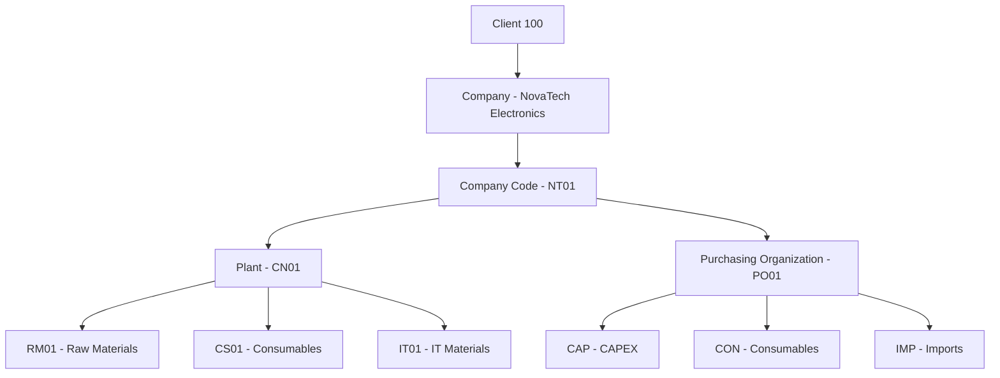
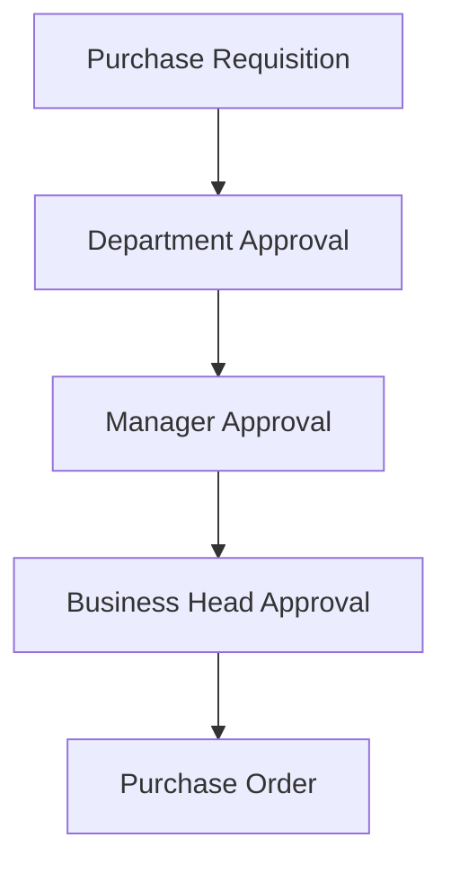

# Solution Design

## Document Information

| Item | Details |
|------|---------|
| Document Name | Solution Design |
| Project | SAP S/4HANA MM Greenfield Implementation |
| Organization | NovaTech Electronics Manufacturing India Pvt. Ltd. |
| Module | SAP S/4HANA Materials Management (MM) |
| Version | 1.0 |
| Prepared By | SAP MM Functional Consultant |

---

# 1. Purpose

The purpose of this document is to define the proposed SAP S/4HANA MM solution based on the approved business requirements. It describes the enterprise structure, organizational units, master data, procurement process, and document flow that will be implemented during the SAP configuration phase.

---

# 2. Solution Overview

The organization currently operates procurement and inventory management through multiple independent systems. The proposed SAP S/4HANA MM solution will integrate these processes into a single ERP platform, enabling centralized procurement, inventory management, vendor management, and invoice verification.

---

# 3. Enterprise Structure

| SAP Object | Description |
|------------|-------------|
| Client | 100 |
| Company | NovaTech Electronics Manufacturing India Pvt. Ltd. |
| Company Code | NT01 |
| Plant | CN01 – Sriperumbudur |
| Purchasing Organization | PO01 |
| Purchasing Groups | CAP, CON, IMP |
| Storage Locations | RM01, CS01, IT01 |

### Enterprise Structure



---

# 4. Master Data Design

The following master data will be maintained within SAP MM to support procurement operations.

| Master Data | Purpose |
|-------------|---------|
| Material Master | Material information |
| Business Partner | Vendor management |
| Material Group | Material classification |
| Purchasing Info Record | Vendor pricing |
| Source List | Approved vendors |

---

# 5. Procurement Categories

| Category | Example |
|----------|---------|
| Production Materials | Smartphone Components |
| Consumables | Gloves, Wipe Roll, Milling Cutter |
| Fixtures | Production Fixtures |
| IT Materials | Laptop, Printer |
| Imported Materials | Testing Cables |
| CAPEX | Production Equipment |
| Services | Calibration & Maintenance |

---

# 6. Procurement Process Design

The proposed SAP procurement process follows a standardized workflow from demand planning to vendor payment.


---

# 7. Document Flow

The procurement cycle in SAP will generate the following business documents.


---

# 8. Material Flow

```mermaid
flowchart LR
Vendor
--> Receiving
--> Warehouse
--> Production
--> Finished Goods
```

---

# 9. Approval Workflow

Purchase Requisitions and Purchase Orders follow a controlled approval process before procurement.



---

# 10. Expected Benefits

The proposed solution provides:

- Centralized procurement management
- Standardized procurement process
- Improved inventory visibility
- Better vendor management
- Faster approval process
- Real-time procurement reporting
- Reduced manual effort
- Improved operational efficiency

---

# 11. Conclusion

The proposed SAP S/4HANA MM solution provides a standardized procurement and inventory management framework that replaces multiple independent systems with a single integrated ERP platform. This design will serve as the basis for the SAP configuration and testing phases.