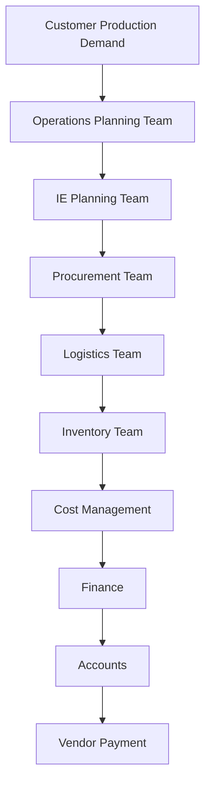
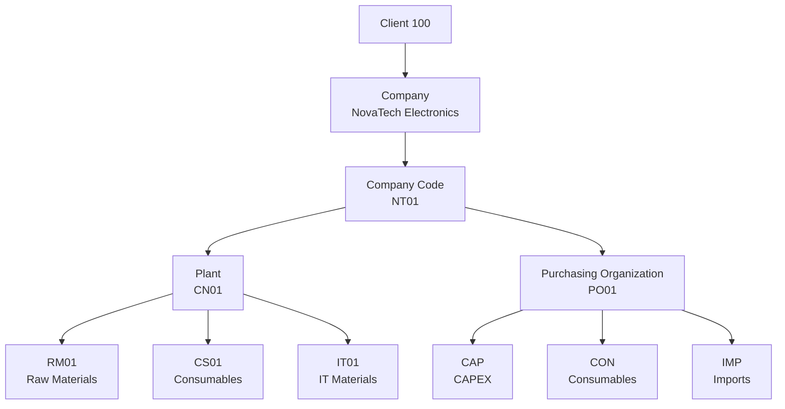
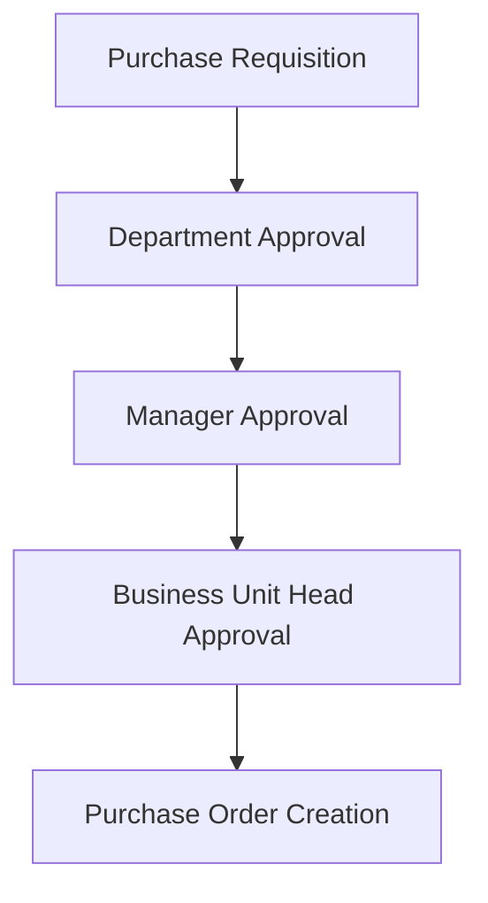

# Solution Design

## Document Information

| Item          | Details                                            |
| ------------- | -------------------------------------------------- |
| Document Name | Solution Design                                    |
| Project       | SAP S/4HANA MM Greenfield Implementation           |
| Organization  | NovaTech Electronics Manufacturing India Pvt. Ltd. |
| Industry      | Electronics Manufacturing                          |
| Module        | SAP S/4HANA Materials Management (MM)              |
| Plant         | CN01 – Sriperumbudur                               |
| Version       | 1.0                                                |
| Prepared By   | SAP MM Functional Consultant                       |

---

# 1. Purpose

This document defines the proposed SAP S/4HANA MM solution based on the approved business requirements. It describes the enterprise structure, organizational structure, procurement process, master data, and business workflow that will be implemented during the SAP configuration phase.

---

# 2. Solution Overview

The current procurement process is managed using multiple independent systems for purchasing, approvals, inventory, and budgeting. The proposed SAP S/4HANA MM solution will replace these fragmented systems with a single integrated ERP platform, enabling centralized procurement, inventory management, vendor management, and invoice verification.

---

# 3. Business Solution Architecture

---

# 4. Organizational Structure

The following departments participate throughout the procurement lifecycle.

| Department          | Responsibility                                          |
| ------------------- | ------------------------------------------------------- |
| Operations Planning | Weekly production planning                              |
| IE Planning         | Material requirement planning                           |
| Procurement         | Purchase Requisition, Purchase Order, Vendor Management |
| Logistics           | ETA Tracking & Material Transportation                  |
| Inventory           | Goods Receipt, Goods Issue & Stock Management           |
| Cost Management     | Budget Monitoring                                       |
| Finance             | Invoice Verification                                    |
| Accounts            | Vendor Payment                                          |

---

# 5. Enterprise Structure

The SAP Enterprise Structure is designed as follows.

| SAP Object              | Planned Value                                      |
| ----------------------- | -------------------------------------------------- |
| Client                  | 100                                                |
| Company                 | NovaTech Electronics Manufacturing India Pvt. Ltd. |
| Company Code            | NT01                                               |
| Plant                   | CN01                                               |
| Purchasing Organization | PO01                                               |
| Purchasing Groups       | CAP, CON, IMP                                      |
| Storage Locations       | RM01, CS01, IT01                                   |

---

# 6. Master Data Design

The following master data will support procurement activities.

| Master Data            | Purpose                   |
| ---------------------- | ------------------------- |
| Material Master        | Material Information      |
| Business Partner       | Vendor Management         |
| Material Group         | Material Classification   |
| Purchasing Info Record | Vendor Pricing            |
| Source List            | Approved Vendor Selection |

---

# 7. Procurement Categories

| Procurement Category | Examples                          |
| -------------------- | --------------------------------- |
| Production Materials | Smartphone Components             |
| Consumables          | Gloves, Wipe Roll, Milling Cutter |
| Fixtures             | Production Fixtures               |
| Imported Materials   | Testing Cables                    |
| IT Materials         | Laptops, Network Devices          |
| CAPEX                | Production Equipment              |
| Services             | Calibration & Maintenance         |

---

# 8. Procurement Process Design

The procurement lifecycle within SAP S/4HANA MM is designed as follows.

---

# 9. SAP Document Flow

The following business documents are generated during procurement.

---

# 10. Material Flow

The movement of materials from supplier to production is shown below.

---

# 11. Approval Workflow

Purchase Requisitions and Purchase Orders follow an approval hierarchy before procurement execution.

---

# 12. Integration Overview

| SAP MM Process       | Business Function    |
| -------------------- | -------------------- |
| Material Master      | Material Management  |
| Business Partner     | Vendor Management    |
| Purchase Requisition | Demand Management    |
| Purchase Order       | Procurement          |
| Goods Receipt        | Inventory Management |
| Goods Issue          | Production Support   |
| Invoice Verification | Finance Integration  |

---

# 13. Expected Benefits

- Centralized procurement operations
- Standardized procurement workflow
- Improved inventory visibility
- Better vendor management
- Faster approval process
- Reduced manual effort
- Real-time procurement reporting
- Improved operational efficiency

---

# 14. Conclusion

The proposed SAP S/4HANA MM solution provides a centralized and standardized procurement framework by integrating planning, procurement, inventory, finance, and accounts into a single ERP platform. This design serves as the blueprint for SAP configuration, testing, and successful implementation.
