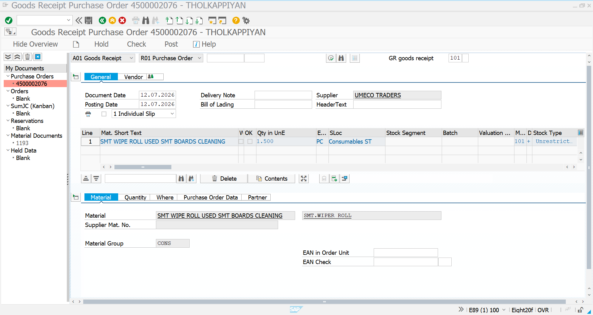
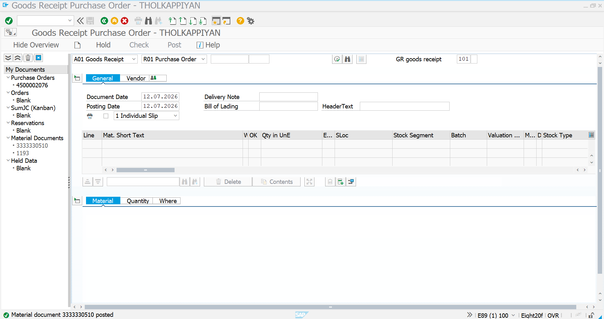
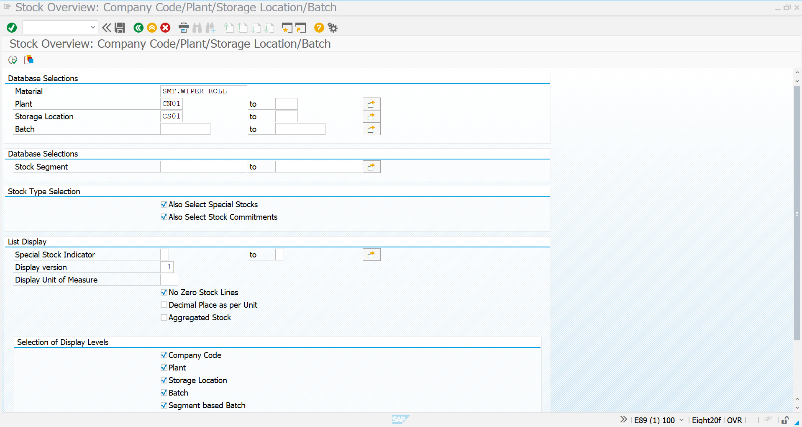
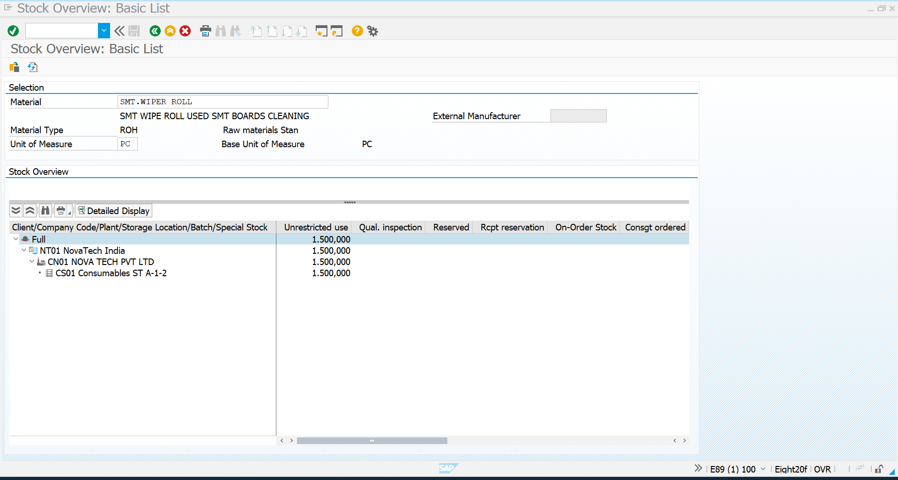

# Goods Receipt & Stock Overview - Consumables

## Overview

This document describes the Goods Receipt (GR) process for the consumable material **SMT WIPER ROLL** using transaction **MIGO**, followed by stock verification using **MMBE** in SAP S/4HANA.

The Goods Receipt confirms that the ordered material has been physically received from the vendor. Once posted, SAP automatically updates inventory, creates a Material Document, and makes the stock available for production. The Stock Overview (MMBE) is then used to verify the updated inventory.

---

## Business Requirement

After receiving SMT WIPER ROLL from the approved vendor, the Procurement and Warehouse teams perform Goods Receipt to record the material receipt in SAP.

Once the Goods Receipt is posted, inventory is verified using the Stock Overview transaction to confirm that the stock has been successfully updated.

---

## Transaction Codes

| Activity | Transaction Code |
|-----------|------------------|
| Goods Receipt | MIGO |
| Stock Overview | MMBE |

---

## Organization Details

| Field | Value |
|------|------|
| Company | NT01 |
| Company Code | NT0100 |
| Plant | CN01 |
| Storage Location | CS01 |
| Purchasing Organization | POR1 |
| Purchasing Group | CON |
| Vendor | UMECO |
| Material | SMT WIPER ROLL |
| Movement Type | 101 |

---

# Step 1 - Item Overview

The Goods Receipt process was initiated by referencing the Purchase Order. SAP automatically retrieved the material and purchasing information.

### Goods Receipt Details

| Parameter | Value |
|-----------|------|
| Material | SMT WIPER ROLL |
| Vendor | UMECO |
| Quantity | 1500 PC |
| Movement Type | 101 |
| Plant | CN01 |
| Storage Location | CS01 |

### Screenshot

---

# Step 2 - Goods Receipt Posted

After verifying all required information, the Goods Receipt was successfully posted.

SAP generated a Material Document and updated inventory automatically.

### Screenshot

---

# Step 3 - Stock Overview Initial Screen

The Stock Overview transaction (**MMBE**) was executed to verify the inventory of the received material.

### Screenshot

---

# Step 4 - Material Stock Display

The Stock Overview confirmed that the Goods Receipt successfully updated inventory.

The received quantity is now available under **Unrestricted Use Stock** for production and warehouse operations.

### Screenshot

---

# Goods Receipt Summary

| Configuration | Value |
|--------------|-------|
| Material | SMT WIPER ROLL |
| Vendor | UMECO |
| Quantity Received | 1500 PC |
| Movement Type | 101 |
| Plant | CN01 |
| Storage Location | CS01 |
| Stock Status | Unrestricted Use |
| Status | ✅ Goods Receipt Successfully Posted |

---

# Business Benefits

- Confirms physical receipt of materials from the vendor.
- Automatically updates inventory levels.
- Generates a Material Document for inventory tracking.
- Makes stock available for production.
- Enables inventory verification through Stock Overview (MMBE).
- Ensures accurate warehouse and inventory management.

---

# Conclusion

The Goods Receipt for **SMT WIPER ROLL** was successfully posted using **MIGO**. SAP automatically updated inventory and created the corresponding Material Document. The updated stock was verified using **MMBE**, confirming that the received quantity is available in **Unrestricted Use Stock** for manufacturing operations.

This completes the inventory update phase of the Procure-to-Pay (P2P) process.

---

# Document Information

| Item | Details |
|------|---------|
| Module | SAP S/4HANA Materials Management (MM) |
| Business Process | Goods Receipt & Stock Verification |
| Transaction Codes | MIGO, MMBE |
| Project | SAP S/4HANA MM Greenfield Implementation |
| Document Type | Transaction Documentation |
| Status | ✅ Completed |