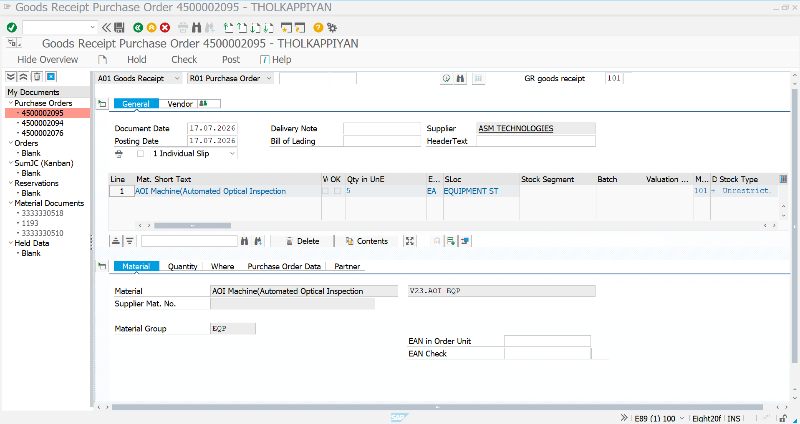
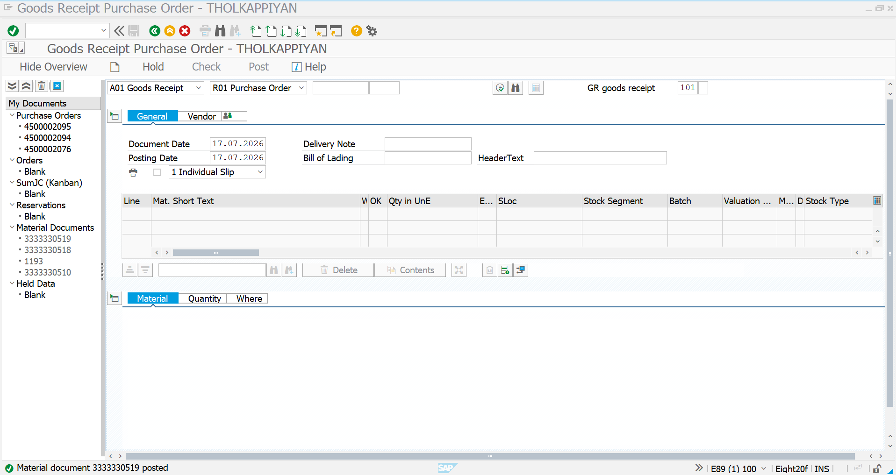
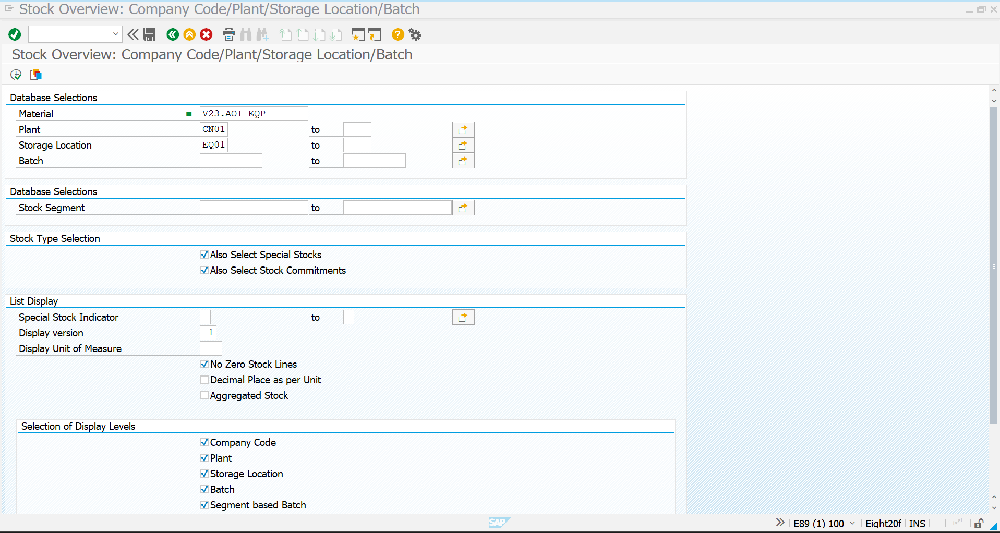
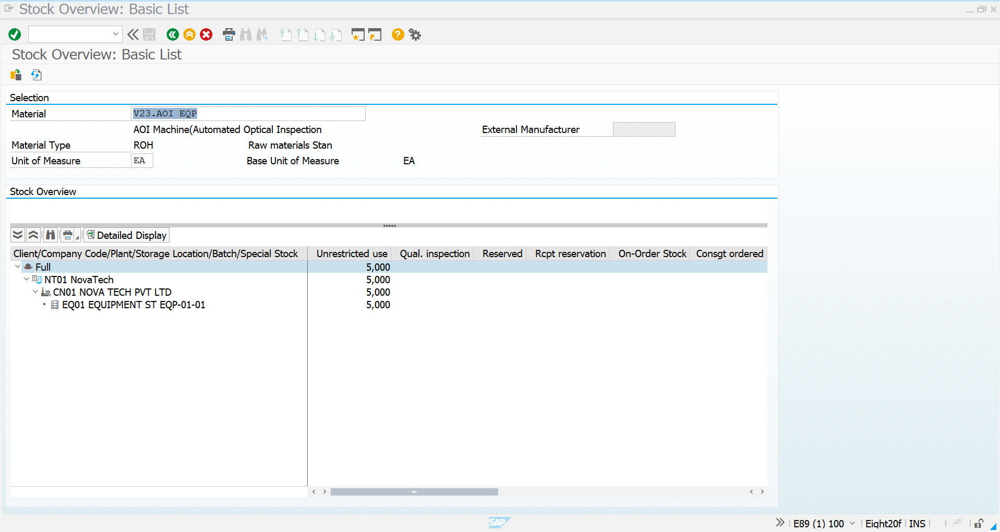

# Goods-Receipt-Equipment.md

# Goods Receipt – Equipment

## Objective

This document describes the Goods Receipt (GR) process for the AOI (Automated Optical Inspection) Machine using SAP S/4HANA MM. The Goods Receipt confirms that the equipment has been received from the vendor and updates the inventory stock.

---

# Goods Receipt Details

| Field | Value |
|-------|-------|
| Transaction Code | MIGO |
| Movement Type | 101 |
| Material | V23.AOI EQP |
| Material Description | AOI Machine (Automated Optical Inspection) |
| Vendor | ASM TECHNOLOGIES |
| Plant | CN01 |
| Storage Location | EQ01 |
| Quantity Received | **5 EA** |
| Unit of Measure | EA |
| Reference Document | Purchase Order |

---

# Step 1 – Goods Receipt Item Overview

**Transaction Code:** MIGO

Select **Goods Receipt** with reference to the Purchase Order and verify the procurement details before posting.

### Information Verified

- Purchase Order
- Vendor
- Material
- Plant
- Storage Location
- Quantity
- Movement Type (101)

## Screenshot

---

# Step 2 – Goods Receipt Posted

After verifying all information, post the Goods Receipt.

### System Updates

- Material Document Generated
- Inventory Updated
- Stock Increased
- Accounting Document Created

## Screenshot

---

# Step 3 – Stock Overview Initial Screen

**Transaction Code:** MMBE

Open the Stock Overview transaction to verify the updated inventory.

## Screenshot

---

# Step 4 – Material Stock Display

Display the material stock after Goods Receipt.

### Verification

- Plant CN01
- Storage Location EQ01
- Unrestricted Stock = 5 EA

## Screenshot

---

# Summary

The Goods Receipt for the AOI Machine has been successfully posted, and the inventory has been updated in SAP S/4HANA MM.

---

# Business Outcome

- Goods Receipt posted successfully
- Inventory updated
- Material available in unrestricted stock
- Accounting entries generated
- Ready for Invoice Verification