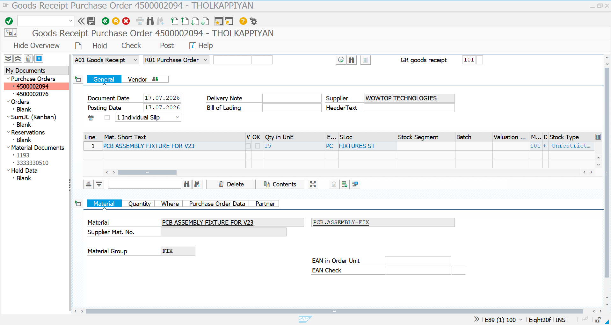
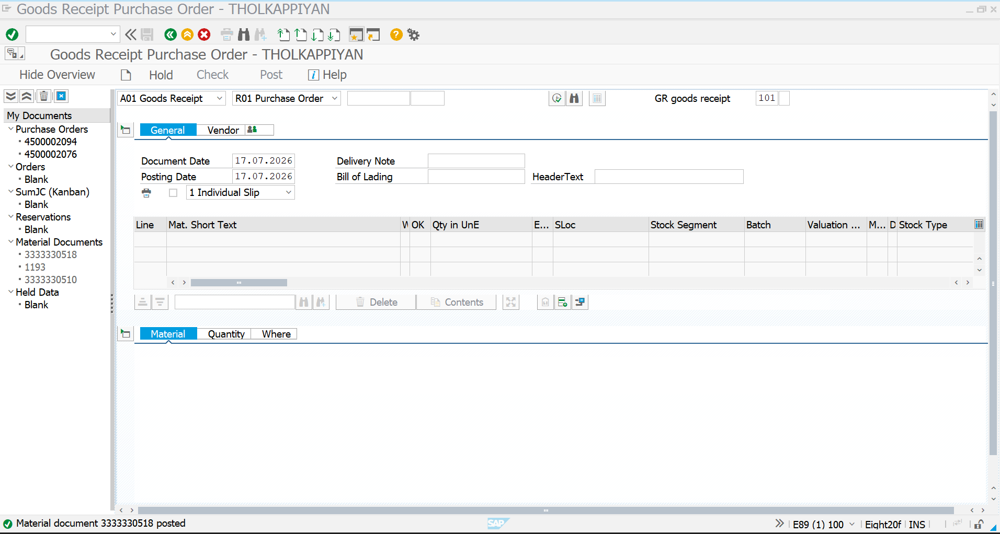
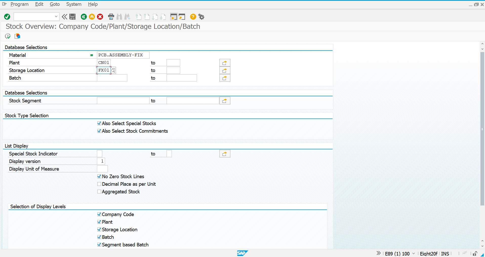
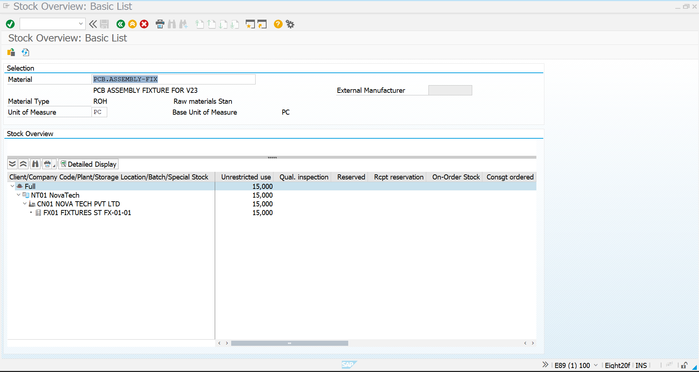

# Goods Receipt - Fixtures

## Overview

This document describes the Goods Receipt process for **PCB Assembly Fixtures** in SAP S/4HANA. After the Purchase Order was issued to **Wowtop Technologies Pvt. Ltd.**, the supplier delivered the ordered fixtures. The receipt of materials was recorded using the Goods Movement transaction, and the inventory was verified through Stock Overview.

---

# Business Requirement

Following the Purchase Order creation, the delivered PCB Assembly Fixtures were received into inventory. The Goods Receipt updates stock quantities and creates the necessary accounting entries for inventory management.

---

# Transaction Codes

| Activity | Transaction Code |
|-----------|------------------|
| Goods Receipt | MIGO |
| Stock Overview | MMBE |

---

# Organization Details

| Field | Value |
|------|------|
| Company | NT01 |
| Company Code | NT0100 |
| Plant | CN01 |
| Storage Location | FX01 |
| Vendor | Wowtop Technologies Pvt. Ltd. |
| Material | PCB Assembly Fixture |

---

# Goods Receipt Details

| Field | Value |
|------|------|
| Material | PCB Assembly Fixture |
| Vendor | Wowtop Technologies Pvt. Ltd. |
| Movement Type | 101 |
| Quantity Received | 15 EA |
| Plant | CN01 |
| Storage Location | FX01 |

---

# Step 1 - Goods Receipt Item Overview

The Purchase Order was referenced in MIGO and the item details were verified before posting the Goods Receipt.

### Screenshot

---

# Step 2 - Goods Receipt Posted

The Goods Receipt was successfully posted, confirming that the materials were received into inventory.

### Screenshot

---

# Step 3 - Stock Overview Initial Screen

The Stock Overview transaction (MMBE) was accessed to verify the inventory position of the material.

### Screenshot

---

# Step 4 - Material Stock Display

The stock overview confirms that the received PCB Assembly Fixtures are available in inventory.

### Screenshot

---

# Goods Receipt Summary

| Activity | Status |
|----------|--------|
| Goods Receipt Posted | ✅ Completed |
| Inventory Updated | ✅ Completed |
| Stock Verification | ✅ Completed |

---

# Business Benefits

- Updates inventory immediately after receipt.
- Creates inventory accounting entries.
- Enables stock visibility through MMBE.
- Supports subsequent Invoice Verification.
- Maintains accurate warehouse inventory records.

---

# Conclusion

The Goods Receipt process for PCB Assembly Fixtures was successfully completed. Inventory was updated using MIGO, and the received stock was verified using MMBE, making the materials available for production and enabling Invoice Verification.

---

# Document Information

| Item | Details |
|------|---------|
| Module | SAP S/4HANA Materials Management (MM) |
| Business Process | Goods Receipt |
| Transaction Codes | MIGO, MMBE |
| Project | SAP S/4HANA MM Greenfield Implementation |
| Status | ✅ Completed |