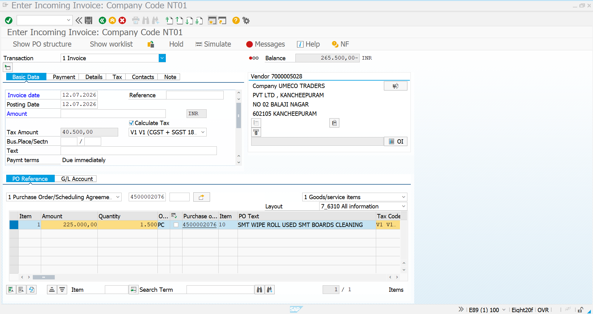
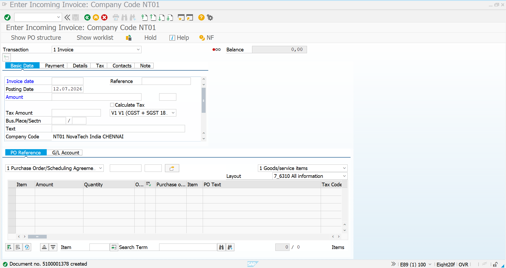
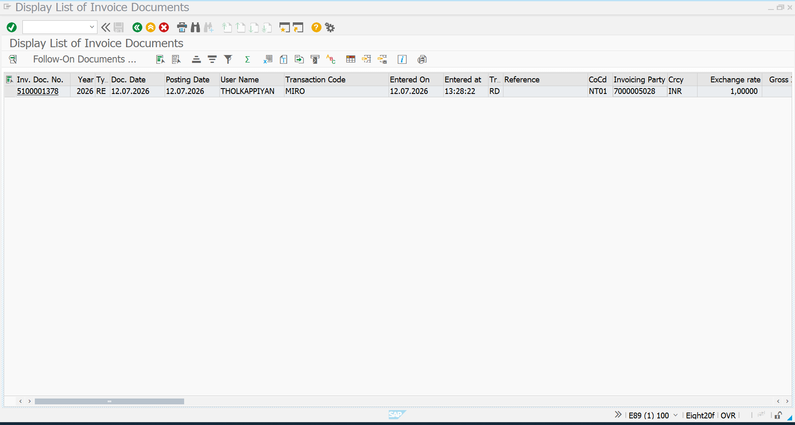

# Invoice Verification – Consumables (MIRO & MIR5)

## Objective

Perform Invoice Verification (MIRO) for the Purchase Order after Goods Receipt and verify the invoice document using MIR5.

---

## Transaction Code

**MIRO** – Enter Incoming Invoice

### Business Scenario

After the Goods Receipt has been posted, the vendor invoice is verified against the Purchase Order. The system performs a three-way match between:

- Purchase Order (PO)
- Goods Receipt (GR)
- Vendor Invoice

Upon successful verification, the accounting document is generated and the vendor liability is recorded.

---

## Step 1 – Item Overview

Enter the Purchase Order number in MIRO. The system automatically proposes the PO quantity, invoice amount, tax information, and vendor details.

### Invoice Details

| Field | Value |
|-------|-------|
| Material Type | Consumables |
| Quantity | 1,500 EA |
| Unit Price | ₹150 |
| Base Amount | ₹225,000 |
| CGST | ₹20,250 |
| SGST | ₹20,250 |
| Total Invoice Amount | ₹265,500 |

---

## Step 2 – Tax Details

The invoice tax is calculated automatically according to the configured tax code.

### Tax Calculation

| Tax Component | Amount |
|--------------|--------:|
| Base Amount | ₹225,000 |
| CGST | ₹20,250 |
| SGST | ₹20,250 |
| **Total Tax** | **₹40,500** |
| **Grand Total** | **₹265,500** |

---

## Step 3 – Invoice Posted

After validation, post the invoice document.

SAP generates:

- Invoice Document Number
- Accounting Document
- Vendor Liability
- FI Posting

---

# Invoice Document List (MIR5)

## Transaction Code

**MIR5** – Display Invoice Documents

### Business Scenario

MIR5 is used to display and verify all invoice documents posted through MIRO.

It allows users to:

- Display Invoice Documents
- Verify Invoice Posting
- Review Vendor Invoice History
- Track Invoice Status

---

## Result

The vendor invoice was successfully posted using MIRO.

The invoice document is available in MIR5 for reporting and verification.

The complete Procure-to-Pay cycle for Consumables has now been completed successfully:

- Material Master
- Vendor Master
- Purchase Info Record
- Purchase Requisition
- Purchase Order
- Goods Receipt (MIGO)
- Stock Verification (MMBE)
- Invoice Verification (MIRO)
- Invoice Display (MIR5)