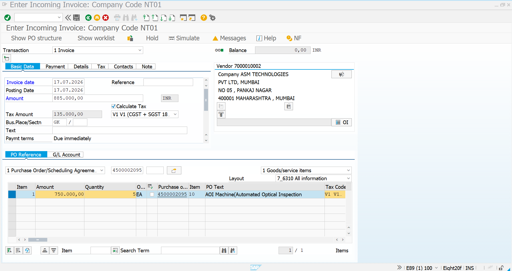
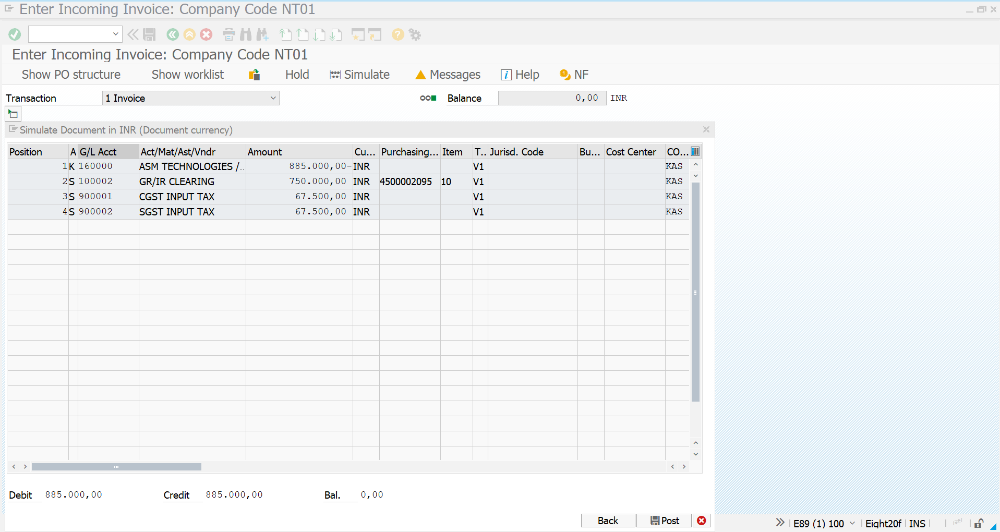
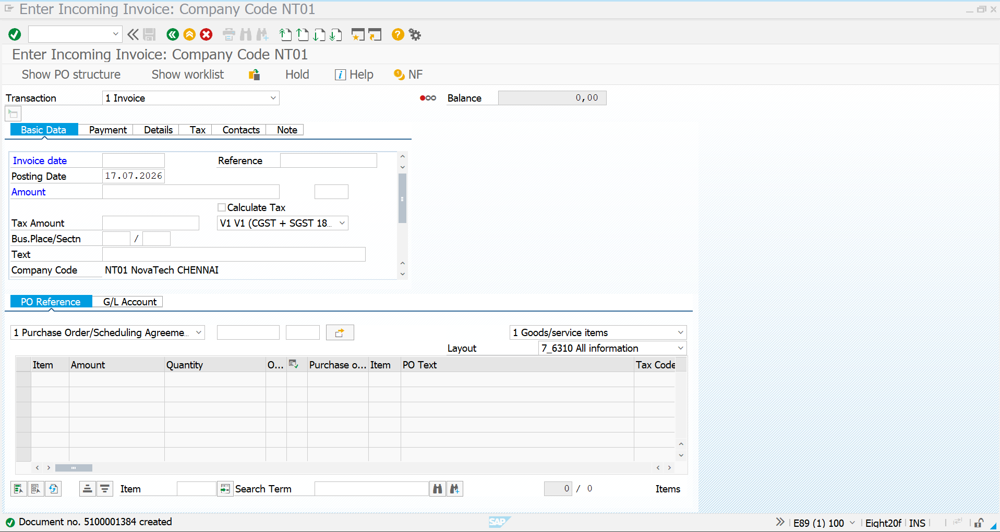
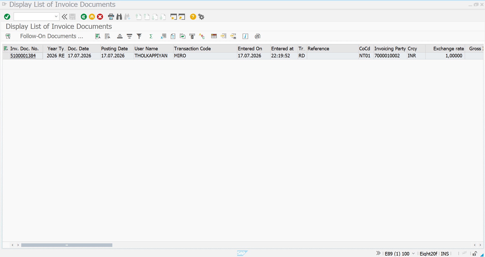

# Invoice-Verification-Equipment.md

# Invoice Verification – Equipment

## Objective

This document describes the Invoice Verification process for the AOI (Automated Optical Inspection) Machine using SAP S/4HANA MM. The supplier invoice is verified against the Purchase Order and Goods Receipt before payment.

---

# Invoice Details

| Field | Value |
|-------|-------|
| Transaction Code | MIRO |
| Vendor | ASM TECHNOLOGIES |
| Vendor Number | 7000010002 |
| Material | V23.AOI EQP |
| Material Description | AOI Machine (Automated Optical Inspection) |
| Quantity | **5 EA** |
| Net Amount | ₹750,000 |
| CGST | ₹67,500 |
| SGST | ₹67,500 |
| Total Invoice Amount | ₹885,000 |
| Tax Code | V1 |
| Company Code | NT01 |

---

# Step 1 – Invoice Item Overview

**Transaction Code:** MIRO

Enter the Purchase Order reference and verify the invoice information before posting.

### Information Verified

- Vendor
- Purchase Order
- Material
- Quantity
- Invoice Amount
- Tax Code

## Screenshot

---

# Step 2 – Tax Details

Verify the accounting and tax postings generated by SAP.

### Tax Information

| Description | Amount |
|------------|---------:|
| Net Invoice Amount | ₹750,000 |
| CGST Input Tax | ₹67,500 |
| SGST Input Tax | ₹67,500 |
| Total Invoice Amount | ₹885,000 |

SAP automatically calculates the applicable GST based on Tax Code **V1** and balances the accounting document before posting.

## Screenshot

---

# Step 3 – Invoice Posted

Post the invoice after successful verification.

### System Updates

- Invoice Document Generated
- Vendor Liability Created
- GR/IR Cleared
- Financial Accounting Updated

## Screenshot

---

# Step 4 – Display Invoice Document List

**Transaction Code:** MIR5

Display the invoice document list to verify the posted invoice.

### Verification

- Invoice Number
- Vendor
- Posting Date
- Invoice Amount
- Company Code
- Document Status

## Screenshot

---

# Summary

The supplier invoice for the AOI Machine has been successfully verified and posted in SAP S/4HANA MM. The invoice is matched with the Purchase Order and Goods Receipt, completing the procurement cycle.

---

# Business Outcome

- Invoice verified successfully
- Vendor liability recorded
- GR/IR account cleared
- Financial accounting updated
- Procure-to-Pay (P2P) cycle completed successfully