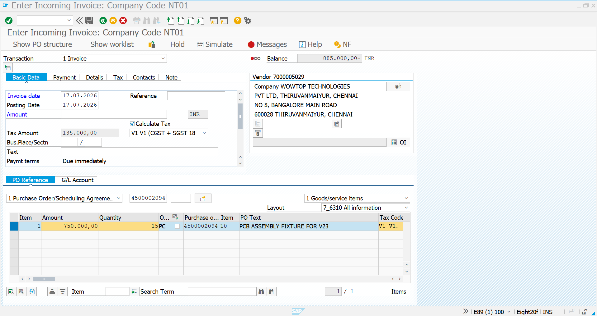
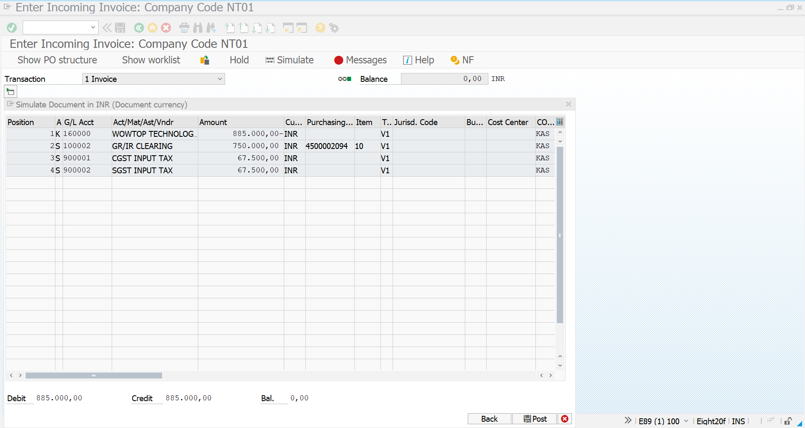
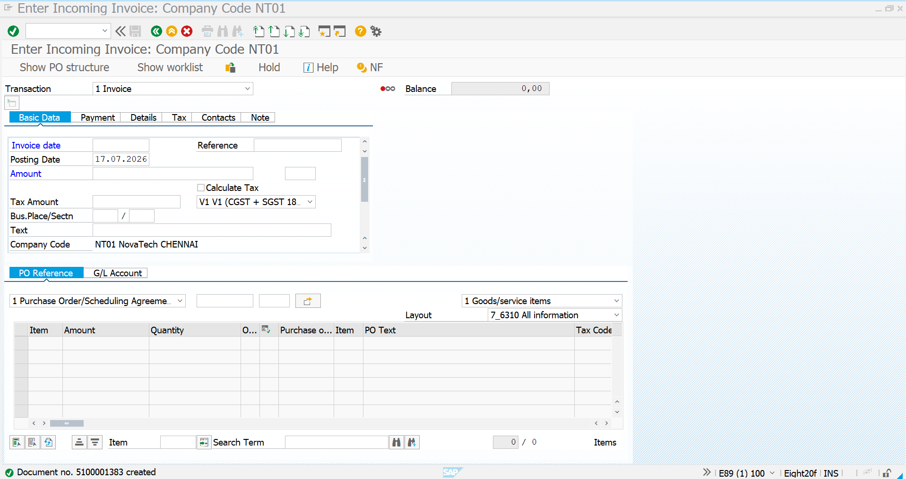
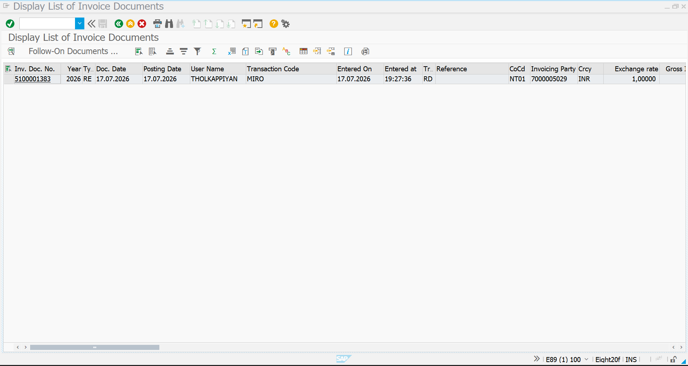

# Invoice Verification - Fixtures

## Overview

This document describes the Invoice Verification process for **PCB Assembly Fixtures** in SAP S/4HANA. After successful Goods Receipt, the supplier invoice was verified and posted using MIRO. The accounting document was then validated using MIR5.

---

# Business Requirement

After receiving the PCB Assembly Fixtures from **Wowtop Technologies Pvt. Ltd.**, the supplier invoice was verified against the Purchase Order and Goods Receipt to complete the Procure-to-Pay cycle.

---

# Transaction Codes

| Activity | Transaction Code |
|-----------|------------------|
| Invoice Verification | MIRO |
| Invoice Document List | MIR5 |

---

# Organization Details

| Field | Value |
|------|------|
| Company | NT01 |
| Company Code | NT0100 |
| Vendor | Wowtop Technologies Pvt. Ltd. |
| Plant | CN01 |
| Material | PCB Assembly Fixture |

---

# Invoice Details

| Field | Value |
|------|------|
| Vendor | Wowtop Technologies Pvt. Ltd. |
| Base Invoice Amount | ₹750,000 |
| CGST | ₹67,500 |
| SGST | ₹67,500 |
| Total Invoice Amount | ₹885,000 |
| Currency | INR |

---

# Step 1 - Invoice Item Overview

The Purchase Order was referenced in MIRO and the invoice details were verified before posting.

### Screenshot

---

# Step 2 - Tax Details

The applicable GST was calculated during invoice verification.

### Tax Summary

| Tax Component | Amount |
|--------------|-------:|
| Base Amount | ₹750,000 |
| CGST | ₹67,500 |
| SGST | ₹67,500 |
| Total Invoice Amount | ₹885,000 |

### Screenshot

---

# Step 3 - Invoice Posted

The supplier invoice was successfully posted after validating the Purchase Order and Goods Receipt.

### Screenshot

---

# Step 4 - Invoice Document List

The posted invoice document was verified using MIR5.

### Screenshot

---

# Invoice Verification Summary

| Activity | Status |
|----------|--------|
| Invoice Verification | ✅ Completed |
| Tax Calculation | ✅ Completed |
| Invoice Posted | ✅ Completed |
| Invoice Verified in MIR5 | ✅ Completed |

---

# Business Benefits

- Matches Purchase Order, Goods Receipt, and Supplier Invoice.
- Ensures accurate GST accounting.
- Automatically updates vendor liability.
- Clears the GR/IR account.
- Completes the Procure-to-Pay cycle.

---

# Conclusion

The Invoice Verification process for PCB Assembly Fixtures was successfully completed in SAP S/4HANA. The supplier invoice from **Wowtop Technologies Pvt. Ltd.** was matched against the Purchase Order and Goods Receipt, GST was calculated accurately, and the invoice was posted successfully. The accounting document was verified through MIR5, completing the Procure-to-Pay cycle.

---

# Document Information

| Item | Details |
|------|---------|
| Module | SAP S/4HANA Materials Management (MM) |
| Business Process | Invoice Verification |
| Transaction Codes | MIRO, MIR5 |
| Project | SAP S/4HANA MM Greenfield Implementation |
| Status | ✅ Completed |