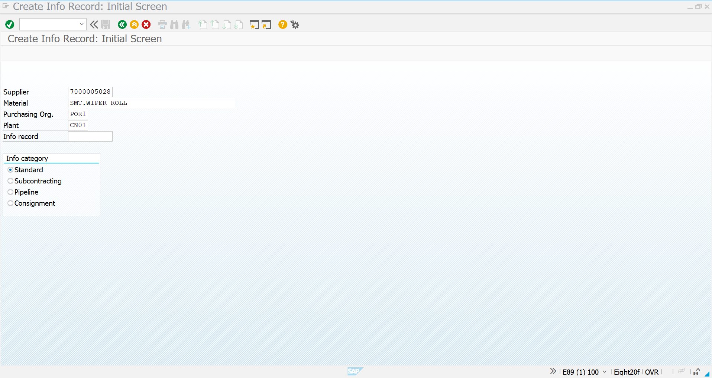
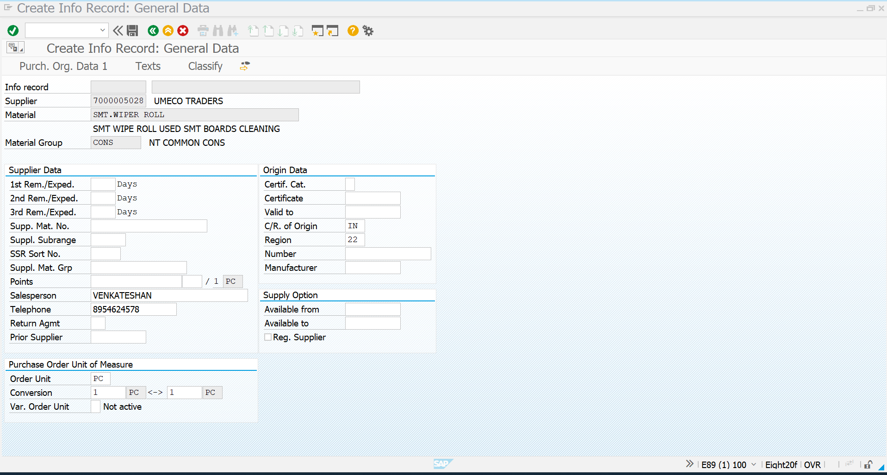
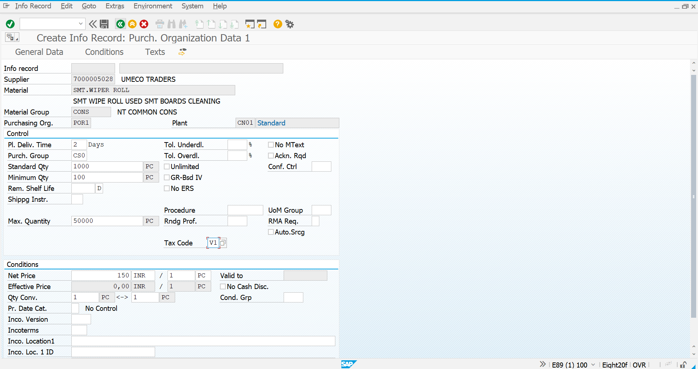
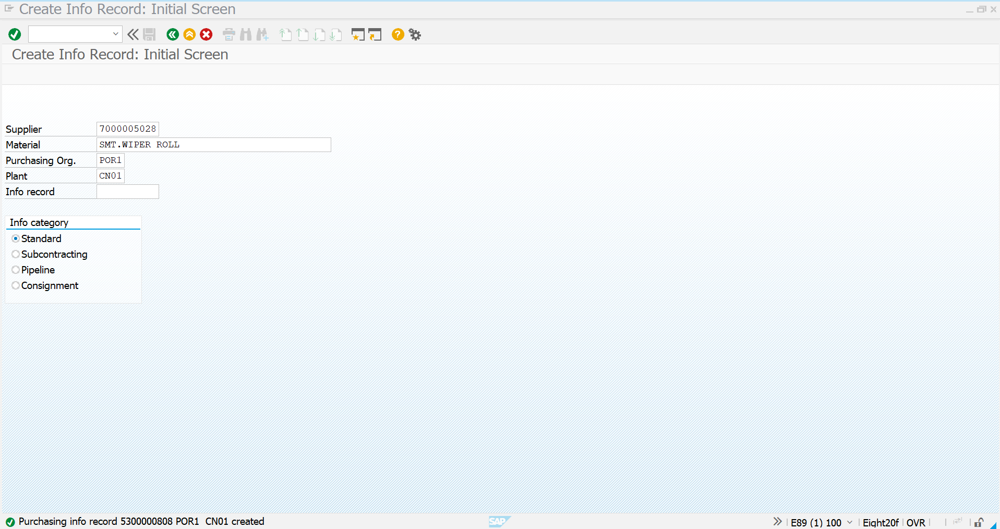

# Purchase Info Record - Consumables

## Overview

This document describes the creation of the **Purchase Info Record (PIR)** for the consumable material **SMT WIPER ROLL** in SAP S/4HANA.

A Purchase Info Record establishes the procurement relationship between a vendor and a material by storing vendor-specific purchasing information such as pricing, delivery time, and order quantities. During Purchase Order creation, SAP automatically proposes these values, improving procurement accuracy and efficiency.

---

## Business Requirement

SMT WIPER ROLL is a critical consumable used in the SMT production process. To ensure standardized procurement from an approved supplier, a Purchase Info Record was created for the material.

The configuration stores vendor-specific purchasing information that will be automatically referenced during Purchase Order processing.

---

## Transaction Codes

| Activity | Transaction Code |
|----------|------------------|
| Create Purchase Info Record | ME11 |
| Change Purchase Info Record | ME12 |
| Display Purchase Info Record | ME13 |

---

## Organization Details

| Field | Value |
|------|------|
| Company | NT01 |
| Company Code | NT0100 |
| Plant | CN01 |
| Purchasing Organization | POR1 |
| Purchasing Group | CON |
| Material | SMT WIPER ROLL |
| Vendor | Consumables Supplier |

---

# Step 1 - Initial Screen

The Purchase Info Record creation process begins by selecting the Vendor, Material, Purchasing Organization, Plant, and Info Record Category.

### Screenshot

---

# Step 2 - General Data

General purchasing information was maintained for the selected vendor and material combination.

The following procurement parameters were configured:

| Parameter | Value |
|----------|------|
| Planned Delivery Time | 2 Days |
| Minimum Order Quantity | 100 PC |
| Standard Order Quantity | 1000 PC |
| Maximum Order Quantity | 50000 PC |

### Screenshot

---

# Step 3 - Pricing Conditions

Vendor-specific pricing conditions were maintained for procurement.

| Parameter | Value |
|----------|------|
| Unit Price | ₹150 / PC |
| Currency | INR |

These pricing conditions are automatically proposed during Purchase Order creation.

### Screenshot

---

# Step 4 - Purchase Info Record Created

After maintaining all mandatory procurement information, the Purchase Info Record was successfully created and saved in SAP S/4HANA.

The Info Record is now available for procurement transactions involving the configured vendor and material.

### Screenshot

---

# Purchase Info Record Summary

| Configuration | Value |
|--------------|-------|
| Material | SMT WIPER ROLL |
| Vendor | Consumables Supplier |
| Purchasing Organization | POR1 |
| Purchasing Group | CON |
| Plant | CN01 |
| Planned Delivery Time | 2 Days |
| Minimum Order Quantity | 100 PC |
| Standard Order Quantity | 1000 PC |
| Maximum Order Quantity | 50000 PC |
| Unit Price | ₹150 / PC |
| Status | ✅ Successfully Created |

---

# Business Benefits

The Purchase Info Record provides standardized procurement information by:

- Maintaining vendor-specific pricing
- Defining delivery lead time
- Standardizing procurement quantities
- Reducing manual data entry during Purchase Order creation
- Improving procurement consistency and accuracy
- Supporting efficient vendor management

---

# Conclusion

The Purchase Info Record for **SMT WIPER ROLL** has been successfully configured in SAP S/4HANA.

This configuration links the approved vendor with the consumable material and stores all essential purchasing information required for procurement. The system will automatically reference this data during Purchase Order creation, ensuring consistency in pricing, delivery schedules, and procurement quantities.

---

# Document Information

| Item | Details |
|------|---------|
| Module | SAP S/4HANA Materials Management (MM) |
| Business Process | Purchase Info Record Configuration |
| Transaction Code | ME11 |
| Project | SAP S/4HANA MM Greenfield Implementation |
| Document Type | Configuration Documentation |
| Status | ✅ Completed |