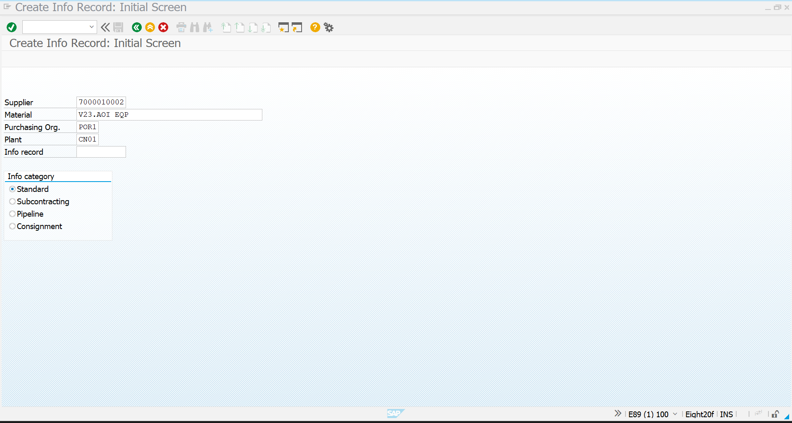
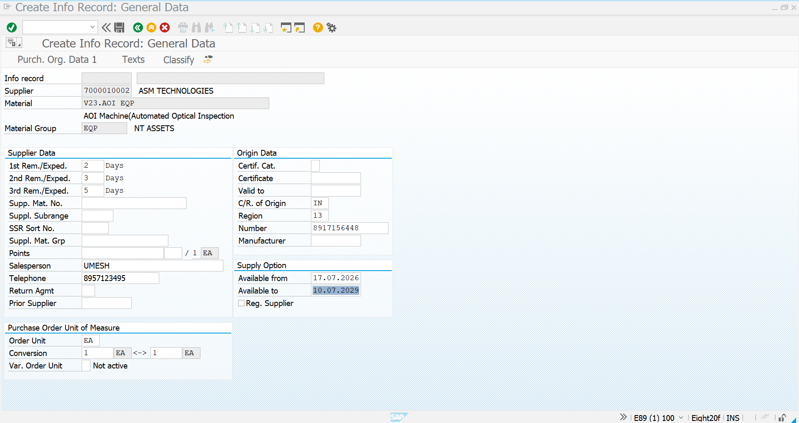
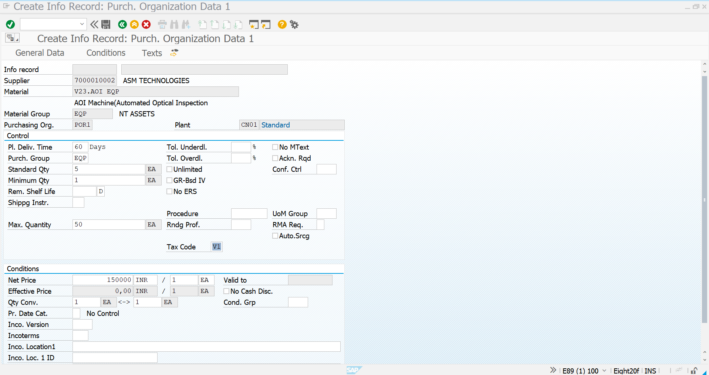
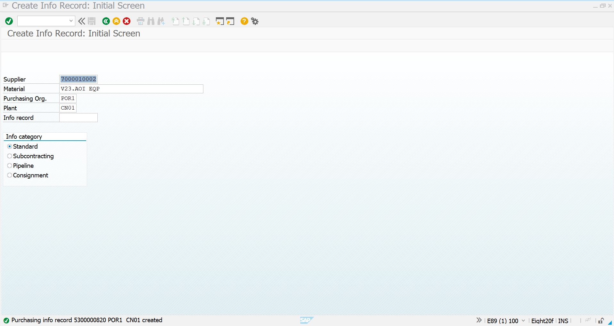
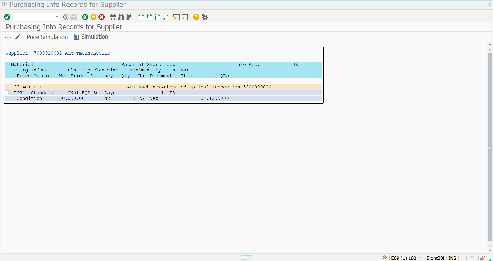

# Purchase Info Record – Equipment

## Objective

This document describes the creation of a **Purchase Info Record** for the **AOI Machine (Automated Optical Inspection Equipment)** in SAP S/4HANA Materials Management (MM).

The Purchase Info Record stores the procurement relationship between the Equipment Material and the Vendor, including pricing, delivery lead time, purchasing organization data, and vendor-specific procurement information.

---

# Purchase Info Record Details

| Field | Value |
|--------|-------|
| Material | V23.AOI EQP |
| Material Description | AOI Machine (Automated Optical Inspection) |
| Material Group | EQP |
| Vendor | ASM TECHNOLOGIES PVT LTD, Mumbai |
| Supplier Number | 7000010002 |
| Purchasing Organization | POR1 |
| Plant | CN01 |
| Purchasing Group | EQP |
| Standard Quantity | 5 EA |
| Minimum Quantity | 1 EA |
| Maximum Quantity | 50 EA |
| Planned Delivery Time | 60 Days |
| Net Price | ₹150,000 / EA |
| Tax Code | V1 |
| Order Unit | EA |
| GR Based Invoice Verification | Enabled |
| Price Unit | 1 EA |
| Goods Receipt Processing Time | 2 Days |

---

# Step 1 – Create Purchase Info Record

**Transaction Code:** `ME11`

Navigate to **ME11** and enter:

- Vendor
- Material
- Purchasing Organization
- Plant

Then proceed to create the Purchase Info Record.

### Screenshot

---

# Step 2 – Maintain Purchasing Organization Data

Maintain vendor-specific purchasing information.

### Information Maintained

- Purchasing Organization
- Plant
- Purchasing Group
- Planned Delivery Time
- Standard Quantity
- Minimum Quantity
- Maximum Quantity
- Tax Code
- Net Price
- Price Unit

### Screenshot

---

# Step 3 – Maintain Purchasing Data

Maintain supplier-specific procurement information.

### Information Maintained

- Reminder Days
- Sales Contact Person
- Supplier Telephone Number
- Country of Origin
- Available From Date
- Available To Date
- Order Unit
- Unit Conversion

### Supplier Details

| Field | Value |
|--------|-------|
| Salesperson | UMESH |
| Telephone | 8957123495 |
| Country of Origin | India |
| Region | 13 |
| Available From | 17-07-2026 |
| Available To | 10-07-2029 |

### Screenshot

---

# Step 4 – Purchase Info Record Created Successfully

After maintaining all purchasing and supplier details, save the Purchase Info Record.

SAP generates a unique Purchase Info Record Number.

### Screenshot

---

# Step 5 – Display Purchase Info Record

Use **ME13** to display and verify the Purchase Info Record.

Verify:

- Vendor
- Material
- Pricing
- Delivery Time
- Purchasing Organization
- Plant
- Purchasing Group
- Supplier Details

### Screenshot

---

# Summary

The Purchase Info Record has been successfully created for the **AOI Machine** supplied by **ASM Technologies Pvt. Ltd., Mumbai**.

The record establishes the procurement relationship between the Equipment Material and the approved vendor while maintaining pricing, delivery schedules, purchasing data, and supplier information.

---

# Business Outcome

- Equipment Material linked with approved Vendor
- Vendor-specific procurement information maintained
- Pricing maintained for future Purchase Orders
- Delivery lead time configured
- Purchasing Organization assigned
- Ready for Purchase Requisition
- Ready for RFQ / Quotation Process
- Ready for Purchase Order Processing
- Supports automated procurement in SAP S/4HANA MM