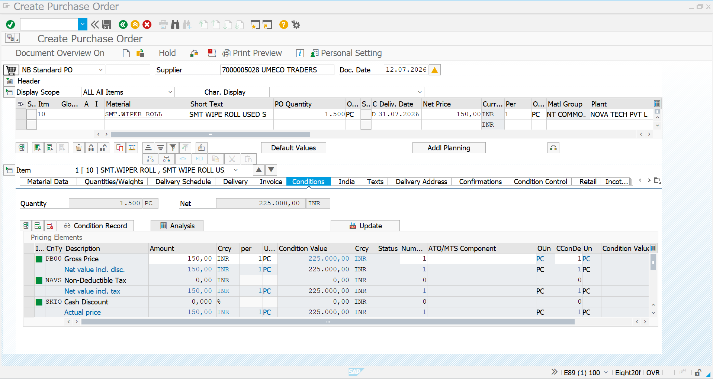
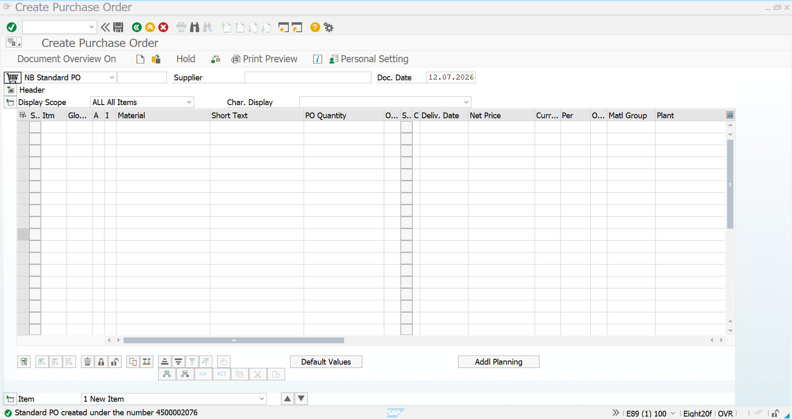
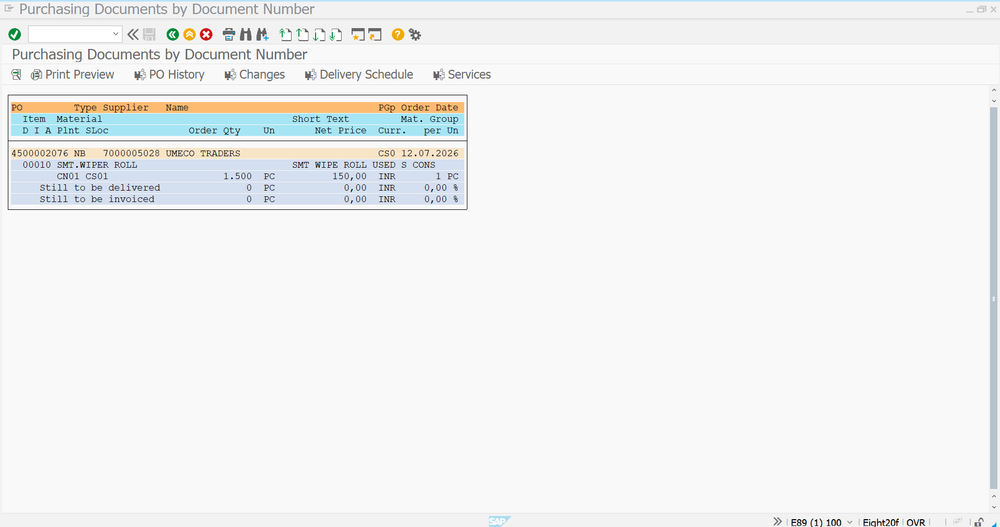

# Purchase Order - Consumables

## Overview

This document describes the creation of a Purchase Order (PO) for the consumable material **SMT WIPER ROLL** using transaction **ME21N** in SAP S/4HANA.

A Purchase Order is a legally binding procurement document issued to an approved vendor for supplying materials required for manufacturing operations.

---

## Business Requirement

Based on the approved Purchase Requisition, a Purchase Order was created for procuring SMT WIPER ROLL from the approved vendor **UMECO**.

The Purchase Order references the Purchase Info Record, allowing SAP to automatically determine vendor-specific pricing and procurement details.

---

## Transaction Codes

| Activity | Transaction Code |
|-----------|------------------|
| Create Purchase Order | ME21N |
| Change Purchase Order | ME22N |
| Display Purchase Order | ME23N |

---

## Organization Details

| Field | Value |
|------|------|
| Company | NT01 |
| Company Code | NT0100 |
| Plant | CN01 |
| Storage Location | CS01 |
| Purchasing Organization | POR1 |
| Purchasing Group | CON |
| Vendor | UMECO |
| Material | SMT WIPER ROLL |

---

# Step 1 - Item Overview

The Purchase Order was created by referencing the approved Purchase Requisition. SAP automatically proposed the vendor, pricing, and purchasing information from the Purchase Info Record.

### Purchase Order Details

| Parameter | Value |
|-----------|------|
| Material | SMT WIPER ROLL |
| Vendor | UMECO |
| Quantity | 1500 PC |
| Unit Price | ₹150 / PC |
| Total Amount | ₹225,000 |
| Plant | CN01 |
| Storage Location | CS01 |

### Screenshot

---

# Step 2 - Purchase Order Created

After validating all procurement details, the Purchase Order was successfully created in SAP S/4HANA.

The system generated a unique Purchase Order number, which will be referenced during Goods Receipt and Invoice Verification.

### Screenshot

---

# Step 3 - Display Purchase Order

The Purchase Order was displayed using transaction **ME23N** to verify all purchasing information before proceeding with the procurement process.

The Purchase Order is now ready for vendor processing and Goods Receipt.

### Screenshot

---

# Purchase Order Summary

| Configuration | Value |
|--------------|-------|
| Material | SMT WIPER ROLL |
| Vendor | UMECO |
| Quantity | 1500 PC |
| Unit Price | ₹150 / PC |
| Total Purchase Value | ₹225,000 |
| Plant | CN01 |
| Storage Location | CS01 |
| Purchasing Organization | POR1 |
| Purchasing Group | CON |
| Status | ✅ Successfully Created |

---

# Business Benefits

- Converts an approved Purchase Requisition into an official procurement document.
- Automatically retrieves vendor pricing from the Purchase Info Record.
- Provides complete procurement traceability.
- Serves as the reference document for Goods Receipt and Invoice Verification.
- Ensures standardized purchasing and vendor communication.

---

# Conclusion

The Purchase Order for **SMT WIPER ROLL** was successfully created in SAP S/4HANA. The document authorizes procurement of **1500 PC** from the approved vendor **UMECO** with a total procurement value of **₹225,000**.

This Purchase Order will be used as the reference document for Goods Receipt (MIGO) and Invoice Verification (MIRO), completing the Procure-to-Pay (P2P) process.

---

# Document Information

| Item | Details |
|------|---------|
| Module | SAP S/4HANA Materials Management (MM) |
| Business Process | Purchase Order |
| Transaction Code | ME21N |
| Project | SAP S/4HANA MM Greenfield Implementation |
| Document Type | Transaction Documentation |
| Status | ✅ Completed |