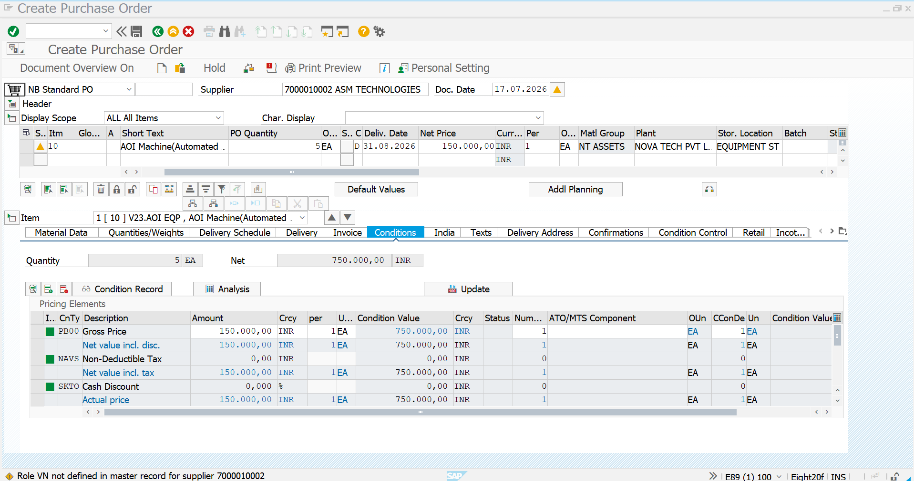
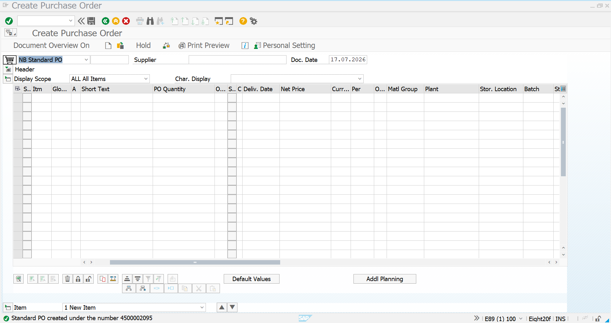
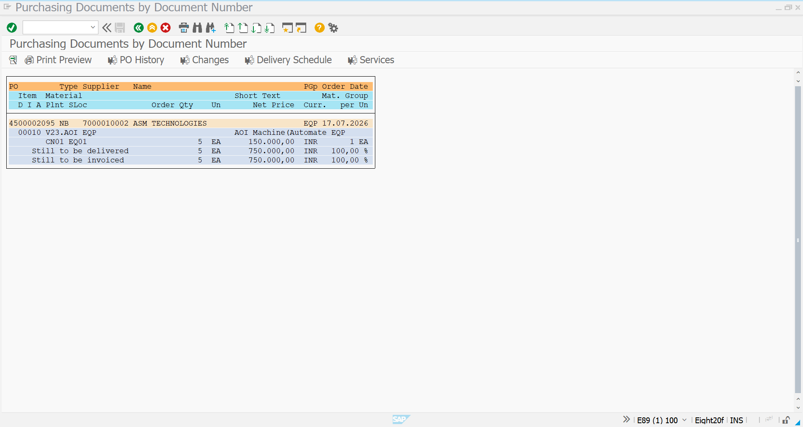

# Purchase Order – Equipment

## Objective

This document describes the creation of a Purchase Order (PO) for procuring an AOI (Automated Optical Inspection) Machine from ASM Technologies in SAP S/4HANA MM.

---

# Purchase Order Details

| Field | Value |
|-------|-------|
| Vendor | ASM TECHNOLOGIES |
| Vendor Number | 7000010002 |
| Material | V23.AOI EQP |
| Material Description | AOI Machine (Automated Optical Inspection) |
| Material Group | EQP |
| Plant | CN01 |
| Purchasing Organization | POR1 |
| Purchasing Group | EQP |
| Quantity | **5 EA** |
| Net Price | **₹150,000 / EA** |
| Total Order Value | **₹750,000** |
| Tax Code | V1 |

---

# Step 1 – Purchase Order Initial Screen

**Transaction Code:** ME21N

The Purchase Order process begins by selecting the vendor and entering procurement details.

## Screenshot

---

# Step 2 – Purchase Order Created

The Purchase Order is created after maintaining all procurement information.

### Information Maintained

- Vendor
- Material
- Quantity
- Net Price
- Purchasing Organization
- Purchasing Group
- Plant
- Delivery Date
- Tax Code

## Screenshot

---

# Step 3 – Display Purchase Order

The Purchase Order is displayed to verify all procurement information before Goods Receipt.

### Verification Details

- PO Number
- Vendor
- Material
- Quantity
- Price
- Plant
- Status

## Screenshot

---

# Summary

The Purchase Order for the AOI Machine has been successfully created and issued to ASM Technologies.

---

# Business Outcome

- Purchase Order generated successfully
- Vendor confirmed for procurement
- Ready for Goods Receipt (MIGO)
- Ready for Invoice Verification (MIRO)
- Procure-to-Pay process continues