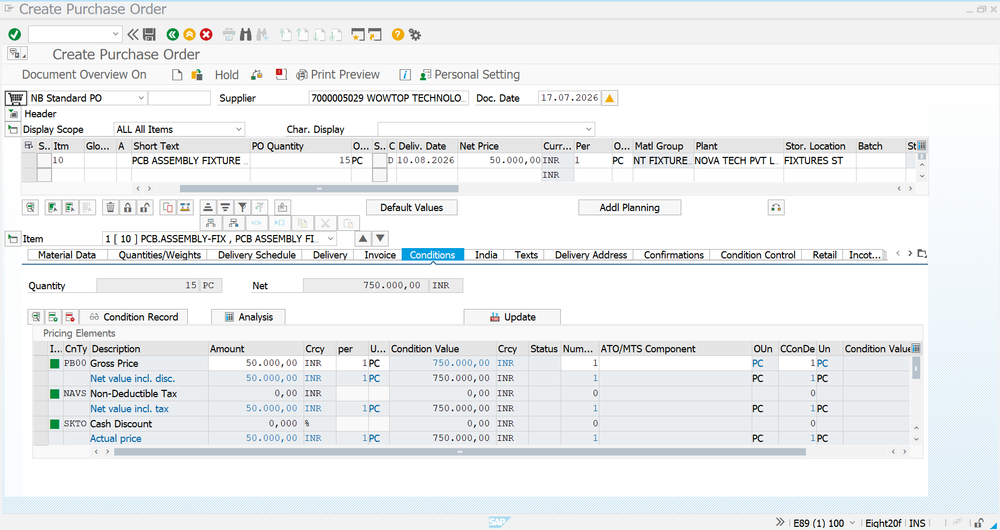
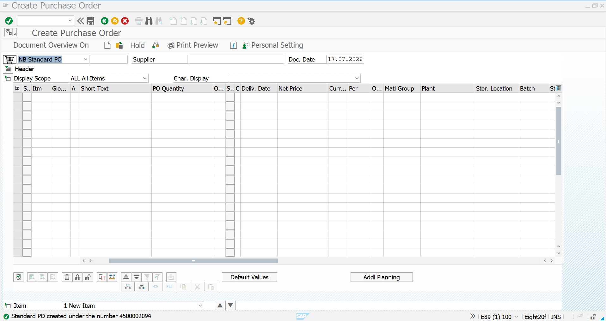
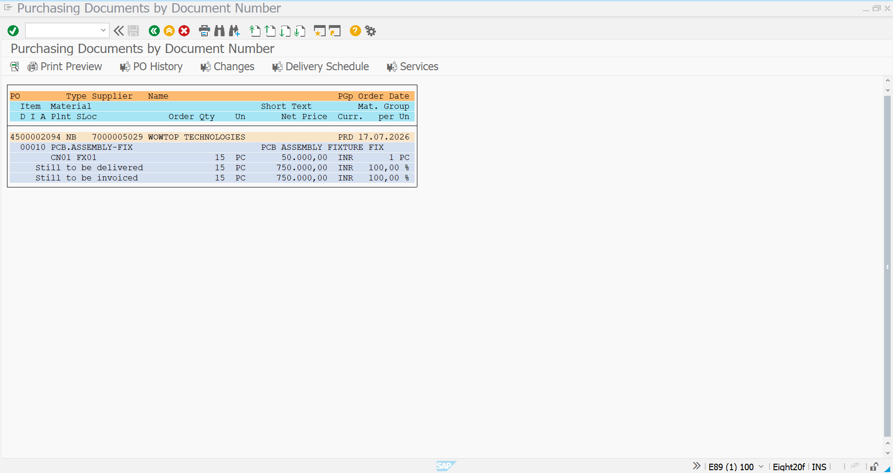

# Purchase Order - Fixtures

## Overview

This document describes the creation of a **Purchase Order (PO)** for procuring **PCB Assembly Fixtures** in SAP S/4HANA. The Purchase Order was created after completing the Strategic Sourcing process, including Request for Quotation (RFQ), Vendor Quotations, and Price Comparison.

Based on the quotation evaluation, **Wowtop Technologies Pvt. Ltd.** was selected as the preferred supplier by offering the most competitive quotation.

---

# Business Requirement

Following the successful completion of the Strategic Sourcing process, a Purchase Order was created to procure **15 PCB Assembly Fixtures** from the selected vendor for the production department.

---

# Transaction Codes

| Activity | Transaction Code |
|-----------|------------------|
| Create Purchase Order | ME21N |
| Change Purchase Order | ME22N |
| Display Purchase Order | ME23N |

---

# Organization Details

| Field | Value |
|------|------|
| Company | NT01 |
| Company Code | NT0100 |
| Plant | CN01 |
| Storage Location | FX01 |
| Purchasing Organization | POR1 |
| Purchasing Group | PRD |
| Vendor | Wowtop Technologies Pvt. Ltd. |
| Material | PCB Assembly Fixture |

---

# Purchase Order Details

| Field | Value |
|------|------|
| Material | PCB Assembly Fixture |
| Vendor | Wowtop Technologies Pvt. Ltd. |
| Quantity | 15 PCS |
| Total Order Value | ₹50,000 |
| Plant | CN01 |
| Storage Location | FX01 |

---

# Step 1 - Purchase Order Item Overview

The Purchase Order was created by referencing the selected vendor and maintaining the required procurement details such as material, quantity, delivery plant, storage location, and pricing information.

### Screenshot

---

# Step 2 - Purchase Order Created

After entering all mandatory information and validating the procurement details, the Purchase Order was successfully created.

SAP generated a unique Purchase Order number for procurement processing.

### Screenshot

---

# Step 3 - Display Purchase Order

The Purchase Order was displayed to verify all procurement information including vendor details, material information, quantity, pricing, and organizational assignments.

### Screenshot

---

# Purchase Order Summary

| Configuration | Value |
|--------------|-------|
| Vendor | Wowtop Technologies Pvt. Ltd. |
| Material | PCB Assembly Fixture |
| Quantity | 15 EA |
| Total Order Value | ₹50,000 |
| Purchasing Organization | POR1 |
| Purchasing Group | PRD |
| Plant | CN01 |
| Status | ✅ Purchase Order Successfully Created |

---

# Business Benefits

- Converts the approved sourcing decision into a formal procurement document.
- Ensures procurement from the selected supplier based on quotation evaluation.
- Maintains complete procurement traceability from RFQ to Purchase Order.
- Integrates directly with Goods Receipt and Invoice Verification processes.
- Supports efficient procurement execution and vendor management.

---

# Conclusion

The Purchase Order for **PCB Assembly Fixture** was successfully created in SAP S/4HANA after completing the Strategic Sourcing process. **Wowtop Technologies Pvt. Ltd.** was selected based on the lowest evaluated quotation, and the Purchase Order authorizes the supplier to deliver **15 PCB Assembly Fixtures** for production use.

This Purchase Order will be used in the subsequent **Goods Receipt (MIGO)** and **Invoice Verification (MIRO)** processes to complete the Procure-to-Pay cycle.

---

# Document Information

| Item | Details |
|------|---------|
| Module | SAP S/4HANA Materials Management (MM) |
| Business Process | Purchase Order |
| Transaction Codes | ME21N, ME22N, ME23N |
| Project | SAP S/4HANA MM Greenfield Implementation |
| Document Type | Transaction Documentation |
| Status | ✅ Completed |