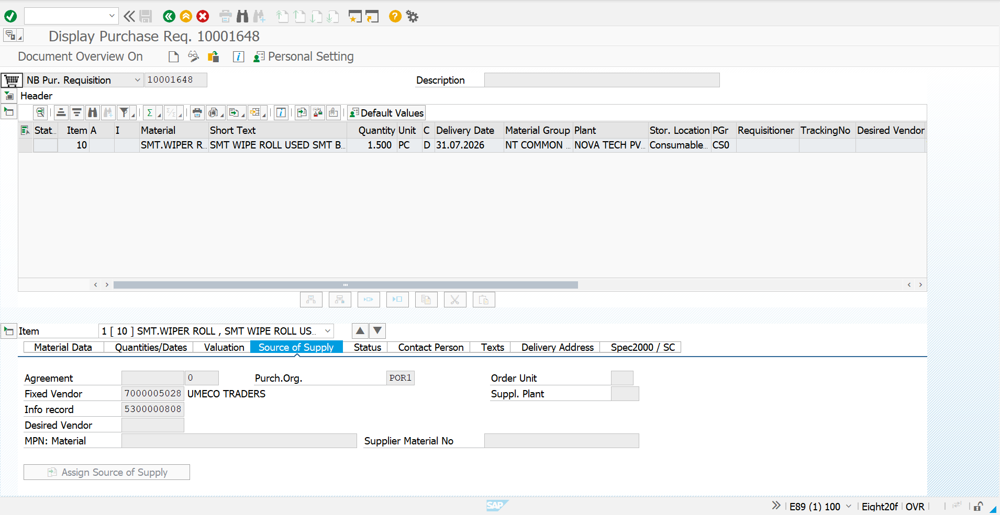
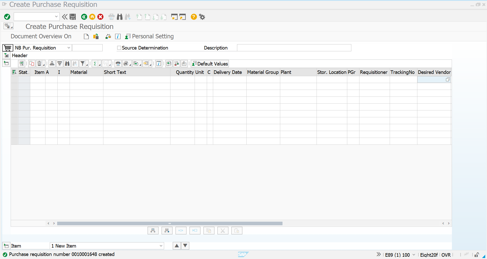
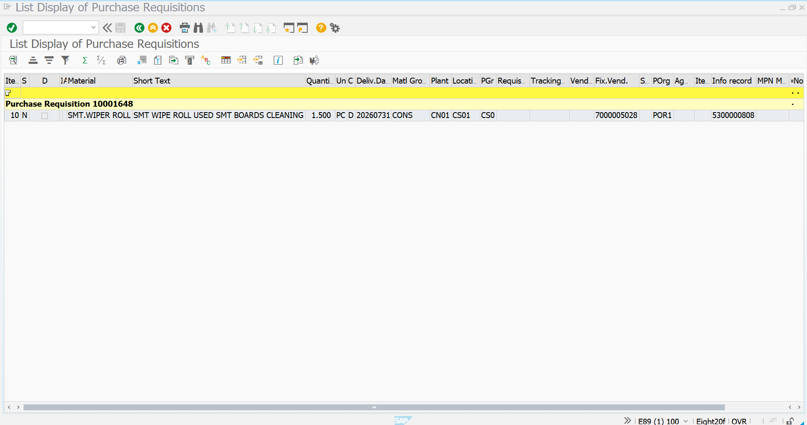

# Purchase Requisition - Consumables

## Overview

This document describes the creation of a Purchase Requisition (PR) for the consumable material **SMT WIPER ROLL** using transaction **ME51N** in SAP S/4HANA.

A Purchase Requisition is an internal procurement document that initiates the purchasing process by requesting the procurement of materials required for production and operational activities.

---

## Business Requirement

Based on the weekly production demand received from the IE Planning and OPM teams, the Procurement Department raises Purchase Requisitions for consumable materials required for manufacturing operations.

In this implementation, a Purchase Requisition was created for **SMT WIPER ROLL**.

---

## Transaction Codes

| Activity | Transaction Code |
|-----------|------------------|
| Create Purchase Requisition | ME51N |
| Change Purchase Requisition | ME52N |
| Display Purchase Requisition | ME53N |

---

## Organization Details

| Field | Value |
|------|------|
| Company | NT01 |
| Company Code | NT0100 |
| Plant | CN01 |
| Storage Location | CS01 |
| Purchasing Organization | POR1 |
| Purchasing Group | CON |
| Material | SMT WIPER ROLL |

---

# Step 1 - Item Overview

The Purchase Requisition was created by entering the required material information.

The following procurement details were maintained:

| Parameter | Value |
|-----------|------|
| Material | SMT WIPER ROLL |
| Quantity | 1500 PC |
| Plant | CN01 |
| Storage Location | CS01 |
| Source of Supply | UMECO |

### Screenshot

---

# Step 2 - Purchase Requisition Created

After validating all mandatory procurement information, the Purchase Requisition was successfully created in SAP S/4HANA.

The system generated a unique Purchase Requisition document number, which will be referenced during Purchase Order creation.

### Screenshot

---

# Step 3 - Purchase Requisition Display

The Purchase Requisition was displayed using transaction **ME53N** to verify all procurement details.

The document is now available for further procurement processing and Purchase Order creation.

### Screenshot

---

# Purchase Requisition Summary

| Configuration | Value |
|--------------|-------|
| Material | SMT WIPER ROLL |
| Quantity | 1500 PC |
| Plant | CN01 |
| Storage Location | CS01 |
| Purchasing Organization | POR1 |
| Purchasing Group | CON |
| Source of Supply | UMECO |
| Document Type | NB |
| Status | ✅ Successfully Created |

---

# Business Benefits

- Initiates the procurement process based on production demand.
- Supports material planning and inventory replenishment.
- Enables controlled purchasing through approval workflows.
- Provides traceability from demand generation to Purchase Order creation.
- Ensures timely availability of consumable materials for production.

---

# Conclusion

The Purchase Requisition for **SMT WIPER ROLL** was successfully created in SAP S/4HANA. The document captures the internal procurement requirement for 1500 units and identifies **UMECO** as the source of supply. This Purchase Requisition serves as the basis for creating the subsequent Purchase Order in the Procure-to-Pay (P2P) process.

---

# Document Information

| Item | Details |
|------|---------|
| Module | SAP S/4HANA Materials Management (MM) |
| Business Process | Purchase Requisition |
| Transaction Code | ME51N |
| Project | SAP S/4HANA MM Greenfield Implementation |
| Document Type | Transaction Documentation |
| Status | ✅ Completed |