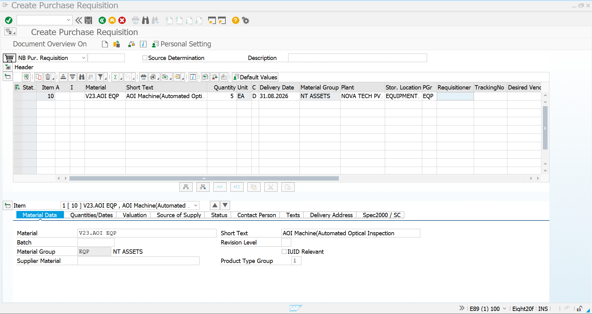
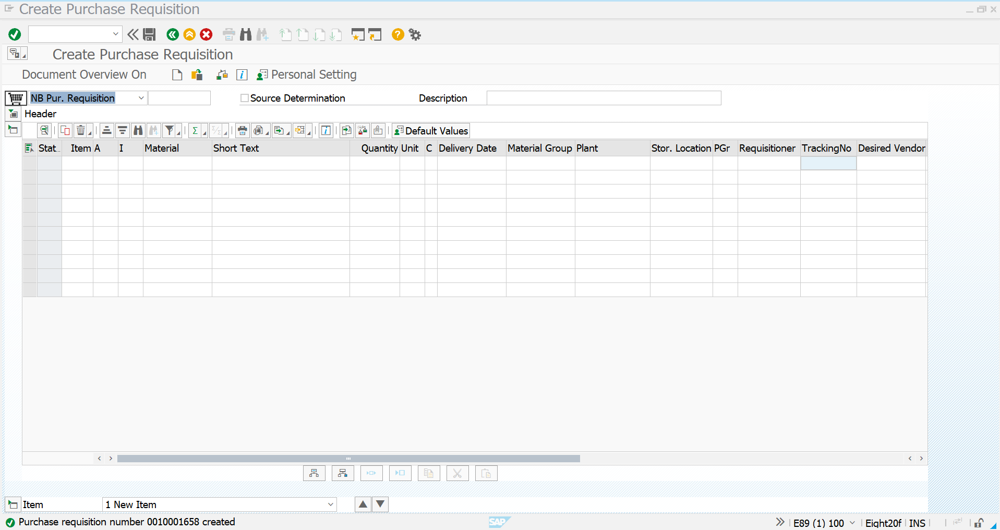
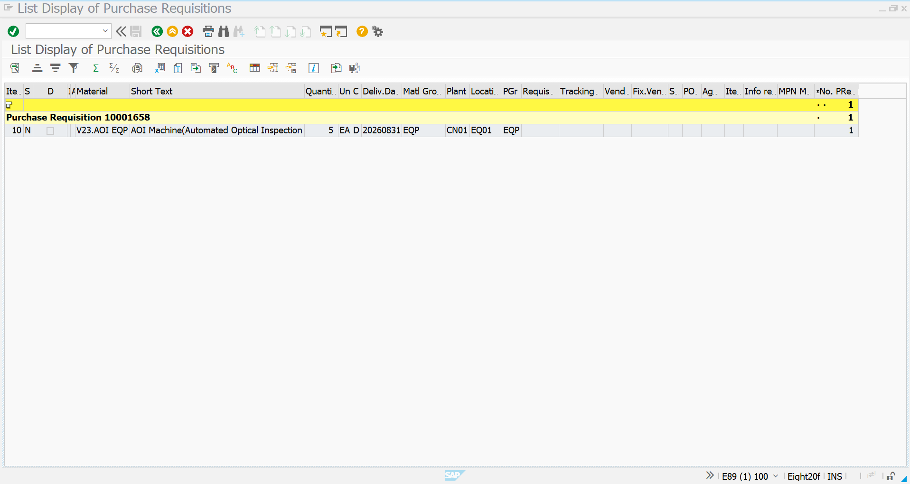

# Purchase Requisition – Equipment

## Objective

This document describes the creation of a Purchase Requisition (PR) for procuring an AOI (Automated Optical Inspection) Machine in SAP S/4HANA MM. The Purchase Requisition represents an internal request to procure equipment required for manufacturing operations.

---

# Purchase Requisition Details

| Field | Value |
|-------|-------|
| Material | V23.AOI EQP |
| Material Description | AOI Machine (Automated Optical Inspection) |
| Material Group | EQP |
| Plant | CN01 |
| Storage Location | EQ01 |
| Purchasing Group | EQP |
| Quantity | **5 EA** |
| Unit of Measure | EA |
| Procurement Type | Standard Procurement |

---

# Step 1 – Purchase Requisition Initial Screen

**Transaction Code:** ME51N

The Purchase Requisition process begins by selecting the document type and entering the required procurement details.

## Screenshot

---

# Step 2 – Purchase Requisition Created

The material, plant, quantity, delivery information, and purchasing data are maintained and the Purchase Requisition is saved successfully.

### Information Maintained

- Material
- Plant
- Storage Location
- Purchasing Group
- Quantity
- Unit of Measure
- Delivery Date

## Screenshot

---

# Step 3 – Display Purchase Requisition

The created Purchase Requisition is displayed for verification.

### Verification Details

- PR Number
- Material
- Quantity
- Plant
- Purchasing Group
- Status

## Screenshot

---

# Summary

The Purchase Requisition for the AOI Machine has been successfully created in SAP S/4HANA MM.

---

# Business Outcome

- Internal procurement request generated
- Equipment requirement approved
- Ready for Purchase Order creation
- Integrated with Procure-to-Pay (P2P) Process