# Strategic Sourcing - Fixtures

## Overview

This document demonstrates the **Strategic Sourcing** process for procuring **PCB Assembly Fixtures** in SAP S/4HANA. Unlike routine consumable procurement, fixtures are sourced through a competitive procurement process involving multiple vendors, Request for Quotation (RFQ), vendor quotations, price comparison, and supplier selection.

---

# Business Requirement

The Production Department requested the procurement of **PCB Assembly Fixtures** for a new manufacturing project. To ensure cost optimization and supplier competitiveness, the Procurement Team initiated the Strategic Sourcing process by inviting quotations from two approved vendors.

---

# Transaction Codes

| Activity | Transaction Code |
|-----------|------------------|
| Purchase Requisition | ME51N |
| Create RFQ | ME41 |
| Maintain Quotation | ME47 |
| Price Comparison | ME49 |

---

# Organization Details

| Field | Value |
|------|------|
| Company | NT01 |
| Company Code | NT0100 |
| Plant | CN01 |
| Storage Location | FX01 |
| Purchasing Organization | POR1 |
| Purchasing Group | PRD |
| Material | PCB Assembly Fixture |
| Material Category | Fixtures |

---

# Approved Vendors

| Vendor | Location |
|---------|----------|
| Wowtop Technologies Pvt. Ltd. | Bangalore |
| Foxconn Precision Engineering (FPE) | Anna Nagar, Chennai |

---

# Step 1 - Purchase Requisition

The procurement process begins with the creation of a Purchase Requisition for the required PCB Assembly Fixtures.

### Screenshot - Purchase Requisition Created

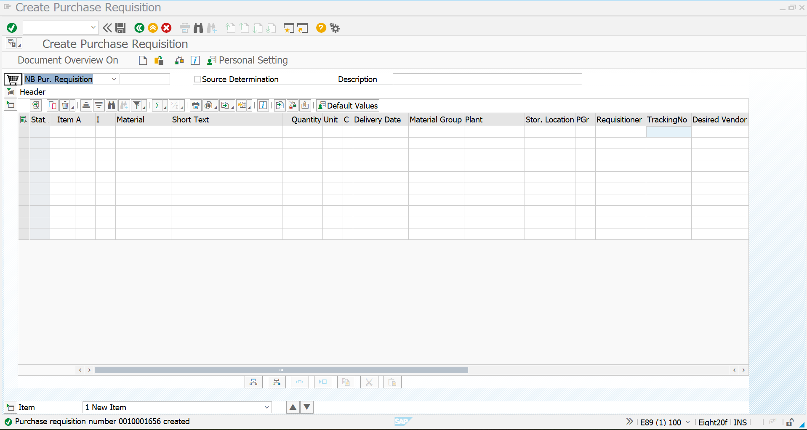

---

### Screenshot - Item Overview

The item overview displays the requested material, quantity, plant, and purchasing information.

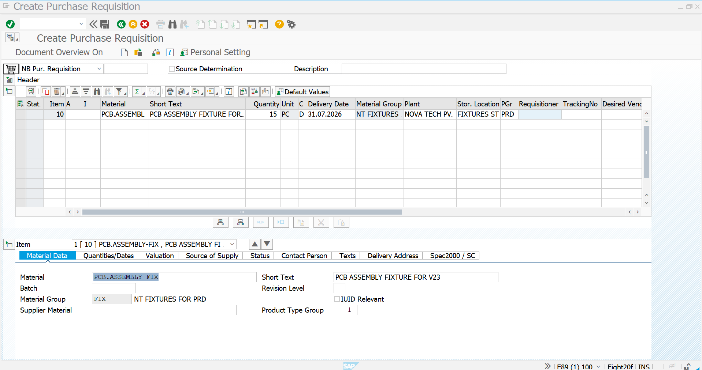

---

### Screenshot - Display Purchase Requisition

The Purchase Requisition was successfully created and displayed.

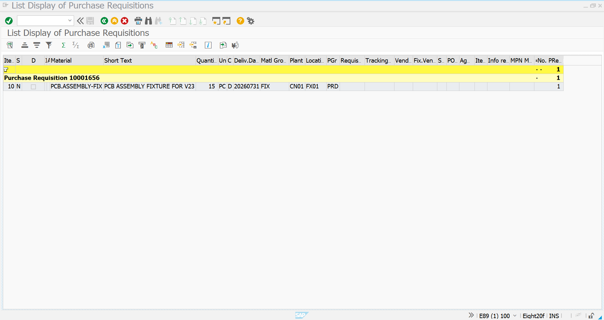

---

# Step 2 - Request for Quotation (RFQ)

After approval of the Purchase Requisition, an RFQ was created and sent to the approved vendors.

### Screenshot - RFQ Initial Screen

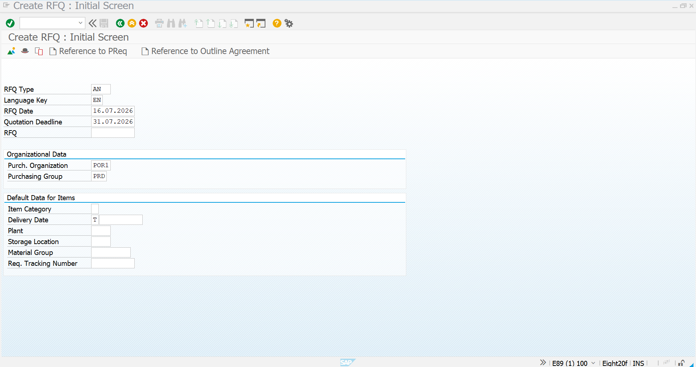

---

### Screenshot - Vendor Selection (Vendor 1)

RFQ assigned to **Wowtop Technologies Pvt. Ltd.**

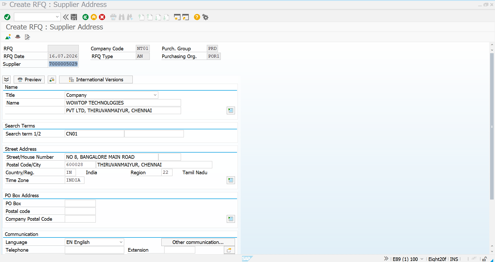

---

### Screenshot - Vendor Selection (Vendor 2)

RFQ assigned to **Foxconn Precision Engineering (FPE)**.

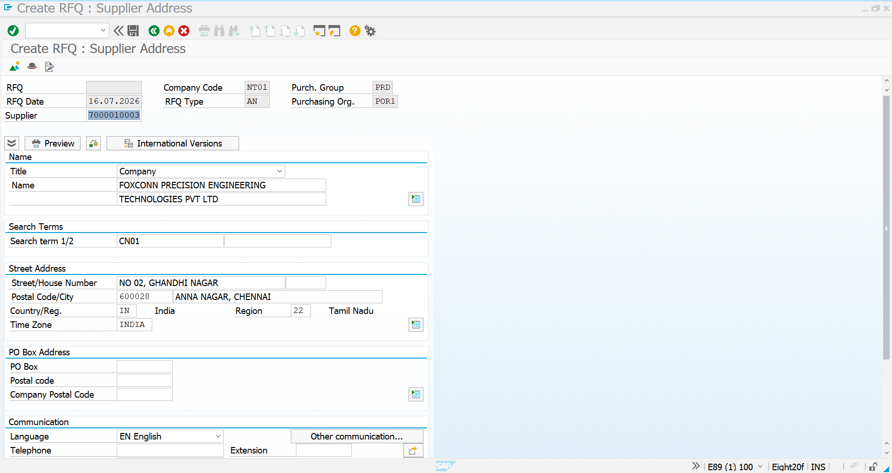

---

### Screenshot - RFQ Item Overview

The RFQ item overview displays the requested fixture details.

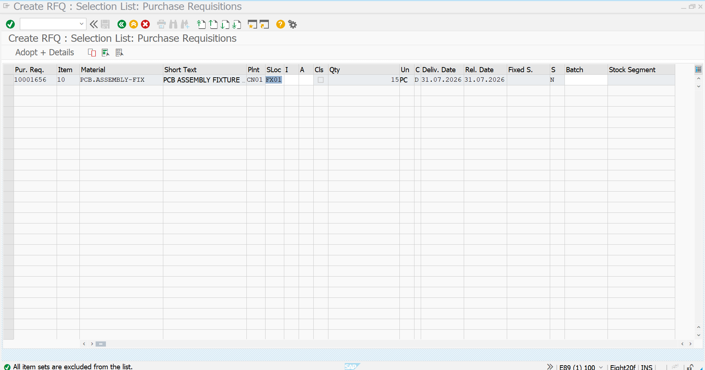

---

### Screenshot - RFQ Created (Vendor 1)

RFQ successfully created for Wowtop Technologies Pvt. Ltd.

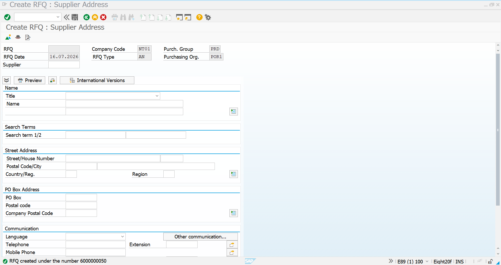

---

### Screenshot - RFQ Created (Vendor 2)

RFQ successfully created for Foxconn Precision Engineering.

---

### Screenshot - Display RFQ

The created RFQ documents were verified successfully.

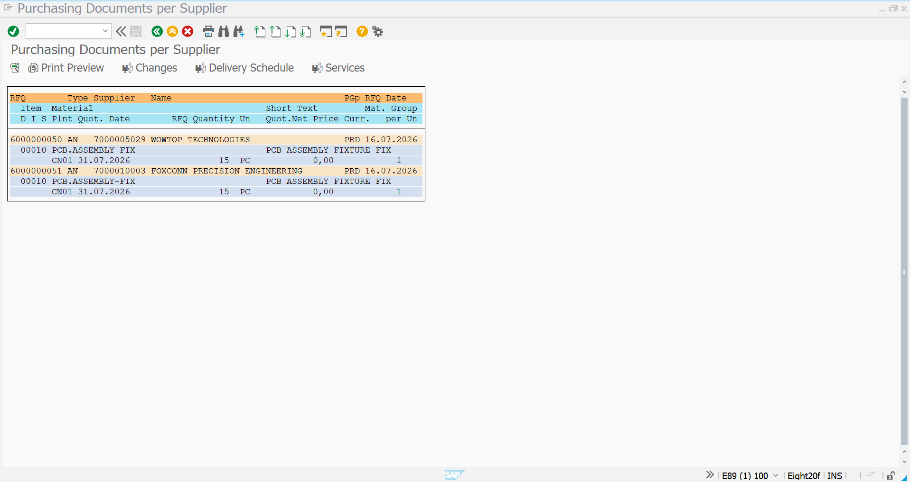

---

# Step 3 - Vendor Quotations

Both vendors submitted their quotations for supplying the PCB Assembly Fixtures.

### Vendor 1 - Wowtop Technologies Pvt. Ltd.

Quoted Amount

**₹50,000**

### Screenshot

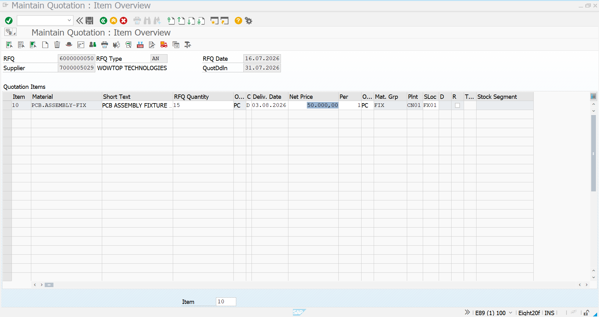

---

### Vendor 2 - Foxconn Precision Engineering

Quoted Amount

**₹60,000**

### Screenshot

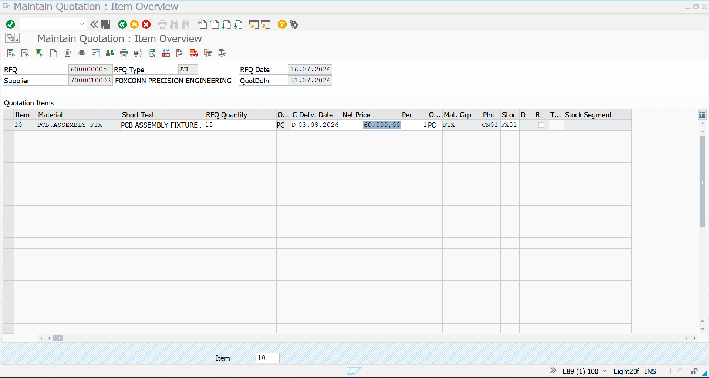

---

# Step 4 - Price Comparison

The quotations received from both vendors were compared using SAP Price Comparison.

### Screenshot - Selection Screen

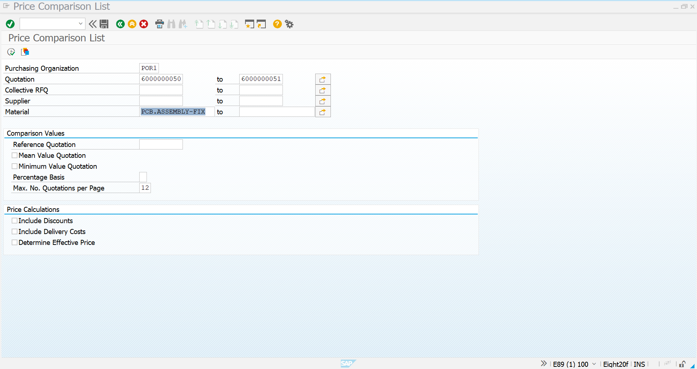

---

### Screenshot - Comparison Result

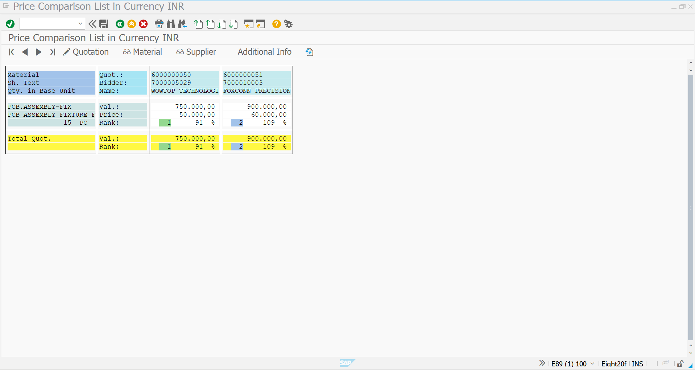

---

## Price Comparison Summary

| Vendor | Quoted Amount | Status |
|---------|--------------:|--------|
| Wowtop Technologies Pvt. Ltd. | ₹50,000 | ✅ Lowest Quotation |
| Foxconn Precision Engineering | ₹60,000 | Higher Quotation |

---

# Step 5 - Vendor Selection

Based on the quotation evaluation, **Wowtop Technologies Pvt. Ltd.** was selected as the supplier because it offered the lowest quotation while meeting the procurement requirements.

### Selected Vendor

- Vendor: **Wowtop Technologies Pvt. Ltd.**
- Location: **Bangalore**
- Final Quotation: **₹50,000**

### Screenshot

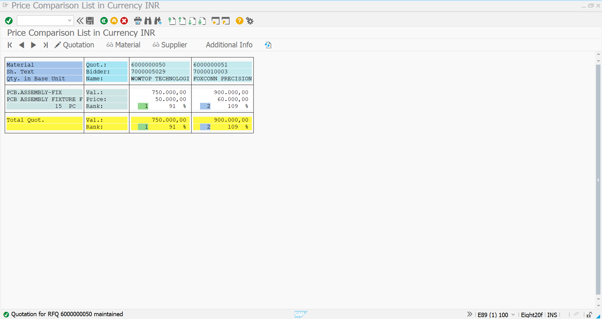

---

# Strategic Sourcing Summary

| Activity | Status |
|-----------|--------|
| Purchase Requisition | ✅ Completed |
| Request for Quotation | ✅ Completed |
| Vendor Quotations | ✅ Received |
| Price Comparison | ✅ Completed |
| Vendor Selection | ✅ Wowtop Technologies Selected |

---

# Business Benefits

- Enables competitive procurement through multiple vendors.
- Ensures transparent quotation evaluation.
- Supports cost optimization through price comparison.
- Improves supplier selection based on commercial evaluation.
- Establishes a structured strategic sourcing process within SAP S/4HANA.

---

# Conclusion

The Strategic Sourcing process for **PCB Assembly Fixtures** was successfully completed in SAP S/4HANA. Purchase Requisition, Request for Quotation, Vendor Quotations, and Price Comparison were executed to evaluate multiple suppliers.

After comparing the submitted quotations, **Wowtop Technologies Pvt. Ltd.** was selected as the preferred supplier by offering the lowest quotation of **₹50,000**, completing the strategic sourcing phase before Purchase Order creation.

---

# Document Information

| Item | Details |
|------|---------|
| Module | SAP S/4HANA Materials Management (MM) |
| Business Process | Strategic Sourcing |
| Transaction Codes | ME51N, ME41, ME47, ME49 |
| Project | SAP S/4HANA MM Greenfield Implementation |
| Document Type | Procurement Process Documentation |
| Status | ✅ Completed |