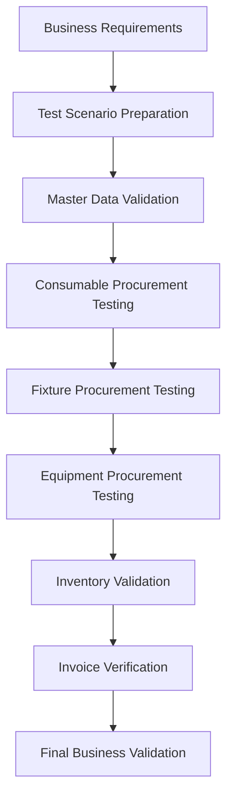
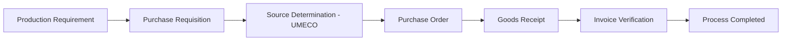
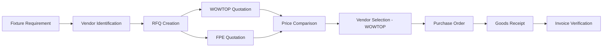

# 🧪 Testing and Validation

---

# Overview

Testing is a critical phase of the SAP S/4HANA MM Greenfield Implementation.

The objective of testing is to validate that configured SAP processes, master data, procurement transactions, inventory updates, and financial integration work according to defined business requirements.

The testing phase covered three major procurement scenarios:

- Consumable Procurement
- Fixture Procurement
- Equipment Procurement

---

# Testing Approach

---

# Testing Scope

| Area | Validation Activity | Status |
|------|--------------------|--------|
| Enterprise Structure | Company, Plant, Storage Location validation | ✅ Passed |
| Material Master | Material creation and verification | ✅ Passed |
| Vendor Master | Supplier data validation | ✅ Passed |
| Purchasing Info Record | Vendor-material relationship validation | ✅ Passed |
| Purchase Requisition | Requirement creation testing | ✅ Passed |
| Purchase Order | Purchasing document validation | ✅ Passed |
| Goods Receipt | Inventory update validation | ✅ Passed |
| Invoice Verification | Financial posting validation | ✅ Passed |

---

# Test Scenario 1: Consumable Procurement

## Material

**SMT Wipe Roll**

## Vendor

**UMECO**

## Business Purpose

SMT Wipe Roll is a critical production consumable used in electronics manufacturing operations.

Maintaining sufficient stock availability is important to avoid production line interruptions.

---

# Procurement Process Validation

---

# Test Execution

| Step | SAP Transaction | Expected Result | Status |
|-----|----------------|----------------|--------|
| Material Creation | MM01 | SMT Wipe Roll created successfully | ✅ |
| Vendor Creation | BP | UMECO vendor maintained | ✅ |
| Purchasing Info Record | ME11 | Vendor-material relationship created | ✅ |
| Purchase Requisition | ME51N | Material requirement generated | ✅ |
| Purchase Order | ME21N | PO created for UMECO | ✅ |
| Goods Receipt | MIGO | Stock updated successfully | ✅ |
| Invoice Verification | MIRO | Invoice posted successfully | ✅ |

---

# Consumable Validation Points

Validated:

- Correct material master data
- Vendor assignment
- Purchase order details
- Goods receipt posting
- Inventory update
- Invoice verification

---

# Test Scenario 2: Fixture Procurement

## Material

**Production Fixture**

## Vendors

- WOWTOP
- FPE

## Business Purpose

Fixtures are production-supporting tools used to improve manufacturing efficiency and accuracy.

The procurement process included vendor sourcing, RFQ creation, quotation comparison, vendor selection, and purchase execution.

---

# Fixture Sourcing Process

---

# Vendor Price Comparison

| Vendor | Quoted Price | Decision |
|--------|-------------|----------|
| WOWTOP | ₹50,000 | Selected |
| FPE | ₹60,000 | Not Selected |

---

# Vendor Selection Decision

## Selected Vendor

**WOWTOP**

## Selection Reason

WOWTOP was selected based on:

- Lower quotation value
- Cost advantage
- Meeting fixture requirements
- Better commercial suitability

## Cost Saving

WOWTOP provided a saving of:

**₹10,000 compared to FPE**

---

# Test Execution

| Step | SAP Transaction | Expected Result | Status |
|-----|----------------|----------------|--------|
| Fixture Material Creation | MM01 | Fixture material created | ✅ |
| Vendor Creation | BP | Vendors maintained | ✅ |
| RFQ Creation | ME41 | RFQ generated | ✅ |
| Quotation Entry | ME47 | Vendor quotations recorded | ✅ |
| Price Comparison | ME49 | Quotations compared | ✅ |
| Vendor Selection | MEQ1 | WOWTOP selected | ✅ |
| Purchase Requisition | ME51N | Requirement created | ✅ |
| Purchase Order | ME21N | PO generated | ✅ |
| Goods Receipt | MIGO | Fixture received | ✅ |
| Invoice Verification | MIRO | Invoice posted | ✅ |

---

# Fixture Validation Points

Validated:

- Vendor sourcing process
- RFQ processing
- Quotation comparison
- Vendor selection
- Purchase execution
- Inventory update
- Invoice verification

---

# Test Scenario 3: Equipment Procurement

## Material

**Production Equipment**

## Vendor

**ASM**

## Purchase Value

**₹150,000**

## Business Purpose

Production equipment procurement supports long-term manufacturing requirements and improves production capability.

---

# Equipment Procurement Process

---

# Test Execution

| Step | SAP Transaction | Expected Result | Status |
|-----|----------------|----------------|--------|
| Equipment Material Creation | MM01 | Equipment created successfully | ✅ |
| Vendor Creation | BP | ASM vendor maintained | ✅ |
| Purchasing Info Record | ME11 | Vendor details maintained | ✅ |
| Purchase Requisition | ME51N | Equipment requirement created | ✅ |
| Purchase Order | ME21N | PO created for ASM | ✅ |
| Goods Receipt | MIGO | Equipment received | ✅ |
| Invoice Verification | MIRO | Invoice posted | ✅ |

---

# Equipment Validation Points

Validated:

- Equipment master data
- Vendor assignment
- Purchase value accuracy
- Goods receipt process
- Financial integration

---

# End-to-End Testing Summary

| Scenario | Vendor | Value | Result |
|---------|--------|-------|--------|
| SMT Wipe Roll | UMECO | ₹150/unit | ✅ Passed |
| Production Fixture | WOWTOP | ₹50,000 | ✅ Passed |
| Production Equipment | ASM | ₹150,000 | ✅ Passed |

---

# Overall Test Outcome

| Metric | Result |
|--------|--------|
| Total Procurement Scenarios | 3 |
| Total Test Cases | 24 |
| Successful Tests | 24 |
| Failed Tests | 0 |
| Final Status | ✅ PASSED |

---

# Final Validation

The SAP S/4HANA MM implementation successfully validated:

✅ Procurement processes  
✅ Vendor sourcing activities  
✅ Material master configuration  
✅ Inventory updates  
✅ Goods receipt processing  
✅ Invoice verification  
✅ MM-FI integration  

---

# Conclusion

The testing phase confirmed that the SAP S/4HANA MM solution successfully supports multiple procurement scenarios including consumables, fixtures, and equipment.

All business processes were validated successfully, ensuring the system is ready for business operations and future enhancements.