# 01 | PR Release Procedure Creation

## 1. Overview

This document covers the configuration of a **Purchase Requisition (PR) Release Procedure with Classification** in SAP S/4HANA.

The release procedure is configured for **Novatech Electronics Pvt. Ltd.** to introduce a structured approval process for purchase requisitions.

The configuration uses:

- Release Procedure with Classification
- Class Type `032 – Release Strategy`
- Release Class `NT_PR`
- Release Group `%N`
- Three release characteristics
- Three release codes
- Three release strategies
- Two release indicators

The configured approval hierarchy is:

```text
Purchase Requisition
        │
        ▼
Engineer Approval
        │
        ▼
Senior Engineer Approval
        │
        ▼
Manager Approval
        │
        ▼
PR Fully Released
```

---

# 2. Business Scenario

Novatech Electronics wants to control Purchase Requisitions through a defined approval hierarchy.

The PR approval structure configured for this project is:

| Level | Release Strategy | Release Code | Approver |
|---|---|---|---|
| Level 1 | `01` | `EN` | Engineer |
| Level 2 | `02` | `SR` | Senior Engineer |
| Level 3 | `03` | `MA` | Manager |

The release statuses are:

| Release Indicator | Description |
|---|---|
| `N` | NOT APPROVED |
| `A` | APPROVED SUCCESSFULLY |

The overall approval flow is:

```text
PR Created
    ↓
Engineer
    ↓
Senior Engineer
    ↓
Manager
    ↓
Approved Successfully
    ↓
PR Can Proceed for Purchasing
```

---

# 3. Release Procedure Architecture

The release procedure is built using the following structure:

```text
PR Characteristics
        │
        ├── NT1 → Plant
        ├── NT2 → Purchasing Organization
        └── NT3 → Total Value of Item
                    │
                    ▼
             Release Class
                NT_PR
                    │
                    ▼
              Class Type 032
                    │
                    ▼
             Release Group %N
                    │
          ┌─────────┼─────────┐
          ▼         ▼         ▼
       Strategy   Strategy   Strategy
          01        02         03
          │         │          │
          ▼         ▼          ▼
          EN      EN + SR   EN + SR + MA
          │         │          │
          ▼         ▼          ▼
       Engineer   Senior     Manager
                 Engineer
                    │
                    ▼
             PR Fully Released
```

---

# 4. Step 1 – Create Release Characteristics

Release characteristics are used to determine which release strategy should apply to a Purchase Requisition.

For this project, three characteristics were created:

| Characteristic | Description | CEBAN Field |
|---|---|---|
| `NT1` | Plant | `WERKS` |
| `NT2` | Purchasing Organization | `EKORG` |
| `NT3` | Total Value of Item | `GSWRT` |

These characteristics are assigned to the release class `NT_PR`.

---

# 5. Characteristic NT1 – Plant

## Purpose

`NT1` represents the **Plant** of the Purchase Requisition.

## Configuration

| Field | Value |
|---|---|
| Characteristic | `NT1` |
| Description | Plant |
| Data Type | CHAR |
| Number of Characters | 4 |
| Reference Table | `CEBAN` |
| Reference Field | `WERKS` |

## Transaction

```text
CT04
```

## Characteristic Creation

The characteristic `NT1` was created in transaction `CT04`.

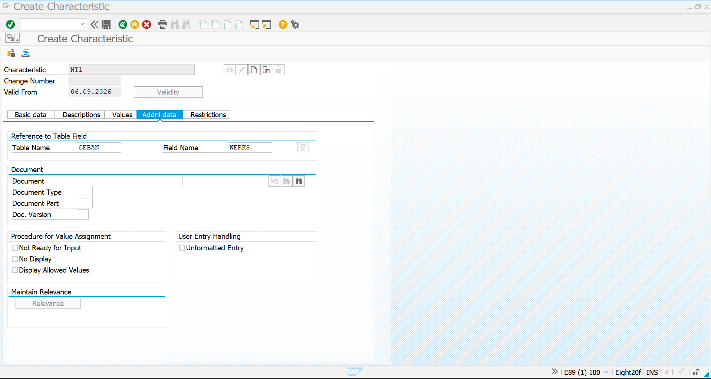

## Result

The system successfully saved characteristic `NT1`.

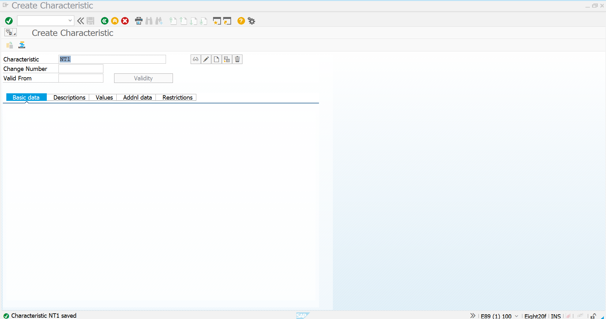

---

# 6. Characteristic NT2 – Purchasing Organization

## Purpose

`NT2` represents the **Purchasing Organization** used in the Purchase Requisition.

## Configuration

| Field | Value |
|---|---|
| Characteristic | `NT2` |
| Description | Purchasing Organization |
| Data Type | CHAR |
| Number of Characters | 4 |
| Reference Table | `CEBAN` |
| Reference Field | `EKORG` |

## Characteristic Creation

The characteristic `NT2` was created with the description **Purchasing Organization**.

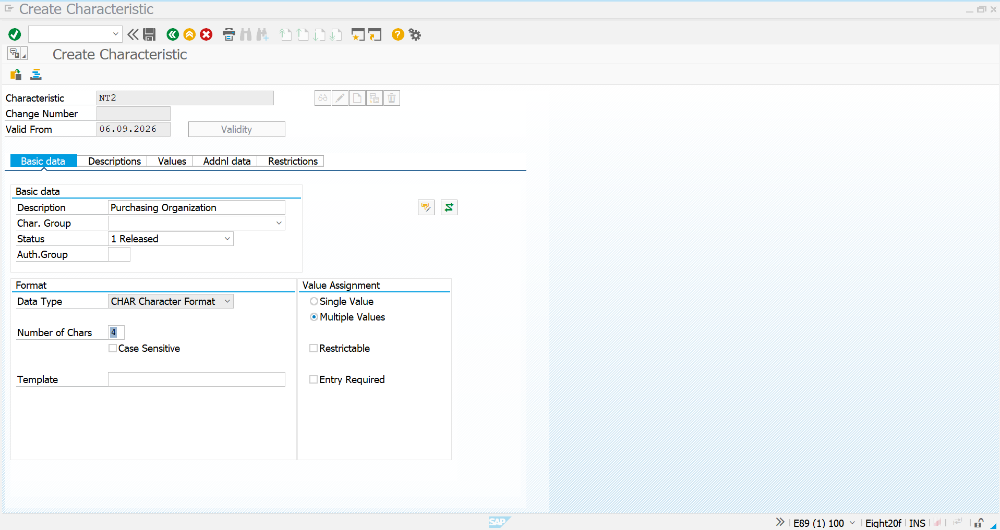

## Result

The system successfully saved characteristic `NT2`.

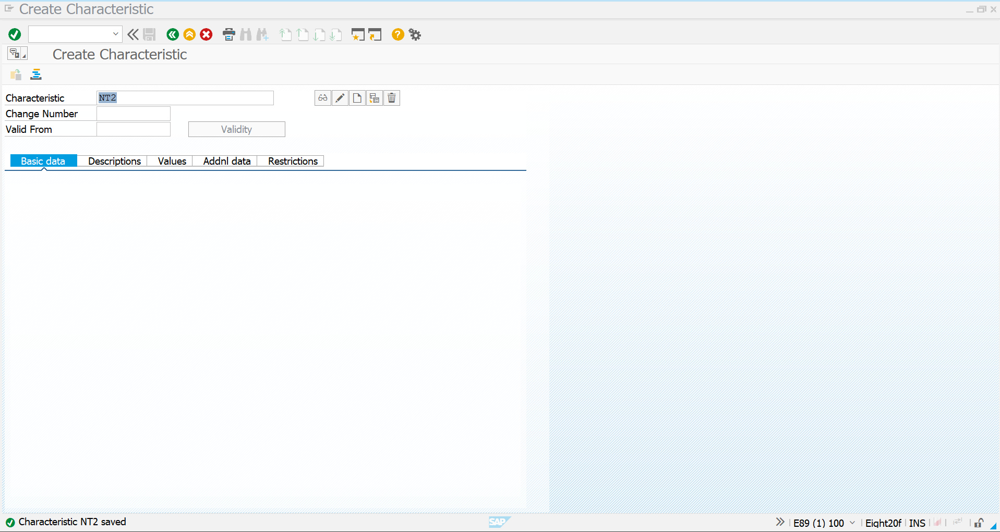

---

# 7. Characteristic NT3 – Total Value of Item

## Purpose

`NT3` represents the **Total Value of the PR Item**.

This characteristic is used to evaluate the monetary value of the Purchase Requisition item during release strategy determination.

## Configuration

| Field | Value |
|---|---|
| Characteristic | `NT3` |
| Description | Total Value of Item |
| Data Type | CURR |
| Number of Characters | 13 |
| Decimal Places | 2 |
| Currency | INR |
| Interval Values | Allowed |
| Reference Table | `CEBAN` |
| Reference Field | `GSWRT` |

## Characteristic Creation

The characteristic `NT3` was created using the currency format with INR.

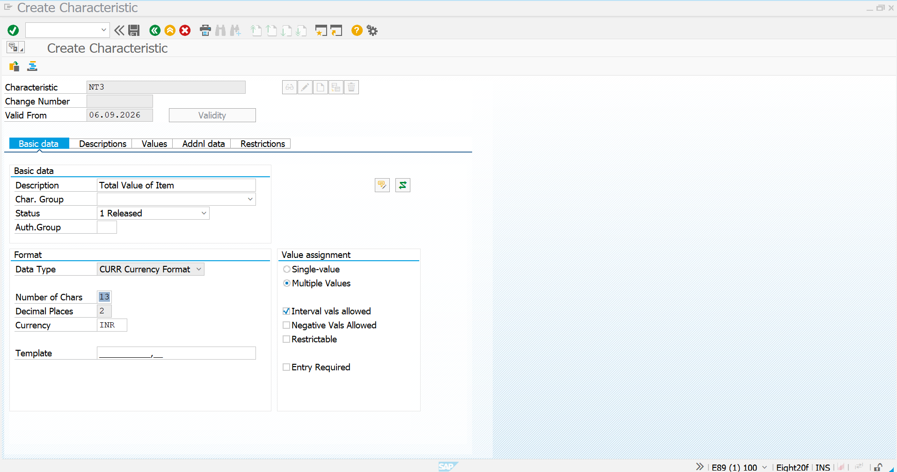

## Result

The system successfully saved characteristic `NT3`.


---

# 8. Characteristics Created – Summary

The three characteristics required for the PR release procedure have been created.

| Characteristic | Description | Reference |
|---|---|---|
| `NT1` | Plant | `CEBAN-WERKS` |
| `NT2` | Purchasing Organization | `CEBAN-EKORG` |
| `NT3` | Total Value of Item | `CEBAN-GSWRT` |

The characteristics will be used in the classification of the PR release class.

---

# 9. Step 2 – Create Release Class

The next step is to create a classification class that contains the characteristics required for release strategy determination.

## Transaction

```text
CL01
```

## Class Configuration

| Field | Value |
|---|---|
| Class | `NT_PR` |
| Class Type | `032` |
| Description | PR REL GRP |
| Valid From | 06.09.2026 |

## Initial Class Creation

The class `NT_PR` was created with class type `032`.

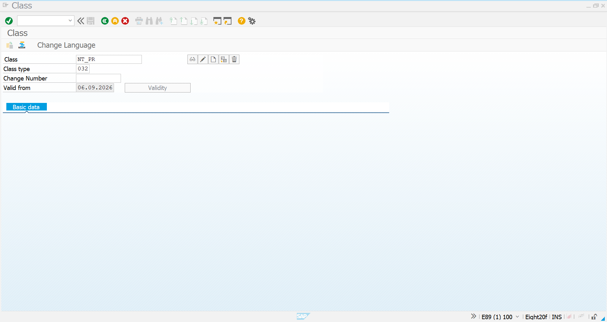

---

# 10. Assign Characteristics to Release Class

The following characteristics were assigned to class `NT_PR`:

```text
NT1 → Plant

NT2 → Purchasing Organization

NT3 → Total Value of Item
```

The class therefore contains all the characteristics required for the PR release procedure.

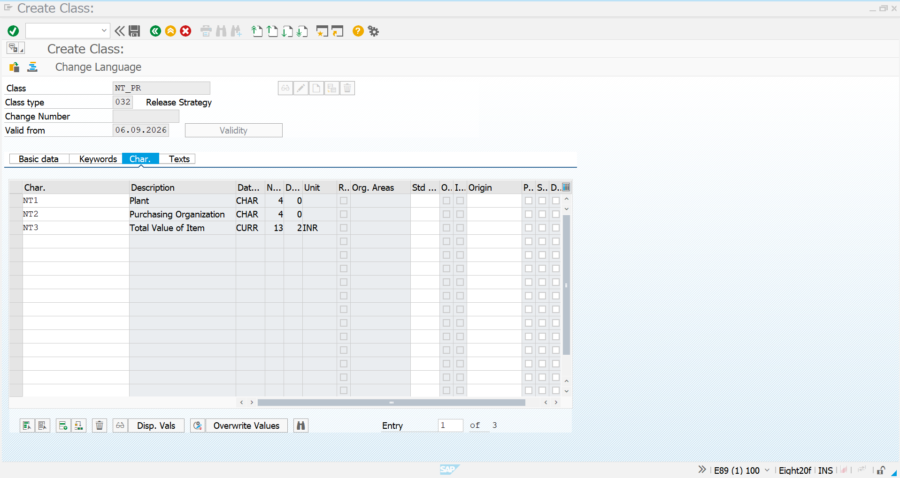

## Result

The release class `NT_PR` was successfully created.

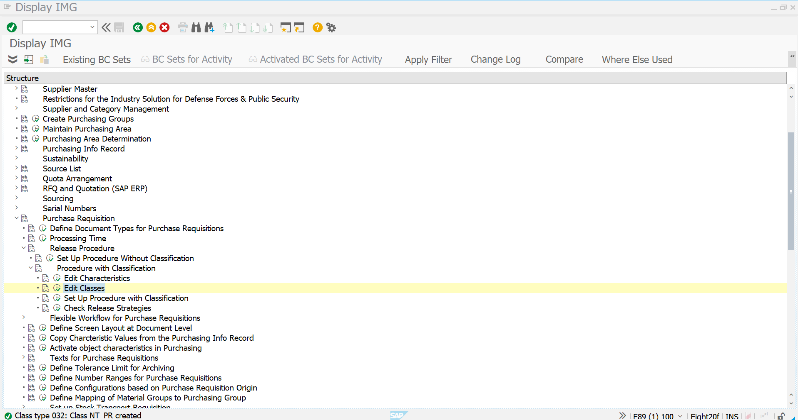

---

# 11. Step 3 – Create Release Group

The next configuration step is to create the **Release Group** and connect it with the release class.

## Configuration

| Field | Value |
|---|---|
| Release Group | `%N` |
| Description | PR REL GRP |
| Class | `NT_PR` |

The release group acts as the organizational grouping for the PR release strategies.

## Release Group Creation

The release group `%N` was created and linked with the release class `NT_PR`.

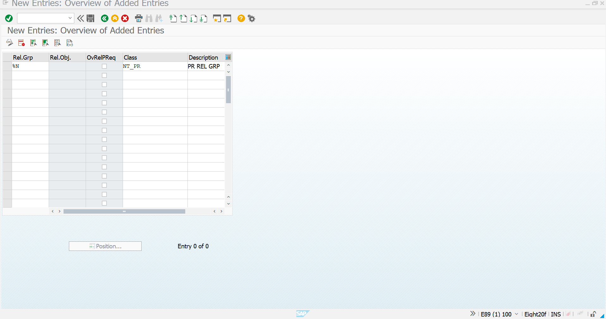

---

# 12. Step 4 – Create Release Codes

Release codes represent the individual approval authorities involved in the release procedure.

Three release codes were configured:

| Release Code | Description | Approval Level |
|---|---|---|
| `EN` | ENGINEER | Level 1 |
| `SR` | SENIOR ENGINEER | Level 2 |
| `MA` | MANAGER | Level 3 |

The approval hierarchy is:

```text
EN – ENGINEER
        ↓
SR – SENIOR ENGINEER
        ↓
MA – MANAGER
```

## Release Codes Creation

The three release codes were configured for the PR release procedure.

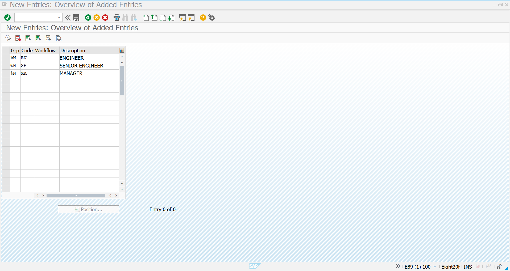

---

# 13. Step 5 – Create Release Indicators

Release indicators represent the status of the Purchase Requisition during the approval process.

Two release indicators were configured.

## Release Indicator N – Not Approved

| Field | Value |
|---|---|
| Release ID | `N` |
| Description | NOT APPROVED |

This indicator represents a PR that has not yet completed the approval process.

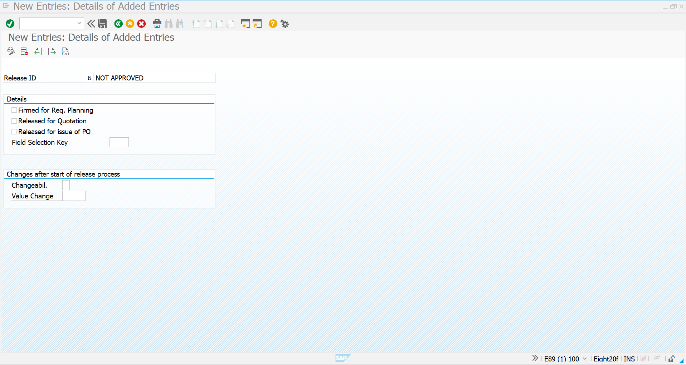

---

# 14. Release Indicator A – Approved Successfully

| Field | Value |
|---|---|
| Release ID | `A` |
| Description | APPROVED SUCCESSFULLY |

This indicator represents the successfully completed approval status.

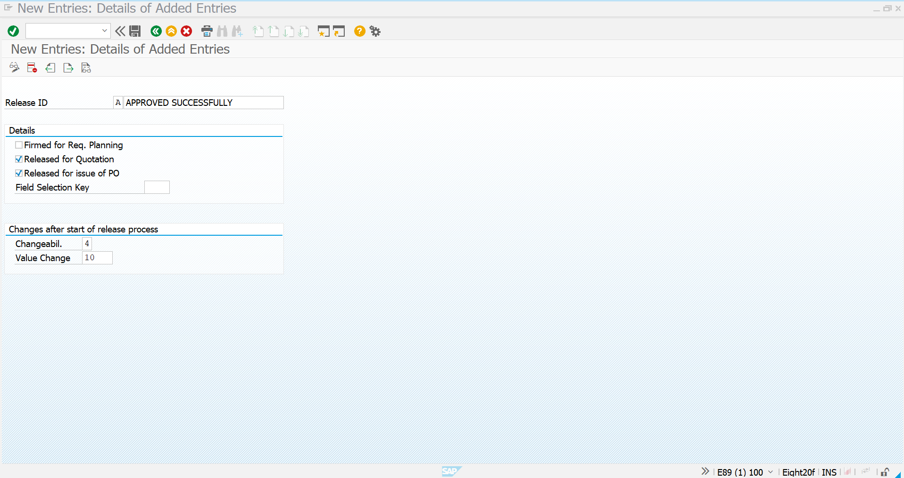

## Release Indicators Overview

The final release indicator configuration contains:

```text
N → NOT APPROVED

A → APPROVED SUCCESSFULLY
```

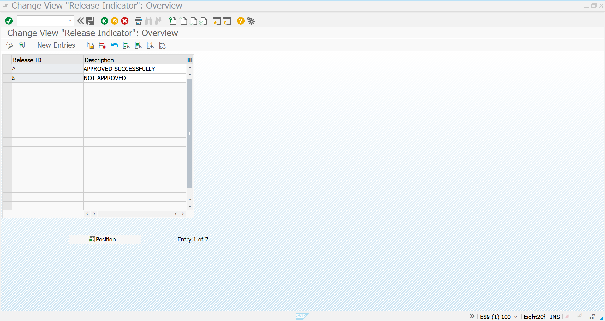

---

# 15. Step 6 – Create Release Strategy 01 – Engineer

The first release strategy represents the **Engineer approval**.

## Configuration

| Field | Value |
|---|---|
| Release Group | `%N` |
| Release Strategy | `01` |
| Description | ENGINEER STATERGY |
| Release Code | `EN` |
| Approver | Engineer |

The Engineer is the first approval authority in the configured hierarchy.

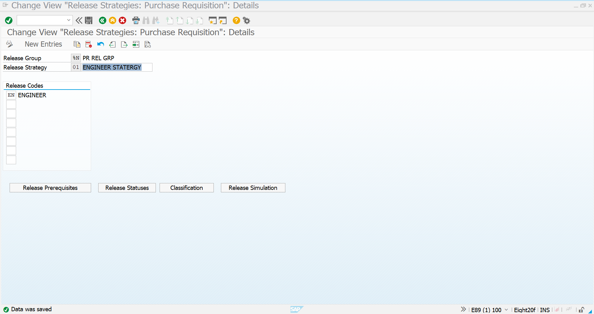

## Approval Flow

```text
PR Created
    ↓
Engineer Approval
    ↓
Release Code EN
```

---

# 16. Step 7 – Create Release Strategy 02 – Senior Engineer

The second release strategy represents the **Senior Engineer approval**.

## Configuration

| Field | Value |
|---|---|
| Release Group | `%N` |
| Release Strategy | `02` |
| Description | SR ENGINEER STATERGY |
| Release Codes | `EN`, `SR` |
| Approvers | Engineer + Senior Engineer |

The second strategy includes both the Engineer and Senior Engineer release codes.

Therefore, the approval sequence is:

```text
EN → SR
```

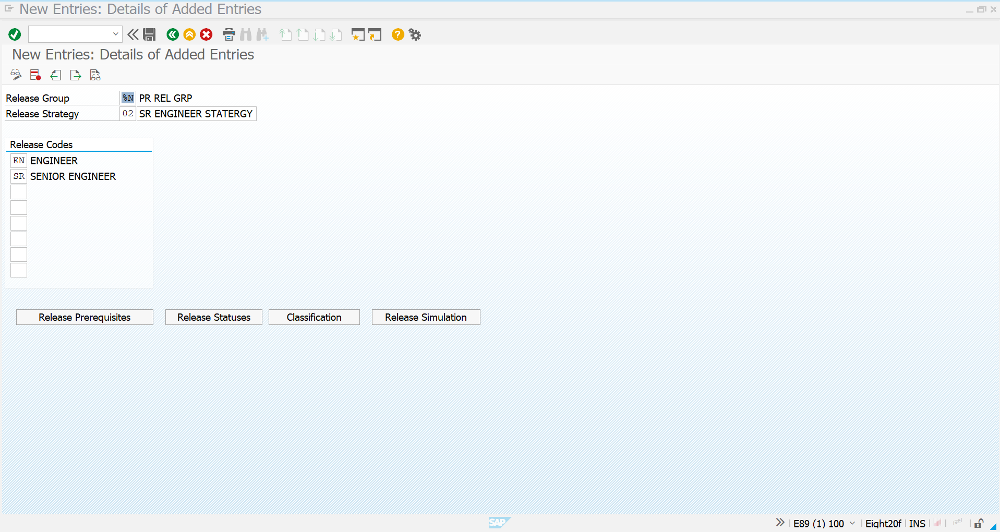

## Approval Flow

```text
PR Created
    ↓
Engineer
  EN
    ↓
Senior Engineer
  SR
```

---

# 17. Step 8 – Create Release Strategy 03 – Manager

The third release strategy represents the **Manager approval**.

## Configuration

| Field | Value |
|---|---|
| Release Group | `%N` |
| Release Strategy | `03` |
| Description | MANAGER STATERGY |
| Release Codes | `EN`, `SR`, `MA` |
| Approvers | Engineer + Senior Engineer + Manager |

This strategy represents the complete three-level approval hierarchy.

The approval sequence is:

```text
EN → SR → MA
```

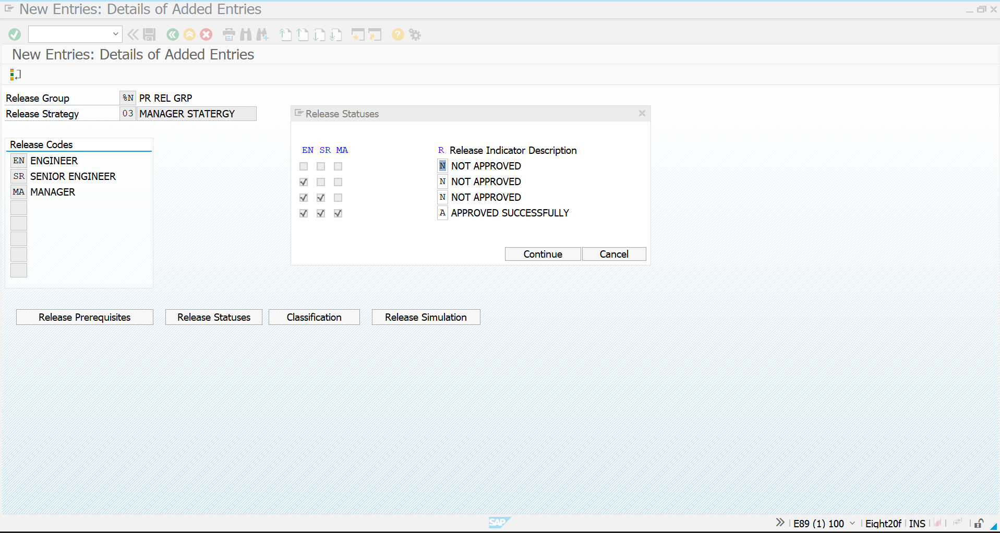

## Approval Flow

```text
PR Created
    ↓
Engineer
  EN
    ↓
Senior Engineer
  SR
    ↓
Manager
  MA
    ↓
PR Fully Released
```

---

# 18. Release Strategy Prerequisites

The release prerequisites control the order in which the approval levels must be completed.

The configured sequence is:

| Release Strategy | Release Codes | Approval Sequence |
|---|---|---|
| `01` | EN | Engineer |
| `02` | EN + SR | Engineer → Senior Engineer |
| `03` | EN + SR + MA | Engineer → Senior Engineer → Manager |

This creates the following approval dependency:

```text
Engineer
   │
   ▼
Senior Engineer
   │
   ▼
Manager
```

For the final Manager strategy, the previous approval levels must be completed before the Manager approval can complete the release process.

---

# 19. Release Procedure Configuration – Overall Structure

The completed configuration can be represented as:

```text
                       Purchase Requisition
                                │
                                ▼
                     Release Strategy Check
                                │
              ┌─────────────────┼─────────────────┐
              │                 │                 │
              ▼                 ▼                 ▼
        Strategy 01        Strategy 02       Strategy 03
         Engineer         Senior Engineer       Manager
              │                 │                 │
              ▼                 ▼                 ▼
             EN              EN + SR         EN + SR + MA
              │                 │                 │
              ▼                 ▼                 ▼
         Engineer         Senior Engineer      Manager
                                │
                                ▼
                       APPROVED SUCCESSFULLY
```

---

# 20. Technical Mapping

The technical structure of the release procedure is:

```text
Purchase Requisition
        │
        ├── CEBAN-WERKS
        │       │
        │       └── NT1 → Plant
        │
        ├── CEBAN-EKORG
        │       │
        │       └── NT2 → Purchasing Organization
        │
        └── CEBAN-GSWRT
                │
                └── NT3 → Total Value of Item
                            │
                            ▼
                       Class NT_PR
                            │
                            ▼
                      Class Type 032
                            │
                            ▼
                       Release Group %N
                            │
                ┌───────────┼───────────┐
                ▼           ▼           ▼
               01          02          03
               EN        EN + SR    EN + SR + MA
                │           │           │
                ▼           ▼           ▼
            Engineer     Sr Engineer   Manager
```

For this project, the PR item value characteristic is mapped to:

```text
CEBAN-GSWRT
```

This allows the release procedure to use the PR item's value during strategy determination.

---

# 21. Configuration Result and Next Step

## Configuration Summary

The PR Release Procedure with Classification has been configured with the following objects:

| Configuration Object | Configured Value |
|---|---|
| Release Class | `NT_PR` |
| Class Type | `032` |
| Release Group | `%N` |
| Characteristic 1 | `NT1 – Plant` |
| Characteristic 2 | `NT2 – Purchasing Organization` |
| Characteristic 3 | `NT3 – Total Value of Item` |
| Release Code 1 | `EN – ENGINEER` |
| Release Code 2 | `SR – SENIOR ENGINEER` |
| Release Code 3 | `MA – MANAGER` |
| Release Indicator 1 | `N – NOT APPROVED` |
| Release Indicator 2 | `A – APPROVED SUCCESSFULLY` |
| Release Strategy 01 | Engineer |
| Release Strategy 02 | Senior Engineer |
| Release Strategy 03 | Manager |

## Final Approval Hierarchy

```text
                  PURCHASE REQUISITION
                           │
                           ▼
                    Release Strategy
                     Determination
                           │
                           ▼
                     ENGINEER (EN)
                           │
                           ▼
                SENIOR ENGINEER (SR)
                           │
                           ▼
                     MANAGER (MA)
                           │
                           ▼
                APPROVED SUCCESSFULLY
                           │
                           ▼
                  PR Fully Released
```

## Business Outcome

The configured release procedure provides Novatech Electronics with a structured PR approval mechanism.

It establishes:

- Defined approval responsibilities
- Sequential approval levels
- Release status control
- Classification-based release strategy determination
- Clear separation between unreleased and fully approved PRs

## Next Step – 02 PR Release

The next document will demonstrate the actual PR release process.

```text
Create Purchase Requisition
          ↓
Enter Material / Quantity / Plant
          ↓
Save PR
          ↓
System Determines Release Strategy
          ↓
Engineer Release – EN
          ↓
Senior Engineer Release – SR
          ↓
Manager Release – MA
          ↓
Release Indicator A
          ↓
PR Fully Released
```

The configured release procedure will now be tested using an actual Purchase Requisition.