# 03 | PO Release Procedure Creation

## 1. Overview

This document demonstrates the configuration of a **Purchase Order (PO) Release Procedure with Classification** in SAP S/4HANA MM.

The release procedure is designed for Novatech Electronics Pvt. Ltd. to control Purchase Orders through a multi-level approval process.

### Release Hierarchy

```text
Purchase Order
      │
      ▼
Engineer Approval
Release Code: EN
      │
      ▼
Senior Engineer Approval
Release Code: SR
      │
      ▼
Manager Approval
Release Code: MA
      │
      ▼
PO Fully Released
```

### Configuration Objects

| Configuration Object | Value |
|---|---|
| Class | `NT_PO` |
| Class Type | `032 – Release Strategy` |
| Release Group | `$N – PO REL GRP` |
| Release Code 1 | `EN – ENGINEER` |
| Release Code 2 | `SR – SENIOR ENGINEER` |
| Release Code 3 | `MA – MANAGER` |
| Strategy 1 | `01 – ENGINEER STATERGY` |
| Strategy 2 | `02 – SR ENGINEER STATERGY` |
| Strategy 3 | `03 – MANAGER STATERGY` |
| Initial Indicator | `N – NOT APPROVED` |
| Final Indicator | `A – APPROVED SUCCESSFULLY` |

---

# 2. Business Requirement

Novatech Electronics requires an approval process for Purchase Orders before they can be processed further.

The approval hierarchy is:

```text
Engineer
   ↓
Senior Engineer
   ↓
Manager
```

The release strategy is determined using Purchase Order characteristics such as:

- Plant
- Purchasing Organization
- Total Net Order Value

These characteristics are assigned to the Release Strategy class.

---

# 3. Release Procedure with Classification

The classic PO Release Procedure with Classification uses:

```text
Characteristics
      ↓
Class
      ↓
Release Group
      ↓
Release Codes
      ↓
Release Indicators
      ↓
Release Strategies
      ↓
Classification
      ↓
PO Release
```

The Purchase Order characteristics are evaluated by SAP to determine the appropriate release strategy.

---

# 4. Create Characteristic – Plant

Transaction:

```text
CT04
```

The first characteristic created for the PO release procedure is **Plant**.

### Characteristic Details

| Field | Value |
|---|---|
| Characteristic | `NTP1` |
| Description | `Plant` |
| Data Type | `CHAR` |
| Number of Characters | `4` |
| Status | `1 – Released` |
| Value Assignment | Multiple Values |

The characteristic is used to identify the plant associated with the Purchase Order.

### Screenshot – Characteristic 1 Creation

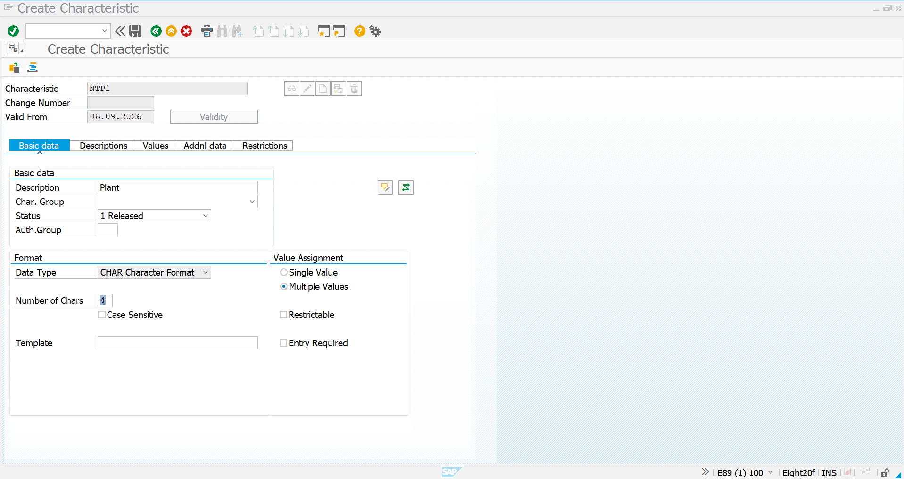

### Screenshot – Characteristic 1 Created

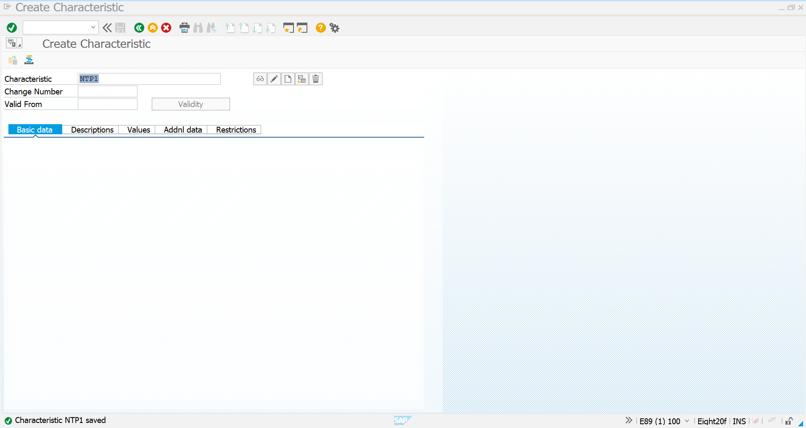

---

# 5. Characteristic – Plant Result

The first characteristic has been successfully created.

```text
Characteristic: NTP1
Description: Plant
Data Type: CHAR
Length: 4
Status: Released
```

This characteristic will later be included in the PO Release Strategy class.

---

# 6. Create Characteristic – Purchasing Organization

The second characteristic is created to identify the Purchasing Organization of the Purchase Order.

### Characteristic Details

| Field | Value |
|---|---|
| Characteristic | `NTP2` |
| Description | `Purchasing Organization` |
| Data Type | `CHAR` |
| Number of Characters | `4` |
| Status | `1 – Released` |
| Value Assignment | Multiple Values |

### Screenshot – Characteristic 2 Creation

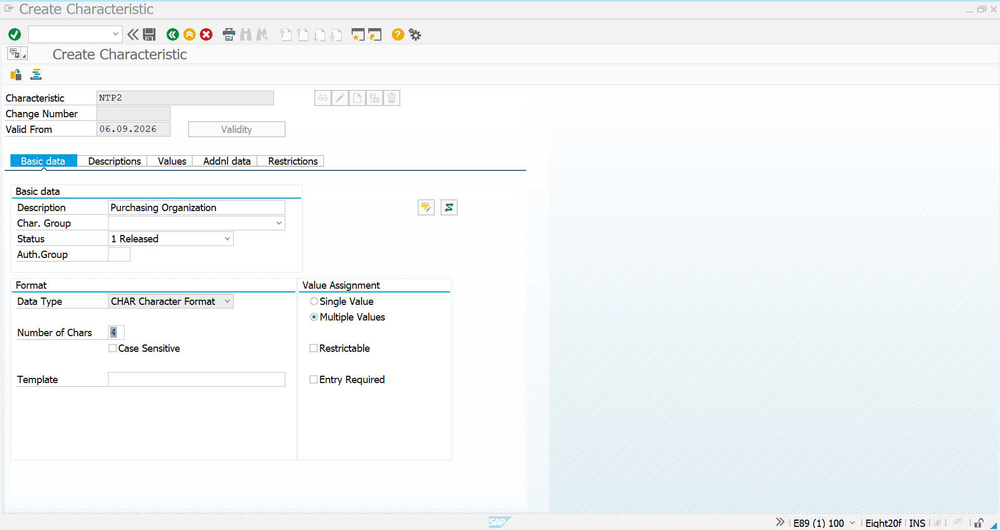

### Screenshot – Characteristic 2 Created


---

# 7. Characteristic – Purchasing Organization Result

The second characteristic has been successfully created.

```text
Characteristic: NTP2
Description: Purchasing Organization
Data Type: CHAR
Length: 4
Status: Released
```

This characteristic will be used as part of the classification criteria for the PO Release Strategy.

---

# 8. Create Characteristic – Total Net Order Value

The third characteristic is created for the **Total Net Order Value** of the Purchase Order.

This allows the release procedure to evaluate the monetary value of the PO.

### Characteristic Details

| Field | Value |
|---|---|
| Characteristic | `NTP3` |
| Description | `Total net order value` |
| Data Type | `CURR – Currency Format` |
| Number of Characters | `15` |
| Decimal Places | `2` |
| Currency | `INR` |
| Value Assignment | Multiple Values |
| Interval Values | Allowed |
| Status | `1 – Released` |

### Screenshot – Characteristic 3 Creation

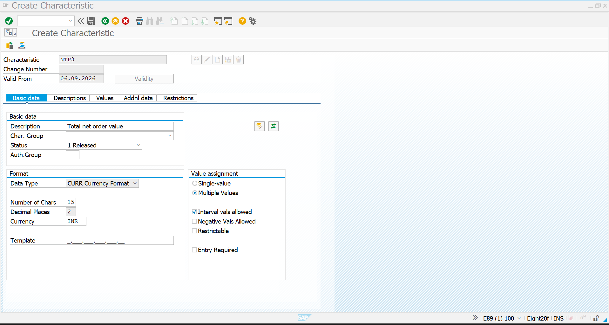

### Screenshot – Characteristic 3 Created

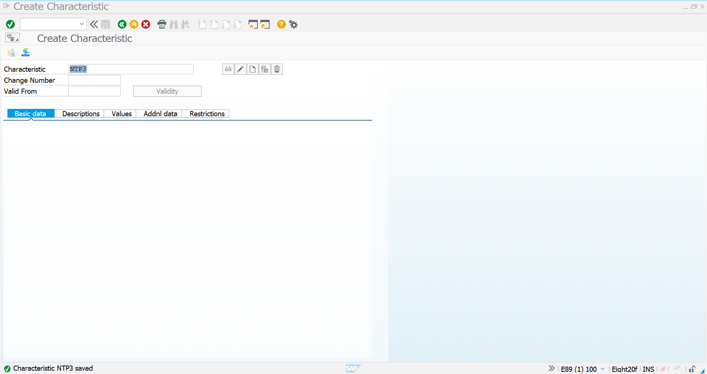

---

# 9. Characteristic – Total Net Order Value Result

The third characteristic has been successfully created.

```text
Characteristic: NTP3
Description: Total net order value
Data Type: CURR
Length: 15
Decimal Places: 2
Currency: INR
```

This characteristic provides the value-based criterion for the PO release procedure.

---

# 10. Create Release Strategy Class

Transaction:

```text
CL01
```

A Release Strategy class is created for the Purchase Order approval process.

### Class Details

| Field | Value |
|---|---|
| Class | `NT_PO` |
| Class Type | `032` |
| Description | `PO REL GRP` |
| Valid From | `06.09.2026` |

Class Type `032` is used for Release Strategies.

### Screenshot – Class Creation Initiation

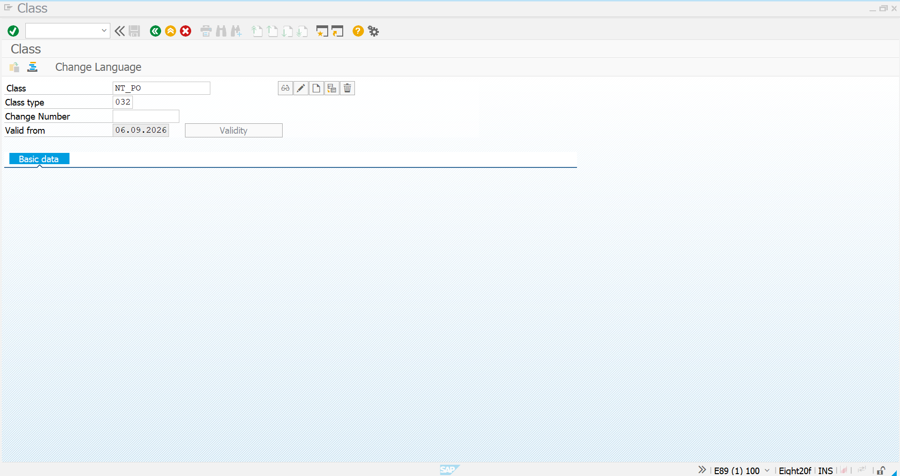

### Screenshot – PO Class Creation

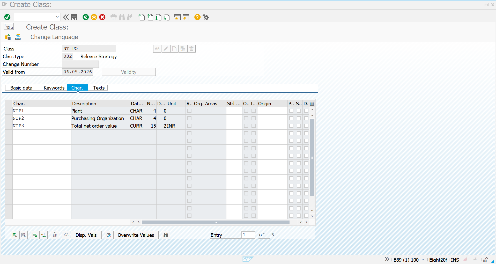

---

# 11. Assign Characteristics to Class

The following characteristics are assigned to class `NT_PO`:

| Characteristic | Description | Data Type |
|---|---|---|
| `NTP1` | Plant | CHAR |
| `NTP2` | Purchasing Organization | CHAR |
| `NTP3` | Total net order value | CURR |

### Screenshot – PO Release Class

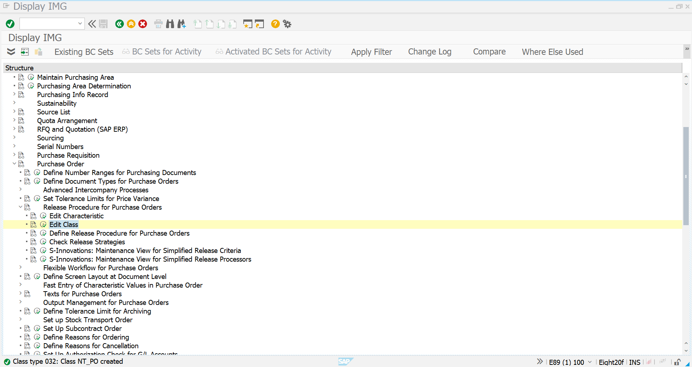

The class therefore contains all three characteristics required for the PO release determination.

---

# 12. Create Release Group

The Release Group identifies the group of release strategies belonging to the Purchase Order release procedure.

### Release Group

```text
$N
```

### Description

```text
PO REL GRP
```

### Screenshot – Release Group Creation

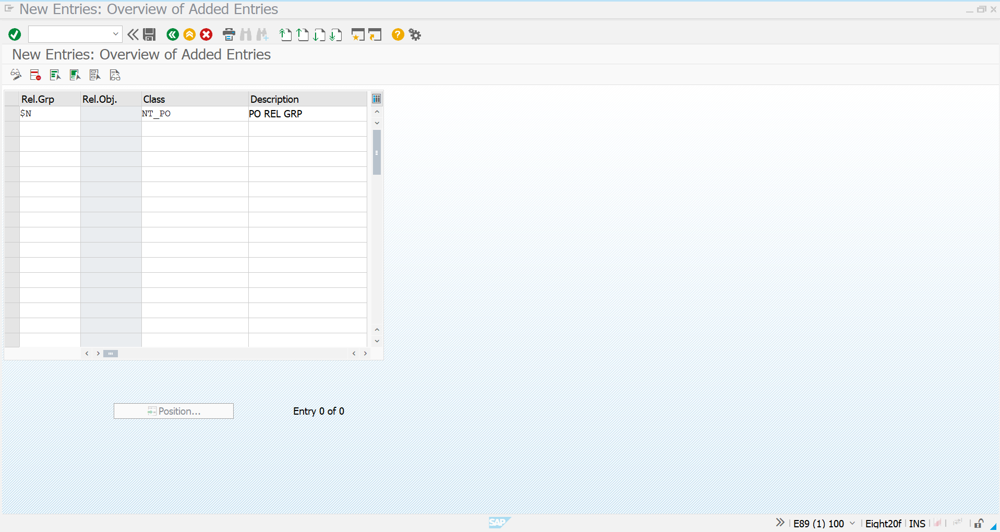

The Release Group is successfully created for the PO release procedure.

---

# 13. Create Release Codes

Three Release Codes are created for the three-level approval hierarchy.

| Release Code | Description |
|---|---|
| `EN` | ENGINEER |
| `SR` | SENIOR ENGINEER |
| `MA` | MANAGER |

### Screenshot – Release Codes Creation

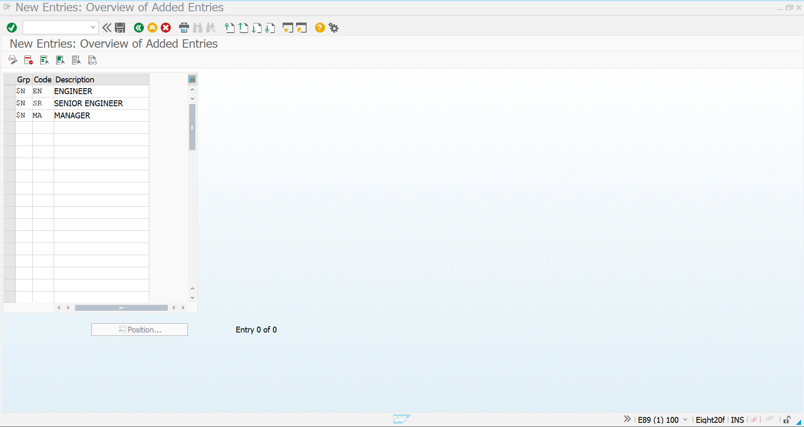

The Release Codes define the individual approval authorities participating in the Purchase Order release process.

---

# 14. Create Release Indicators

Two Release Indicators are configured.

| Release ID | Released | Description |
|---|---|---|
| `A` | ✓ | APPROVED SUCCESSFULLY |
| `N` | | NOT APPROVED |

The initial status is:

```text
N – NOT APPROVED
```

After completing all required approvals:

```text
A – APPROVED SUCCESSFULLY
```

### Screenshot – Release Indicators

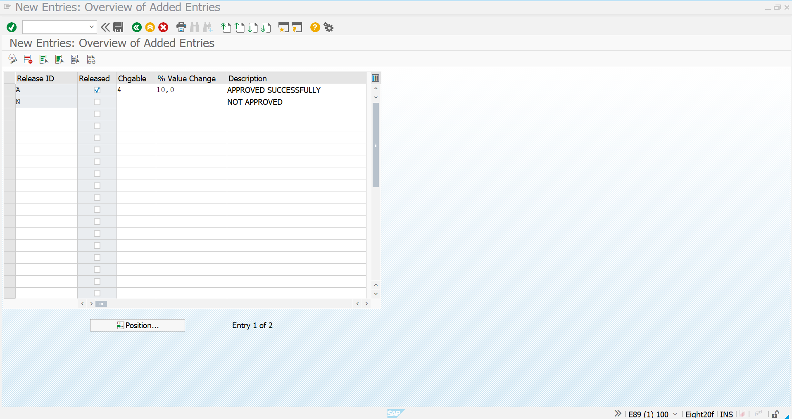

The screenshot shows the configured Release IDs and their corresponding descriptions.

---

# 15. Create Release Strategy – Engineer

The first Release Strategy represents the Engineer approval stage.

### Strategy Details

| Field | Value |
|---|---|
| Release Group | `$N – PO REL GRP` |
| Release Strategy | `01` |
| Description | `ENGINEER STATERGY` |
| Release Code | `EN – ENGINEER` |

### Approval Logic

```text
PO
 │
 ▼
Engineer
 │
 ▼
Release Code EN
```

### Screenshot – Engineer Strategy


---

# 16. Create Release Strategy – Senior Engineer

The second Release Strategy represents the Senior Engineer approval stage.

### Strategy Details

| Field | Value |
|---|---|
| Release Group | `$N – PO REL GRP` |
| Release Strategy | `02` |
| Description | `SR ENGINEER STATERGY` |
| Release Codes | `EN`, `SR` |

The Senior Engineer strategy requires the Engineer release to be completed before the Senior Engineer release.

### Approval Logic

```text
Engineer
   ✓
   │
   ▼
Senior Engineer
   │
   ▼
Release Code SR
```

### Screenshot – Senior Engineer Strategy

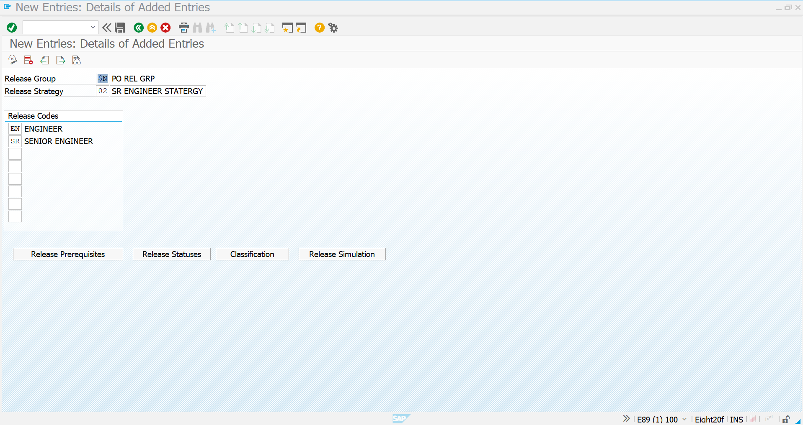

The configured release codes show both:

```text
EN – ENGINEER
SR – SENIOR ENGINEER
```

---

# 17. Create Release Strategy – Manager

The third Release Strategy represents the final Manager approval stage.

### Strategy Details

| Field | Value |
|---|---|
| Release Group | `$N – PO REL GRP` |
| Release Strategy | `03` |
| Description | `MANAGER STATERGY` |
| Release Codes | `EN`, `SR`, `MA` |

The Manager strategy requires the previous two approval levels to be completed.

### Approval Logic

```text
Engineer
   ✓
   │
   ▼
Senior Engineer
   ✓
   │
   ▼
Manager
   │
   ▼
Release Code MA
```

### Screenshot – Manager Strategy

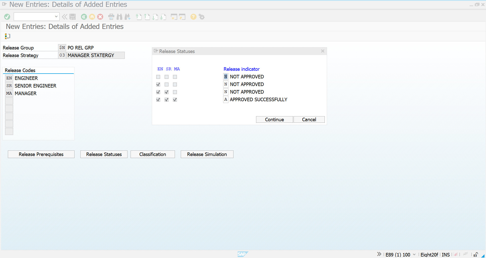

---

# 18. Configure Release Status Sequence

The Manager Strategy contains the complete approval sequence.

The Release Status configuration represents the progression:

```text
EN = Pending
SR = Pending
MA = Pending
        │
        ▼
EN Released
        │
        ▼
EN + SR Released
        │
        ▼
EN + SR + MA Released
        │
        ▼
A – APPROVED SUCCESSFULLY
```

The configured status matrix contains:

| EN | SR | MA | Release Indicator |
|---|---|---|---|
| ✗ | ✗ | ✗ | N – NOT APPROVED |
| ✓ | ✗ | ✗ | N – NOT APPROVED |
| ✓ | ✓ | ✗ | N – NOT APPROVED |
| ✓ | ✓ | ✓ | A – APPROVED SUCCESSFULLY |

### Screenshot – Release Status Sequence


This configuration ensures that the PO receives the final approval indicator only after all three release codes have been completed.

---

# 19. Complete PO Release Procedure Configuration

The complete configuration created in SAP is:

```text
                    PO RELEASE PROCEDURE
                            │
                            ▼
                     Class NT_PO
                     Class Type 032
                            │
             ┌──────────────┼──────────────┐
             │              │              │
             ▼              ▼              ▼
           NTP1            NTP2           NTP3
           Plant       Purchasing Org.   Net Order Value
             │              │              │
             └──────────────┼──────────────┘
                            │
                            ▼
                    Release Group $N
                       PO REL GRP
                            │
                            ▼
                    Release Strategies
                            │
          ┌─────────────────┼─────────────────┐
          │                 │                 │
          ▼                 ▼                 ▼
        01                  02                03
     ENGINEER          SR ENGINEER         MANAGER
     STATERGY           STATERGY           STATERGY
          │                 │                 │
          ▼                 ▼                 ▼
         EN                EN + SR          EN + SR + MA
          │                 │                 │
          └─────────────────┼─────────────────┘
                            ▼
                  A – APPROVED SUCCESSFULLY
```

---

# 20. Configuration Summary

Although the configuration consists of multiple SAP objects, the overall setup can be summarized as follows:

### Characteristics

```text
NTP1 → Plant
NTP2 → Purchasing Organization
NTP3 → Total Net Order Value
```

### Class

```text
NT_PO
Class Type 032
```

### Release Group

```text
$N → PO REL GRP
```

### Release Codes

```text
EN → ENGINEER
SR → SENIOR ENGINEER
MA → MANAGER
```

### Release Strategies

```text
01 → ENGINEER STATERGY
02 → SR ENGINEER STATERGY
03 → MANAGER STATERGY
```

### Release Indicators

```text
N → NOT APPROVED
A → APPROVED SUCCESSFULLY
```

---

# 21. Configuration Validation

The configuration can be validated by checking that:

- The three characteristics exist and are released.
- Class `NT_PO` exists with Class Type `032`.
- `NTP1`, `NTP2`, and `NTP3` are assigned to the class.
- Release Group `$N` exists.
- Release Codes `EN`, `SR`, and `MA` exist.
- Release Indicators `N` and `A` are configured.
- Release Strategy `01` contains Engineer approval.
- Release Strategy `02` contains Engineer and Senior Engineer approval.
- Release Strategy `03` contains Engineer, Senior Engineer, and Manager approval.
- The final release status is linked to indicator `A`.

---

# 22. PO Approval Hierarchy

The configured approval hierarchy is:

```text
                    PURCHASE ORDER
                          │
                          ▼
                   Release Strategy
                          │
                          ▼
                  ┌───────────────┐
                  │   ENGINEER    │
                  │      EN       │
                  └───────┬───────┘
                          │
                          ▼
                  ┌───────────────┐
                  │ SENIOR ENGINEER│
                  │      SR       │
                  └───────┬───────┘
                          │
                          ▼
                  ┌───────────────┐
                  │    MANAGER    │
                  │      MA       │
                  └───────┬───────┘
                          │
                          ▼
                APPROVED SUCCESSFULLY
```

---

# 23. SAP Transactions Used

| Transaction | Purpose |
|---|---|
| `CT04` | Create/Edit Characteristics |
| `CL01` | Create Class |
| `CL02` | Change Class |
| `SPRO` | Configure Release Procedure |
| `ME21N` | Create Purchase Order |
| `ME22N` | Change Purchase Order |
| `ME23N` | Display Purchase Order |
| `ME29N` | Individual PO Release |
| `ME28` | Collective PO Release |

---

# 24. Screenshot Evidence

All configuration screenshots are stored in:

```text
assets/Release-procedure/PO-Release-Procedure-Creation/
```

### Screenshot List

| No. | Configuration | Screenshot |
|---:|---|---|
| 1 | Characteristic 1 Creation | `Characteristic-1-PO-Creation.png` |
| 2 | Characteristic 1 Created | `Characteristic-1-PO-Created.png` |
| 3 | Characteristic 2 Creation | `Characteristic-2-PO-Creation.png` |
| 4 | Characteristic 2 Created | `Characteristic-2-PO-Created.png` |
| 5 | Characteristic 3 Creation | `Characteristic-3-PO-Creation.png` |
| 6 | Characteristic 3 Created | `Characteristic-3-PO-Created.png` |
| 7 | Class Creation Initiation | `PO-Class-Creation-Initiation.png` |
| 8 | PO Class Creation | `PO-Class-Creation.png` |
| 9 | PO Release Class | `PO-Release-Class-Created.png` |
| 10 | Release Group | `PO-Release-Groups-Creation.png` |
| 11 | Release Codes | `PO-Release-Codes-Creation.png` |
| 12 | Release Indicators | `PO-Release-Indicators-Created.png` |
| 13 | Engineer Strategy | `PO-Release-Engineer-Statergy.png` |
| 14 | Senior Engineer Strategy | `PO-Release-SR-Engineer-Statergy.png` |
| 15 | Manager Strategy | `PO-Release-Manager-Statergy.png` |

---

# 25. Final Configuration Result

The Purchase Order Release Procedure has been configured with a three-level approval hierarchy.

```text
┌───────────────────────────────────────────┐
│           PO RELEASE PROCEDURE            │
├───────────────────────────────────────────┤
│ Class       : NT_PO                       │
│ Class Type  : 032                         │
│ Group       : $N – PO REL GRP              │
├───────────────────────────────────────────┤
│ EN          : ENGINEER                    │
│ SR          : SENIOR ENGINEER             │
│ MA          : MANAGER                     │
├───────────────────────────────────────────┤
│ Strategy 01 : ENGINEER STATERGY           │
│ Strategy 02 : SR ENGINEER STATERGY        │
│ Strategy 03 : MANAGER STATERGY            │
├───────────────────────────────────────────┤
│ N           : NOT APPROVED                │
│ A           : APPROVED SUCCESSFULLY       │
└───────────────────────────────────────────┘
```

The configuration is now ready to be tested with an actual Purchase Order.

---

# 26. End-to-End PO Release Flow

```text
Create PO
   │
   ▼
ME21N
   │
   ▼
PO Release Strategy Determined
   │
   ▼
Engineer Approval
EN
   │
   ▼
Senior Engineer Approval
SR
   │
   ▼
Manager Approval
MA
   │
   ▼
Release Indicator A
APPROVED SUCCESSFULLY
   │
   ▼
PO Fully Released
```

---

# 27. Business Benefits

The configured PO Release Procedure provides:

- Multi-level purchasing approval
- Better procurement governance
- Controlled PO processing
- Clear authorization hierarchy
- Approval traceability
- Reduced unauthorized purchasing
- Standardized purchasing controls
- Separation of approval responsibilities

---

# 28. Key Interview Explanation

If asked **"How did you configure the PO Release Procedure?"**, the project can be explained as:

> I configured a classic PO Release Procedure with Classification in SAP S/4HANA MM. I created three characteristics for Plant, Purchasing Organization, and Total Net Order Value using CT04. These characteristics were assigned to class `NT_PO` with class type `032`. I then configured Release Group `$N`, three Release Codes — Engineer (`EN`), Senior Engineer (`SR`), and Manager (`MA`) — along with the required Release Indicators. Finally, I configured three sequential Release Strategies so that the PO moves from Engineer to Senior Engineer and then Manager approval before reaching the final `A – APPROVED SUCCESSFULLY` status.

---

# 29. Configuration Checklist

| Configuration | Status |
|---|---|
| Characteristic NTP1 – Plant | ✅ Created |
| Characteristic NTP2 – Purchasing Organization | ✅ Created |
| Characteristic NTP3 – Total Net Order Value | ✅ Created |
| Class NT_PO | ✅ Created |
| Class Type 032 | ✅ Configured |
| Release Group $N | ✅ Created |
| Release Code EN | ✅ Created |
| Release Code SR | ✅ Created |
| Release Code MA | ✅ Created |
| Release Indicator N | ✅ Created |
| Release Indicator A | ✅ Created |
| Strategy 01 – Engineer | ✅ Configured |
| Strategy 02 – Senior Engineer | ✅ Configured |
| Strategy 03 – Manager | ✅ Configured |
| Release Status Sequence | ✅ Configured |
| Classification Setup | ✅ Configured |

---

# 30. Final Outcome

The PO Release Procedure configuration for Novatech Electronics Pvt. Ltd. has been successfully established.

The configured structure is:

```text
CHARACTERISTICS
       │
       ▼
CLASS NT_PO
       │
       ▼
RELEASE GROUP $N
       │
       ▼
RELEASE CODES
       │
       ├── EN → ENGINEER
       ├── SR → SENIOR ENGINEER
       └── MA → MANAGER
       │
       ▼
RELEASE STRATEGIES
       │
       ├── 01 → ENGINEER
       ├── 02 → SENIOR ENGINEER
       └── 03 → MANAGER
       │
       ▼
RELEASE STATUS
       │
       ├── N → NOT APPROVED
       └── A → APPROVED SUCCESSFULLY
```
