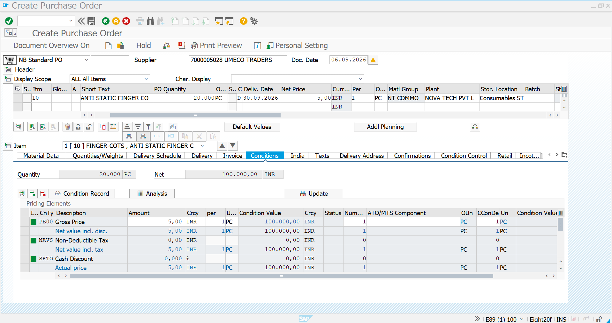
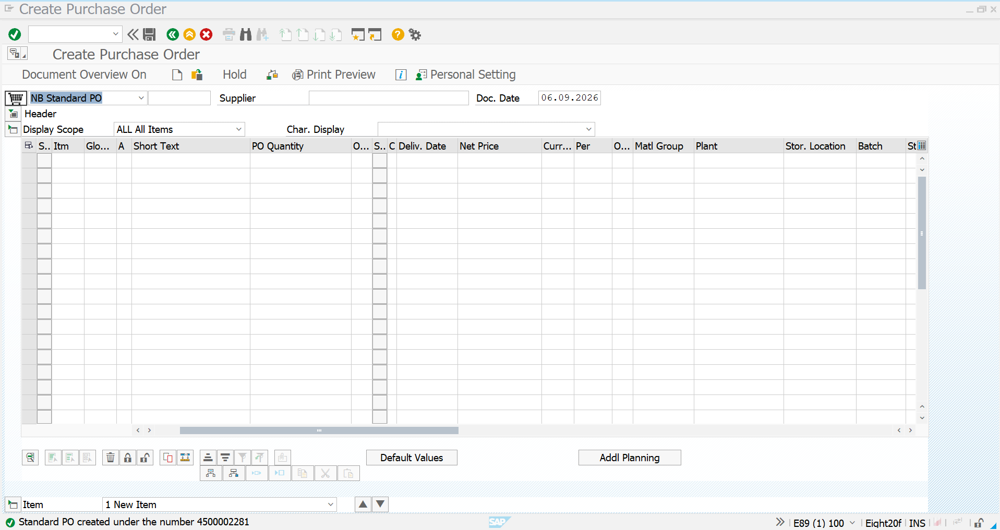
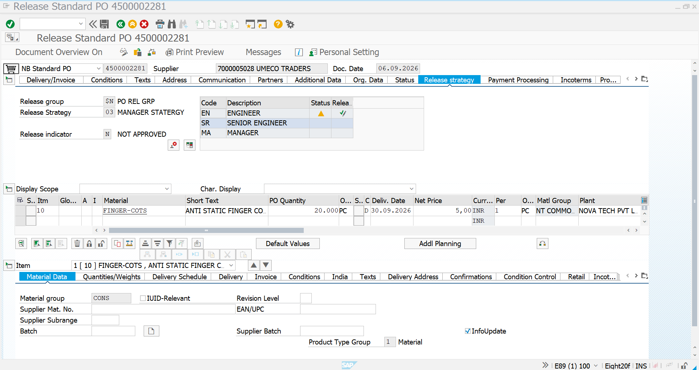
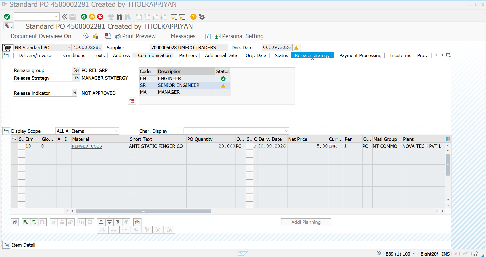
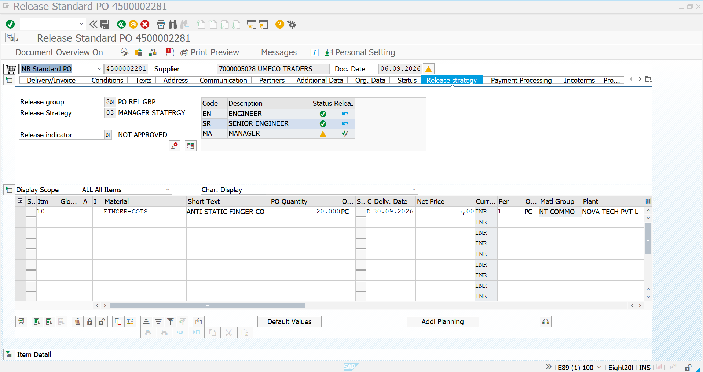
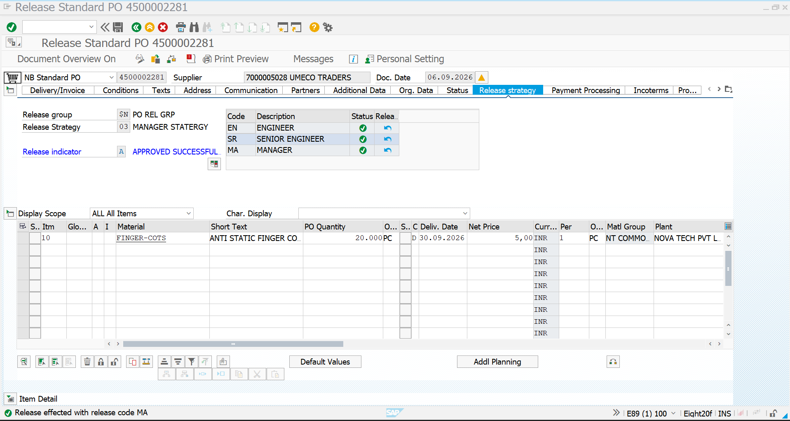
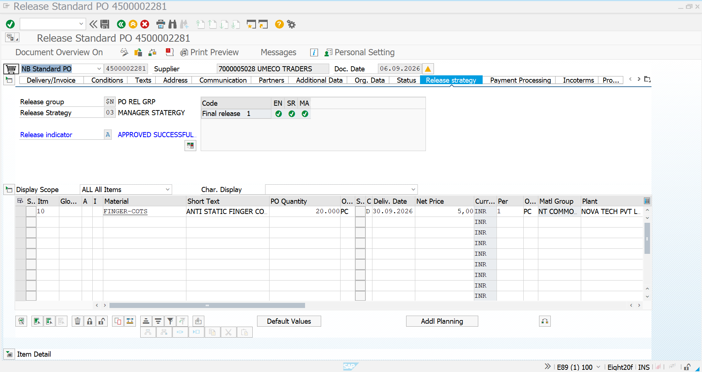
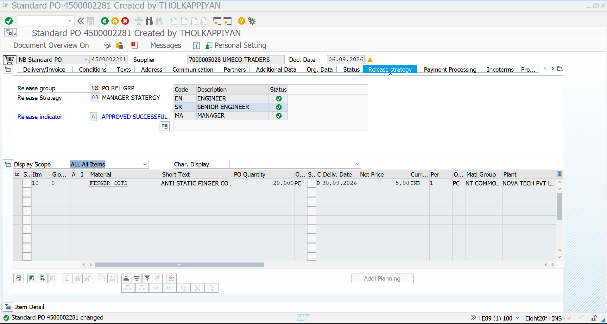

# 04 | PO Release

## 📌 Overview

This document demonstrates the **Purchase Order (PO) Release Procedure** configured in SAP S/4HANA using a **multi-level approval strategy**.

The PO created for the release procedure is routed through the following approval hierarchy:

```text
Purchase Order Created
        ↓
Engineer (EN)
        ↓
Senior Engineer (SR)
        ↓
Manager (MA)
        ↓
Final Release
        ↓
PO Approved for Further Processing
```

The scenario demonstrates how SAP controls PO processing through sequential release codes before the PO becomes fully approved.

---

## 🎯 Business Scenario

**Novatech Electronics Pvt. Ltd.** requires anti-static finger cots for its manufacturing operations.

A standard purchase order is created for the material:

| Field | Value |
|---|---|
| Material | `FINGER-COTS` |
| Description | Anti Static Finger Cots |
| Quantity | 20 PC |
| Net Price | ₹5 / PC |
| PO Value | ₹100 |
| Supplier | `7000005028` – UMECO TRADERS |
| Plant | NOVA TECH PVT LTD |
| Delivery Date | 30.09.2026 |
| PO Type | NB – Standard PO |
| Release Group | `$N` – PO REL GRP |
| Release Strategy | `03` – MANAGER STRATEGY |
| Release Codes | EN → SR → MA |

### Approval Hierarchy

| Level | Release Code | Role | Status |
|---|---|---|---|
| 1 | `EN` | Engineer | Required |
| 2 | `SR` | Senior Engineer | Required |
| 3 | `MA` | Manager | Required |
| Final | — | PO Fully Released | Approved |

---

# 1. Prerequisites

Before testing the PO release procedure, the following configuration should already exist:

- PO release group
- PO release codes
- PO release strategy
- Release prerequisites
- Release indicators
- Classification/characteristics where applicable
- Release authorization for the relevant users

For this project, the configured release strategy is:

```text
Release Group     : $N – PO REL GRP
Release Strategy  : 03 – MANAGER STRATEGY

Approval Sequence:
EN → SR → MA
```

---

# 2. Create Purchase Order

## Transaction Code

```text
ME21N
```

Create a standard purchase order using the required supplier and material.

### PO Details

Enter:

```text
Supplier       : 7000005028
Supplier Name  : UMECO TRADERS

Material       : FINGER-COTS
Quantity       : 20 PC
Net Price      : ₹5 / PC
Plant          : NOVA TECH PVT LTD
Delivery Date  : 30.09.2026
```

The PO is created as a **Standard PO**.

### Screenshot — PO Creation



### Result

The system creates:

```text
PO Number: 4500002281
```

The PO is now subject to the configured release strategy.

---

# 3. PO Created with Release Strategy

After creation, open the PO and navigate to:

```text
ME23N / ME22N
        ↓
Release Strategy
```

The release strategy section shows:

```text
Release Group     : $N – PO REL GRP
Release Strategy  : 03 – MANAGER STRATEGY
Release Indicator : N – NOT APPROVED
```

The approval sequence is displayed as:

```text
EN – ENGINEER
SR – SENIOR ENGINEER
MA – MANAGER
```

At this stage, the PO is **not fully approved**.

### Screenshot — PO Created



### Screenshot — PO Release Strategy


---

# 4. Initial PO Release Status

## Transaction Code

```text
ME29N
```

Use `ME29N` for **individual PO release**.

Enter:

```text
Purchase Order: 4500002281
```

The release screen displays the approval hierarchy.

Initially:

```text
EN – Engineer          → Release required
SR – Senior Engineer   → Waiting
MA – Manager           → Waiting
```

The release indicator remains:

```text
N – NOT APPROVED
```

This demonstrates that the PO cannot proceed to final approval until the configured release sequence is completed.

### Screenshot — Initial Release



---

# 5. Level 1 – Engineer Release

The first approval level is the **Engineer**.

### Release Code

```text
EN
```

The Engineer performs the first release of the PO.

After successful release:

```text
EN – ENGINEER        ✓ Released
SR – SENIOR ENGINEER → Pending
MA – MANAGER         → Pending
```

The PO is still not fully approved because the remaining release codes are outstanding.

### Screenshot — Engineer Release



### Result

The system confirms the release action for:

```text
Release Code: EN
Role        : Engineer
```

The next release level becomes available.

---

# 6. Level 2 – Senior Engineer Release

The second approval level is the **Senior Engineer**.

### Release Code

```text
SR
```

After the Engineer has released the PO, the Senior Engineer can perform the next release.

The status becomes:

```text
EN – ENGINEER        ✓ Released
SR – SENIOR ENGINEER ✓ Released
MA – MANAGER         → Pending
```

### Screenshot — Senior Engineer Release



### Result

The Senior Engineer release is successfully completed.

The PO now moves to the final approval level:

```text
Manager
```

---

# 7. Level 3 – Manager Release

The final approval level is the **Manager**.

### Release Code

```text
MA
```

The Manager performs the final release of the PO.

Before the final release:

```text
EN – ENGINEER        ✓
SR – SENIOR ENGINEER ✓
MA – MANAGER         → Release Required
```

After the Manager releases the PO:

```text
EN – ENGINEER        ✓
SR – SENIOR ENGINEER ✓
MA – MANAGER         ✓
```

### Screenshot — Manager Release



### Result

The system confirms:

```text
Release effected with release code MA
```

The complete approval hierarchy has now been completed.

---

# 8. Final PO Release Status

After all three release codes have been executed, the PO shows:

```text
Release Group     : $N – PO REL GRP
Release Strategy  : 03 – MANAGER STRATEGY
Release Indicator : A – APPROVED SUCCESSFULLY
```

All release codes display successful status:

```text
EN ✓
SR ✓
MA ✓
```

The release indicator changes from:

```text
N – NOT APPROVED
```

to:

```text
A – APPROVED SUCCESSFULLY
```

### Screenshot — Final Release Status



---

# 9. Final PO Status

The final PO screen confirms that all approval levels have been completed.

The release strategy section shows:

| Field | Final Status |
|---|---|
| Release Group | `$N` – PO REL GRP |
| Release Strategy | `03` – MANAGER STRATEGY |
| EN – Engineer | ✓ Released |
| SR – Senior Engineer | ✓ Released |
| MA – Manager | ✓ Released |
| Release Indicator | `A` – Approved Successfully |

### Screenshot — Final PO



The system also confirms that the PO has been successfully changed/saved after the release process.

---

# 10. PO Release Process Flow

```text
                 STANDARD PO
                     │
                     ▼
              ME21N – Create PO
                     │
                     ▼
              PO 4500002281
                     │
                     ▼
       Release Strategy Determined
                     │
                     ▼
       $N – PO REL GRP / Strategy 03
                     │
                     ▼
             N – NOT APPROVED
                     │
                     ▼
        ┌───────────────────────┐
        │ EN – ENGINEER         │
        │ Level 1 Approval      │
        └───────────┬───────────┘
                    │
                    ▼
        ┌───────────────────────┐
        │ SR – SENIOR ENGINEER  │
        │ Level 2 Approval      │
        └───────────┬───────────┘
                    │
                    ▼
        ┌───────────────────────┐
        │ MA – MANAGER          │
        │ Level 3 Approval      │
        └───────────┬───────────┘
                    │
                    ▼
          A – APPROVED
        SUCCESSFULLY
                    │
                    ▼
          PO Fully Released
```

---

# 11. Release Status Analysis

The screenshots demonstrate the progressive change in the PO approval status.

### Initial Status

```text
Release Indicator: N – NOT APPROVED

EN → Required
SR → Waiting
MA → Waiting
```

### After Engineer Release

```text
EN → ✓
SR → Required / Pending
MA → Waiting
```

### After Senior Engineer Release

```text
EN → ✓
SR → ✓
MA → Required / Pending
```

### After Manager Release

```text
EN → ✓
SR → ✓
MA → ✓

Release Indicator:
A – APPROVED SUCCESSFULLY
```

This proves that the release procedure is operating as a **sequential multi-level approval process**.

---

# 12. Key SAP Transactions

| Transaction | Purpose |
|---|---|
| `ME21N` | Create Purchase Order |
| `ME22N` | Change Purchase Order |
| `ME23N` | Display Purchase Order |
| `ME29N` | Individual PO Release |
| `ME28` | Collective PO Release |

---

# 13. Important PO Release Fields

| Field | Example |
|---|---|
| Release Group | `$N` |
| Release Group Description | PO REL GRP |
| Release Strategy | `03` |
| Strategy Description | MANAGER STRATEGY |
| Release Code 1 | `EN` – Engineer |
| Release Code 2 | `SR` – Senior Engineer |
| Release Code 3 | `MA` – Manager |
| Initial Indicator | `N` – Not Approved |
| Final Indicator | `A` – Approved Successfully |

---

# 14. Business Purpose

A PO release procedure provides **approval control and governance** before procurement commitments are finalized.

In this scenario, the organization uses a three-level approval hierarchy:

```text
Engineer
   ↓
Senior Engineer
   ↓
Manager
```

This provides:

- Controlled purchasing approvals
- Segregation of responsibilities
- Multi-level authorization
- Better procurement governance
- Reduced risk of unauthorized purchasing
- Clear approval visibility
- Audit-friendly procurement control

---

# 15. Key Learning

This scenario demonstrates the complete operational testing of a **PO Release Procedure** in SAP S/4HANA.

The important concept is that the PO does not become fully released immediately after creation.

Instead, SAP controls the PO through the configured release strategy:

```text
PO Creation
    ↓
Release Strategy Determination
    ↓
Engineer Approval
    ↓
Senior Engineer Approval
    ↓
Manager Approval
    ↓
Final PO Release
```

The successful final state is:

```text
Release Indicator = A
Approved Successfully
```

---

# 16. Final Outcome

### PO Tested

```text
PO Number : 4500002281
Supplier  : 7000005028 – UMECO TRADERS
Material  : FINGER-COTS
Quantity  : 20 PC
Price     : ₹5 / PC
```

### Release Strategy Tested

```text
Release Group     : $N – PO REL GRP
Release Strategy  : 03 – MANAGER STRATEGY

EN → Engineer
SR → Senior Engineer
MA → Manager
```

### Final Result

```text
EN ✓
SR ✓
MA ✓

Release Indicator:
A – APPROVED SUCCESSFULLY
```

The PO release procedure was successfully executed from **PO creation through the complete three-level approval cycle**.