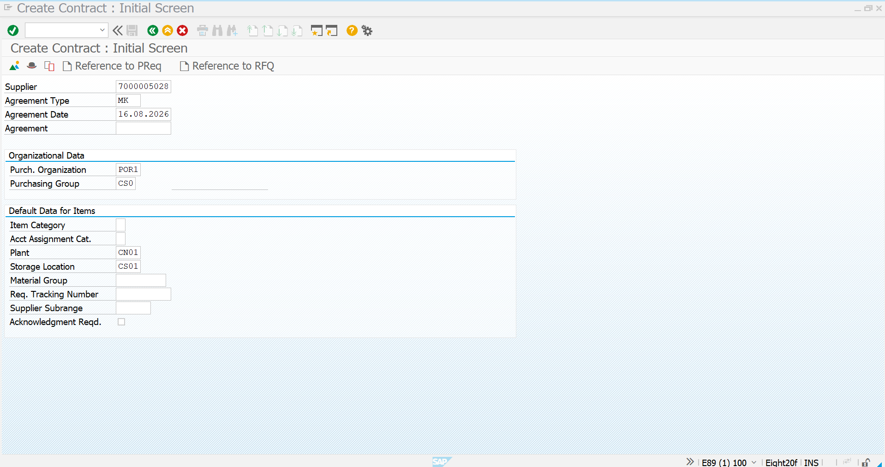
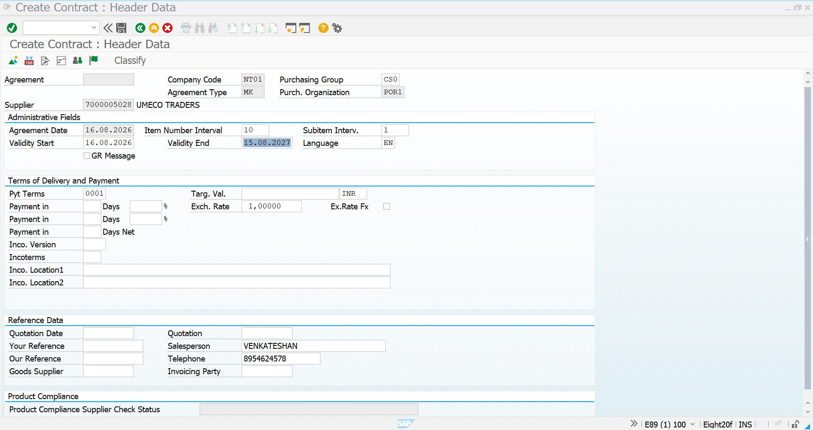
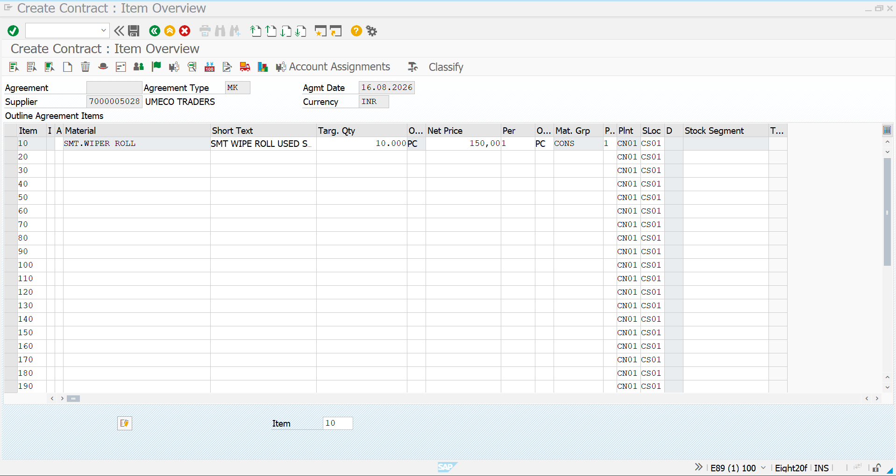
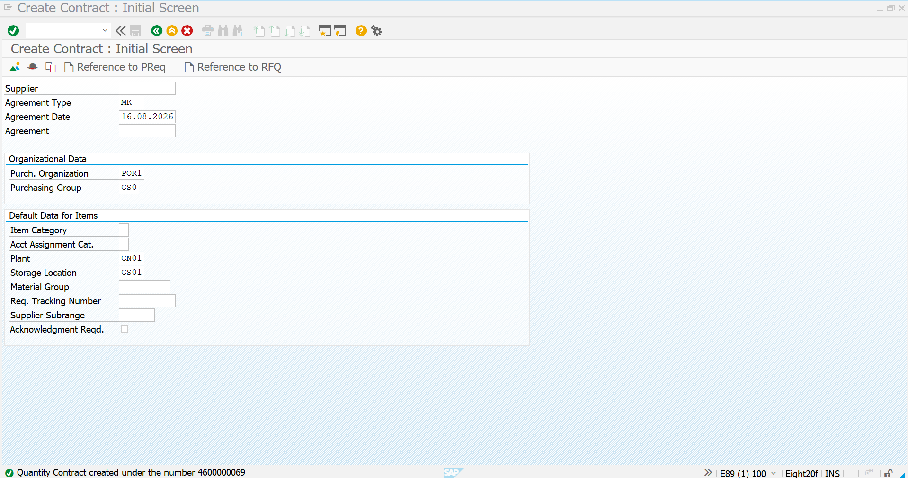

# Quantity Contract

## Overview

A Quantity Contract in SAP S/4HANA Materials Management (MM) is a long-term purchasing agreement between an organization and a supplier for a predefined quantity of a specific material within a defined validity period.

In this project, the Quantity Contract scenario is demonstrated using **UMECO TRADERS** as the supplier and **SMT WIPER ROLL** as the representative manufacturing consumable.

The agreement establishes the supplier relationship, contract validity, target quantity, purchasing conditions, plant, and storage location. Future procurement requirements can then be fulfilled against the established contract.

---

## Business Scenario

The organization has a recurring requirement for **SMT WIPER ROLL** used in manufacturing activities.

Instead of negotiating and managing every purchase independently, a Quantity Contract is created with UMECO TRADERS for a predefined quantity over a specific period.

### Contract Details

| Field | Value |
|---|---|
| Supplier | UMECO TRADERS |
| Supplier Code | 7000005028 |
| Agreement Type | MK – Quantity Contract |
| Purchasing Organization | POR1 |
| Purchasing Group | CS0 |
| Material | SMT WIPER ROLL |
| Target Quantity | 10,000 PC |
| Plant | CN01 |
| Storage Location | CS01 |
| Validity Start | 16.08.2026 |
| Validity End | 15.08.2027 |
| Currency | INR |

---

## Quantity Contract Creation

The Quantity Contract is created using transaction **ME31K – Create Contract**.

The process consists of maintaining the initial contract information, header data, material and quantity details, and finally saving the agreement.

---

## 1. Enter Initial Contract Data

Open transaction **ME31K** to create the purchasing contract.

Enter the required supplier and organizational information.

For this implementation:

- **Supplier:** 7000005028 – UMECO TRADERS
- **Agreement Type:** MK
- **Purchasing Organization:** POR1
- **Purchasing Group:** CS0
- **Plant:** CN01
- **Storage Location:** CS01

The initial screen establishes the basic organizational and supplier information required for the contract.



---

## 2. Maintain Contract Header Data

After entering the initial information, maintain the contract header details.

The header contains important agreement-level information such as:

- Supplier
- Agreement Type
- Purchasing Organization
- Purchasing Group
- Agreement Date
- Validity Start Date
- Validity End Date
- Payment Terms
- Currency
- Reference Information

For this project, the Quantity Contract is maintained with a validity period from **16.08.2026 to 15.08.2027**.



---

## 3. Maintain Contract Item Details

In the contract item overview, maintain the material and quantity covered by the agreement.

For this implementation:

- **Material:** SMT WIPER ROLL
- **Target Quantity:** 10,000 PC
- **Plant:** CN01
- **Storage Location:** CS01
- **Material Group:** CONS
- **Net Price:** As agreed with the supplier

The target quantity represents the maximum quantity covered by the Quantity Contract during its validity period.



---

## 4. Save the Quantity Contract

After verifying the supplier, agreement type, validity period, material, target quantity, plant, storage location, and purchasing conditions, save the contract.

SAP generates a unique contract number for the newly created Quantity Contract.

In this implementation, the system confirms that the Quantity Contract has been successfully created.



---

## Process Flow

```text
Business Requirement
        ↓
Recurring Material Requirement
        ↓
Supplier Selection
        ↓
ME31K – Create Contract
        ↓
Maintain Contract Header
        ↓
Maintain Material & Target Quantity
        ↓
Maintain Pricing & Organizational Data
        ↓
Save Contract
        ↓
Quantity Contract Created
        ↓
Future Procurement Against Contract