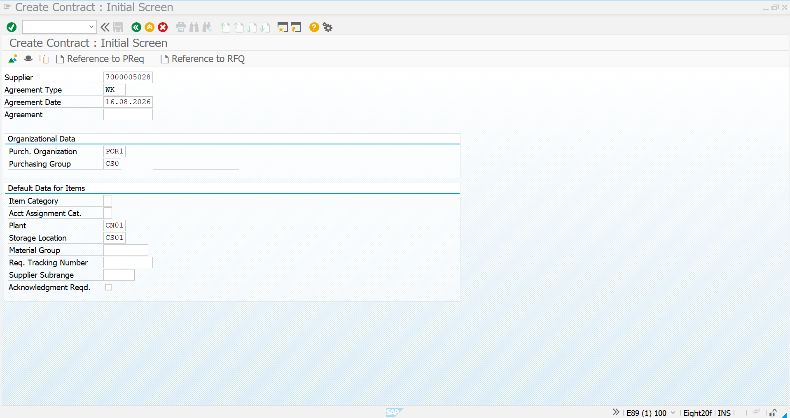
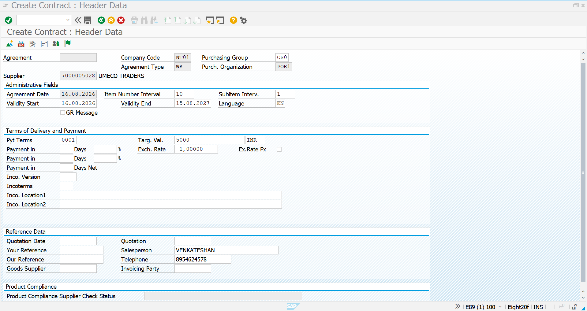
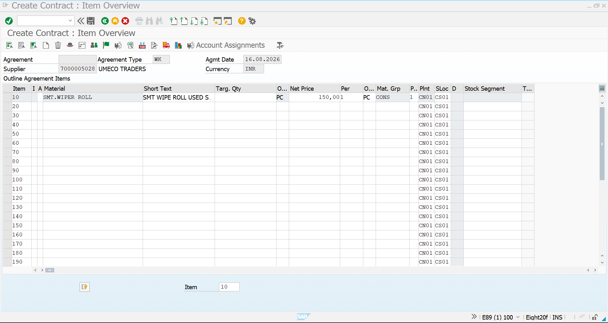
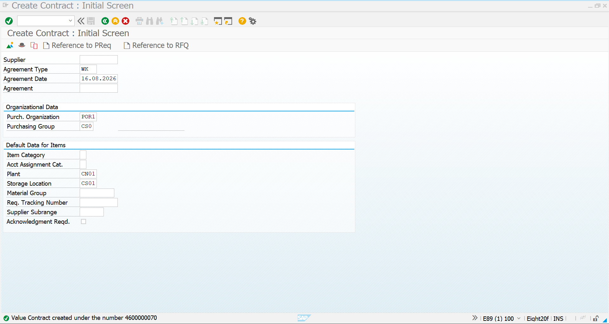

# Value Contract

## Overview

A **Value Contract** in SAP S/4HANA MM is a long-term purchasing agreement between an organization and a supplier where the procurement commitment is controlled based on a **maximum target value** rather than a predefined quantity.

In this project, the Value Contract is demonstrated using **UMECO TRADERS** as the supplier and **SMT.WIPER ROLL** as the manufacturing consumable.

The contract is created using transaction **ME31K** with document type **WK – Value Contract**.

---

## Business Scenario

The organization regularly purchases SMT Wipe Roll from UMECO TRADERS for manufacturing activities.

Instead of creating an independent purchasing arrangement for every requirement, a Value Contract is created with a predefined maximum procurement value.

### Project Details

| Field | Value |
|---|---|
| Supplier | UMECO TRADERS |
| Supplier Code | 7000005028 |
| Material | SMT.WIPER ROLL |
| Contract Type | Value Contract |
| Document Type | WK |
| Purchasing Organization | POR1 |
| Purchasing Group | CS0 |
| Plant | CN01 |
| Storage Location | CS01 |
| Target Value | INR 5,000 |
| Validity | 16.08.2026 – 15.08.2027 |

---

## 1. Create Value Contract – ME31K

Execute transaction **ME31K** to create the purchasing contract.

On the initial screen, enter the supplier and select the **WK – Value Contract** document type.

Maintain the relevant organizational data such as purchasing organization, purchasing group, plant, and storage location.



---

## 2. Maintain Contract Header Data

After continuing from the initial screen, maintain the contract header information.

The header contains important administrative and commercial information such as:

- Supplier
- Company Code
- Purchasing Organization
- Purchasing Group
- Agreement Type
- Agreement Date
- Validity Start Date
- Validity End Date
- Payment Terms
- Currency
- Target Value

For this project, the Value Contract is maintained with a validity period from **16.08.2026 to 15.08.2027**.

The agreed **target value is INR 5,000**.



---

## 3. Maintain Contract Item Details

In the item overview, maintain the material covered by the Value Contract.

For this project, the material **SMT.WIPER ROLL** is entered.

The agreed net price, plant, storage location, and other relevant item-level information are maintained at this stage.

The key difference from a Quantity Contract is that the overall agreement is controlled based on the **target monetary value** rather than a predefined target quantity.



---

## 4. Save the Value Contract

After verifying the supplier, agreement type, validity period, target value, material, plant, storage location, and pricing information, save the contract.

SAP generates a unique contract number for the created Value Contract.

In this implementation, the system confirms the successful creation of the Value Contract.



---

## Process Flow

```text
Supplier Requirement
        ↓
Create Value Contract
        ↓
ME31K – Document Type WK
        ↓
Maintain Header Data
        ↓
Define Target Value
        ↓
Maintain Material / Item Details
        ↓
Verify Contract Data
        ↓
Save Contract
        ↓
Value Contract Created
```

---

## Key SAP Details

| Parameter | Details |
|---|---|
| Transaction | ME31K |
| Contract Type | Value Contract |
| Document Type | WK |
| Supplier | UMECO TRADERS |
| Supplier Code | 7000005028 |
| Material | SMT.WIPER ROLL |
| Purchasing Organization | POR1 |
| Purchasing Group | CS0 |
| Plant | CN01 |
| Storage Location | CS01 |
| Target Value | INR 5,000 |
| Validity | 16.08.2026 – 15.08.2027 |

---

## Key Point

A **Value Contract** establishes a long-term purchasing agreement where the procurement commitment is controlled by an agreed **total monetary value**.

In this project, **UMECO TRADERS** supplies **SMT.WIPER ROLL**, with the agreement maintained for a target value of **INR 5,000** during the defined contract validity period.