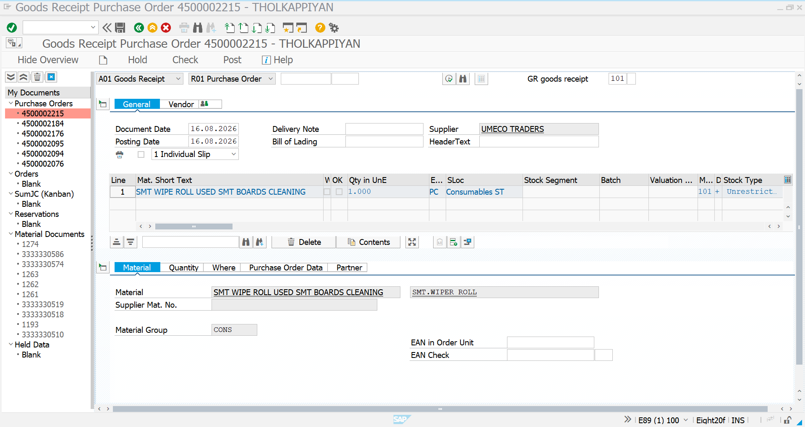
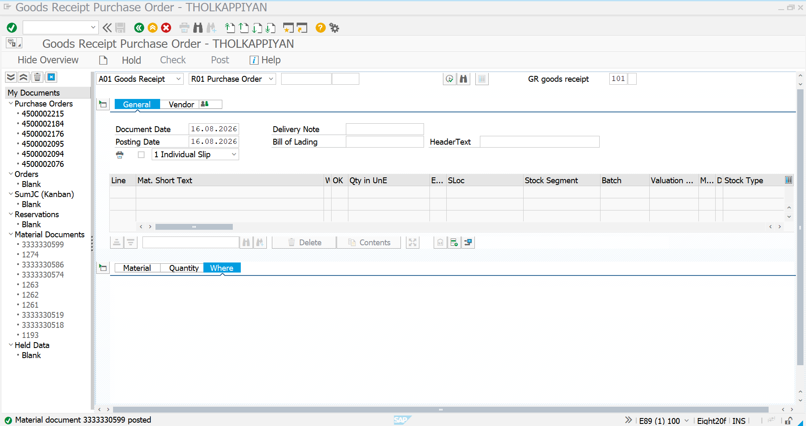
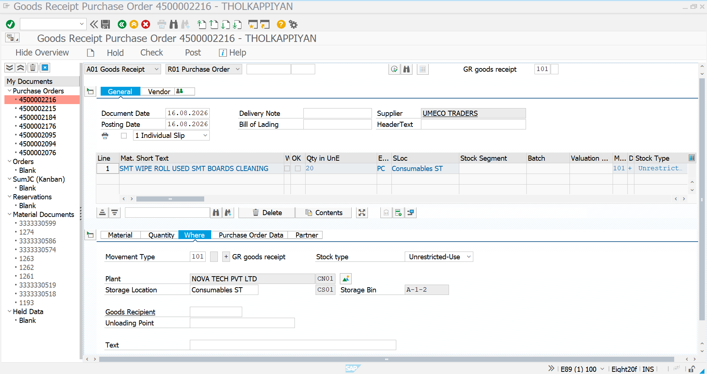

# Goods Receipt – Purchasing Agreements

## 1. Overview

After the Release Purchase Order is created against the Purchasing Agreement, the next step in the procurement cycle is to perform the **Goods Receipt (GR)** using **MIGO – Goods Receipt for Purchase Order**.

The Goods Receipt process is demonstrated for both Purchasing Agreement types:

1. **Quantity Contract (MK)** – Release PO created against the quantity-based contract.
2. **Value Contract (WK)** – Release PO created against the value-based contract.

For both scenarios, the Goods Receipt is posted with **Movement Type 101**, which represents a standard goods receipt against a Purchase Order.

The MIGO process updates the inventory after the material is physically received from the supplier and creates a **Material Document** as proof of the goods receipt posting.

---

# 2. Quantity Contract – Goods Receipt

## 2.1 Business Purpose

The Quantity Contract process uses a Release Purchase Order created with reference to the Quantity Contract.

The Goods Receipt is then posted against the Release Purchase Order using MIGO.

### Quantity Contract Details

| Field | Details |
|---|---|
| Agreement Type | MK – Quantity Contract |
| Supplier | `7000005028 – UMECO TRADERS` |
| Material | `SMT.WIPE ROLL USED SMT BOARDS CLEANING` |
| Order Unit | PC |
| Plant | `CN01` |
| Storage Location | `CS01 – Consumables ST` |
| Movement Type | `101 – GR Goods Receipt` |
| Stock Type | Unrestricted-Use |
| Process | MIGO – Goods Receipt |

---

## 2.2 MIGO – Initial Screen

The Goods Receipt is created using the **MIGO** transaction.

The transaction is configured for:

- **Goods Receipt**
- **Purchase Order**
- **Movement Type 101**

The Purchase Order is used as the reference document for the Goods Receipt.



### Analysis

- Transaction: **MIGO – Goods Receipt**
- Transaction type: **A01 – Goods Receipt**
- Reference document: **R01 – Purchase Order**
- Movement Type: **101 – GR Goods Receipt**
- The Goods Receipt is created against the Release Purchase Order.
- Supplier information is displayed after the Purchase Order is referenced.
- The material and related purchasing information are brought into the Goods Receipt document.
- The received quantity can be entered and checked before posting.

This establishes the connection:

**Release Purchase Order → Goods Receipt**

---

## 2.3 Quantity Contract – Goods Receipt Posting

After entering the Purchase Order reference, the material item is displayed in MIGO.

The received quantity is entered and the item is prepared for posting.

In the demonstrated scenario:

- Material: **SMT.WIPE ROLL USED SMT BOARDS CLEANING**
- Quantity: **1 PC**
- Movement Type: **101**
- Stock Type: **Unrestricted-Use**
- Storage Location: **Consumables ST**

The Goods Receipt is then posted.



### Analysis

The screenshot confirms that the Goods Receipt has been successfully posted.

SAP displays the status:

> **Material document 333330599 posted**

The posting creates a Material Document that records the inventory movement resulting from the Goods Receipt.

### Key Information

| Field | Value |
|---|---|
| Movement Type | `101` |
| Material | `SMT.WIPE ROLL USED SMT BOARDS CLEANING` |
| Quantity | `1 PC` |
| Stock Type | Unrestricted-Use |
| Plant | `CN01 – NOVA TECH PVT LTD` |
| Storage Location | `CS01 – Consumables ST` |
| Material Document | `333330599` |

The successful posting confirms that the material received against the Release Purchase Order has been recorded in SAP inventory.

---

# 3. Value Contract – Goods Receipt

## 3.1 Business Purpose

The Value Contract process uses a Release Purchase Order created with reference to the Value Contract.

Once the supplier delivers the material, the Goods Receipt is posted against the Release Purchase Order using MIGO.

The Goods Receipt process is the same as the Quantity Contract process. The main difference is that the originating Purchase Order is linked to a **Value Contract (WK)** rather than a **Quantity Contract (MK)**.

### Value Contract Details

| Field | Details |
|---|---|
| Agreement Type | WK – Value Contract |
| Supplier | `7000005028 – UMECO TRADERS` |
| Material | `SMT.WIPE ROLL USED SMT BOARDS CLEANING` |
| Order Unit | PC |
| Plant | `CN01` |
| Storage Location | `CS01 – Consumables ST` |
| Movement Type | `101 – GR Goods Receipt` |
| Stock Type | Unrestricted-Use |
| Process | MIGO – Goods Receipt |

---

## 3.2 MIGO – Initial Screen

The Goods Receipt for the Value Contract Release PO is also created using **MIGO**.

The transaction uses:

- **A01 – Goods Receipt**
- **R01 – Purchase Order**
- **Movement Type 101**

The Purchase Order is entered as the reference document.



### Analysis

- Transaction: **MIGO – Goods Receipt**
- Transaction type: **A01 – Goods Receipt**
- Reference document: **R01 – Purchase Order**
- Movement Type: **101 – GR Goods Receipt**
- The Release Purchase Order is used as the source document.
- The supplier and material information are retrieved from the Purchase Order.
- The Goods Receipt is prepared against the relevant Purchase Order.

This confirms the document relationship:

**Value Contract → Release Purchase Order → Goods Receipt**

---

## 3.3 Value Contract – Goods Receipt Posting

After referencing the Purchase Order, the material information is displayed in MIGO.

In the demonstrated scenario, the Goods Receipt is prepared for:

- Material: **SMT.WIPE ROLL USED SMT BOARDS CLEANING**
- Quantity: **20 PC**
- Movement Type: **101**
- Stock Type: **Unrestricted-Use**
- Plant: **CN01**
- Storage Location: **CS01 – Consumables ST**

The Goods Receipt is then posted.


### Analysis

The screenshot confirms the successful posting of the Goods Receipt.

SAP displays the status:

> **Material document 333330600 posted**

The system has therefore created a Material Document for the Goods Receipt.

### Key Information

| Field | Value |
|---|---|
| Movement Type | `101` |
| Material | `SMT.WIPE ROLL USED SMT BOARDS CLEANING` |
| Quantity | `20 PC` |
| Stock Type | Unrestricted-Use |
| Plant | `CN01 – NOVA TECH PVT LTD` |
| Storage Location | `CS01 – Consumables ST` |
| Material Document | `333330600` |

The successful posting confirms that the material received against the Value Contract Release Purchase Order has been recorded through the standard Goods Receipt process.

---

# 4. Quantity Contract vs Value Contract – Goods Receipt

The Goods Receipt execution is essentially the same for both Purchasing Agreement types.

| Control | Quantity Contract | Value Contract |
|---|---|---|
| Agreement Type | MK | WK |
| Contract Control | Quantity | Value |
| Release Document | Purchase Order | Purchase Order |
| Goods Receipt | MIGO | MIGO |
| Transaction Type | A01 – Goods Receipt | A01 – Goods Receipt |
| Reference | Purchase Order | Purchase Order |
| Movement Type | 101 | 101 |
| Stock Type | Unrestricted-Use | Unrestricted-Use |
| Plant | CN01 | CN01 |
| Storage Location | CS01 | CS01 |
| Quantity Demonstrated | 1 PC | 20 PC |
| Result | Material Document Created | Material Document Created |

The important distinction is that the **contract type controls the preceding purchasing agreement and release process**, while the Goods Receipt is performed against the resulting Purchase Order using the standard MIGO process.

---

# 5. Goods Receipt – Key SAP Controls

The MIGO process demonstrates several important SAP procurement controls.

### 5.1 Purchase Order Reference

The Goods Receipt is created with reference to the Purchase Order.

This ensures that the received material is connected to the corresponding procurement document.

### 5.2 Movement Type 101

The Goods Receipt uses:

**Movement Type 101 – Goods Receipt for Purchase Order**

This records the receipt of material into inventory.

### 5.3 Material and Quantity Verification

The Goods Receipt screen displays the material and quantity being received.

The user can verify the received quantity before posting the document.

### 5.4 Stock Type

The demonstrated Goods Receipts use:

**Unrestricted-Use Stock**

The received quantity is therefore posted into the specified unrestricted stock.

### 5.5 Plant and Storage Location

The Goods Receipt identifies the receiving organizational and inventory locations:

- Plant: **CN01 – NOVA TECH PVT LTD**
- Storage Location: **CS01 – Consumables ST**

### 5.6 Material Document Creation

After successful posting, SAP creates a Material Document.

The demonstrated postings created:

- Quantity Contract GR → **Material Document 333330599**
- Value Contract GR → **Material Document 333330600**

The Material Document provides the SAP record of the inventory movement.

---

# 6. End-to-End Purchasing Agreement Process

The complete process from Purchasing Agreement to Goods Receipt is:

```text
Purchasing Agreement
        │
        ├─────────────────────────┐
        │                         │
        ▼                         ▼
Quantity Contract             Value Contract
      (MK)                         (WK)
        │                         │
        ▼                         ▼
Release Purchase Order       Release Purchase Order
        │                         │
        └────────────┬────────────┘
                     │
                     ▼
              ME21N – Create PO
                     │
                     ▼
              Reference to Contract
                     │
                     ▼
              Release PO Created
                     │
                     ▼
              MIGO – Goods Receipt
                     │
                     ▼
             Movement Type 101
                     │
                     ▼
             Material Document
                     │
                     ▼
              Inventory Updated
                     │
                     ▼
              MIRO – Invoice
              Verification