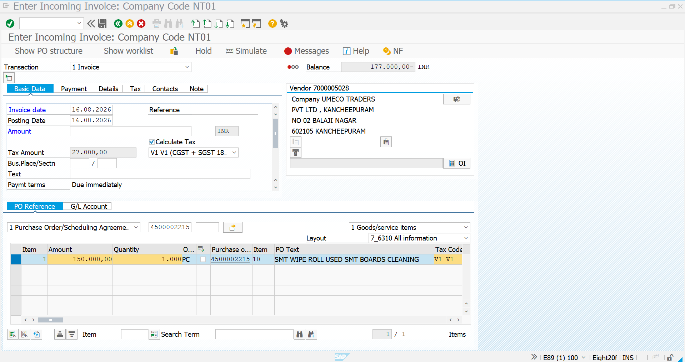
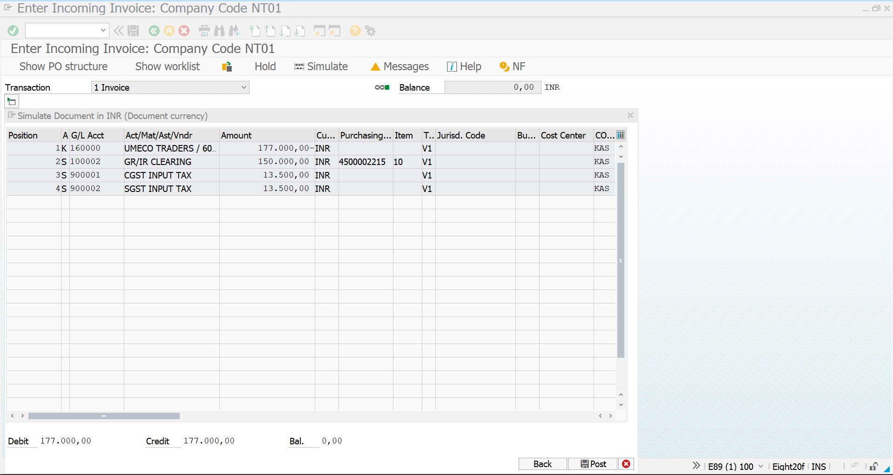
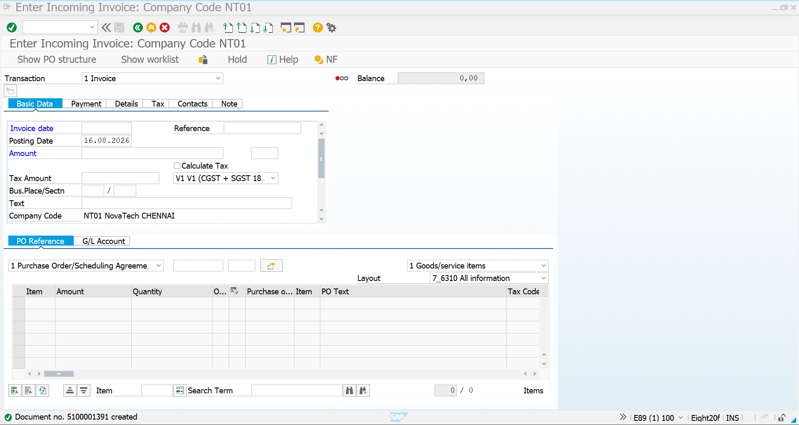
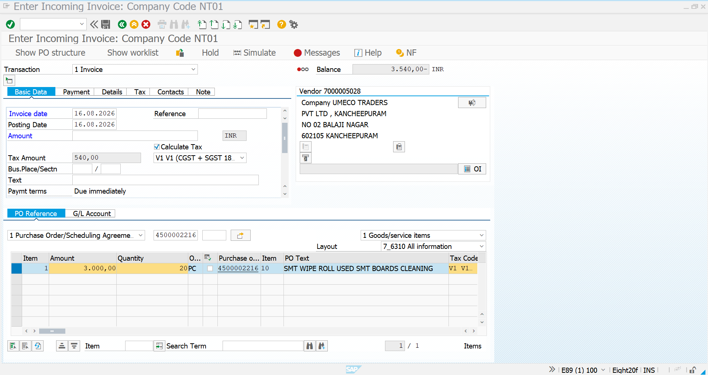
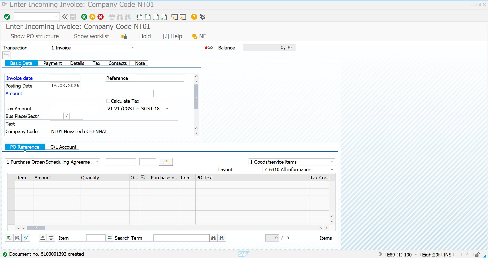

# Invoice Verification – MIRO

## 1. Overview

Invoice Verification is the final stage of the **Procure-to-Pay (P2P)** process. In SAP, the **MIRO** transaction is used to post and verify the supplier invoice against the Purchase Order and Goods Receipt.

For Purchasing Agreements, Invoice Verification is performed for both:

- **Quantity Contract (MK)**
- **Value Contract (WK)**

The invoice is checked against the corresponding Release Purchase Order and Goods Receipt before posting.

---

## 2. MIRO – Quantity Contract

The Quantity Contract process is completed through:

**Quantity Contract → Release PO → MIGO → MIRO**

### Step 1 – MIRO Initial Screen

Transaction **MIRO** is opened to enter the supplier invoice. The invoice is referenced against the Release Purchase Order created from the Quantity Contract.



---

### Step 2 – Quantity Contract Invoice Details

The Purchase Order reference is entered in MIRO. The system retrieves the relevant PO item, quantity, amount and tax information for invoice verification.



---

### Step 3 – Quantity Contract Invoice Posting

After checking the invoice amount, tax and PO reference, the invoice is posted successfully.

The system generates an **Invoice Document Number** confirming successful Invoice Verification.



---

## 3. MIRO – Value Contract

The Value Contract process follows the same Invoice Verification procedure:

**Value Contract → Release PO → MIGO → MIRO**

The invoice is verified against the Release PO generated from the Value Contract.

### Step 1 – MIRO Initial Screen

MIRO is opened and the supplier invoice information is entered with reference to the Release Purchase Order.



---

### Step 2 – Value Contract Invoice Details

The Purchase Order reference retrieves the relevant PO item, amount, quantity and applicable tax details for verification.


---

### Step 3 – Value Contract Invoice Posting

After verification of the invoice details, the invoice is posted successfully in MIRO.

The system generates an **Invoice Document Number** after successful posting.



---

## 4. Process Summary

| Contract Type | Release PO | MIGO | MIRO | Result |
|---|---|---|---|---|
| Quantity Contract (MK) | Completed | Completed | Completed | Invoice Posted |
| Value Contract (WK) | Completed | Completed | Completed | Invoice Posted |

### Complete P2P Flow

```text
Quantity Contract / Value Contract
              ↓
       Release Purchase Order
              ↓
             MIGO
              ↓
       Goods Receipt Posted
              ↓
             MIRO
              ↓
       Invoice Verification
              ↓
        Invoice Document