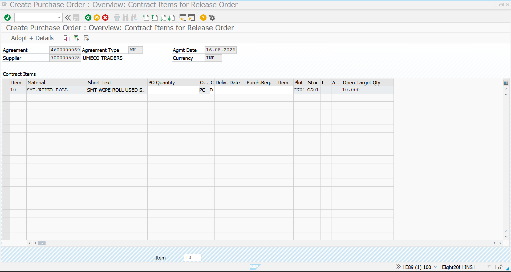
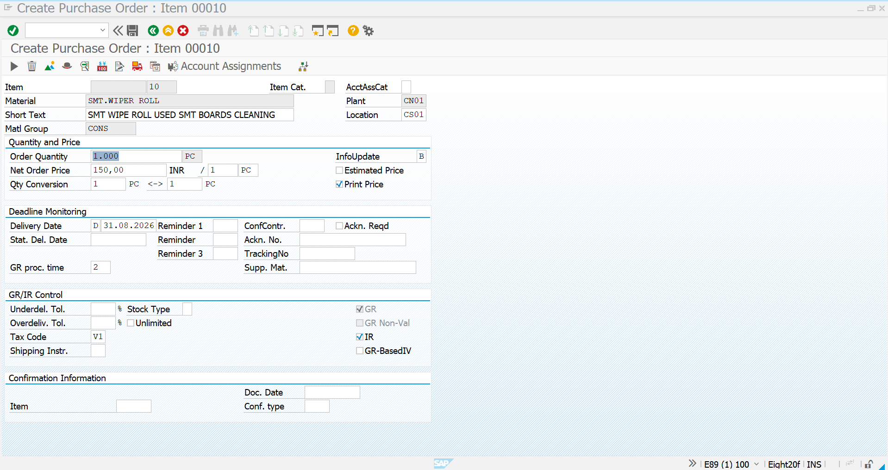
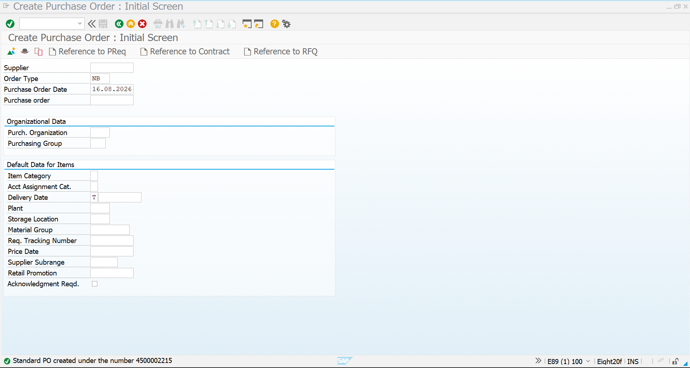
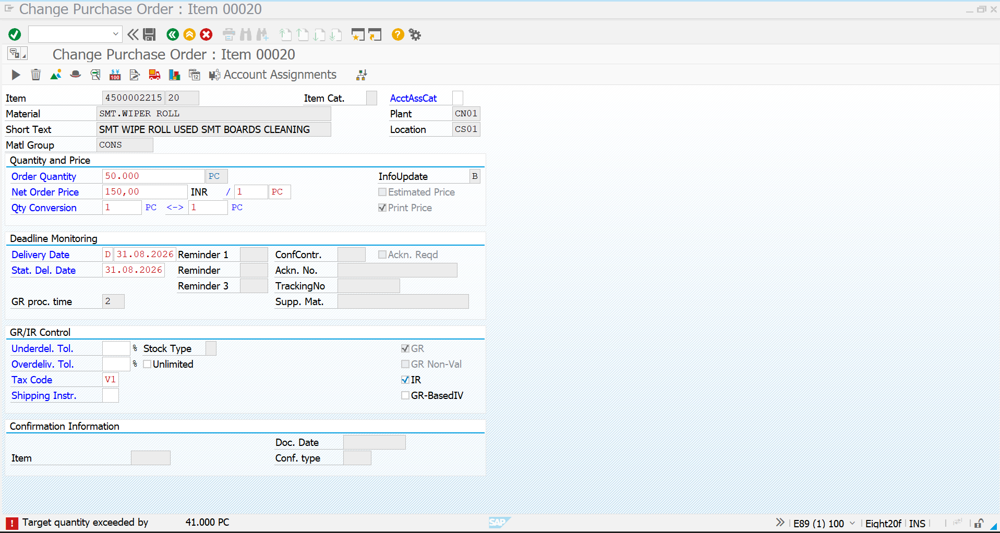
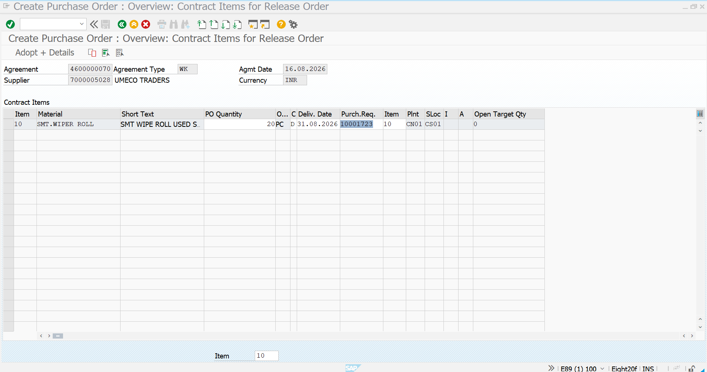
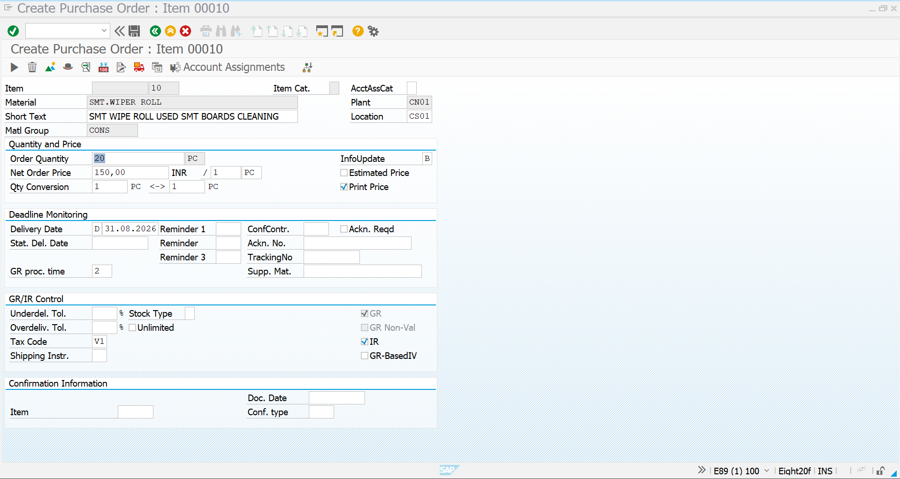
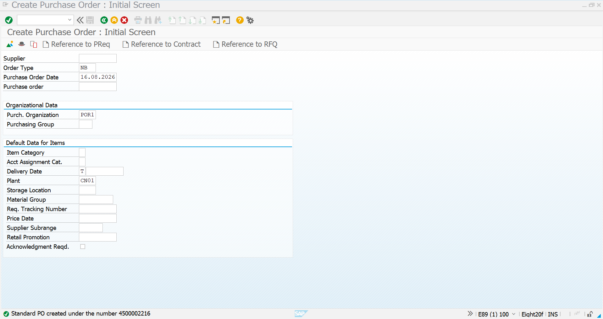
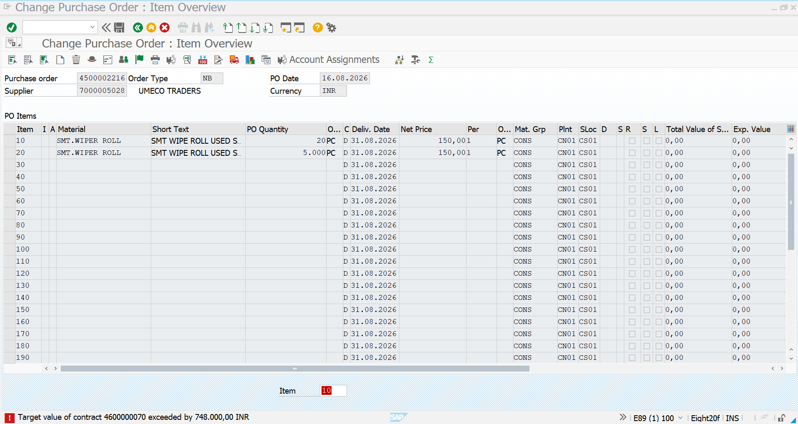

# Purchase Order Creation – Purchasing Agreements

## 1. Overview

After creating the Purchasing Agreements, the next step in the procurement cycle is to create a **Release Purchase Order** with reference to the relevant agreement using **ME21N – Create Purchase Order**.

Two types of Purchasing Agreements are covered in this process:

1. **Quantity Contract (MK)** – Procurement is controlled based on the contracted quantity.
2. **Value Contract (WK)** – Procurement is controlled based on the contracted monetary value.

For both agreement types, the Purchase Order is created using **Reference to Contract** in ME21N. The contract reference carries the relevant supplier, material, price, plant, storage location, and agreement information into the Purchase Order.

The process also validates the agreement controls by attempting to create a PO beyond the available contract limit. SAP displays an error when the contracted quantity or value is exceeded.

---

# 2. Quantity Contract – Release Purchase Order

## 2.1 Business Purpose

A **Quantity Contract** is used when the organization agrees with a supplier to procure a specific quantity of a material over a defined validity period.

### Quantity Contract Details

| Field | Details |
|---|---|
| Agreement Type | MK – Quantity Contract |
| Agreement | `4600000069` |
| Supplier | `7000005028 – UMECO TRADERS` |
| Material | `SMT.WIPER ROLL` |
| Unit | PC |
| Plant | `CN01` |
| Storage Location | `CS01` |
| Control | Contract Quantity |

The Purchase Order is created as a **Release Order** against the existing Quantity Contract.

---

## 2.2 ME21N – Initial Screen

Transaction **ME21N – Create Purchase Order** is used to create the Purchase Order.

The initial screen provides the **Reference to Contract** option. This option is used to create the PO against an existing Purchasing Agreement rather than creating an independent PO.



### Analysis

- **Transaction:** ME21N – Create Purchase Order
- **PO Document Type:** NB – Standard PO
- **Reference:** Reference to Contract
- The Purchase Order is created with reference to the existing Quantity Contract.
- The contract reference establishes the document relationship between the contract and the Release Purchase Order.

---

## 2.3 Reference to Contract – Contract Item Selection

After selecting **Reference to Contract**, the relevant Quantity Contract is entered and the available contract item is displayed.



### Analysis

- **Agreement:** `4600000069`
- **Agreement Type:** `MK`
- **Supplier:** `UMECO TRADERS`
- **Material:** `SMT.WIPER ROLL`
- **Plant:** `CN01`
- **Storage Location:** `CS01`
- The **Open Target Qty** column shows the remaining quantity available under the contract.
- The contract item is selected as the source for the Release Purchase Order.

This confirms that the PO is being created as a release against the existing Quantity Contract.

---

## 2.4 Quantity Contract – PO Created with Contract Reference

The selected contract item is adopted into the Purchase Order. SAP transfers the relevant contract information into the PO item.



### Analysis

The created Purchase Order contains the purchasing information inherited from the contract, including:

- Contract-referenced material
- Supplier information
- Contract price
- Plant and storage location
- Contract-related quantity control
- Delivery information
- Contract reference

The Purchase Order therefore acts as a **Release Order against the Quantity Contract**.

---

## 2.5 Quantity Contract – Contract Limit Validation

To verify that the Quantity Contract is controlling the release orders, an additional PO quantity is entered that exceeds the remaining quantity available under the contract.



### SAP Message

> **Target quantity exceeded by 41.000 PC**

### Analysis

This validation demonstrates that the Quantity Contract is not merely being referenced for information.

SAP checks the total quantity released against the target quantity maintained in the contract. When the proposed PO quantity causes the contract target quantity to be exceeded, SAP displays the quantity-exceeded message.

### Control Demonstrated

**Contract Target Quantity → Release PO Quantity → SAP Validation → Error if Quantity Exceeded**

This confirms that the **MK Quantity Contract control is working correctly**.

---

# 3. Value Contract – Release Purchase Order

## 3.1 Business Purpose

A **Value Contract** is used when the organization agrees with a supplier on a maximum procurement value instead of controlling the agreement primarily by quantity.

### Value Contract Details

| Field | Details |
|---|---|
| Agreement Type | WK – Value Contract |
| Agreement | `4600000070` |
| Supplier | `7000005028 – UMECO TRADERS` |
| Material | `SMT.WIPER ROLL` |
| Currency | INR |
| Plant | `CN01` |
| Storage Location | `CS01` |
| Control | Contract Value |

The Purchase Order is released against the Value Contract using ME21N.

---

## 3.2 ME21N – Initial Screen

The Purchase Order creation process begins from **ME21N – Create Purchase Order**.



### Analysis

- **Transaction:** ME21N – Create Purchase Order
- **PO Document Type:** NB – Standard PO
- **Reference:** Reference to Contract
- The Purchase Order is linked to the existing Value Contract.
- The contract reference ensures that the Release PO is checked against the agreement's target value.

---

## 3.3 Reference to Contract – Contract Item Selection

The Value Contract is entered as the reference document and SAP displays the available contract item.



### Analysis

- **Agreement:** `4600000070`
- **Agreement Type:** `WK`
- **Supplier:** `UMECO TRADERS`
- **Currency:** `INR`
- **Material:** `SMT.WIPER ROLL`
- **Plant:** `CN01`
- **Storage Location:** `CS01`
- The contract item is selected for the Release Purchase Order.

The Purchase Order inherits the applicable purchasing information from the Value Contract.

---

## 3.4 Value Contract – PO Created with Contract Reference

The selected contract item is adopted into the Purchase Order.



### Analysis

The Purchase Order contains the information derived from the Value Contract, including:

- Supplier
- Material
- Contract price
- Plant
- Storage location
- Delivery date
- Contract reference

The PO is therefore created as a **Release Order against the Value Contract**.

---

## 3.5 Value Contract – Contract Limit Validation

To verify the Value Contract control, a PO is attempted with a value that causes the total release value to exceed the target value maintained in the contract.



### SAP Message

> **Target value of contract 4600000070 exceeded by 748,000.00 INR**

### Analysis

SAP compares the value of the proposed Release PO with the available target value of the Value Contract.

When the release causes the contract's target value to be exceeded, SAP displays the validation message and does not allow the release to proceed normally.

### Control Demonstrated

**Contract Target Value → Release PO Value → SAP Validation → Error if Value Exceeded**

This confirms that the **WK Value Contract control is working correctly**.

---

# 4. Comparison – Quantity Contract vs Value Contract

| Control | Quantity Contract | Value Contract |
|---|---|---|
| Agreement Type | MK | WK |
| Agreement | `4600000069` | `4600000070` |
| Main Control | Quantity | Monetary Value |
| Release Document | Purchase Order | Purchase Order |
| PO Creation | ME21N | ME21N |
| Reference | Reference to Contract | Reference to Contract |
| Material | SMT.WIPER ROLL | SMT.WIPER ROLL |
| Supplier | UMECO TRADERS | UMECO TRADERS |
| Plant | CN01 | CN01 |
| Storage Location | CS01 | CS01 |
| Currency | INR | INR |
| Validation | Target Quantity | Target Value |
| Exceeding Result | Quantity exceeded error | Value exceeded error |

---

# 5. End-to-End Release Process

The Release Purchase Order process for both agreement types follows the same overall procurement flow.

```text
Purchasing Agreement
        ↓
Quantity Contract / Value Contract
        ↓
ME21N – Create Purchase Order
        ↓
Reference to Contract
        ↓
Enter Contract Number
        ↓
Select Contract Item
        ↓
Adopt Contract Data
        ↓
Create Release Purchase Order
        ↓
SAP Validates Contract Limit
        ↓
Quantity Contract → Quantity Check
Value Contract    → Value Check
        ↓
Within Contract Limit
        ↓
PO Creation Allowed

