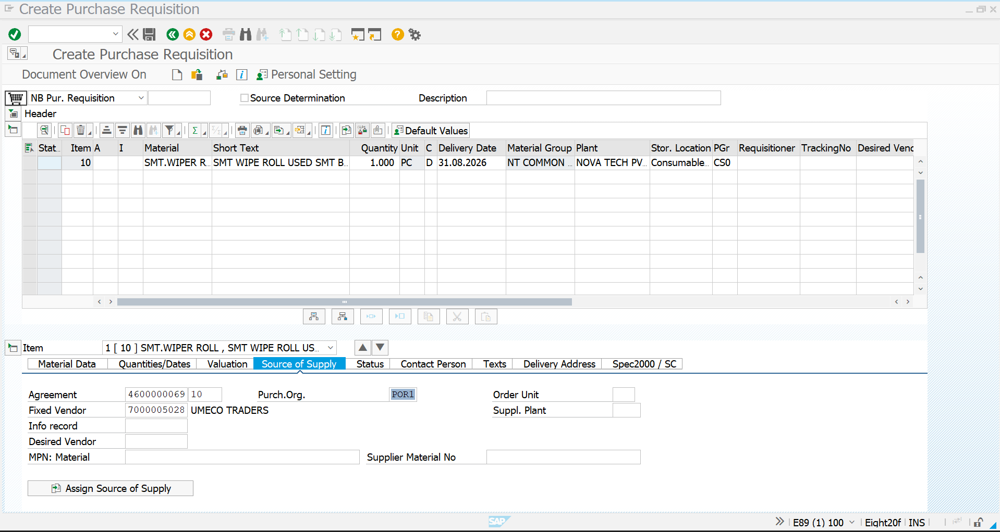
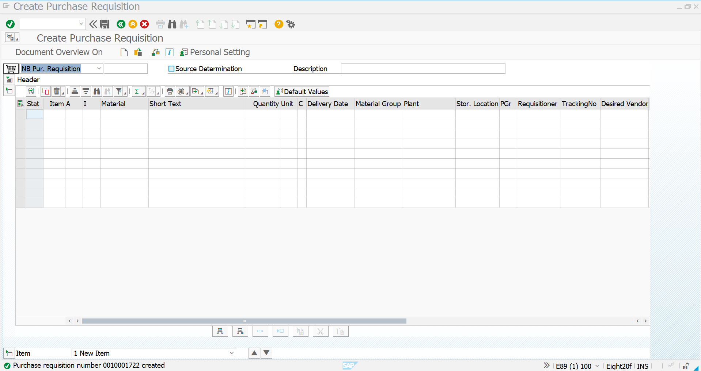
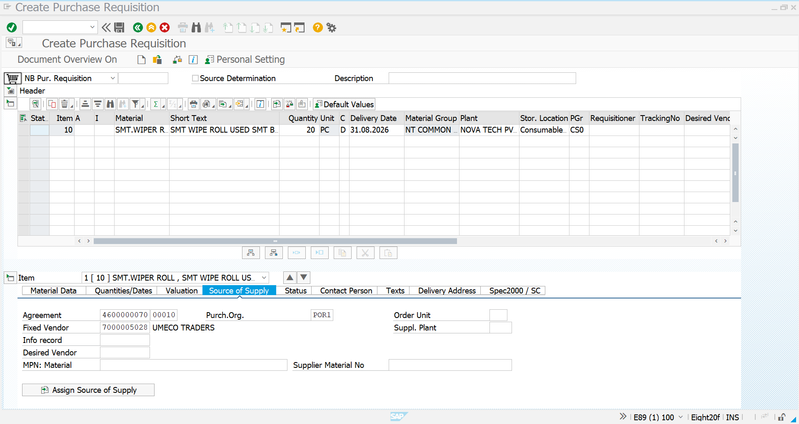

# Purchase Requisition Creation

## Overview

A Purchase Requisition (PR) in SAP S/4HANA Materials Management (MM) is an internal purchasing document used to initiate a requirement for materials or services.

In this project, Purchase Requisitions are created against two types of purchasing contracts:

- **Quantity Contract**
- **Value Contract**

The PR references the respective contract as the source of supply. This allows the subsequent Purchase Order to be created against the existing purchasing agreement.

The complete procurement flow for both contract types follows:

**Contract → Purchase Requisition → Purchase Order → Goods Receipt → Invoice Verification**

---

## Business Scenario

The organization has a recurring requirement for **SMT WIPER ROLL**, which is used as a manufacturing consumable.

To manage this requirement through long-term supplier agreements, contracts have already been established with **UMECO TRADERS**.

Purchase Requisitions are then created against the respective contracts so that procurement requirements can be fulfilled using the agreed supplier and purchasing conditions.

Two scenarios are demonstrated:

1. Purchase Requisition against a **Quantity Contract**
2. Purchase Requisition against a **Value Contract**

---

## Common Procurement Details

| Field | Value |
|---|---|
| Supplier | UMECO TRADERS |
| Supplier Code | 7000005028 |
| Material | SMT WIPER ROLL |
| Purchasing Organization | POR1 |
| Purchasing Group | CS0 |
| Plant | CN01 |
| Storage Location | CS01 |
| Unit | PC |
| Transaction Code | ME51N |

---

# 1. Purchase Requisition Against Quantity Contract

## 1.1 Enter Initial Purchase Requisition Data

Open transaction **ME51N – Create Purchase Requisition**.

Create a new Purchase Requisition and enter the required material and procurement information.

For this implementation, the following material is used:

- **Material:** SMT WIPER ROLL
- **Quantity:** 1 PC
- **Unit:** PC
- **Plant:** CN01
- **Storage Location:** CS01
- **Purchasing Organization:** POR1
- **Purchasing Group:** CS0

The initial screen is used to enter the basic material and requirement information for the Purchase Requisition.



---

## 1.2 Maintain Quantity Contract as Source of Supply

After entering the PR item details, maintain the **Source of Supply** for the material.

The existing Quantity Contract is assigned to the PR item.

For this implementation:

- **Quantity Contract:** 4600000069
- **Contract Item:** 10
- **Supplier:** 7000005028 – UMECO TRADERS
- **Purchasing Organization:** POR1

The contract reference establishes the relationship between the Purchase Requisition and the existing Quantity Contract.

The system identifies the supplier and the relevant contract item from the source of supply information.



---

## 1.3 Save the Quantity Contract Purchase Requisition

After verifying the material, quantity, plant, storage location, and contract reference, save the Purchase Requisition.

SAP generates a unique Purchase Requisition number.

In this implementation, the Quantity Contract Purchase Requisition is successfully created.

The created PR can now be used as the basis for creating the Purchase Order against the Quantity Contract.

---

# 2. Purchase Requisition Against Value Contract

## 2.1 Enter Initial Purchase Requisition Data

Create another Purchase Requisition using transaction **ME51N – Create Purchase Requisition**.

Enter the required material and procurement information.

For this implementation:

- **Material:** SMT WIPER ROLL
- **Quantity:** 20 PC
- **Unit:** PC
- **Plant:** CN01
- **Storage Location:** CS01
- **Purchasing Organization:** POR1
- **Purchasing Group:** CS0

The PR is created for the material requirement that will be fulfilled against the existing Value Contract.



---

## 2.2 Maintain Value Contract as Source of Supply

After entering the PR item details, maintain the **Source of Supply** for the material.

The existing Value Contract is assigned to the PR item.

For this implementation:

- **Value Contract:** 4600000070
- **Contract Item:** 10
- **Supplier:** 7000005028 – UMECO TRADERS
- **Purchasing Organization:** POR1

The contract reference connects the Purchase Requisition with the existing Value Contract.

This ensures that the subsequent Purchase Order can be created with reference to the appropriate Value Contract.


---

## 2.3 Save the Value Contract Purchase Requisition

After verifying the material, quantity, plant, storage location, and contract reference, save the Purchase Requisition.

SAP generates a unique Purchase Requisition number.

In this implementation, the Value Contract Purchase Requisition is successfully created.

The created PR can now be used as the basis for creating the Purchase Order against the Value Contract.

---

# Contract Reference Summary

| Field | Quantity Contract | Value Contract |
|---|---|---|
| Contract Type | Quantity Contract | Value Contract |
| Contract Number | 4600000069 | 4600000070 |
| Contract Item | 10 | 10 |
| Supplier | UMECO TRADERS | UMECO TRADERS |
| Supplier Code | 7000005028 | 7000005028 |
| Material | SMT WIPER ROLL | SMT WIPER ROLL |
| Quantity | 1 PC | 20 PC |
| Purchasing Organization | POR1 | POR1 |
| Purchasing Group | CS0 | CS0 |
| Plant | CN01 | CN01 |
| Storage Location | CS01 | CS01 |
| PR Transaction | ME51N | ME51N |

---

# Purchase Requisition Process Flow

## Quantity Contract

```text
Existing Quantity Contract
        ↓
ME51N – Create Purchase Requisition
        ↓
Enter Material & Quantity
        ↓
Maintain Plant & Storage Location
        ↓
Maintain Source of Supply
        ↓
Reference Quantity Contract
        ↓
Save Purchase Requisition
        ↓
Quantity Contract PR Created
        ↓
Future Procurement Against Contract