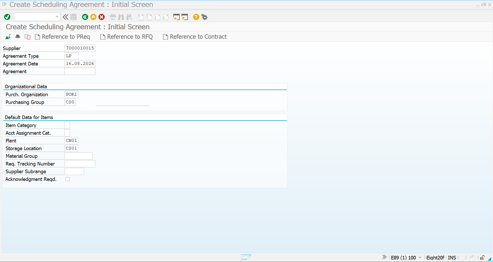
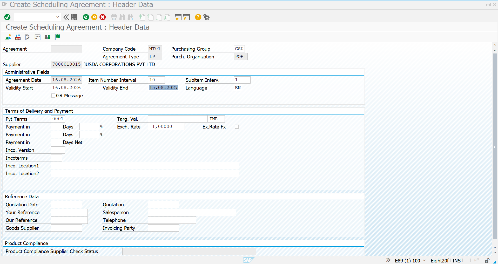
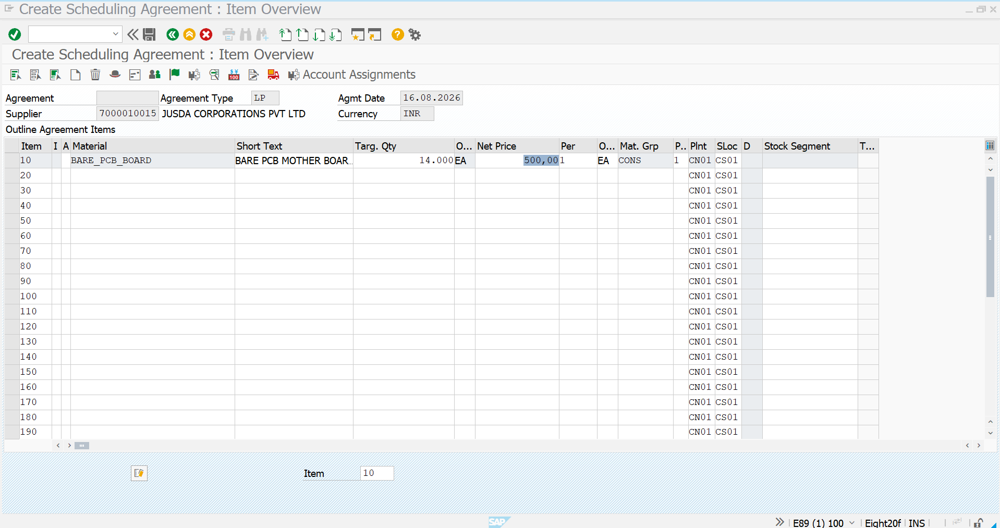
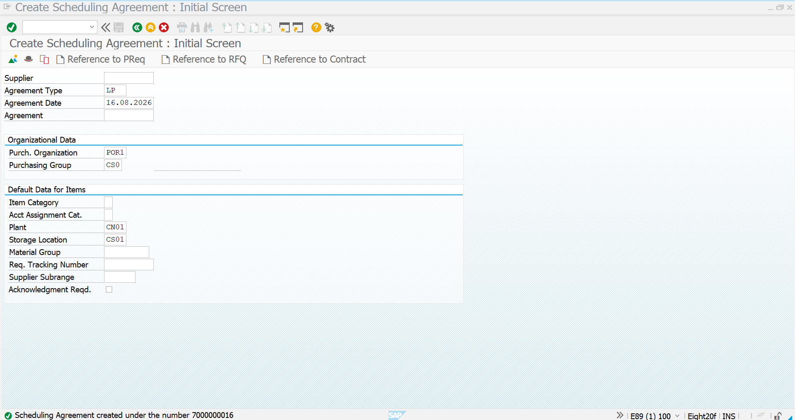
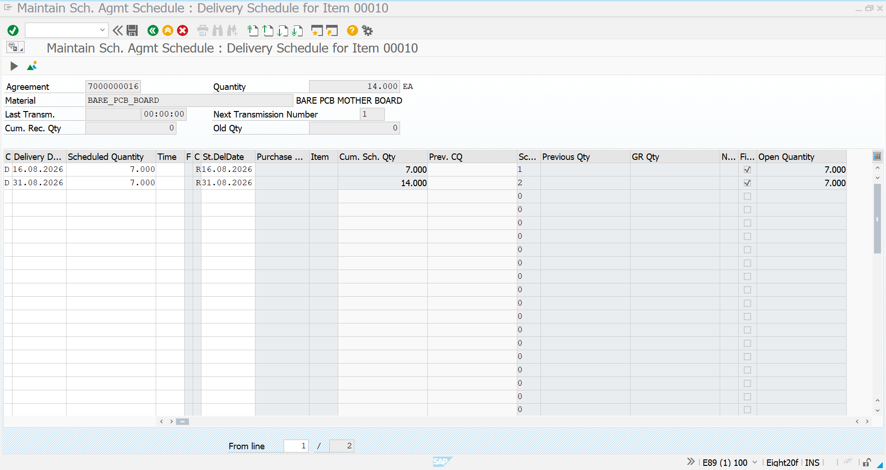
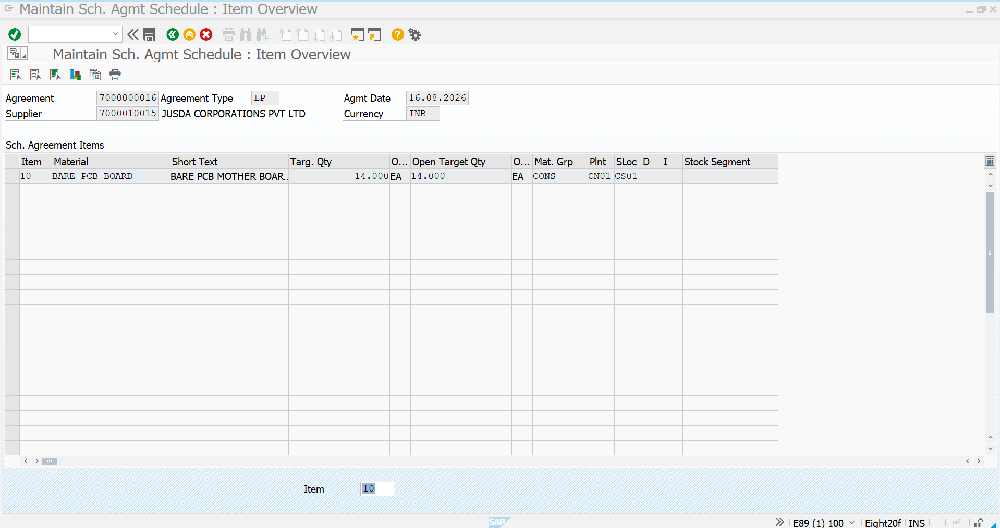
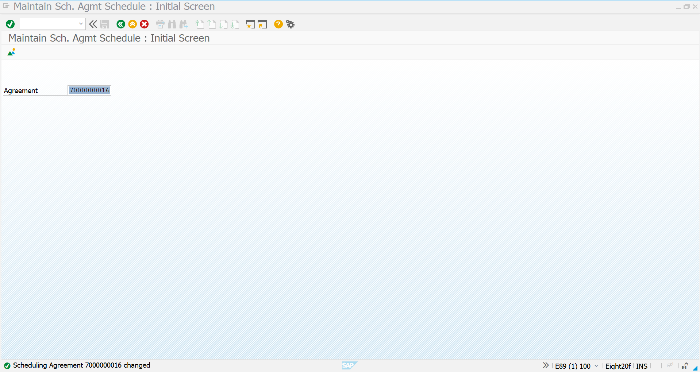

# 03 – Scheduling Agreement – Agreement Creation

## 1. Scheduling Agreement Creation – Overview

A *Scheduling Agreement* is a long-term purchasing agreement with a supplier where the total requirement is agreed in advance and deliveries are planned through *schedule lines*.

In this process, a Scheduling Agreement is created using transaction *ME31L*. The agreement contains:

* Supplier details
* Purchasing Organization
* Purchasing Group
* Agreement validity period
* Material and target quantity
* Net price
* Plant and Storage Location
* Delivery schedule

The created Scheduling Agreement is then maintained using *ME38*, where the delivery schedule is entered.

### Process Flow

```text
ME31L → Initial Screen → Header Data → Item Overview → Save Agreement
→ ME38 → Delivery Schedule → Save Schedule
```

---

## 2. Scheduling Agreement – Initial Screen

*Transaction Code:* `ME31L`

The initial screen is used to enter the basic information required to create the Scheduling Agreement.

### Key Fields

| Field                   | Example Value | Purpose                             |
| ----------------------- | ------------- | ----------------------------------- |
| Supplier                | 7000010015    | Supplier for the agreement          |
| Agreement Type          | LP            | Scheduling Agreement document type  |
| Agreement Date          | 16.08.2026    | Date on which agreement is created  |
| Purchasing Organization | POR1          | Purchasing organization responsible |
| Purchasing Group        | CS0           | Buyer/Purchasing Group              |
| Plant                   | CN01          | Receiving plant                     |
| Storage Location        | CS01          | Storage location                    |

After entering the required organizational and default item data, press *Enter* to proceed to the agreement header and item screens.

### Screenshot



---

## 3. Scheduling Agreement – Header Data

After entering the initial information, SAP opens the *Header Data* screen.

The header contains the overall commercial and administrative information for the Scheduling Agreement.

### Important Information Maintained

* Agreement Type – LP
* Supplier – 7000010015
* Company Code – NT01
* Purchasing Organization – POR1
* Purchasing Group – CS0
* Agreement Date – 16.08.2026
* Validity Start – 16.08.2026
* Validity End – 15.08.2027
* Currency – INR
* Payment Terms – 0001

The validity period determines the period during which the Scheduling Agreement is active.

The header also contains areas for:

* Terms of Delivery and Payment
* Incoterms
* Reference Data
* Supplier Information
* Invoicing Party
* Product Compliance

### Screenshot



---

## 4. Scheduling Agreement – Item Overview

The *Item Overview* contains the actual materials covered by the Scheduling Agreement.

In this example, the following material is entered:

| Field            | Value                 |
| ---------------- | --------------------- |
| Item             | 10                    |
| Material         | BARE_PCB_BOARD        |
| Short Text       | BARE PCB MOTHER BOARD |
| Target Quantity  | 14k Pcs                 |
| Net Price        | 500.00 INR            |
| Material Group   | CONS                  |
| Plant            | CN01                  |
| Storage Location | CS01                  |

The *Target Quantity* represents the total quantity agreed with the supplier for the Scheduling Agreement.

The *Net Price* defines the agreed purchasing price for the material.

After maintaining the item information, the agreement can be saved.

### Screenshot



---

## 5. Scheduling Agreement – Agreement Created

After all required header and item information is maintained, the Scheduling Agreement is saved.

SAP generates a unique Scheduling Agreement document number.

In this example, the Scheduling Agreement is created under:

*Scheduling Agreement:* `7000000016`

The generated document number is important because it is subsequently used in *ME38* to maintain the delivery schedule.

The successful creation confirms that the Scheduling Agreement has been created in SAP.

### Screenshot



---

## 6. ME38 – Scheduling Agreement Schedule

After creating the Scheduling Agreement, transaction *ME38* is used to maintain the delivery schedule.

Enter the Scheduling Agreement number:

*Agreement:* `7000000016`

The schedule maintenance screen displays the material and the total quantity agreed under the Scheduling Agreement.

### Agreement Details

* Material: BARE_PCB_BOARD
* Total Quantity: 14k Pcs

The total quantity is distributed across the required delivery dates.

In this example, the delivery schedule is divided into two deliveries:

| Delivery Date | Scheduled Quantity |
| ------------- | -----------------: |
| 16.08.2026    |               7K Pcs |
| 31.08.2026    |               7K Pcs |
| *Total*       |            *14K Pcs* |

This allows the supplier to deliver the agreed quantity according to predefined delivery dates rather than delivering the entire quantity at once.

### Screenshot



---

## 7. ME38 – Agreement Schedule Overview

After entering the delivery schedule, SAP displays the schedule overview for the Scheduling Agreement item.

The overview confirms the planned delivery quantities and dates.

### Schedule Details

* Agreement: 7000000016
* Material: BARE_PCB_BOARD
* Total Quantity: 14000 Pcs
* First Schedule Line: 7000 Pcs on 16.08.2026
* Second Schedule Line: 7000 Pcs on 31.08.2026

The cumulative scheduled quantity reaches *14K Pcs*, matching the target quantity of the Scheduling Agreement.

The *Open Quantity* represents the quantity that is still expected from the supplier.

### Screenshot



---

## 8. ME38 – Scheduling Agreement Schedule Created

Once the delivery schedule is entered and saved, SAP confirms that the Scheduling Agreement has been changed successfully.

The system message confirms:

> Scheduling Agreement 7000000016 changed

This indicates that the schedule lines have been successfully maintained against the Scheduling Agreement.

The completed Scheduling Agreement now contains:

* Supplier
* Material
* Target Quantity
* Agreed Price
* Validity Period
* Plant and Storage Location
* Planned Delivery Dates
* Scheduled Delivery Quantities

The Scheduling Agreement is now ready for the subsequent procurement and delivery process based on the maintained schedule lines.

### Screenshot



---

# Scheduling Agreement Creation – Final Process

```text
ME31L
   ↓
Enter Supplier & Agreement Type
   ↓
Enter Purchasing Organization & Purchasing Group
   ↓
Enter Plant & Storage Location
   ↓
Maintain Header Data
   ↓
Maintain Material & Target Quantity
   ↓
Maintain Net Price
   ↓
Save Scheduling Agreement
   ↓
Scheduling Agreement Number Generated
   ↓
ME38
   ↓
Enter Scheduling Agreement Number
   ↓
Maintain Delivery Schedule
   ↓
Enter Delivery Dates & Quantities
   ↓
Save Schedule
   ↓
Scheduling Agreement Schedule Completed
```
