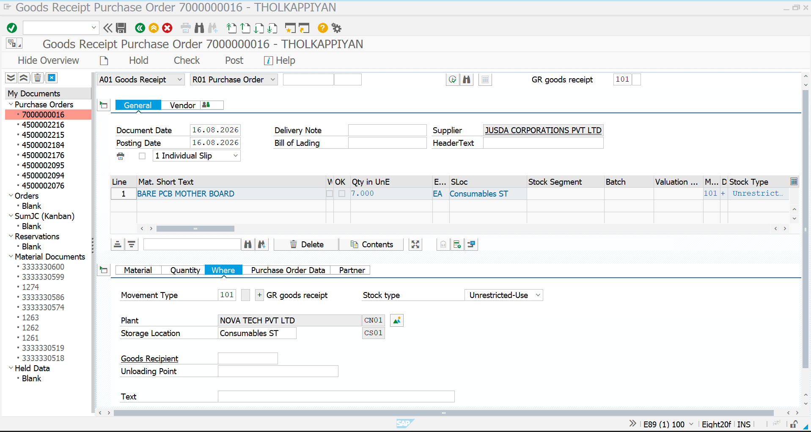
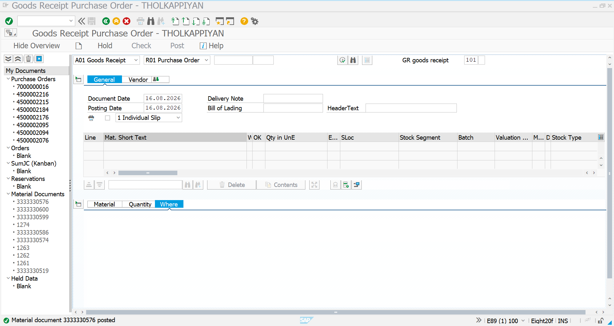
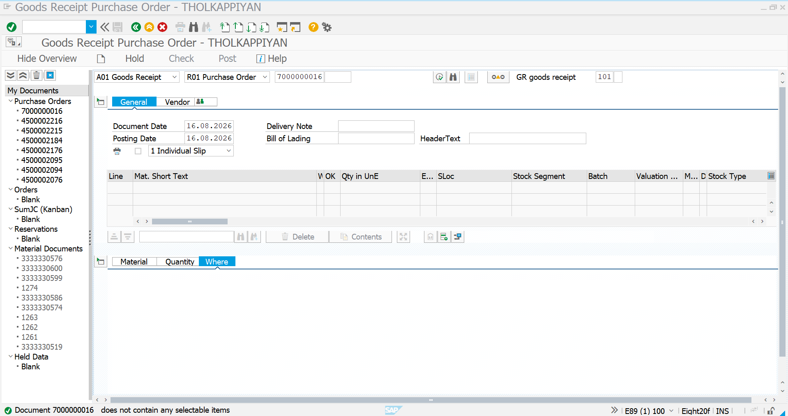

# 04 – Scheduling Agreement – Goods Receipt

## 1. Goods Receipt – Overview

After creating the Scheduling Agreement and maintaining the delivery schedule through `ME38`, the next step is to post the Goods Receipt for the scheduled material.

For this Scheduling Agreement, the agreement number is used as the reference in `MIGO`.

### Scheduling Agreement Details

| Field                     | Value                      |
| ------------------------- | -------------------------- |
| Scheduling Agreement      | 7000000016                 |
| Supplier                  | JUSDA CORPORATIONS PVT LTD |
| Material                  | BARE_PCB_BOARD             |
| Material Description      | BARE PCB MOTHER BOARD      |
| Plant                     | CN01                       |
| Storage Location          | CS01                       |
| Movement Type             | 101                        |
| First Scheduled Quantity  | 7k EA                       |
| First Scheduled Date      | 16.08.2026                 |
| Second Scheduled Quantity | 7k EA                       |
| Second Scheduled Date     | 31.08.2026                 |

The Scheduling Agreement contains two schedule lines:

| Schedule Line | Delivery Date |  Quantity |
| ------------- | ------------- | --------: |
| 1             | 16.08.2026    |      7k EA |
| 2             | 31.08.2026    |      7k EA |
| **Total**     |               | **14k EA** |

The Goods Receipt is therefore processed according to the delivery dates maintained in the Scheduling Agreement.

---

# 2. MIGO – Initial Screen

### Transaction Code

`MIGO`

### Process

In MIGO, select:

* **Goods Receipt**
* **Purchase Order**
* Enter Scheduling Agreement number `7000000016`
* Movement Type `101`
* Document Date: `16.08.2026`
* Posting Date: `16.08.2026`

The Scheduling Agreement number is entered as the purchasing document reference.

### Screenshot



---

# 3. MIGO – First Scheduled Delivery

The first schedule line of the Scheduling Agreement is scheduled for:

**16.08.2026 → 7 EA**

Since the posting date matches the scheduled delivery date, the first scheduled quantity can be processed through MIGO.

### Goods Receipt Details

| Field                | Value            |
| -------------------- | ---------------- |
| Scheduling Agreement | 7000000016       |
| Material             | BARE_PCB_BOARD   |
| Quantity             | 7k EA             |
| Movement Type        | 101              |
| Plant                | CN01             |
| Storage Location     | CS01             |
| Posting Date         | 16.08.2026       |
| Stock Type           | Unrestricted-Use |

After entering the Scheduling Agreement number, SAP retrieves the relevant material and delivery information.

The item is then selected and the quantity of `7K EA` is entered for the first scheduled delivery.

### Screenshot



---

# 4. MIGO – First Delivery Posted

After checking the document and posting the Goods Receipt, SAP generates a Material Document.

The successful posting confirms that the first scheduled delivery quantity has been received into inventory.

### Result

* Scheduling Agreement: `7000000016`
* Received Quantity: `7k EA`
* Movement Type: `101`
* Plant: `CN01`
* Storage Location: `CS01`
* Posting Date: `16.08.2026`
* Goods Receipt: Successfully Posted
* Material Document: Generated by SAP

The first schedule line of the Scheduling Agreement has therefore been completed through Goods Receipt.

### Screenshot


---

# 5. MIGO – Attempt to Process the Second Scheduled Delivery

The second schedule line is maintained in `ME38` for:

**31.08.2026 → 7 EA**

If the second quantity is attempted before its scheduled delivery date, SAP does not provide a selectable item for Goods Receipt based on the current schedule.

For example, when attempting to process the second `7K EA` on `16.08.2026`, the system does not find a selectable schedule line for that delivery date.

### Screenshot



---

# 6. MIGO – Schedule Date Control

The error demonstrates the relationship between the Scheduling Agreement schedule lines and Goods Receipt processing.

The Scheduling Agreement contains:

```text
Schedule Line 1
16.08.2026 → 7K EA
        ↓
Goods Receipt can be processed
        ↓
7 EA Posted

Schedule Line 2
31.08.2026 → 7K EA
        ↓
Before 31.08.2026
        ↓
No selectable item for Goods Receipt
```

The second quantity should therefore be processed on or after its scheduled delivery date, subject to the system configuration and delivery tolerance settings.

This ensures that Goods Receipt is aligned with the delivery schedule maintained against the Scheduling Agreement.

---

# 7. Second Scheduled Delivery – 31.08.2026

On the second scheduled delivery date, the remaining quantity can be processed through MIGO.

### Process

```text
MIGO
   ↓
Goods Receipt
   ↓
Purchase Order
   ↓
Enter Scheduling Agreement 7000000016
   ↓
Movement Type 101
   ↓
Posting Date: 31.08.2026
   ↓
Select 7K EA Schedule Line
   ↓
Check
   ↓
Post
   ↓
Material Document Generated
```

### Expected Result

| Field                | Value                |
| -------------------- | -------------------- |
| Scheduling Agreement | 7000000016           |
| Material             | BARE_PCB_BOARD       |
| Quantity             | 7K EA                 |
| Scheduled Date       | 31.08.2026           |
| Movement Type        | 101                  |
| Plant                | CN01                 |
| Storage Location     | CS01                 |
| Status               | Goods Receipt Posted |

After posting the second delivery, the complete `14K EA` target quantity of the Scheduling Agreement will have been received.

---

# 8. Goods Receipt – Final Process

```text
Scheduling Agreement
7000000016
        ↓
ME38
        ↓
Delivery Schedule
        ↓
16.08.2026 → 7K EA
31.08.2026 → 7K EA
        ↓
MIGO
        ↓
First Delivery
16.08.2026 → 7K EA
        ↓
Goods Receipt Posted
        ↓
Attempt Second Delivery Before 31.08.2026
        ↓
No Selectable Schedule Item
        ↓
Wait Until Scheduled Delivery Date
        ↓
31.08.2026 → 7K EA
        ↓
Goods Receipt Posted
        ↓
Total Goods Receipt
14K EA
```

## Process Summary

The Goods Receipt process for the Scheduling Agreement is controlled by the delivery schedule maintained in `ME38`.

The first scheduled quantity of `7K EA` is received on `16.08.2026`. When the second quantity of `7K EA` is attempted before its scheduled date of `31.08.2026`, SAP does not provide a selectable item for Goods Receipt. The second quantity can then be processed according to the scheduled delivery date and applicable system configuration.

This demonstrates how **ME38 schedule lines control the planned delivery quantities and dates used during the MIGO Goods Receipt process**.
