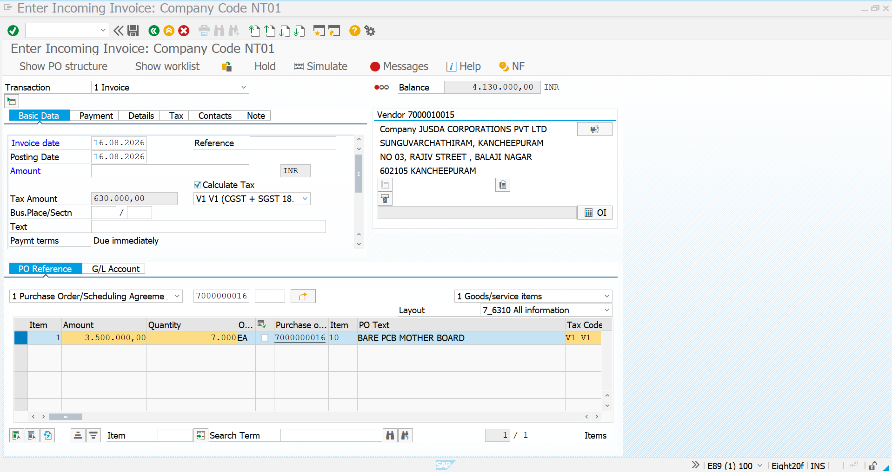
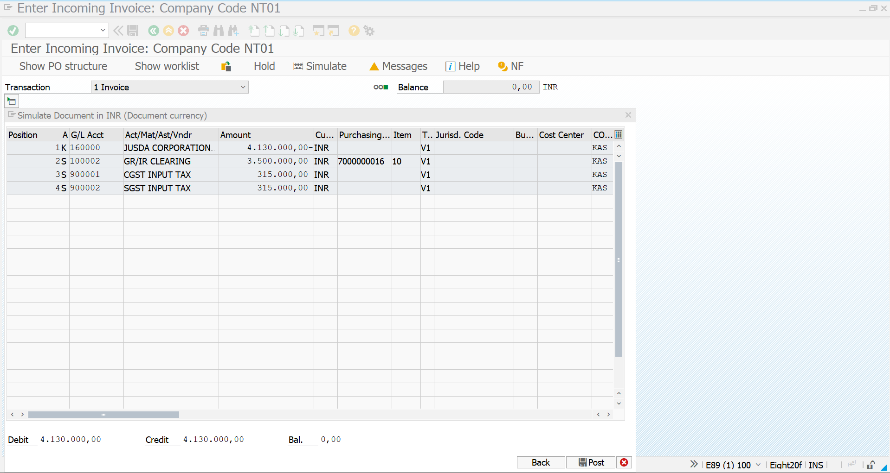
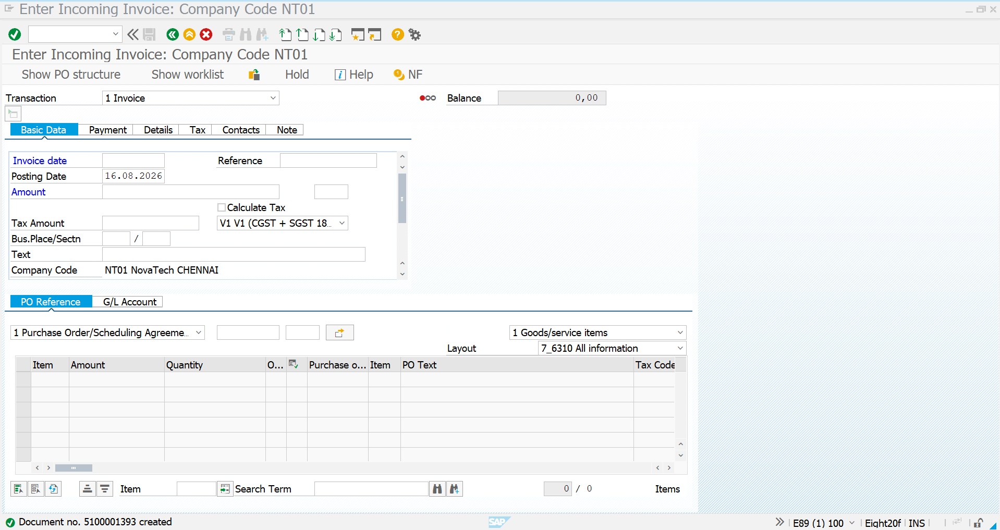

# 05 – Scheduling Agreement – Invoice Verification

## 1. Invoice Verification – Overview

After the Goods Receipt is completed for the Scheduling Agreement, the supplier invoice is processed in SAP using transaction `MIRO`.

The invoice is posted with reference to the Scheduling Agreement number `7000000016`.

In this example, the invoice is processed for the first Goods Receipt quantity of `7k EA`.

### Scheduling Agreement Details

| Field                | Value                      |
| -------------------- | -------------------------- |
| Scheduling Agreement | 7000000016                 |
| Supplier             | JUSDA CORPORATIONS PVT LTD |
| Vendor               | 7000001015                 |
| Company Code         | NT01                       |
| Material             | BARE_PCB_BOARD             |
| Material Description | BARE PCB MOTHER BOARD      |
| Invoice Quantity     | 7k EA                       |
| Base Amount          | 3,500,000.00 INR           |
| Tax                  | CGST + SGST                |
| Tax Amount           | 630,000.00 INR             |
| Invoice Amount       | 4,130,000.00 INR           |
| Payment Terms        | Due immediately            |

The invoice verification process follows the standard three-way matching concept between the purchasing document, Goods Receipt and supplier invoice.

```text id="q5v9ba"
Scheduling Agreement
        ↓
Goods Receipt – MIGO
        ↓
Supplier Invoice
        ↓
MIRO
        ↓
Invoice Verification
        ↓
Simulate
        ↓
Post Invoice
```

---

# 2. MIRO – Initial Screen

### Transaction Code

`MIRO`

Select the transaction:

**Invoice**

Enter the invoice information in the **Basic Data** section.

### Important Fields

* Invoice Date: `16.08.2026`
* Posting Date: `16.08.2026`
* Company Code: `NT01`
* Currency: `INR`
* Vendor: `7000010015`
* Reference: Supplier Invoice Reference
* Tax Code: `V1`
* Calculate Tax: Selected

Under **PO Reference**, select:

**Purchase Order/Scheduling Agreement**

Enter the Scheduling Agreement number:

`7000000016`

SAP retrieves the relevant purchasing document item and Goods Receipt information.

### Screenshot



---

# 3. MIRO – Invoice Item

After entering the Scheduling Agreement number `7000000016`, SAP retrieves the relevant item information.

The invoice item corresponds to the Goods Receipt quantity already posted through MIGO.

### Invoice Item Details

| Field                | Value                 |
| -------------------- | --------------------- |
| Scheduling Agreement | 7000000016            |
| Item                 | 10                    |
| Material             | BARE_PCB_BOARD        |
| Description          | BARE PCB MOTHER BOARD |
| Quantity             | 7k EA                  |
| Base Amount          | 3,500,000.00 INR      |
| Tax Code             | V1                    |
| Tax                  | CGST + SGST           |

The invoice quantity and amount should be verified against the corresponding Goods Receipt and purchasing document.

The invoice amount before tax is:

**3,500,000.00 INR**

The applicable tax amount is:

**630,000.00 INR**

Therefore, the total invoice amount is:

**4,130,000.00 INR**

---

# 4. MIRO – Invoice Verification and Balance

The invoice amount is entered in the **Basic Data** section.

The system calculates the tax based on the selected tax code.

### Amount Calculation

```text id="k8x7wp"
Base Invoice Amount     = 3,500,000.00 INR
CGST + SGST             =   630,000.00 INR
------------------------------------------
Total Invoice Amount    = 4,130,000.00 INR
```

The MIRO balance must be:

`0.00 INR`

A zero balance indicates that the entered invoice amount and the calculated invoice items are balanced and the document can proceed to simulation/posting, subject to any configured checks.

---

# 5. MIRO – Simulation

Before posting the invoice, use the **Simulate** function to review the accounting document generated by SAP.

The simulation displays the accounting entries that will be posted.

### Simulated Accounting Entries

| Position | Account | Description                |           Amount |
| -------- | ------- | -------------------------- | ---------------: |
| 1        | 160000  | Vendor – JUSDA CORPORATION | 4,130,000.00 INR |
| 2        | 100002  | GR/IR CLEARING             | 3,500,000.00 INR |
| 3        | 900001  | CGST INPUT TAX             |   315,000.00 INR |
| 4        | 900002  | SGST INPUT TAX             |   315,000.00 INR |

The total debit and credit amounts are balanced at:

**4,130,000.00 INR**

### Screenshot



---

# 6. MIRO – Invoice Posting

After verifying the invoice details and confirming that the simulation is balanced, click **Post** to create the invoice document.

SAP generates an accounting document for the invoice.

In this example, SAP displays:

> Document no. 5100001393 created

This confirms that the supplier invoice has been successfully posted in SAP.

### Posting Result

| Field                | Value                      |
| -------------------- | -------------------------- |
| Scheduling Agreement | 7000000016                 |
| Vendor               | JUSDA CORPORATIONS PVT LTD |
| Invoice Quantity     | 7k EA                       |
| Invoice Amount       | 4,130,000.00 INR           |
| Company Code         | NT01                       |
| Invoice Document     | 5100001393                 |
| Posting Status       | Successfully Posted        |

### Screenshot



---

# 7. Invoice Verification – Final Process

```text id="f7vl9e"
Scheduling Agreement
7000000016
        ↓
Goods Receipt Completed
        ↓
MIGO
        ↓
7k EA Received
        ↓
MIRO
        ↓
Enter Invoice Date & Posting Date
        ↓
Select Purchase Order / Scheduling Agreement
        ↓
Enter Agreement No. 7000000016
        ↓
Retrieve Invoice Item
        ↓
Enter Invoice Amount
        ↓
Calculate Tax
        ↓
Check Balance
        ↓
Simulate
        ↓
Review Accounting Entries
        ↓
Post
        ↓
Invoice Document Generated
        ↓
Invoice Verification Completed
```

---

# 8. Procure-to-Pay Flow – Scheduling Agreement

The complete procurement cycle documented for this Scheduling Agreement is:

```text id="xg6g1j"
ME31L
   ↓
Create Scheduling Agreement
   ↓
Scheduling Agreement
7000000016
   ↓
ME38
   ↓
Maintain Delivery Schedule
   ↓
16.08.2026 → 7k EA
31.08.2026 → 7k EA
   ↓
MIGO
   ↓
Goods Receipt
   ↓
7k EA Received
   ↓
MIRO
   ↓
Invoice Verification
   ↓
Simulate
   ↓
Post Invoice
   ↓
Accounting Document Created
```

The Scheduling Agreement therefore connects the long-term purchasing arrangement, delivery schedule, Goods Receipt and Invoice Verification into a complete procurement process.
