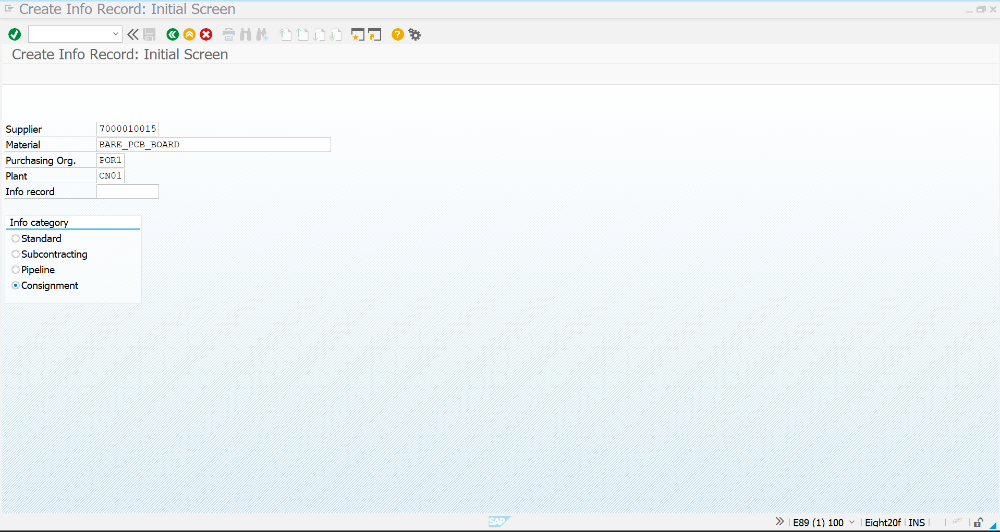
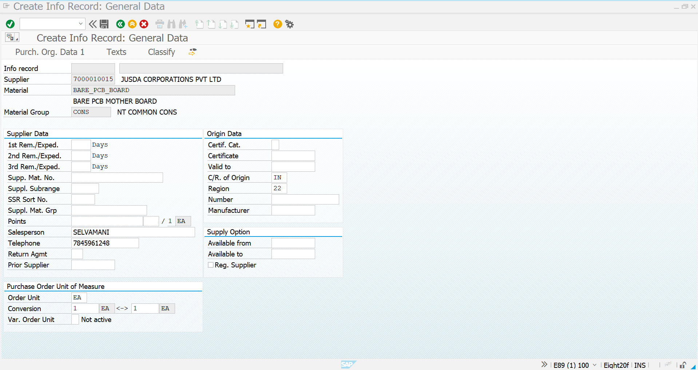
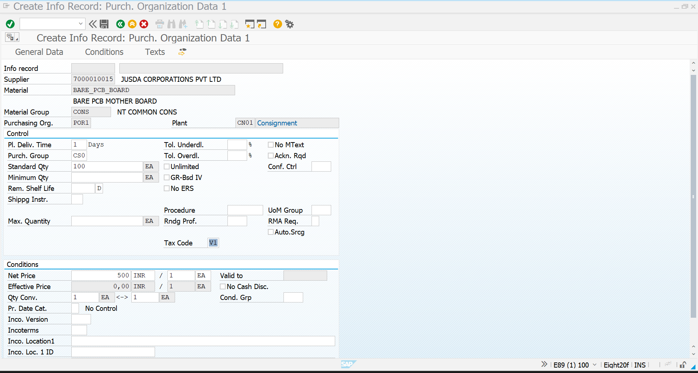
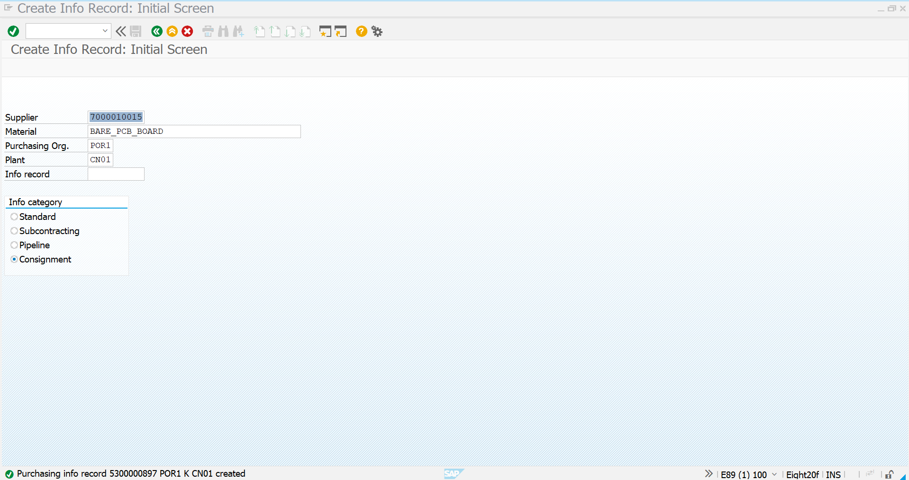
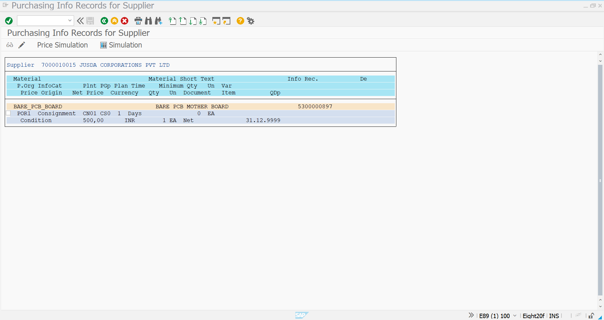

# Consignment Purchasing Info Record

## Overview

The Purchasing Info Record (PIR) defines the purchasing relationship between the **JUSDA Corporations Pvt Ltd** supplier and the **Bare PCB Board** material for the Consignment Procurement scenario.

In this implementation, the Info Record is created using the **Consignment** information category for Plant **CN01** and Purchasing Organization **POR1**.

The PIR maintains the supplier-specific purchasing information and consignment price that will be referenced during the subsequent Consignment Purchase Requisition and Purchase Order process.

---

## SAP Transaction

```text
ME11 – Create Purchasing Info Record
```

**Info Category:**

```text
Consignment
```

---

## Business Scenario

The company maintains Bare PCB Board requirements through a third-party supplier, **JUSDA Corporations Pvt Ltd**.

JUSDA maintains material stock on behalf of the company. The company can subsequently obtain the required quantity from this consignment stock and transfer the required quantity into its own unrestricted stock.

The Purchasing Info Record establishes the purchasing relationship required for this process.

### Scenario Flow

```text
JUSDA Supplier
       │
       ▼
Bare PCB Board Material
       │
       ▼
Consignment Purchasing Info Record
       │
       ▼
Consignment PR
       │
       ▼
Consignment PO
       │
       ▼
Goods Receipt
       │
       ▼
Vendor Consignment Stock
       │
       ▼
411 K Transfer Posting
       │
       ▼
Company-Owned Stock
       │
       ▼
MRM1 / MRKO
       │
       ▼
Vendor Settlement
```

---

# 1. Create Info Record – Initial Screen

Execute transaction:

```text
ME11
```

On the initial screen, enter the relevant supplier, material, purchasing organization, and plant.

### Input Details

| Field | Value |
|---|---|
| Supplier | `7000010015` |
| Supplier Name | JUSDA CORPORATIONS PVT LTD |
| Material | `BARE_PCB_BOARD` |
| Material Description | BARE PCB MOTHER BOARD |
| Purchasing Organization | `POR1` |
| Plant | `CN01` |
| Info Category | Consignment |

Select:

```text
Consignment
```

as the Info Category.

### Screenshot



---

# 2. Maintain General Purchasing Information

After continuing from the initial screen, maintain the general information required for the supplier-material relationship.

The system displays the supplier and material information.

### Supplier Information

```text
Supplier: 7000010015
Supplier Name: JUSDA CORPORATIONS PVT LTD
```

### Material Information

```text
Material: BARE_PCB_BOARD
Description: BARE PCB MOTHER BOARD
Material Group: CONS
```

The relevant supplier information can be maintained where required.

### Screenshot



---

# 3. Maintain Purchasing Organization Data

Maintain the purchasing organization-specific information for the Consignment Info Record.

The implemented values include:

| Field | Value |
|---|---|
| Purchasing Organization | `POR1` |
| Plant | `CN01` |
| Info Category | Consignment |
| Planned Delivery Time | `1 Day` |
| Purchasing Group | `CS0` |
| Standard Quantity | `100 EA` |
| Tax Code | `V1` |
| Order Unit | `EA` |

The purchasing organization data controls how the supplier-material relationship is used during purchasing.

### Screenshot


---

# 4. Maintain Consignment Conditions

Maintain the supplier-specific consignment price under the Conditions section.

For this implementation:

| Field | Value |
|---|---|
| Net Price | `500 INR` |
| Price Unit | `1 EA` |
| Currency | `INR` |
| Order Unit | `EA` |
| Validity | `31.12.9999` |

The condition establishes the price that SAP uses for the consignment material during the relevant procurement and settlement process.

### Screenshot



---

# 5. Save the Consignment Info Record

After maintaining the required purchasing and condition data, save the Info Record.

SAP creates the Purchasing Info Record for:

```text
Supplier: 7000010015
Material: BARE_PCB_BOARD
Purchasing Organization: POR1
Plant: CN01
Info Category: Consignment
```

The system confirms successful creation.

### Screenshot



---

# 6. Verify the Created Info Record

The created Info Record can be displayed to verify that the supplier-material purchasing relationship has been successfully maintained.

The display confirms:

```text
Supplier
        ↓
JUSDA CORPORATIONS PVT LTD

Material
        ↓
BARE_PCB_BOARD

Purchasing Organization
        ↓
POR1

Plant
        ↓
CN01

Info Category
        ↓
Consignment

Price
        ↓
500 INR / 1 EA
```

### Screenshot



---

# 7. Result

The Consignment Purchasing Info Record has been successfully created and verified.

### Created Information

| Parameter | Value |
|---|---|
| Supplier | `7000010015` – JUSDA CORPORATIONS PVT LTD |
| Material | `BARE_PCB_BOARD` |
| Material Description | BARE PCB MOTHER BOARD |
| Material Group | `CONS` |
| Purchasing Organization | `POR1` |
| Plant | `CN01` |
| Info Category | Consignment |
| Purchasing Group | `CS0` |
| Planned Delivery Time | `1 Day` |
| Standard Quantity | `100 EA` |
| Net Price | `500 INR / 1 EA` |
| Tax Code | `V1` |
| Info Record | `5300000897` |

---

# Integration with the Consignment Process

The created PIR becomes the purchasing master-data foundation for the next stages of the scenario.

```text
Material Master
      │
      ▼
Vendor Master
      │
      ▼
Consignment PIR
      │
      ▼
Purchase Requisition
      │
      ▼
Consignment Purchase Order
(Item Category K)
      │
      ▼
Goods Receipt
      │
      ▼
Consignment Stock
      │
      ▼
411 K Transfer Posting
      │
      ▼
Own Stock
      │
      ▼
MRM1 / MRKO
      │
      ▼
Vendor Settlement
```

---

## Key SAP Learning

This activity demonstrates how to:

- Create a Purchasing Info Record using `ME11`
- Select the **Consignment** Info Category
- Link a supplier with a material
- Maintain purchasing organization and plant data
- Maintain supplier-specific purchasing conditions
- Define a consignment price
- Verify the created Info Record
- Prepare the master data required for Consignment Procurement

---

## Conclusion

The Consignment Purchasing Info Record is successfully configured for the **JUSDA – Bare PCB Board** relationship.

This completes the PIR/master-data preparation stage and allows the process to proceed to the **Consignment Purchase Requisition and Purchase Order** stages.