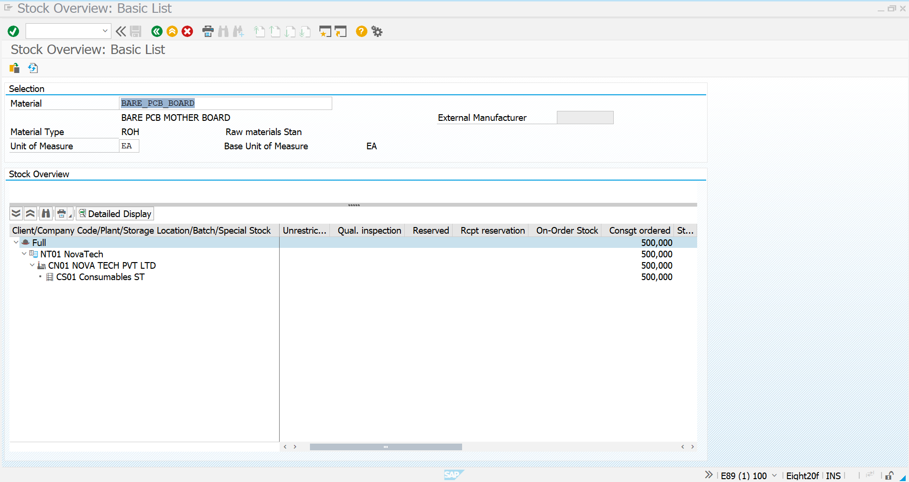
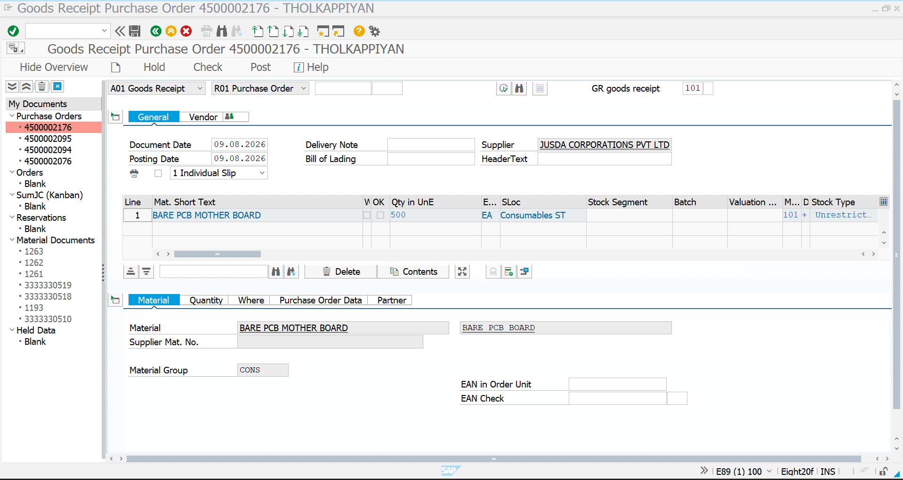
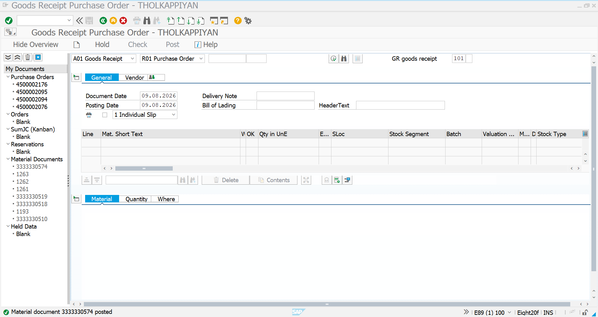
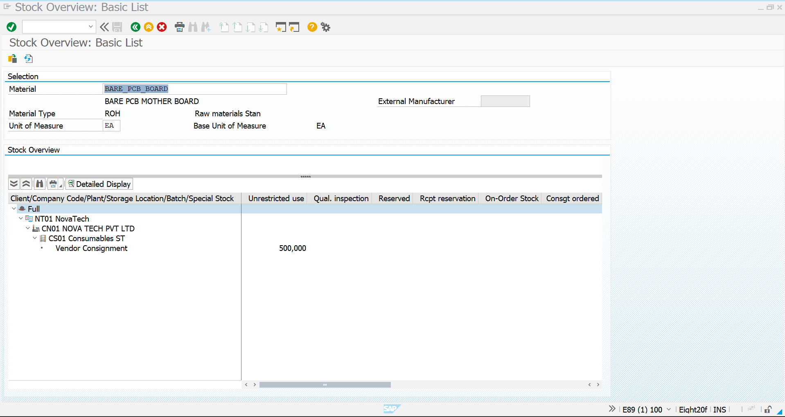
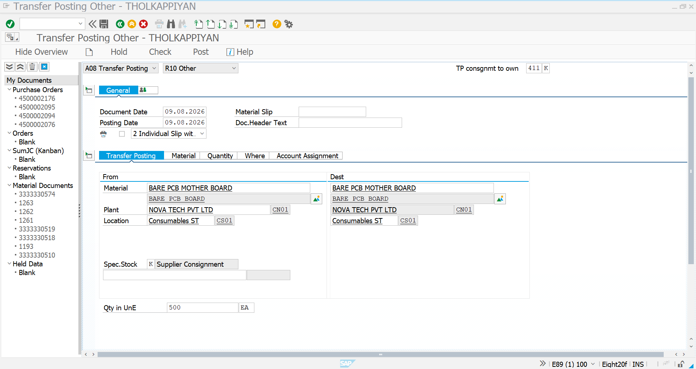
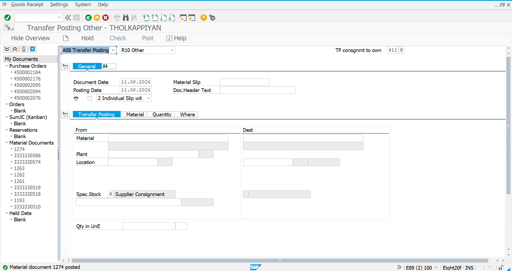
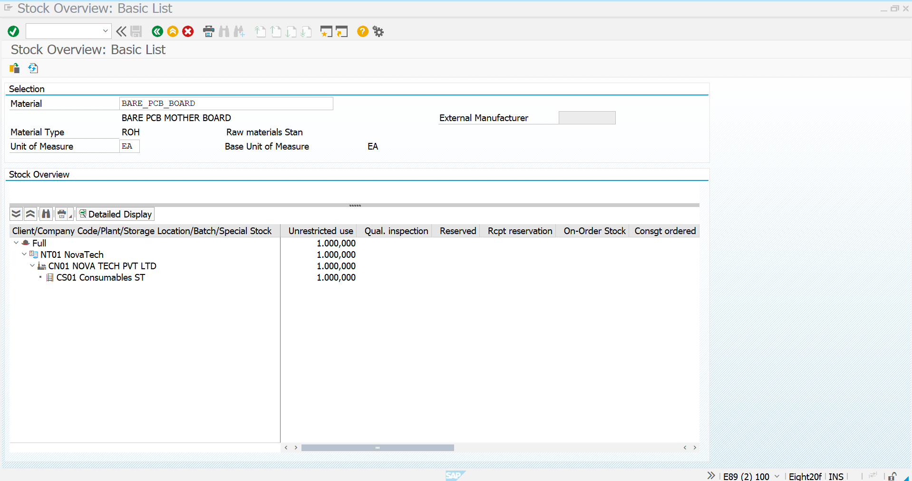

# Consignment Goods Receipt & Transfer Posting

## Overview

This stage demonstrates the inventory movement in the **Consignment Procurement** process.

The material is initially received as **supplier-owned consignment stock**. When the company needs to consume the material, the required quantity is transferred from consignment stock to company-owned unrestricted-use stock using **Movement Type 411 K**.

The stock position is verified in **MMBE before and after the transfer**.

---

## Process Flow

```text
Consignment Purchase Order
        ↓
MIGO – Goods Receipt
        ↓
Supplier Consignment Stock
        ↓
MMBE – Stock Verification
        ↓
MIGO – Transfer Posting 411 K
        ↓
Consignment Stock → Own Stock
        ↓
Post Transfer
        ↓
MMBE – Final Stock Verification
        ↓
Unrestricted-Use Stock
```

---

# 1. MMBE – Initial Stock Verification

Before processing the transfer, the stock position is checked using:

```text
MMBE
```

### Material

```text
BARE_PCB_BOARD
```

### Plant

```text
CN01
```

### Storage Location

```text
CS01 – Consumables ST
```

The initial MMBE screen shows the material under **Consignment Ordered** stock.

This establishes the starting stock position before the Goods Receipt and ownership transfer process.



---

# 2. MIGO – Goods Receipt

Execute:

```text
MIGO
```

Select:

```text
A01 – Goods Receipt
R01 – Purchase Order
Movement Type: 101
```

Enter the Consignment Purchase Order:

```text
4500002176
```

### Procurement Details

| Field            | Value                        |
| ---------------- | ---------------------------- |
| Purchase Order   | `4500002176`                 |
| Supplier         | `JUSDA CORPORATIONS PVT LTD` |
| Material         | `BARE_PCB_BOARD`             |
| Quantity         | `500 EA`                     |
| Plant            | `CN01`                       |
| Storage Location | `CS01 – Consumables ST`      |
| Movement Type    | `101`                        |
| Item Category    | `K – Consignment`            |

The Purchase Order is loaded into MIGO and the material quantity is entered for Goods Receipt.



---

# 3. Post Goods Receipt

After checking the material, quantity, plant and storage location, post the Goods Receipt.

SAP generates a Material Document confirming the successful posting.

The Goods Receipt represents the physical receipt of the material into the company's location.

However, because this is **Consignment Procurement**, the material remains **supplier-owned**.



---

# 4. Consignment Stock

After the Goods Receipt, the material is available as supplier-owned consignment stock.

The material can physically be stored at the company's location while ownership remains with the supplier.

```text
Physical Location
        ↓
Company Plant / Storage Location

Ownership
        ↓
Supplier

Stock Type
        ↓
Consignment Stock
```

This is one of the key differences between normal procurement and consignment procurement.



---

# 5. MMBE – Consignment Stock Verification

MMBE is used again to verify the stock position.

The material can be reviewed at:

```text
Plant: CN01
Storage Location: CS01
```

The stock is associated with the supplier's consignment inventory.

---

# 6. MIGO – 411 K Transfer Posting

When the company requires the material for its own consumption, the required quantity is transferred from supplier-owned consignment stock to company-owned stock.

Execute:

```text
MIGO
```

Select:

```text
A08 – Transfer Posting
R10 – Other
Movement Type: 411 K
```

### Movement Type

```text
411 K
```

### Meaning

```text
Transfer from Consignment Stock
to Own Stock
```

Enter:

```text
Material: BARE_PCB_BOARD
Plant: CN01
Storage Location: CS01
Special Stock: K – Supplier Consignment
Quantity: 500 EA
```

The **From** side represents:

```text
Supplier Consignment
```

The destination represents the company's own stock.



---

# 7. Post the 411 K Transfer

Review the transfer posting details and perform the document check.

Once everything is correct, select:

```text
Post
```

SAP creates the corresponding Material Document.

The successful posting confirms that the material has been transferred from supplier-owned consignment stock to company-owned stock.



---

# 8. Ownership Change

The critical business event in this step is the **change in stock ownership**.

### Before 411 K

```text
Supplier
   │
   ▼
Consignment Stock
   │
   ▼
Supplier-Owned
```

### 411 K Transfer

```text
Consignment Stock
       │
       │ 411 K
       ▼
Own Stock
```

### After 411 K

```text
Company
   │
   ▼
Unrestricted-Use Stock
   │
   ▼
Company-Owned
```

Therefore:

```text
Supplier-Owned Consignment
            │
            │ 411 K
            ▼
Company-Owned Unrestricted Stock
```

---

# 9. Final MMBE Stock Verification

After the 411 K transfer is posted, execute:

```text
MMBE
```

again for:

```text
Material: BARE_PCB_BOARD
Plant: CN01
Storage Location: CS01
```

The transferred quantity should now be visible under:

```text
Unrestricted Use
```

The corresponding supplier consignment quantity is reduced.

This confirms that the ownership transfer has been successfully completed.



---

# 10. Stock Movement Summary

| Stage              | SAP Transaction | Stock Status            | Ownership          |
| ------------------ | --------------- | ----------------------- | ------------------ |
| Initial Check      | MMBE            | Consignment Ordered     | Supplier           |
| Goods Receipt      | MIGO / 101      | Consignment Stock       | Supplier           |
| Stock Verification | MMBE            | Consignment Stock       | Supplier           |
| Transfer           | MIGO / 411 K    | Consignment → Own Stock | Ownership Transfer |
| Posting            | MIGO            | Own Stock               | Company            |
| Final Check        | MMBE            | Unrestricted Use        | Company            |

---

# 11. Complete Consignment Procurement Flow

```text
Material Creation
        ↓
Vendor Master
        ↓
Consignment PIR
        ↓
Consignment PR
        ↓
Consignment PO
        ↓
MIGO – Goods Receipt (101)
        ↓
Supplier Consignment Stock
        ↓
MMBE – Stock Verification
        ↓
MIGO – Transfer Posting (411 K)
        ↓
Consignment Stock → Own Stock
        ↓
Material Document Posted
        ↓
MMBE – Final Stock Verification
        ↓
Unrestricted-Use Stock
        ↓
MRM1 / MRKO
        ↓
Vendor Settlement
```

---

# 12. Business Significance

Consignment procurement allows the company to maintain supplier-owned inventory at its premises without immediately purchasing the entire quantity.

The company becomes financially responsible for the material when it is withdrawn from consignment stock.

In this implementation:

```text
Supplier:
JUSDA CORPORATIONS PVT LTD

Material:
BARE_PCB_BOARD

Quantity:
500 EA

Plant:
CN01

Storage Location:
CS01
```

The `411 K` movement represents the transition from supplier-owned inventory to company-owned inventory.

This provides clear visibility of:

- Supplier-owned inventory
- Company-owned inventory
- Stock ownership
- Material availability
- Inventory movements
- Consumption-related stock transfers

---

## Key SAP MM Transactions

| Transaction | Purpose                                       |
| ----------- | --------------------------------------------- |
| `MIGO`      | Goods Receipt and Transfer Posting            |
| `MMBE`      | Stock Overview                                |
| `101`       | Goods Receipt                                 |
| `411 K`     | Consignment Stock → Own Stock                 |
| `MRM1`      | Consignment Settlement Selection / Processing |
| `MRKO`      | Consignment Vendor Settlement                 |

---

## Result

The Consignment Goods Receipt and Stock Transfer process has been successfully demonstrated.

The complete inventory movement is:

```text
Consignment Ordered
        ↓
Goods Receipt – 101
        ↓
Supplier Consignment Stock
        ↓
411 K Transfer Posting
        ↓
Company-Owned Stock
        ↓
Unrestricted Use
```

The **MMBE before-and-after verification** provides evidence of the stock transition, while the **MIGO 411 K document** demonstrates the actual ownership transfer.

The final MMBE verification confirms that the transferred quantity is now available under **Unrestricted Use** as company-owned stock.

The next stage is:

```text
MRM1 → MRKO
```

for **Consignment Vendor Settlement** based on the quantity transferred/consumed.