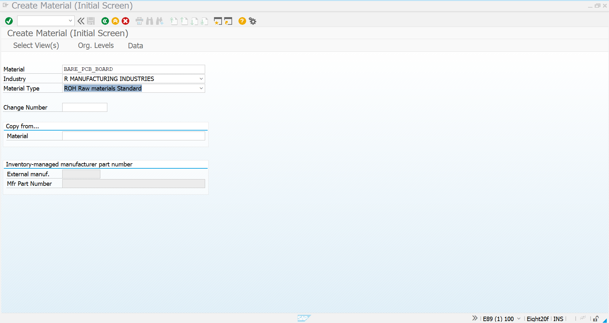
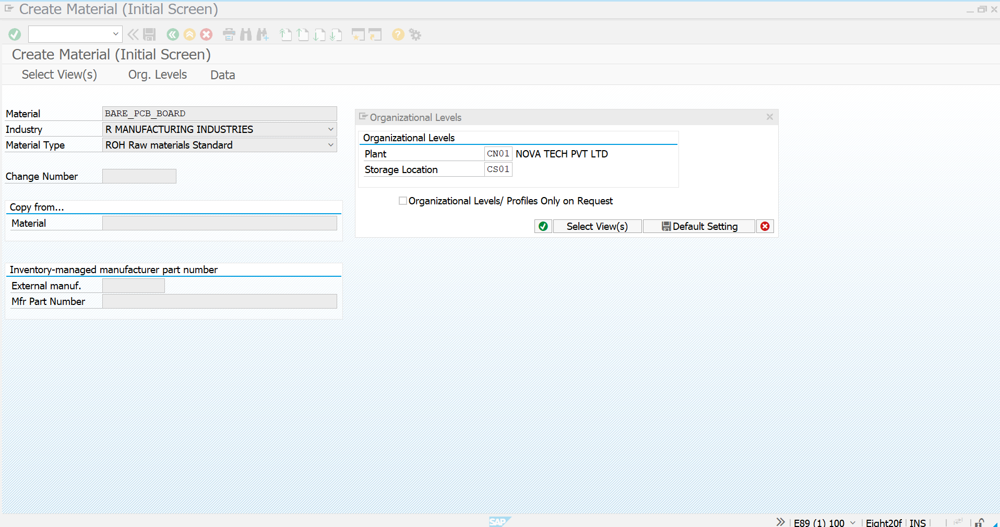
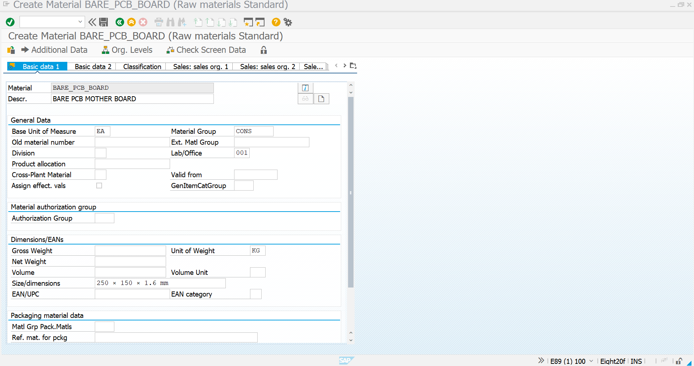
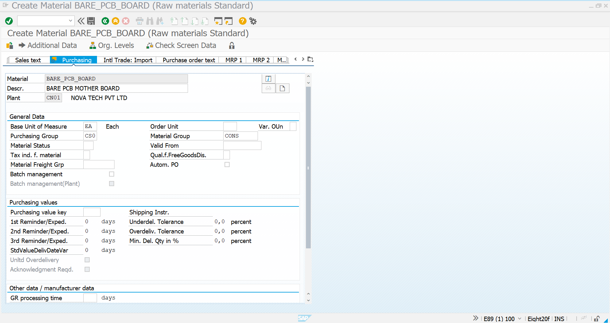
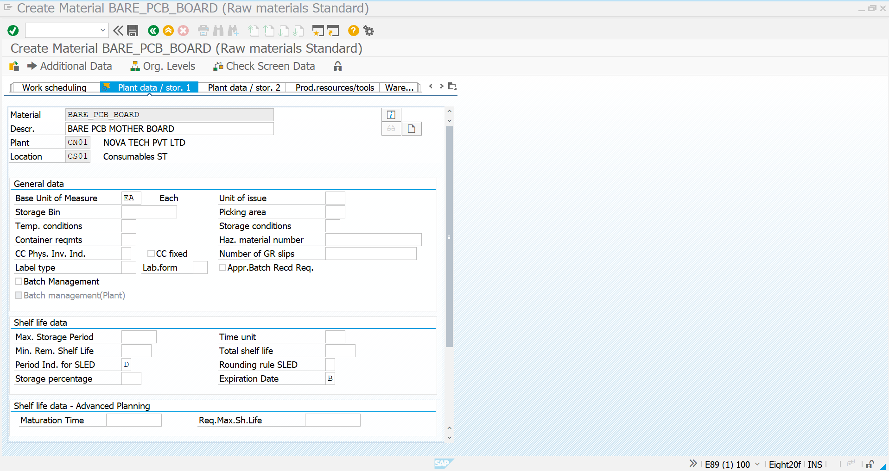
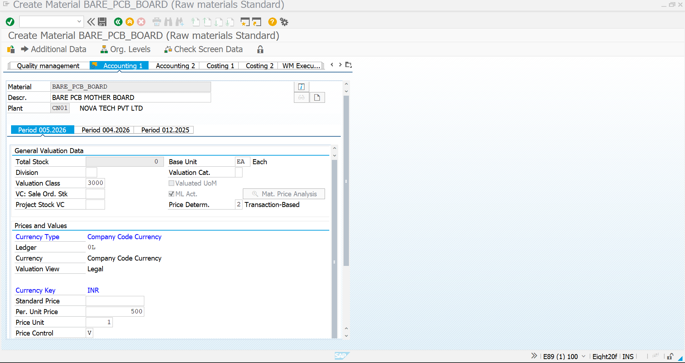
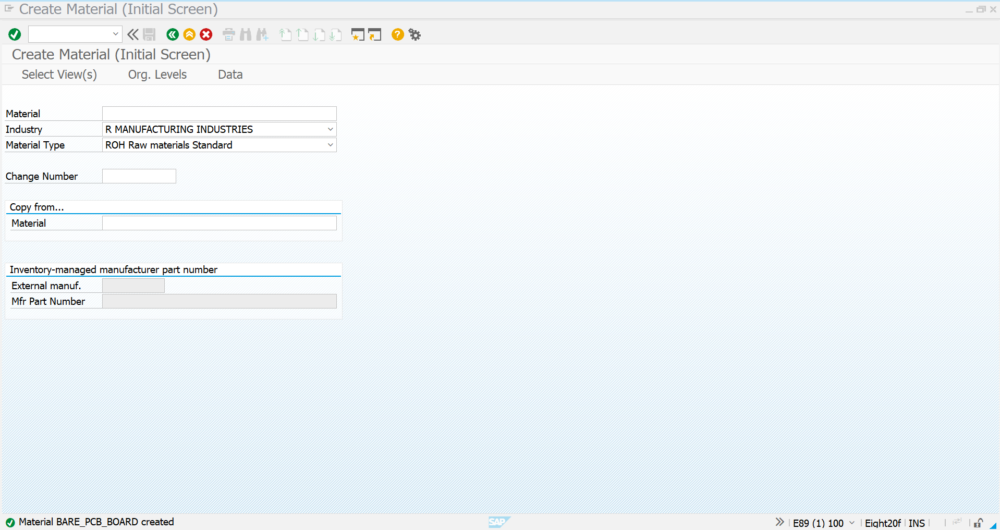

# Material Master Creation – Consignment Procurement

## Overview

The Material Master is the foundation of the Consignment Procurement process. It contains the material identification, purchasing, plant, storage, inventory, and accounting information required to manage the raw material throughout its lifecycle.

For this scenario, a **Bare PCB (Printed Circuit Board)** is created as a raw material that can be procured through the Consignment Procurement process.

---

## Transaction Code

```text
MM01
```

---

## Material Details

| Field | Value |
|---|---|
| Material Description | Bare PCB |
| Material Type | ROH – Raw Material |
| Material Group | PCB |
| Base Unit of Measure | EA |
| Plant | CN01 |
| Storage Location | CS01 |
| Purchasing Group | CS0 |
| Dimensions | 250 × 150 × 1.6 mm |

> The material is created as a standard raw material so that it can be managed through the Consignment Procurement process.

---

# Step 1 – Material Creation Initial Screen

Execute transaction:

```text
MM01
```

Enter the required material creation information and select the relevant views.

### Required Views

- Basic Data 1
- Basic Data 2
- Purchasing
- Plant/Storage 1
- Plant/Storage 2
- Accounting 1
- Accounting 2

### Screenshot



---

# Step 2 – Organizational Levels

Enter the organizational levels for the material.

| Organizational Level | Value |
|---|---|
| Plant | CN01 |
| Storage Location | CS01 |

These organizational assignments determine where the material will be managed and stored.

### Screenshot



---

# Step 3 – Basic Data

Maintain the general material information.

### Information Maintained

- Material Description
- Material Group
- Base Unit of Measure
- Dimensions

The material is maintained as a **Bare PCB** with a base unit of measure of **EA**.

### Screenshot



---

# Step 4 – Purchasing Data

Maintain the purchasing-related information required for procurement.

### Information Maintained

- Purchasing Group
- Order Unit
- Purchasing-related material data
- Goods Receipt Processing Time, where applicable

The Consignment-specific purchasing relationship will subsequently be maintained through the **Consignment Purchasing Info Record**.

### Screenshot



---

# Step 5 – Plant & Storage Data

Maintain plant-specific and storage-related information.

### Information Maintained

- Plant
- Storage Location
- Storage-related parameters
- Inventory management information

This enables the Bare PCB to be managed at the required plant and storage location.

### Screenshot



---

# Step 6 – Accounting Data

Maintain the accounting and valuation information required for material management.

### Information Maintained

- Valuation Class
- Price Control
- Valuation-related parameters
- Accounting information

The accounting values used are based on the configuration available in the SAP system.

### Screenshot



---

# Step 7 – Material Created Successfully

After all required views and organizational data are maintained, save the material.

SAP generates the material number and confirms successful creation.

### Screenshot



---

# Process Flow

```text
MM01
  │
  ▼
Material Creation
  │
  ▼
Organizational Levels
  │
  ▼
Basic Data
  │
  ▼
Purchasing Data
  │
  ▼
Plant & Storage Data
  │
  ▼
Accounting Data
  │
  ▼
Material Created
  │
  ▼
Ready for Consignment Procurement
```

---

# Consignment Process Integration

The created material will be used in the subsequent Consignment Procurement process:

```text
Material Master
      │
      ▼
Vendor Master
      │
      ▼
Consignment Info Record
      │
      ▼
Purchase Requisition
      │
      ▼
Consignment Purchase Order
(Item Category K)
      │
      ▼
MIGO – Goods Receipt
      │
      ▼
Vendor Consignment Stock
      │
      ▼
MIGO – 411 K
      │
      ▼
Company-Owned Stock
```

---

# Business Outcome

The **Bare PCB Material Master** has been successfully created and prepared for the Consignment Procurement process.

The material is now ready for:

- Consignment Info Record creation
- Purchase Requisition
- Consignment Purchase Order
- Goods Receipt
- Consignment Stock Management
- Transfer Posting to Own Stock
- Stock Verification
- Vendor Settlement

---

# Key Learning

- Created a raw material using **MM01**
- Maintained material master data across relevant SAP views
- Assigned plant and storage location
- Maintained purchasing information
- Maintained material dimensions and weight
- Maintained accounting and valuation information
- Prepared the material for the subsequent Consignment Procurement process