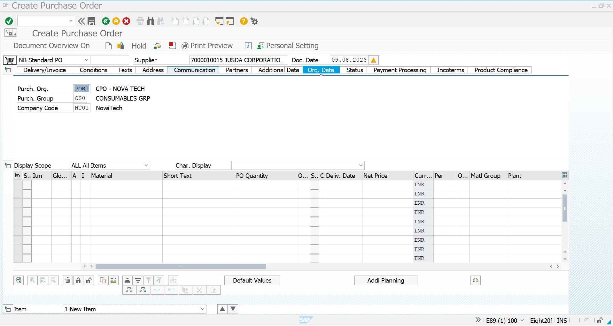
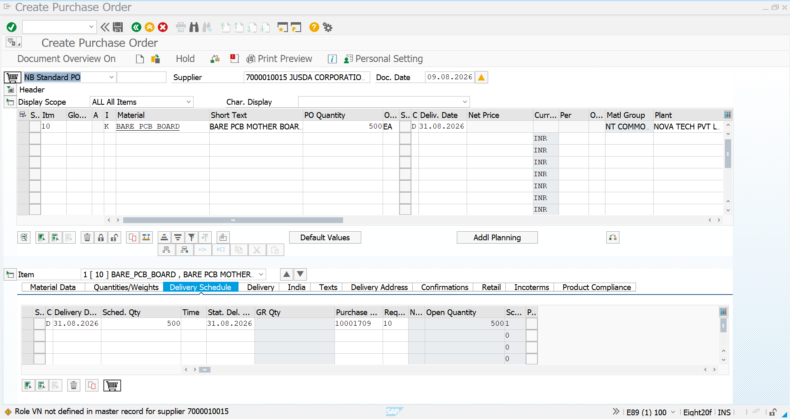
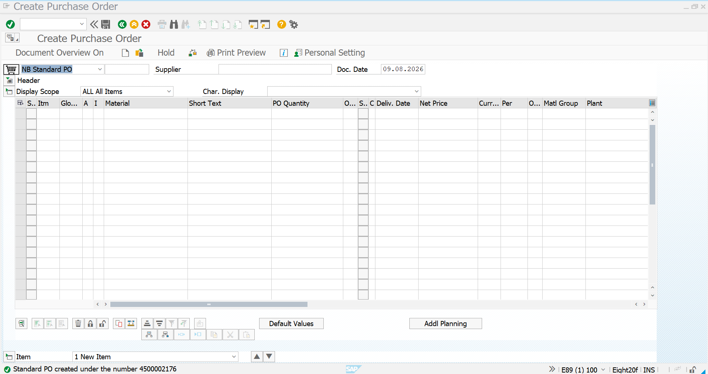

# Consignment Purchase Order

## Overview

The Consignment Purchase Order is created after the Consignment Purchase Requisition for the required material.

In this scenario, **JUSDA CORPORATIONS PVT LTD** acts as the third-party consignment supplier. The supplier maintains the material as consignment stock, while the company can later transfer the required quantity into its own stock when the material is required.

The Purchase Order is created with **Item Category K – Consignment**.

---

## SAP Transaction

```text
ME21N – Create Purchase Order
```

### Procurement Type

```text
Consignment Procurement
```

### Item Category

```text
K – Consignment
```

---

# 1. Create Consignment Purchase Order

Execute transaction:

```text
ME21N
```

The **Create Purchase Order** screen is opened.

Enter the relevant supplier and organizational information.

### Supplier

```text
7000010015 – JUSDA CORPORATIONS PVT LTD
```

The Purchase Order is created based on the previously created Consignment Purchase Requisition.

### Reference PR

```text
0010001709
```

The PR contains the requirement for:

```text
Material: BARE_PCB_BOARD
Quantity: 500 EA
Plant: CN01
Item Category: K – Consignment
```

### Screenshot



---

# 2. Maintain Purchase Order Item

Enter or reference the required material and verify the item details.

### Purchase Order Item

| Field | Value |
|---|---|
| Material | `BARE_PCB_BOARD` |
| Short Text | BARE PCB MOTHER BOARD |
| Item Category | `K – Consignment` |
| Quantity | `500 EA` |
| Plant | `CN01` |
| Supplier | `7000010015 – JUSDA CORPORATIONS PVT LTD` |

The **K – Consignment** item category identifies the PO as a consignment procurement document.

The material is therefore received into **supplier-owned consignment stock** rather than immediately becoming company-owned stock.

### Screenshot



---

# 3. Verify Purchasing Information

Review the item-level information before saving the Purchase Order.

The relevant material and purchasing information should correspond with the Consignment PIR created previously.

### Consignment PIR Reference

```text
Supplier:
7000010015 – JUSDA CORPORATIONS PVT LTD

Material:
BARE_PCB_BOARD

Purchasing Organization:
POR1

Plant:
CN01

Info Category:
Consignment

Price:
500 INR / 1 EA
```

The Purchase Order therefore uses the supplier-material purchasing relationship maintained through the Consignment Purchasing Info Record.

---

# 4. Save the Purchase Order

After reviewing the supplier, material, quantity, plant, item category and purchasing information, save the Purchase Order.

SAP generates the Purchase Order number:

```text
4500002176
```

### Created Purchase Order

```text
PO Number: 4500002176
Supplier: 7000010015 – JUSDA CORPORATIONS PVT LTD
Material: BARE_PCB_BOARD
Quantity: 500 EA
Plant: CN01
Item Category: K – Consignment
```

### Screenshot



---

# 5. Purchase Order Result

The Consignment Purchase Order has been successfully created.

| Parameter | Value |
|---|---|
| Purchase Order | `4500002176` |
| Purchase Requisition | `0010001709` |
| Supplier | `7000010015` – JUSDA CORPORATIONS PVT LTD |
| Material | `BARE_PCB_BOARD` |
| Description | BARE PCB MOTHER BOARD |
| Item Category | `K – Consignment` |
| Quantity | `500 EA` |
| Plant | `CN01` |
| Purchasing Organization | `POR1` |
| Price Reference | `500 INR / 1 EA` |

---

# Consignment Procurement Process

The Purchase Order completes the purchasing document creation stage of the Consignment scenario.

```text
Material Creation
       │
       ▼
Vendor Master
       │
       ▼
Consignment PIR
       │
       ▼
Consignment PR
0010001709
       │
       ▼
Consignment PO
4500002176
       │
       ▼
Goods Receipt
       │
       ▼
Consignment Stock
       │
       ▼
411 K Transfer Posting
       │
       ▼
Company-Owned Stock
       │
       ▼
MMBE Stock Verification
       │
       ▼
MRM1 / MRKO
       │
       ▼
Vendor Settlement
```

---

# Business Purpose

The Consignment Purchase Order formally communicates the requirement to the supplier while maintaining the material under the consignment procurement model.

At the Purchase Order stage:

- The supplier is identified as the consignment vendor.
- The material requirement is formally ordered.
- The item is classified using **Item Category K**.
- The material quantity is maintained against the plant.
- The supplier-material purchasing relationship is supported by the Consignment PIR.
- Ownership of the material remains with the supplier until the company withdraws/transfers the material into its own stock.

---

# Key SAP MM Concepts Demonstrated

This activity demonstrates:

- Creation of a Purchase Order using `ME21N`
- Consignment procurement
- Use of **Item Category K**
- Reference from PR to PO
- Supplier and material determination
- Plant assignment
- Quantity and purchasing data management
- Integration with the Consignment Purchasing Info Record
- Understanding of supplier-owned consignment stock
- Preparation for the subsequent Goods Receipt and stock transfer process

---

# Integration with Previous Step

The Purchase Order is created based on the Consignment Purchase Requisition created in the previous stage.

```text
Consignment PIR
       │
       ▼
PR 0010001709
       │
       ▼
PO 4500002176
```

The process now moves to the **Goods Receipt** stage.

---

# Next Process

After the Consignment Purchase Order is created, the material can be received as consignment stock through:

```text
MIGO – Goods Receipt
```

The received quantity remains **supplier-owned consignment stock**.

When the company actually requires the material, a transfer posting using:

```text
411 K – Transfer from Consignment Stock to Own Stock
```

is performed.

The stock can then be verified using:

```text
MMBE – Stock Overview
```

After the material is withdrawn from consignment stock, the supplier settlement process is performed through:

```text
MRM1 / MRKO – Vendor Settlement
```

---

## Conclusion

The Consignment Purchase Order has been successfully created for **500 EA of Bare PCB Mother Board** from **JUSDA CORPORATIONS PVT LTD**.

The created Purchase Order is:

```text
4500002176
```

with:

```text
Item Category: K – Consignment
Plant: CN01
Quantity: 500 EA
```

This completes the **Purchase Order stage** of the Consignment Procurement scenario and prepares the process for **MIGO Goods Receipt and subsequent 411 K stock transfer**.
