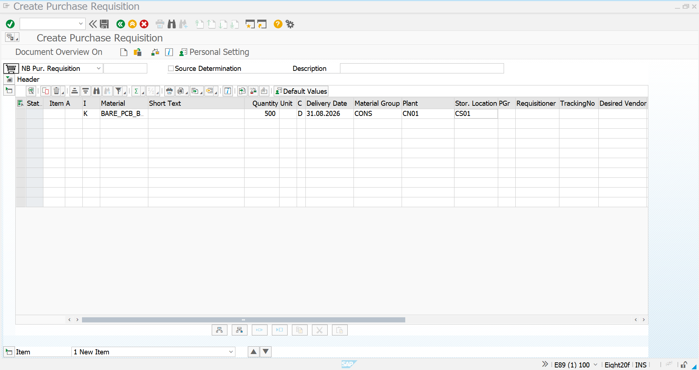
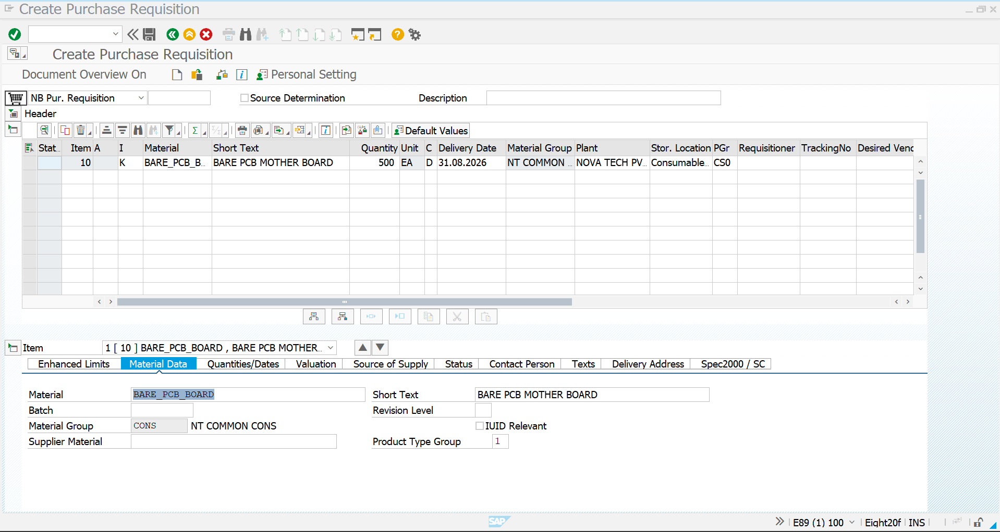
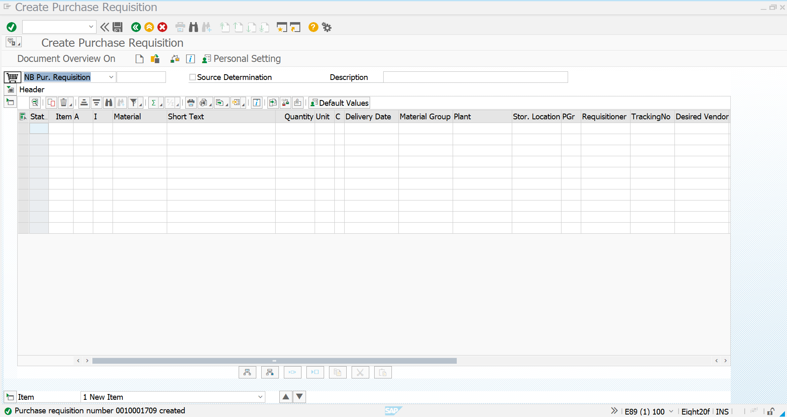

# Consignment Purchase Requisition

## Overview

The Purchase Requisition (PR) is created to formally request the required quantity of material through the **Consignment Procurement** process.

In this scenario, the company requires **Bare PCB Mother Board** material from **JUSDA Corporations Pvt Ltd**, which maintains the material as consignment stock.

The PR is created with **Item Category K (Consignment)** so that the requested material is treated as consignment material in the subsequent Purchase Order and Goods Receipt process.

---

## SAP Transaction

```text
ME51N – Create Purchase Requisition
```

### Procurement Type

```text
Consignment Procurement
```

### Item Category

```text
K – Consignment
```

---

# 1. Create Purchase Requisition – Initial Screen

Execute transaction:

```text
ME51N
```

The **Create Purchase Requisition** screen is opened.

Select the appropriate requisition document type:

```text
NB – Purchase Requisition
```

The initial screen provides the structure for entering the material requirement.

### Screenshot



---

# 2. Enter PR Item Details

Enter the required material and procurement information in the item overview.

For this implementation, the PR is created for:

| Field | Value |
|---|---|
| Material | `BARE_PCB_BOARD` |
| Short Text | `BARE PCB MOTHER BOARD` |
| Item Category | `K – Consignment` |
| Quantity | `500 EA` |
| Delivery Date | `31.08.2026` |
| Material Group | `CONS` |
| Plant | `CN01` |
| Purchasing Group | `CS01` |
| Storage Location | As applicable |

The **K item category** is the key requirement for this scenario because the material is being procured as consignment stock rather than as immediately company-owned stock.

### Screenshot



---

# 3. Maintain Material Data

Select the PR item and review the item-level material information.

The Material Data section confirms the material maintained in the requisition.

### Material Details

```text
Material:
BARE_PCB_BOARD

Description:
BARE PCB MOTHER BOARD

Material Group:
CONS
```

The material is linked to the Consignment procurement requirement.

The PR item remains classified with:

```text
Item Category: K – Consignment
```

This ensures that the subsequent purchasing document follows the consignment procurement process.

---

# 4. Review Quantities and Dates

Review the requested quantity and delivery date before saving the PR.

### Requirement

```text
Quantity: 500 EA
Delivery Date: 31.08.2026
```

The requested quantity represents the quantity that the business requires from the consignment supplier.

The delivery date represents the required availability date for the material.

---

# 5. Save the Purchase Requisition

After entering and validating the required information, save the Purchase Requisition.

SAP generates the Purchase Requisition number.

### Created PR

```text
Purchase Requisition: 0010001709
```

The system confirms successful creation of the Purchase Requisition.

### Screenshot



---

# 6. Purchase Requisition Result

The Consignment Purchase Requisition has been successfully created for the Bare PCB Mother Board.

### PR Summary

| Parameter | Value |
|---|---|
| PR Number | `0010001709` |
| Material | `BARE_PCB_BOARD` |
| Description | BARE PCB MOTHER BOARD |
| Item Category | `K – Consignment` |
| Quantity | `500 EA` |
| Delivery Date | `31.08.2026` |
| Material Group | `CONS` |
| Plant | `CN01` |
| Purchasing Group | `CS01` |

---

# Consignment Procurement Flow

The Purchase Requisition is the next step after the Consignment Purchasing Info Record.

```text
Material Master
       │
       ▼
Vendor Master
       │
       ▼
Consignment PIR
       │
       ▼
Consignment PR
       │
       │
       │  ME51N
       ▼
Consignment PO
       │
       │  ME21N
       ▼
Goods Receipt
       │
       │  MIGO
       ▼
Consignment Stock
       │
       ▼
411 K Transfer Posting
       │
       ▼
Company-Owned Stock
       │
       ▼
MMBE Stock Verification
       │
       ▼
MRM1 / MRKO
       │
       ▼
Vendor Settlement
```

---

# Business Purpose

The Consignment Purchase Requisition provides the formal internal requirement for material that will be obtained through the company's consignment arrangement.

Unlike a standard PR, the item is created with:

```text
K – Consignment
```

This distinguishes the requirement from normal direct procurement.

The material remains supplier-owned while it is held as consignment stock. The company becomes financially responsible for the material when the required quantity is transferred from consignment stock into company-owned stock.

---

# Key SAP MM Concepts Demonstrated

This activity demonstrates:

- Creation of a Purchase Requisition using `ME51N`
- Consignment procurement using **Item Category K**
- Material-based PR creation
- Quantity and delivery-date management
- Plant and purchasing group assignment
- Integration with the Consignment Purchasing Info Record
- Preparation of the requirement for the Consignment Purchase Order
- Understanding of the transition from PR → PO → MIGO → 411 K → Settlement

---

# Integration with Previous Step

The Consignment PIR created in the previous step provides the supplier-material purchasing relationship:

```text
Supplier:
7000010015 – JUSDA CORPORATIONS PVT LTD

Material:
BARE_PCB_BOARD

Purchasing Organization:
POR1

Plant:
CN01

Info Category:
Consignment
```

The PR now converts the business requirement into an SAP purchasing document.

```text
Consignment PIR
       │
       ▼
Consignment PR
0010001709
       │
       ▼
Consignment PO
```

---

## Conclusion

The Consignment Purchase Requisition has been successfully created for **500 EA of Bare PCB Mother Board** using **Item Category K – Consignment**.

This completes the **Purchase Requisition stage** of the Consignment Procurement scenario.

The next step is to create the **Consignment Purchase Order (ME21N)** with the appropriate consignment item category and supplier.