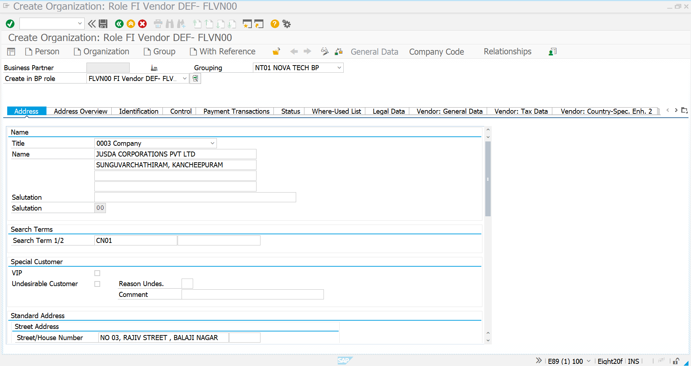
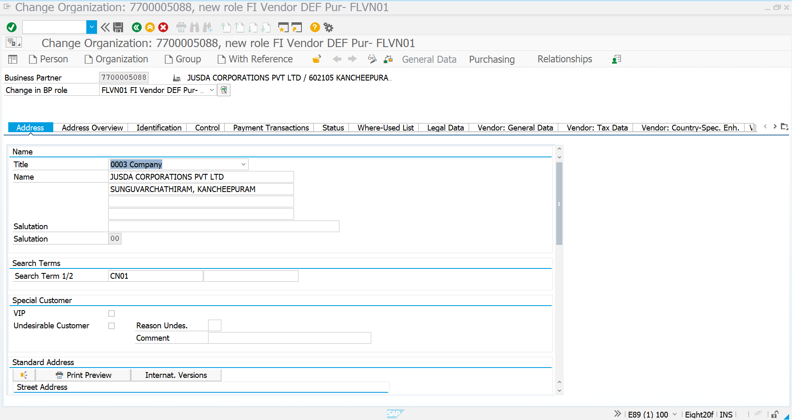
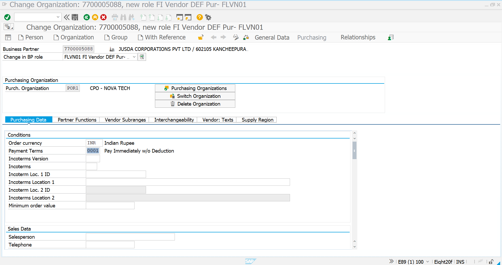
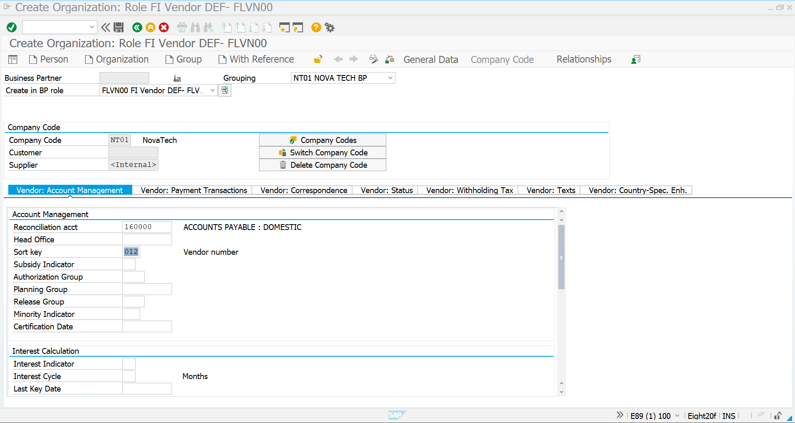
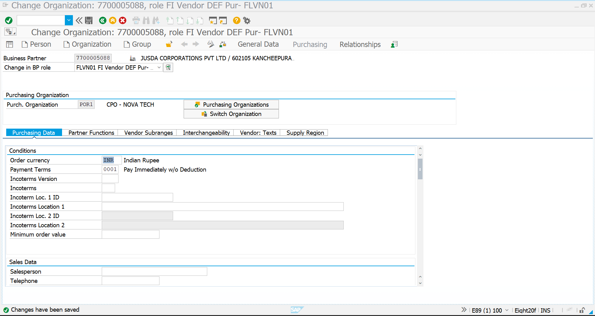
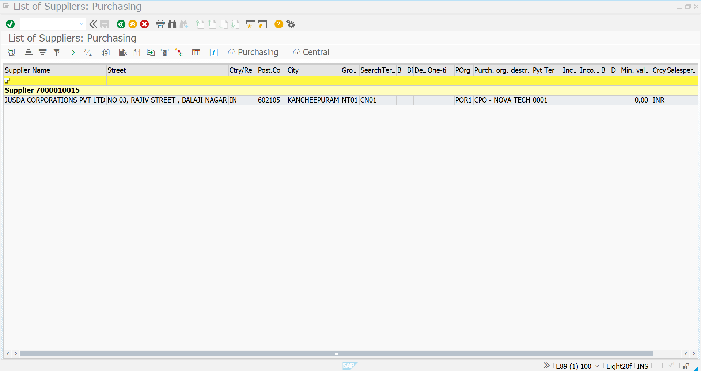

# Vendor Master Creation – Consignment Procurement

## Overview

The Vendor Master is a key master-data component of the Consignment Procurement process. It contains the supplier identification, general, purchasing, accounting, and payment information required to manage the vendor throughout the procurement lifecycle.

For this scenario, **JUSDA CORPORATIONS PVT LTD** is created as a third-party vendor. JUSDA maintains raw materials in bulk and provides the required materials when the company's regular procurement shipment is delayed and an urgent material requirement arises.

The vendor is created and maintained using the **Business Partner (BP)** approach in SAP S/4HANA.

---

## Transaction Code

```text
BP
```

---

## Vendor Details

| Field                    | Value                                  |
| ------------------------ | -------------------------------------- |
| Vendor Name              | JUSDA CORPORATIONS PVT LTD             |
| Business Partner         | 7700005088                             |
| Supplier Number          | 7000010015                             |
| Company Code             | NT01                                   |
| Purchasing Organization  | POR1 – CPO - NOVA TECH                 |
| Currency                 | INR                                    |
| Payment Terms            | 0001 – Pay Immediately w/o Deduction   |
| Reconciliation Account   | 160000 – ACCOUNTS PAYABLE : DOMESTIC   |
| Sort Key                 | 012 – Vendor Number                    |
| Search Term              | CN01                                   |

> JUSDA is created as the third-party vendor for the Consignment Procurement scenario.

---

# Step 1 – Business Partner Initial Screen

Execute transaction:

```text
BP
```

Create the Business Partner as an **Organization** and maintain the required Business Partner grouping and supplier roles.

### Business Partner Grouping

```text
NT01 NOVA TECH BP
```

### Supplier Roles

- FLVN00 – FI Vendor
- FLVN01 – Purchasing Vendor

Enter the required organization and Business Partner information.

### Screenshot



---

# Step 2 – Basic Vendor Data

Maintain the general information of the supplier.

### Information Maintained

- Organization Name
- Address
- Search Term
- Country / Region
- General Business Partner information

The supplier is maintained as:

```text
JUSDA CORPORATIONS PVT LTD
```

The required address and general vendor information are maintained in the Business Partner master.

### Screenshot



---

# Step 3 – Company Code / Finance Data

Extend the Business Partner to the required company code and maintain the vendor accounting information.

### Company Code

```text
NT01 – NovaTech
```

### Finance Information

| Field                    | Value                                |
| ------------------------ | ------------------------------------ |
| Company Code             | NT01                                 |
| Reconciliation Account   | 160000                               |
| Account Description      | ACCOUNTS PAYABLE : DOMESTIC          |
| Sort Key                 | 012 – Vendor Number                  |

The reconciliation account enables vendor transactions to be integrated with Financial Accounting.

### Screenshot



---

# Step 4 – Purchasing Organization Data

Extend the supplier to the required purchasing organization and maintain the purchasing-related information.

### Purchasing Organization

```text
POR1 – CPO - NOVA TECH
```

### Purchasing Information

| Field                    | Value                                |
| ------------------------ | ------------------------------------ |
| Purchasing Organization  | POR1                                 |
| Order Currency           | INR                                  |
| Payment Terms            | 0001                                 |
| Payment Terms Description| Pay Immediately w/o Deduction        |

The supplier is now available for purchasing transactions under the required purchasing organization.

### Screenshot



---

# Step 5 – Vendor Created Successfully

After maintaining the required Business Partner, company code, and purchasing organization data, save the Business Partner.

SAP successfully creates the vendor master record.

The created Business Partner is:

```text
7700005088
```

The corresponding supplier number is:

```text
7000010015
```

### Screenshot



---

# Step 6 – Vendor Verification

Verify the created vendor and confirm that the required supplier information is available.

The vendor record is verified after creation to ensure that the supplier can be used in the subsequent Consignment Procurement process.

### Screenshot



---

# Process Flow

```text
BP
 │
 ▼
Business Partner Creation
 │
 ▼
Basic Vendor Data
 │
 ▼
Company Code Extension
 │
 ▼
Finance Data
 │
 ▼
Purchasing Organization Extension
 │
 ▼
Purchasing Data
 │
 ▼
Vendor Created
 │
 ▼
Vendor Verification
 │
 ▼
Ready for Consignment Procurement
```

---

# Consignment Process Integration

The created JUSDA vendor will be used in the subsequent Consignment Procurement process:

```text
Material Master
      │
      ▼
Vendor Master
      │
      ▼
Consignment Purchasing Info Record
      │
      ▼
Purchase Requisition
      │
      ▼
Consignment Purchase Order
(Item Category K)
      │
      ▼
MIGO – Goods Receipt
      │
      ▼
Vendor Consignment Stock
      │
      ▼
MIGO – 411 K
      │
      ▼
Company-Owned Stock
      │
      ▼
MMBE – Stock Verification
      │
      ▼
MRM1
      │
      ▼
MRKO – Vendor Settlement
```

---

# Business Outcome

The **JUSDA Vendor Master** has been successfully created and prepared for the Consignment Procurement process.

The vendor is now ready for:

- Consignment Info Record creation
- Purchase Requisition
- Consignment Purchase Order
- Goods Receipt
- Consignment Stock Management
- Transfer Posting to Own Stock
- Stock Verification
- Vendor Settlement

---

# Key Learning

- Created a supplier using **Business Partner (BP)**
- Maintained general vendor master data
- Maintained supplier roles for FI and Purchasing
- Extended the vendor to company code **NT01**
- Maintained vendor accounting information
- Maintained the reconciliation account
- Extended the vendor to purchasing organization **POR1**
- Maintained purchasing currency and payment terms
- Created and verified the JUSDA supplier
- Prepared the vendor for the subsequent **Consignment Procurement** process