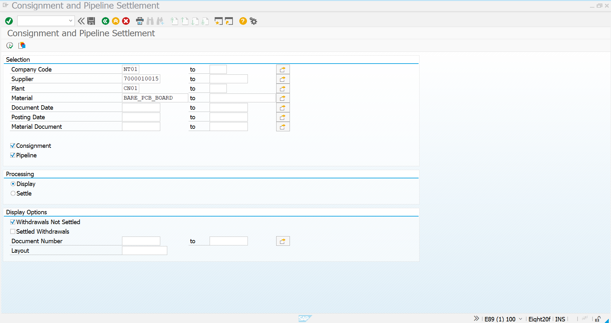
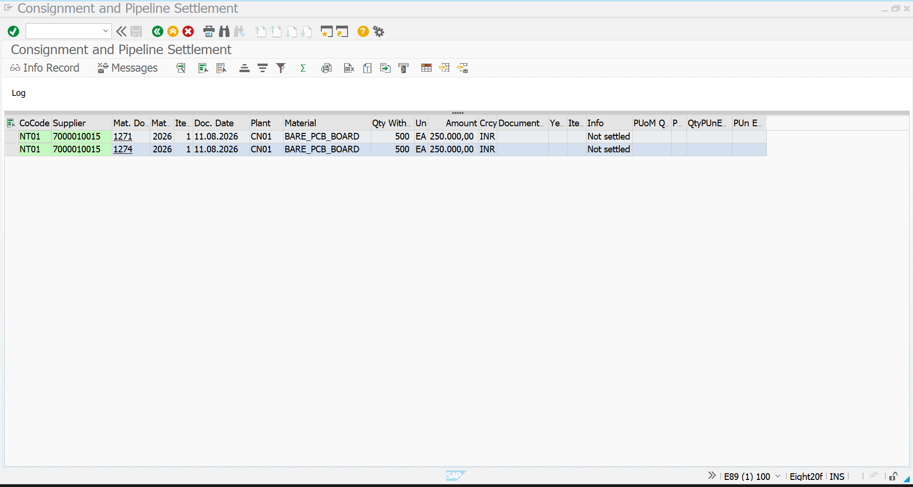
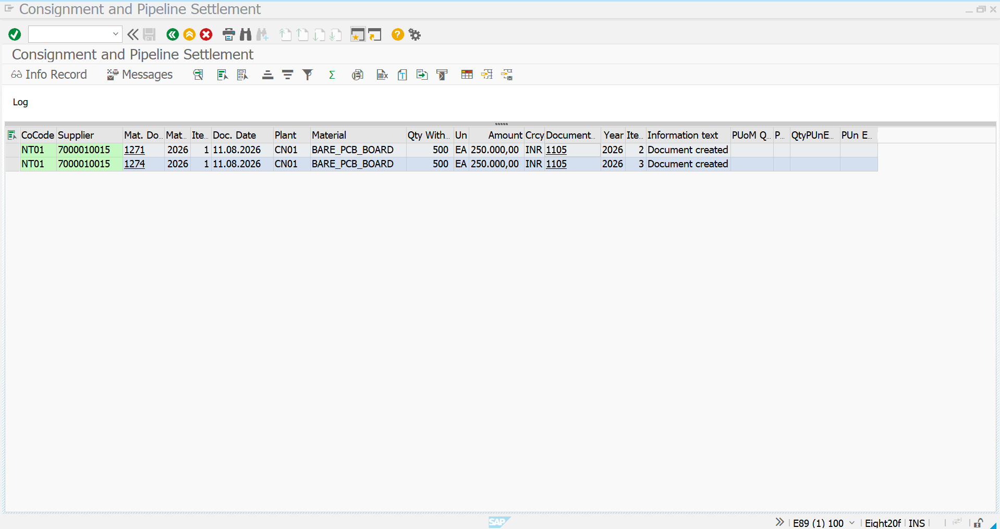

# Consignment Vendor Settlement – MRKO

## Overview

This stage demonstrates the **Vendor Settlement** process in the **Consignment Procurement** cycle using the SAP transaction:

```text
MRKO
```

In the previous stage, the material was received from the supplier as **consignment stock** using Movement Type `101`.

The material initially remained **supplier-owned**.

When the company required the material for its own consumption, the stock was transferred from supplier consignment stock to company-owned stock using:

```text
411 K
```

After the `411 K` transfer, the relevant consignment withdrawals become eligible for **vendor settlement**.

The vendor settlement is processed using:

```text
MRKO – Consignment and Pipeline Settlement
```

---

## Process Flow

```text
Consignment Purchase Order
        ↓
MIGO – Goods Receipt 101
        ↓
Supplier Consignment Stock
        ↓
411 K Transfer Posting
        ↓
Company-Owned Stock
        ↓
Consignment Withdrawal
        ↓
MRKO – Consignment Settlement
        ↓
Unsettled Consignment Items
        ↓
Settlement Processing
        ↓
Settlement Document Created
        ↓
Vendor Settlement Completed
```

---

# 1. Prerequisite – Consignment Stock Transfer

Before performing the vendor settlement, the consignment material must have been withdrawn from supplier-owned consignment stock.

In the previous process, the material was transferred using:

```text
Movement Type: 411 K
```

### Movement Type

```text
411 K
```

### Meaning

```text
Consignment Stock → Own Stock
```

The `411 K` movement represents the point at which the company takes ownership of the consignment material.

The corresponding consignment withdrawal becomes relevant for vendor settlement.

The overall ownership movement is:

```text
Supplier-Owned Consignment
        ↓
411 K Transfer
        ↓
Company-Owned Stock
        ↓
Vendor Settlement
```

---

# 2. MRKO – Consignment and Pipeline Settlement

Execute the SAP transaction:

```text
MRKO
```

MRKO is used to process the settlement of **consignment and pipeline withdrawals**.

The transaction provides selection criteria that allow the user to identify the relevant consignment transactions for settlement.

---

# 3. MRKO – Initial Selection Screen

The MRKO initial screen provides the selection criteria required to identify the relevant consignment transactions.

The selection screen contains fields such as:

- Company Code
- Supplier
- Plant
- Material
- Document Date
- Posting Date
- Material Document
- Consignment
- Pipeline
- Processing option
- Withdrawal settlement status

For this implementation, the relevant values are:

| Field | Value |
|---|---|
| Company Code | `NT01` |
| Supplier | `7000010015` |
| Plant | `CN01` |
| Material | `BARE_PCB_BOARD` |
| Consignment | Selected |
| Pipeline | Selected |
| Processing | Display |
| Withdrawals Not Settled | Selected |

The supplier code used for the settlement selection is:

```text
7000010015
```

The plant is:

```text
CN01
```

The material is:

```text
BARE_PCB_BOARD
```

The **Withdrawals Not Settled** option is selected so that SAP displays the consignment withdrawals that have not yet been settled with the supplier.

### MRKO Initial Selection

The following screenshot shows the MRKO **Consignment and Pipeline Settlement** selection screen with the relevant company code, supplier, plant and material entered.



---

# 4. Selection Criteria

The selection criteria are used to identify the consignment withdrawals that are ready for settlement.

The important selection values are:

```text
Company Code:
NT01
```

```text
Supplier:
7000010015
```

```text
Plant:
CN01
```

```text
Material:
BARE_PCB_BOARD
```

The processing option is initially:

```text
Display
```

and:

```text
Withdrawals Not Settled
```

is selected.

This allows SAP to display the relevant unsettled consignment withdrawals before settlement is executed.

The selection process provides visibility into the transactions that will be included in the vendor settlement.

---

# 5. Execute MRKO – Display Unsettled Withdrawals

After entering the required selection criteria, execute the MRKO transaction.

SAP displays the consignment withdrawal records matching the selection criteria.

The result screen provides information such as:

- Company Code
- Supplier
- Material Document
- Material
- Item
- Document Date
- Plant
- Material
- Withdrawal Quantity
- Unit
- Amount
- Currency
- Settlement status

---

# 6. MRKO – Settlement Items

The MRKO result screen shows the consignment withdrawal items that are currently **Not settled**.

In this implementation, the displayed records include:

```text
Company Code:
NT01
```

```text
Supplier:
7000010015
```

```text
Plant:
CN01
```

```text
Material:
BARE_PCB_BOARD
```

The displayed withdrawal quantity is:

```text
500 EA
```

The amount shown for the withdrawal is:

```text
250,000.00 INR
```

The screen also shows the corresponding material documents, including:

```text
1271
```

and:

```text
1274
```

The information text shows:

```text
Not settled
```

This confirms that these consignment withdrawals are available for vendor settlement.

### MRKO Settlement Items



---

# 7. Understanding the Settlement Items

The MRKO settlement list provides the link between the consignment withdrawal and the supplier settlement.

The settlement-relevant information can be summarized as:

| Field | Value |
|---|---|
| Company Code | `NT01` |
| Supplier | `7000010015` |
| Plant | `CN01` |
| Material | `BARE_PCB_BOARD` |
| Withdrawal Quantity | `500 EA` |
| Amount | `250,000.00 INR` |
| Currency | `INR` |
| Settlement Status | `Not settled` |
| Material Documents | `1271`, `1274` |

The presence of the **Not settled** status indicates that the vendor has not yet been settled for these consignment withdrawals.

---

# 8. Settlement Processing

After reviewing the displayed consignment withdrawal items, the processing option can be changed from:

```text
Display
```

to:

```text
Settle
```

The settlement process instructs SAP to create the appropriate settlement document for the selected consignment withdrawals.

The relevant withdrawals are processed for settlement with the supplier.

The system creates the corresponding settlement document.

---

# 9. Vendor Settlement Posting

The settlement is posted after reviewing the relevant withdrawal records.

SAP processes the selected consignment withdrawals and creates a settlement document.

The settlement represents the financial settlement between the company and the supplier for the material that was withdrawn from consignment stock.

The important business relationship is:

```text
Material Withdrawn
        ↓
Company Takes Ownership
        ↓
Consignment Withdrawal Recorded
        ↓
MRKO Settlement
        ↓
Supplier Settlement
```

---

# 10. MRKO – Settlement Successfully Posted

After the settlement is processed, SAP updates the settlement information.

The previous:

```text
Not settled
```

status is replaced with settlement information.

The result screen shows:

```text
Document created
```

and the settlement document number:

```text
1105
```

The settlement result also shows the relevant material, quantity and amount.

### Settlement Details

| Field | Value |
|---|---|
| Company Code | `NT01` |
| Supplier | `7000010015` |
| Plant | `CN01` |
| Material | `BARE_PCB_BOARD` |
| Quantity | `500 EA` |
| Amount | `250,000.00 INR` |
| Settlement Document | `1105` |
| Information Text | `Document created` |

### MRKO Settlement Posted

The following screenshot confirms that the settlement has been successfully processed and the settlement document has been created.



---

# 11. Settlement Document

The successful MRKO processing creates a settlement document.

In this implementation, the settlement document generated is:

```text
1105
```

The MRKO result screen displays:

```text
Document created
```

This provides evidence that the consignment vendor settlement was successfully processed.

The settlement document connects the consignment withdrawal to the supplier settlement process.

---

# 12. Business Flow

The complete business flow demonstrated in this stage is:

```text
Supplier Provides Material
        ↓
Material Received as Consignment
        ↓
Supplier-Owned Stock
        ↓
411 K Transfer Posting
        ↓
Company-Owned Stock
        ↓
Consignment Withdrawal
        ↓
MRKO
        ↓
Unsettled Withdrawal Identified
        ↓
Settlement Processing
        ↓
Settlement Document 1105
        ↓
Vendor Settlement Completed
```

---

# 13. Consignment Ownership and Settlement

Consignment procurement separates the physical receipt of material from the financial settlement with the supplier.

### Goods Receipt

The material is physically received using:

```text
101
```

However:

```text
Ownership = Supplier
```

### Transfer to Own Stock

When the company requires the material:

```text
411 K
```

is used.

Therefore:

```text
Ownership = Company
```

### Vendor Settlement

The supplier settlement is subsequently processed through:

```text
MRKO
```

Therefore:

```text
Consignment Withdrawal
        ↓
MRKO
        ↓
Vendor Settlement
```

---

# 14. Stock and Financial Movement

The complete process can be represented as:

```text
                    PHYSICAL MOVEMENT

Supplier
   │
   │ 101 Goods Receipt
   ▼
Company Location
   │
   │ Supplier-Owned
   ▼
Consignment Stock
   │
   │ 411 K
   ▼
Company-Owned Stock


                    FINANCIAL SETTLEMENT

Consignment Withdrawal
        │
        ▼
MRKO
        │
        ▼
Settlement Document
        │
        ▼
Vendor Settlement
```

The physical receipt and financial settlement are therefore handled as separate stages of the consignment procurement process.

---

# 15. Consignment Settlement Summary

| Stage | SAP Transaction | Status |
|---|---|---|
| Consignment PO | ME21N / Purchase Order | Created |
| Goods Receipt | MIGO / `101` | Material Received |
| Consignment Stock | MMBE | Supplier-Owned |
| Ownership Transfer | MIGO / `411 K` | Company-Owned |
| Settlement Selection | MRKO | Unsettled Withdrawals |
| Settlement Processing | MRKO | Settlement Executed |
| Settlement Document | MRKO | `1105` Created |
| Vendor Settlement | MRKO | Completed |

---

# 16. Key SAP MM Transactions

| Transaction | Purpose |
|---|---|
| `MIGO` | Goods Receipt and Stock Transfer |
| `MMBE` | Stock Overview |
| `411 K` | Transfer Consignment Stock to Own Stock |
| `MRKO` | Consignment and Pipeline Settlement |

---

# 17. Important Data Used in This Implementation

### Company Code

```text
NT01
```

### Supplier

```text
7000010015
```

### Plant

```text
CN01
```

### Material

```text
BARE_PCB_BOARD
```

### Quantity

```text
500 EA
```

### Amount

```text
250,000.00 INR
```

### Material Documents

```text
1271
1274
```

### Settlement Document

```text
1105
```

---

# 18. Complete Consignment Procurement Process

The complete Consignment Procurement process demonstrated in this project is:

```text
Material Creation
        ↓
Vendor Master
        ↓
Consignment PIR
        ↓
Consignment PR
        ↓
Consignment PO
        ↓
MIGO – Goods Receipt 101
        ↓
Supplier Consignment Stock
        ↓
MMBE – Stock Verification
        ↓
MIGO – Transfer Posting 411 K
        ↓
Consignment Stock → Own Stock
        ↓
MMBE – Final Stock Verification
        ↓
Unrestricted-Use Stock
        ↓
MRKO – Consignment Settlement
        ↓
Unsettled Withdrawals
        ↓
Settlement Processing
        ↓
Settlement Document Created
        ↓
Vendor Settlement Completed
```

---

# 19. Business Significance

Consignment procurement allows the company to physically hold supplier-owned inventory without immediately purchasing the material.

The company becomes responsible for the material when it is withdrawn from consignment stock.

The settlement process ensures that the supplier is financially settled for the material withdrawn by the company.

In this implementation:

```text
Supplier:
7000010015

Material:
BARE_PCB_BOARD

Quantity:
500 EA

Plant:
CN01

Company Code:
NT01

Settlement Amount:
250,000.00 INR

Settlement Document:
1105
```

The process provides visibility into:

- Supplier-owned inventory
- Company-owned inventory
- Consignment withdrawals
- Settlement-relevant quantities
- Settlement amounts
- Vendor settlement documents
- Financial settlement status

---

# 20. Result

The Consignment Vendor Settlement process has been successfully demonstrated using **MRKO**.

The process begins with the identification of unsettled consignment withdrawals.

The relevant withdrawal records are displayed in MRKO with:

```text
500 EA
```

and:

```text
250,000.00 INR
```

The settlement is then processed and SAP creates settlement document:

```text
1105
```

The final MRKO result shows:

```text
Document created
```

confirming that the vendor settlement has been successfully completed.

The complete settlement flow is:

```text
411 K Transfer
        ↓
Consignment Withdrawal
        ↓
MRKO
        ↓
Unsettled Withdrawal
        ↓
Settlement Processing
        ↓
Settlement Document 1105
        ↓
Vendor Settlement Completed
```

This completes the **Consignment Procurement** process from Purchase Order creation through Goods Receipt, stock ownership transfer and final vendor settlement.

---

## Final Consignment Procurement Flow

```text
Consignment Purchase Order
        ↓
MIGO – Goods Receipt 101
        ↓
Supplier Consignment Stock
        ↓
MMBE – Stock Verification
        ↓
MIGO – Transfer Posting 411 K
        ↓
Company-Owned Unrestricted Stock
        ↓
MRKO – Consignment Settlement
        ↓
Unsettled Withdrawals
        ↓
Settlement Processing
        ↓
Settlement Document 1105
        ↓
Vendor Settlement Completed
```
