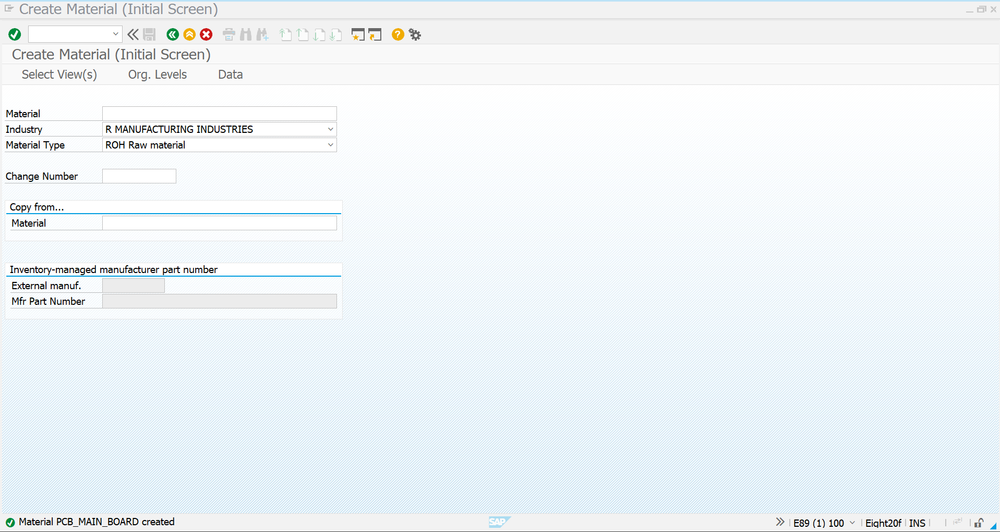
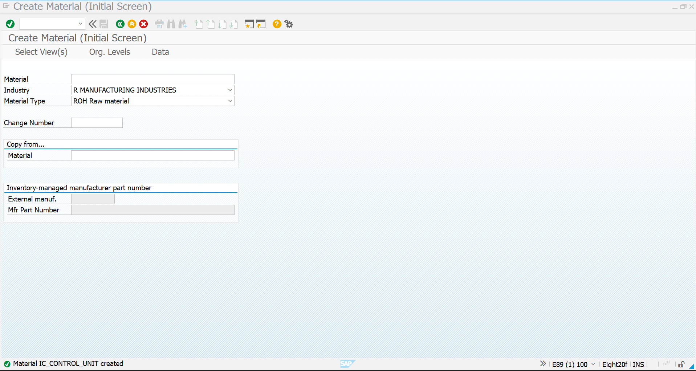
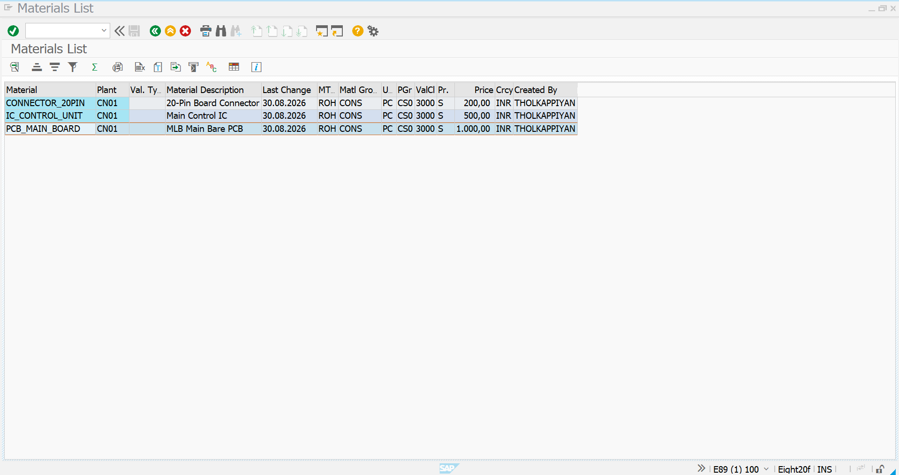
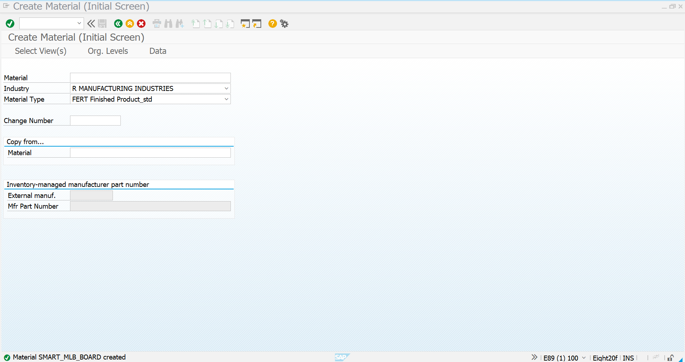
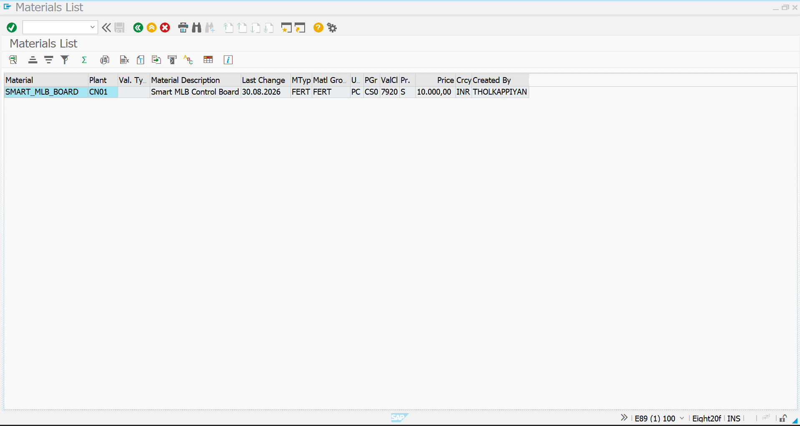
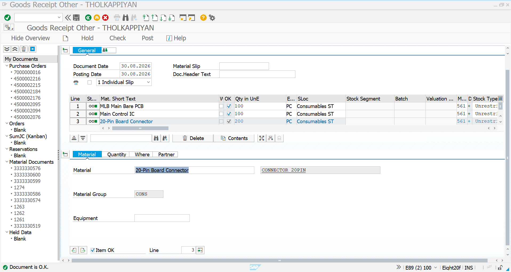
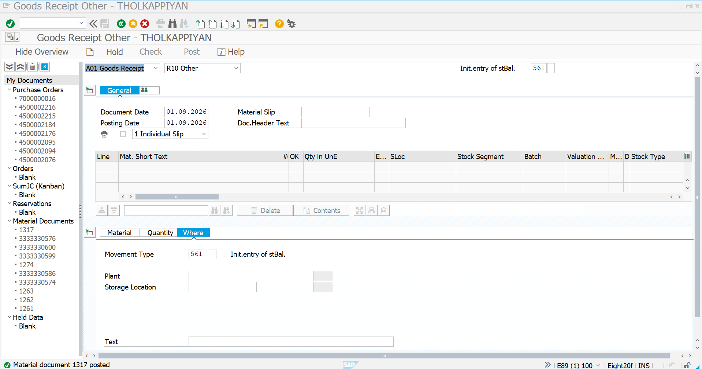

# 01 - Material and Initial Stock

## 1. Process Overview

The first step in the Novatech subcontracting process is to prepare the required raw materials and finished product material in SAP.

For this project scenario, Novatech requires three raw materials to manufacture the Smart MLB Control Board:

| Material | Material Type | Description |
|---|---|---|
| `PCB_MAIN_BOARD` | ROH | MLB Main Bare PCB |
| `IC_CONTROL_UNIT` | ROH | Main Control IC |
| `CONNECTOR_20PIN` | ROH | 20-Pin Board Connector |
| `SMART_MLB_BOARD` | FERT | Smart MLB Control Board |

The raw materials are assumed to already be physically available in the Novatech warehouse. Therefore, for this project demonstration, the existing stock is entered into SAP using **MIGO with Movement Type 561**.

---

## 2. Create Raw Materials

Three raw materials are created for the subcontracting process.

### PCB Main Board

- **Material:** `PCB_MAIN_BOARD`
- **Material Type:** ROH – Raw Material
- **Description:** MLB Main Bare PCB



### IC Control Unit

- **Material:** `IC_CONTROL_UNIT`
- **Material Type:** ROH – Raw Material
- **Description:** Main Control IC



### 20-Pin Board Connector

- **Material:** `CONNECTOR_20PIN`
- **Material Type:** ROH – Raw Material
- **Description:** 20-Pin Board Connector


---

## 3. Verify Raw Materials

After creating the raw materials, the material list is checked to confirm that all three components have been successfully created.

The following materials are available:

- `PCB_MAIN_BOARD`
- `IC_CONTROL_UNIT`
- `CONNECTOR_20PIN`

These materials will later be used as components in the **BOM of the finished product**.



---

## 4. Create Finished Product

The finished product for the Novatech subcontracting scenario is created as a **FERT – Finished Product**.

- **Material:** `SMART_MLB_BOARD`
- **Material Type:** FERT – Finished Product
- **Description:** Smart MLB Control Board

This material represents the completed Smart MLB Control Board that will be received from the subcontractor after the subcontracting activities are completed.



---

## 5. Verify Finished Product

After creation, the FERT material is verified in SAP.

The finished product is maintained as:

| Field | Value |
|---|---|
| Material | `SMART_MLB_BOARD` |
| Material Type | FERT |
| Description | Smart MLB Control Board |
| Plant | `CN01` |
| Base Unit | PC |

This confirms that the finished product material is available for the subsequent subcontracting process.



---

## 6. Enter Initial Stock Using MIGO

### Business Scenario

In a real Novatech business environment, the raw materials would normally be purchased from suppliers and received through the standard procurement process:

```text
Purchase Requisition
        ↓
Purchase Order
        ↓
Goods Receipt
        ↓
Warehouse Stock
```

For this project, we assume that the required raw materials are **already physically available in the Novatech warehouse**.

Therefore, instead of creating a purchase order for the initial stock, the existing warehouse stock is entered into SAP using **MIGO**.

### Movement Type

The initial stock is entered using:

**Movement Type: 561 – Initial Entry of Stock**

### MIGO Process

```text
MIGO
  ↓
Goods Receipt
  ↓
Other
  ↓
Movement Type 561
```

Example initial stock:

| Material | Quantity | Unit | Movement Type |
|---|---:|---|---:|
| `PCB_MAIN_BOARD` | 100 | PC | 561 |
| `IC_CONTROL_UNIT` | 100 | PC | 561 |
| `CONNECTOR_20PIN` | 200 | PC | 561 |

The materials are entered against the appropriate Novatech plant and storage location.



---

## 7. Post Initial Stock

After entering the materials, quantities, plant, storage location and Movement Type `561`, the MIGO document is checked and posted.

Once successfully posted:

- SAP creates a material document.
- The inventory quantity is updated.
- The raw materials become available in SAP stock.
- The materials are ready to be provided to the subcontractor.

The initial stock therefore becomes the component stock that will be used in the next stages of the subcontracting process.

### MIGO with Movement Type 561


### Successful Stock Posting



---

## 8. Process Completion

At the end of this activity, the material master data and initial component stock required for the Novatech subcontracting process are ready.

### Completed Activities

1. Created `PCB_MAIN_BOARD` as a raw material.
2. Created `IC_CONTROL_UNIT` as a raw material.
3. Created `CONNECTOR_20PIN` as a raw material.
4. Verified the raw materials.
5. Created `SMART_MLB_BOARD` as a FERT finished product.
6. Verified the finished product.
7. Entered the assumed existing warehouse stock using MIGO.
8. Used Movement Type `561`.
9. Successfully posted the initial stock.

### Overall Process Flow

```text
Create Raw Materials
        ↓
PCB_MAIN_BOARD
IC_CONTROL_UNIT
CONNECTOR_20PIN
        ↓
Create Finished Product
        ↓
SMART_MLB_BOARD
        ↓
Raw Materials Already Available
in Novatech Warehouse
        ↓
MIGO
        ↓
Movement Type 561
        ↓
Initial Stock Posted
        ↓
Raw Material Stock Available
        ↓
Ready for Subcontracting
```

---

## Screenshot Summary

| No. | Screenshot | Purpose |
|---:|---|---|
| 1 | `Raw-Materials-Creation-PCB_MAIN_BOARD.png` | PCB raw material creation |
| 2 | `Raw-Materials-Creation-IC_CONTROL_UNIT.png` | IC raw material creation |
| 3 | `Raw-Materials-Creation-CONNECTOR_20PIN.png` | Connector raw material creation |
| 4 | `Raw-Materials-List.png` | Verification of raw materials |
| 5 | `FERT-Material-Creation-SMART_MLB_BOARD.png` | Finished product creation |
| 6 | `Display-of-FERT-Material.png` | Verification of finished product |
| 7 | `Initial-Stock-Entry.png` | MIGO initial stock entry |
| 8 | `Initial-Stock-Posted.png` | Successful stock posting |

---

