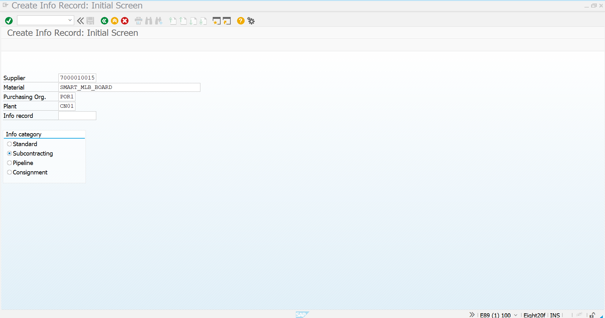
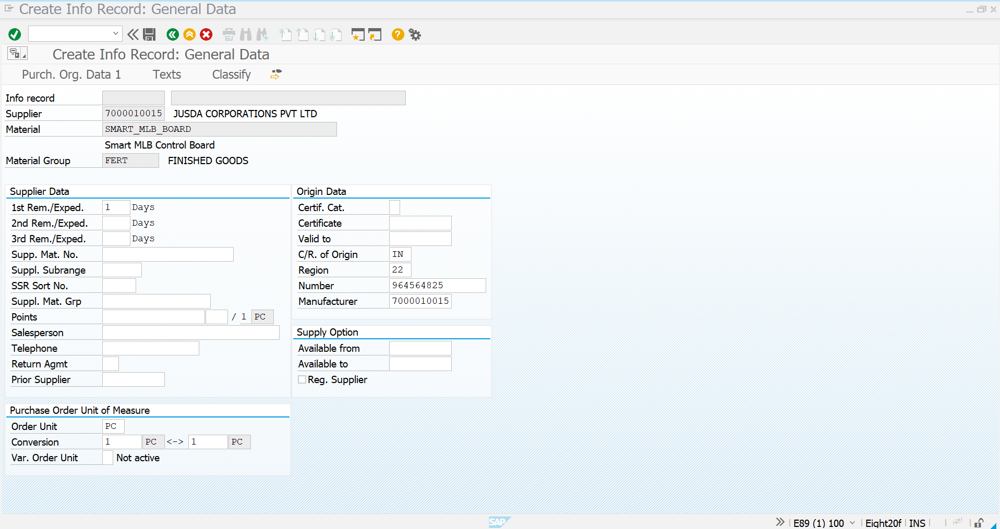
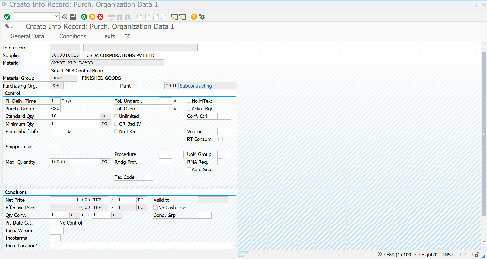
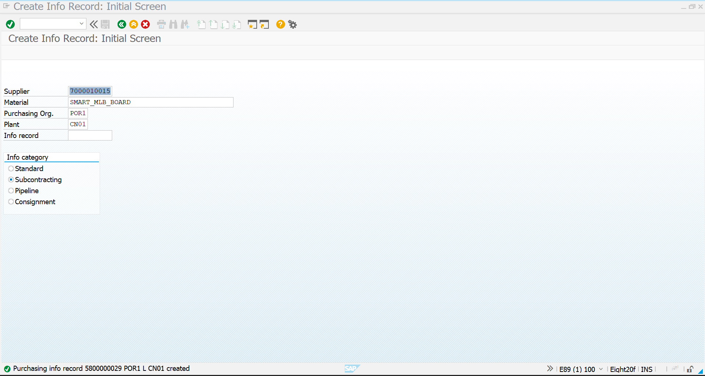

# 02 - Purchase Info Record - Subcontracting

## 1. Process Overview

After completing the material creation and initial stock preparation, the next step in the Novatech subcontracting process is to create a **Purchase Info Record** for the finished product.

The Purchase Info Record establishes the purchasing relationship between Novatech and the subcontractor for the finished Smart MLB Control Board.

For this project scenario, Novatech uses **JUSDA CORPORATIONS PVT LTD** as the subcontracting supplier.

| Field | Value |
|---|---|
| Supplier | `7000010015` – JUSDA CORPORATIONS PVT LTD |
| Material | `SMART_MLB_BOARD` |
| Material Description | Smart MLB Control Board |
| Purchasing Organization | `POR1` |
| Plant | `CN01` |
| Info Category | Subcontracting |
| Material Group | `FERT` – FINISHED GOODS |
| Purchasing Group | `CS0` |
| Planned Delivery Time | 1 Day |
| Standard Quantity | 10 PC |
| Minimum Quantity | 1 PC |
| Maximum Quantity | 10,000 PC |
| Net Price | 15,000 INR / PC |

The Purchase Info Record is created using transaction **`ME11`**.

---

## 2. ME11 - Initial Screen

### Transaction Code

`ME11`

### Process

Start transaction `ME11` to create a new Purchase Info Record.

Enter the required purchasing information:

- **Supplier:** `7000010015`
- **Material:** `SMART_MLB_BOARD`
- **Purchasing Organization:** `POR1`
- **Plant:** `CN01`

Select **Subcontracting** as the Info Category.

The Subcontracting category is selected because Novatech will provide the required components to the subcontractor and receive the completed `SMART_MLB_BOARD` after the subcontracting activity.

### Screenshot



---

## 3. Select Subcontracting Info Category

The **Info Category** determines the type of purchasing relationship being maintained between the supplier and the material.

For this implementation, **Subcontracting** is selected.

The purchasing relationship can be represented as:

```text
Novatech
    ↓
Subcontracting Requirement
    ↓
Supplier
7000010015
    ↓
JUSDA CORPORATIONS PVT LTD
    ↓
SMART_MLB_BOARD
    ↓
Subcontracting Info Record
```

After selecting the Subcontracting category and continuing, SAP displays the relevant Purchase Info Record data screen.

The supplier and finished product are therefore connected through a subcontracting purchasing relationship.

### Screenshot



---

## 4. Maintain Purchase Info Record Data

The Purchase Info Record data screen contains the supplier-specific purchasing information for the finished product.

For the Novatech subcontracting scenario, the following information is maintained:

| Field | Value |
|---|---|
| Supplier | `7000010015` |
| Supplier Name | JUSDA CORPORATIONS PVT LTD |
| Material | `SMART_MLB_BOARD` |
| Material Description | Smart MLB Control Board |
| Material Group | `FERT` – FINISHED GOODS |
| Purchasing Organization | `POR1` |
| Plant | `CN01` |
| Order Unit | PC |
| Planned Delivery Time | 1 Day |

This information establishes the supplier-specific purchasing relationship for `SMART_MLB_BOARD`.

The material will subsequently be procured through the subcontracting process using the components defined in its BOM.

### Screenshot


---

## 5. Maintain Conditions - Subcontracting Price

The **Conditions** section is used to maintain the purchasing price for the subcontracting material.

For this project scenario, the subcontracting price is maintained as:

| Field | Value |
|---|---|
| Net Price | `15,000 INR` |
| Price Unit | `1 PC` |
| Order Unit | PC |
| Quantity Conversion | `1 PC = 1 PC` |

The maintained price represents the purchasing value associated with the subcontracting finished product.

The condition information can subsequently be used during the creation of the subcontracting Purchase Order.

### Screenshot



---

## 6. Save the Purchase Info Record

After maintaining the supplier, material, purchasing organization, plant, subcontracting category and conditions, save the Purchase Info Record.

SAP successfully creates the Purchase Info Record.

### Created Info Record

**Info Record:** `5800000029`

The relationship created in SAP is:

```text
Supplier
7000010015
JUSDA CORPORATIONS PVT LTD
            ↓
Material
SMART_MLB_BOARD
            ↓
Purchasing Organization
POR1
            ↓
Plant
CN01
            ↓
Info Category
Subcontracting
            ↓
Info Record
5800000029
```

The successful creation confirms that the subcontracting purchasing relationship has been established.

### Screenshot



---

## 7. Purchase Info Record - Final Result

The Purchase Info Record is now available for the next stage of the Novatech subcontracting process.

### Final Information

| Field | Value |
|---|---|
| Info Record | `5800000029` |
| Supplier | `7000010015` |
| Supplier Name | JUSDA CORPORATIONS PVT LTD |
| Material | `SMART_MLB_BOARD` |
| Material Description | Smart MLB Control Board |
| Purchasing Organization | `POR1` |
| Plant | `CN01` |
| Info Category | Subcontracting |
| Net Price | `15,000 INR / PC` |
| Order Unit | PC |
| Planned Delivery Time | 1 Day |

The Purchase Info Record provides the purchasing master-data relationship required for the subsequent subcontracting procurement process.

The information maintained here will support the creation of the subcontracting procurement documents in the next stages.

---

## 8. Process Completion

The Purchase Info Record creation process is completed successfully.

### Completed Activities

1. Started transaction `ME11`.
2. Entered supplier `7000010015`.
3. Entered material `SMART_MLB_BOARD`.
4. Entered Purchasing Organization `POR1`.
5. Entered Plant `CN01`.
6. Selected **Subcontracting** as the Info Category.
7. Maintained supplier and purchasing information.
8. Maintained the subcontracting price of `15,000 INR / PC`.
9. Saved the Purchase Info Record.
10. SAP generated Info Record `5800000029`.

### Overall Process Flow

```text
Material & Initial Stock Completed
            ↓
          ME11
            ↓
Enter Supplier
7000010015
            ↓
Enter Material
SMART_MLB_BOARD
            ↓
Purchasing Organization
POR1
            ↓
Plant
CN01
            ↓
Select Subcontracting
            ↓
Maintain Supplier/Purchasing Data
            ↓
Maintain Conditions
15,000 INR / PC
            ↓
Save Info Record
            ↓
Info Record
5800000029
            ↓
Purchase Info Record Completed
            ↓
Ready for BOM Creation
```

---

## Screenshot Summary

| No. | Screenshot | Purpose |
|---:|---|---|
| 1 | `ME11-Initial-Screen.png` | Initial ME11 screen and basic purchasing information |
| 2 | `ME11-Subcontracting-Details.png` | Subcontracting supplier and material details |
| 3 | `ME11-Conditions.png` | Maintain subcontracting price and conditions |
| 4 | `ME11-Info-Record-Created.png` | Confirm successful Purchase Info Record creation |


## Completion Status

| Activity | Status |
|---|---|
| Material Master Creation | Completed |
| Initial Stock Entry | Completed |
| ME11 Initial Data | Completed |
| Subcontracting Info Category | Completed |
| Supplier & Material Data | Completed |
| Subcontracting Conditions | Completed |
| Purchase Info Record | Completed |
| Info Record | `5800000029` |

