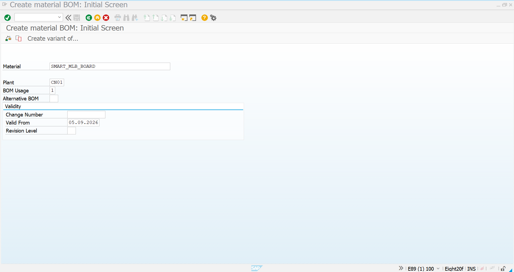
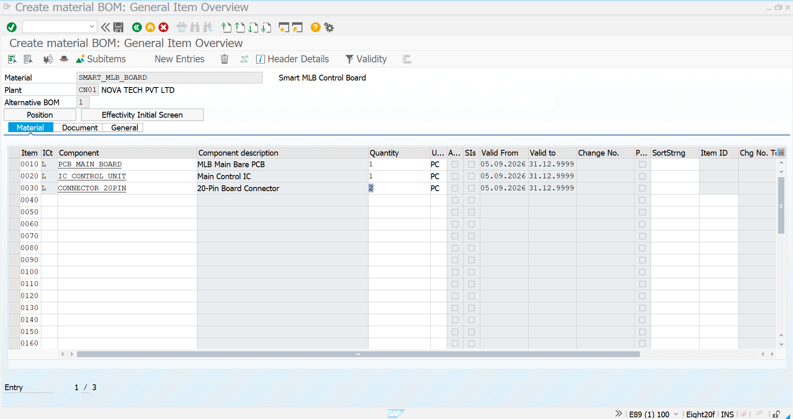
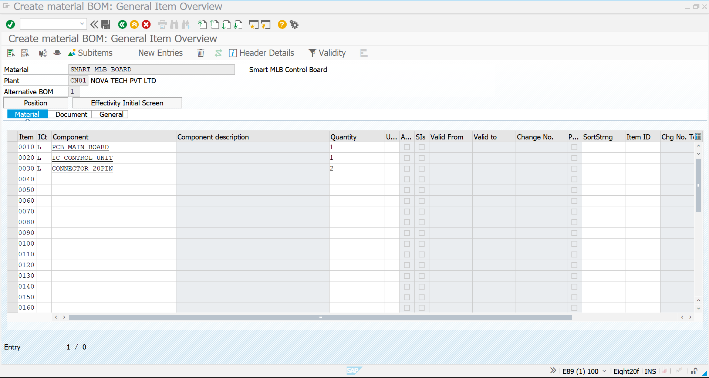
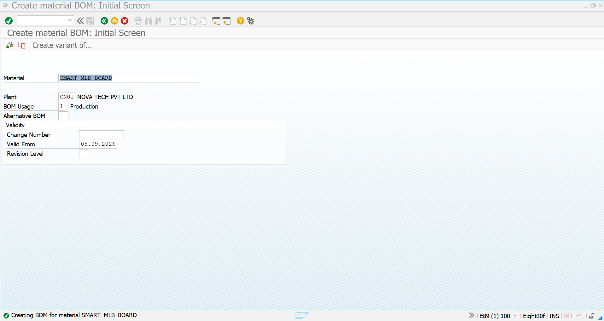

# 03 - Bill of Materials (BOM) Creation - Subcontracting

## 1. Process Overview

After completing the material creation, initial stock preparation and Purchase Info Record creation, the next step in the Novatech subcontracting process is to create the **Bill of Materials (BOM)** for the finished product.

A **Bill of Materials (BOM)** defines the components and their required quantities that make up a finished or assembled material.

For this project scenario, the finished product is the **SMART_MLB_BOARD – Smart MLB Control Board**.

The BOM is created for plant **CN01 – NOVA TECH PVT LTD** using transaction **CS01**.

| Field | Value |
|---|---|
| Finished Material | `SMART_MLB_BOARD` |
| Material Description | Smart MLB Control Board |
| Plant | `CN01` – NOVA TECH PVT LTD |
| BOM Usage | `1` – Production |
| Alternative BOM | `1` |
| Transaction Code | `CS01` |
| Valid From | `05.09.2026` |

The BOM contains the following components:

| Item | Component | Component Description | Quantity | UoM |
|---:|---|---|---:|---|
| 0010 | `PCB_MAIN_BOARD` | MLB Main Bare PCB | 1 | PC |
| 0020 | `IC_CONTROL_UNIT` | Main Control IC | 1 | PC |
| 0030 | `CONNECTOR_20PIN` | 20-Pin Board Connector | 2 | PC |

### BOM Structure

```text
SMART_MLB_BOARD
        │
        ├── 1 × PCB_MAIN_BOARD
        │
        ├── 1 × IC_CONTROL_UNIT
        │
        └── 2 × CONNECTOR_20PIN
```

The BOM establishes the component structure required for the `SMART_MLB_BOARD`.

In the Novatech subcontracting scenario, these components represent the materials associated with the finished product that will be processed through the subcontracting procurement cycle.

---

## 2. CS01 - Create BOM Initial Screen

### Transaction Code

`CS01`

### Process

Start transaction `CS01` to create a new material BOM.

Enter the following information:

- **Material:** `SMART_MLB_BOARD`
- **Plant:** `CN01`
- **BOM Usage:** `1 – Production`
- **Alternative BOM:** `1`
- **Valid From:** `05.09.2026`

The material `SMART_MLB_BOARD` is selected as the finished product for which the BOM is being created.

Plant `CN01` represents the Novatech manufacturing location where the BOM is maintained.

BOM Usage `1 – Production` indicates that the BOM is maintained for production-related purposes.

Alternative BOM `1` represents the first BOM alternative for this material.

The validity date `05.09.2026` determines when the BOM becomes effective.

### Screenshot



### Initial BOM Information

| Field | Entered Value |
|---|---|
| Material | `SMART_MLB_BOARD` |
| Plant | `CN01` |
| BOM Usage | `1 – Production` |
| Alternative BOM | `1` |
| Valid From | `05.09.2026` |

After entering the initial information, continue to the BOM item overview to maintain the required components.

---

## 3. Maintain BOM Components and Quantities

After entering the BOM header information, the required components were maintained in the BOM item overview.

The following component quantities were entered:

| Item | Component | Description | Quantity | Unit |
|---:|---|---|---:|---|
| 0010 | `PCB_MAIN_BOARD` | MLB Main Bare PCB | 1 | PC |
| 0020 | `IC_CONTROL_UNIT` | Main Control IC | 1 | PC |
| 0030 | `CONNECTOR_20PIN` | 20-Pin Board Connector | 2 | PC |

### Component Details

#### Item 0010 – PCB_MAIN_BOARD

`PCB_MAIN_BOARD` represents the main bare PCB used as the base board.

The required quantity is **1 PC per SMART_MLB_BOARD**.

#### Item 0020 – IC_CONTROL_UNIT

`IC_CONTROL_UNIT` represents the main control IC used in the Smart MLB Control Board.

The required quantity is **1 PC per SMART_MLB_BOARD**.

#### Item 0030 – CONNECTOR_20PIN

`CONNECTOR_20PIN` represents the 20-pin board connector required for board connectivity.

The required quantity is **2 PC per SMART_MLB_BOARD**.

The quantity of two connectors is intentionally maintained because each Smart MLB Control Board requires two 20-pin connectors.

### Screenshot



### BOM Component Logic

```text
1 SMART_MLB_BOARD
        │
        ├── PCB_MAIN_BOARD      → 1 PC
        │
        ├── IC_CONTROL_UNIT     → 1 PC
        │
        └── CONNECTOR_20PIN     → 2 PC
```

Therefore, the BOM defines the complete component requirement for one unit of the finished product.

---

## 4. Review BOM Component Overview

After entering all components, the BOM item overview was reviewed to validate the component structure and quantities before saving.

### Screenshot



### BOM Quantity Validation

The BOM requirement for one `SMART_MLB_BOARD` is:

| Component | Quantity per Finished Product |
|---|---:|
| `PCB_MAIN_BOARD` | 1 PC |
| `IC_CONTROL_UNIT` | 1 PC |
| `CONNECTOR_20PIN` | 2 PC |

For example, if the requirement is for **100 SMART_MLB_BOARD** units, the component requirement would be:

| Component | BOM Quantity | Requirement for 100 Boards |
|---|---:|---:|
| `PCB_MAIN_BOARD` | 1 PC | 100 PC |
| `IC_CONTROL_UNIT` | 1 PC | 100 PC |
| `CONNECTOR_20PIN` | 2 PC | 200 PC |

This quantity structure is aligned with the initial stock prepared for the subcontracting scenario.

### Validation Performed

The following points were checked before saving:

1. Finished material is `SMART_MLB_BOARD`.
2. Plant is `CN01`.
3. BOM Usage is `1 – Production`.
4. Alternative BOM is `1`.
5. Validity date is `05.09.2026`.
6. `PCB_MAIN_BOARD` is maintained with quantity `1 PC`.
7. `IC_CONTROL_UNIT` is maintained with quantity `1 PC`.
8. `CONNECTOR_20PIN` is maintained with quantity `2 PC`.
9. Units of measure are maintained as `PC`.
10. All required components are available in the BOM overview.

The component overview confirms that the BOM structure has been entered correctly.

---

## 5. Save BOM and Process Completion

After validating the BOM header information and component quantities, the BOM was saved successfully.

### Screenshot



The completed BOM establishes the following relationship:

```text
Finished Product
SMART_MLB_BOARD
        │
        ↓
Production BOM
Alternative BOM 1
        │
        ├── 0010 → PCB_MAIN_BOARD → 1 PC
        │
        ├── 0020 → IC_CONTROL_UNIT → 1 PC
        │
        └── 0030 → CONNECTOR_20PIN → 2 PC
```

### Final BOM Information

| Field | Value |
|---|---|
| Transaction | `CS01` |
| Material | `SMART_MLB_BOARD` |
| Material Description | Smart MLB Control Board |
| Plant | `CN01` |
| BOM Usage | `1 – Production` |
| Alternative BOM | `1` |
| Valid From | `05.09.2026` |
| Number of Components | 3 |
| PCB Quantity | 1 PC |
| IC Quantity | 1 PC |
| Connector Quantity | 2 PC |

The successful save confirms that the BOM has been created for `SMART_MLB_BOARD` at plant `CN01`.

### Completed Activities

1. Started transaction `CS01`.
2. Entered material `SMART_MLB_BOARD`.
3. Entered plant `CN01`.
4. Selected BOM Usage `1 – Production`.
5. Maintained Alternative BOM `1`.
6. Maintained validity date `05.09.2026`.
7. Added `PCB_MAIN_BOARD` with quantity `1 PC`.
8. Added `IC_CONTROL_UNIT` with quantity `1 PC`.
9. Added `CONNECTOR_20PIN` with quantity `2 PC`.
10. Reviewed the BOM component overview.
11. Saved the BOM successfully.

### Overall Subcontracting Process Flow

```text
Material Creation & Initial Stock
              ↓
Purchase Info Record
              ↓
BOM Creation – CS01
              ↓
BOM Components
              ↓
PCB_MAIN_BOARD × 1
IC_CONTROL_UNIT × 1
CONNECTOR_20PIN × 2
              ↓
BOM Successfully Created
              ↓
Purchase Requisition
              ↓
Subcontracting Purchase Order
              ↓
Provide Components to Vendor
              ↓
Vendor Performs Assembly / Processing
              ↓
Receive SMART_MLB_BOARD
              ↓
Invoice Verification – MIRO
```

### Screenshot Summary

| No. | Screenshot | Purpose |
|---:|---|---|
| 1 | `CS01-Initial-Screen.png` | Initial CS01 screen with material, plant, BOM usage and validity |
| 2 | `CS01-BOM-Component-Details.png` | BOM component details and quantities |
| 3 | `CS01-BOM-Component-Overview.png` | Review of the complete BOM component structure |
| 4 | `CS01-BOM-Created.png` | Confirmation of the completed BOM |

### Completion Status

| Activity | Status |
|---|---|
| Material Master Creation | Completed |
| Initial Stock Entry | Completed |
| Purchase Info Record | Completed |
| CS01 Initial BOM Data | Completed |
| BOM Usage & Validity | Completed |
| BOM Components | Completed |
| Component Quantities | Completed |
| BOM Review | Completed |
| BOM Creation | Completed |

**Result:** The production BOM for `SMART_MLB_BOARD` was successfully created in plant `CN01` using transaction `CS01`. The BOM contains `PCB_MAIN_BOARD`, `IC_CONTROL_UNIT`, and `CONNECTOR_20PIN` with the required quantities and is ready for the next stage of the subcontracting process.