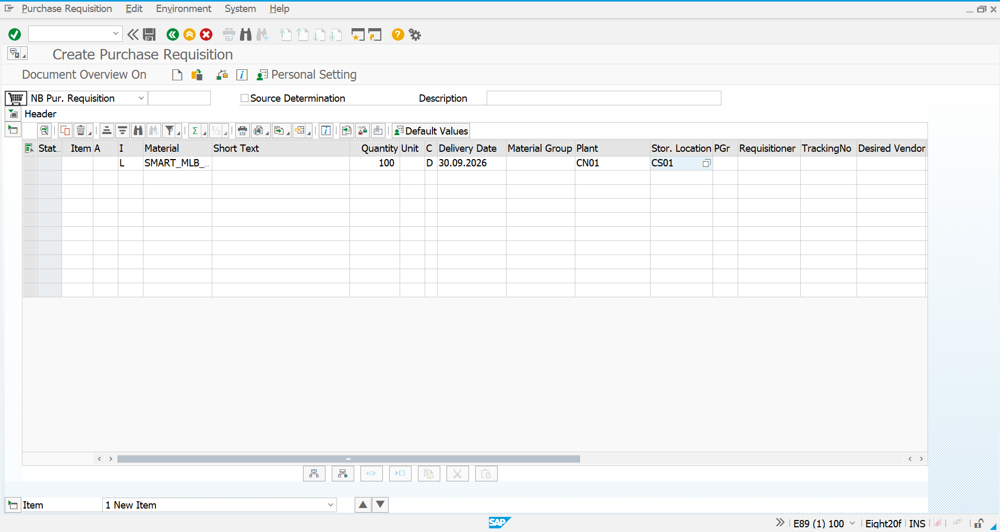
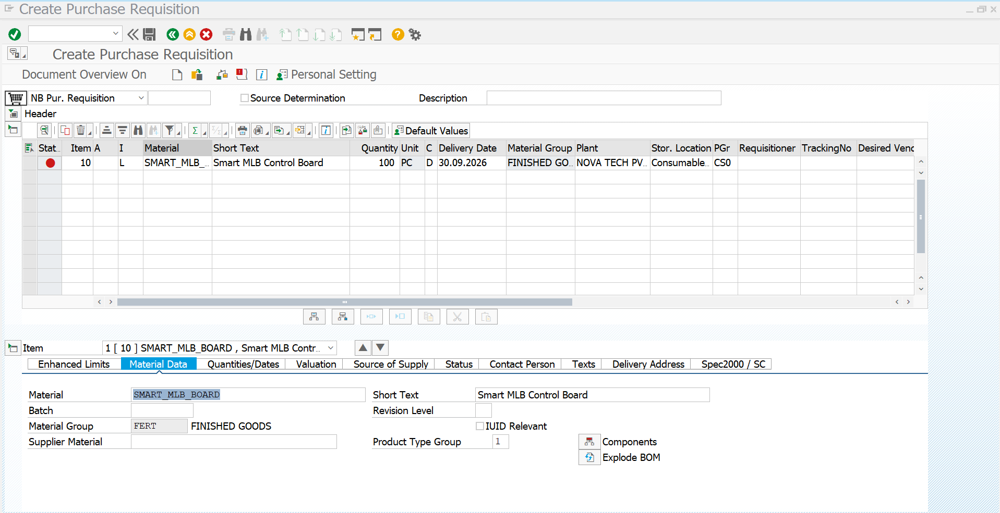
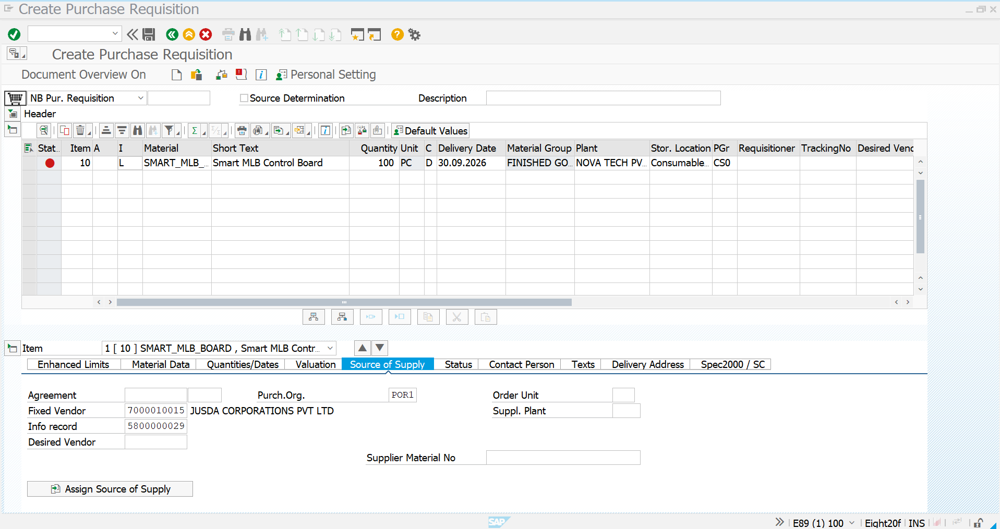
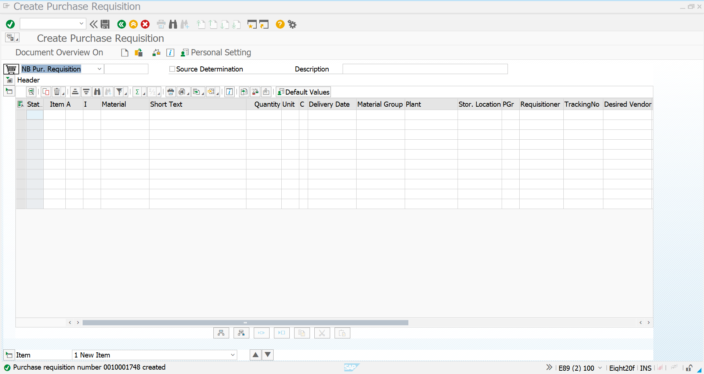

# 04 - Purchase Requisition - Subcontracting

## 1. Process Overview

After completing the material creation, initial stock preparation, Purchase Info Record and BOM creation, the next step in the Novatech subcontracting process is to create a **Purchase Requisition (PR)** for the subcontracting requirement.

A Purchase Requisition is an internal purchasing request used to communicate the requirement for a material or service that needs to be procured.

For this subcontracting scenario, Novatech requires **100 PC of SMART_MLB_BOARD** from the subcontracting supplier.

The BOM created earlier defines the component requirement for one finished product:

| Component | Quantity per FERT |
|---|---:|
| `PCB_MAIN_BOARD` | 1 PC |
| `IC_CONTROL_UNIT` | 1 PC |
| `CONNECTOR_20PIN` | 2 PC |

Therefore, for a requirement of **100 SMART_MLB_BOARD**, the corresponding component requirement is:

| Component | Requirement for 100 FERT |
|---|---:|
| `PCB_MAIN_BOARD` | 100 PC |
| `IC_CONTROL_UNIT` | 100 PC |
| `CONNECTOR_20PIN` | 200 PC |

The Purchase Requisition is created using transaction **ME51N**.

### PR Information

| Field | Value |
|---|---|
| Transaction | `ME51N` |
| Material | `SMART_MLB_BOARD` |
| Material Description | Smart MLB Control Board |
| Quantity | `100 PC` |
| Plant | `CN01` |
| Storage Location | `CS01` |
| Purchasing Group | `CS0` |
| Material Group | `FERT` – FINISHED GOODS |
| Delivery Date | `30.09.2026` |
| Fixed Vendor | `7000010015` – JUSDA CORPORATIONS PVT LTD |
| Purchasing Organization | `POR1` |
| Info Record | `5800000029` |
| Item Category | `L` – Subcontracting |

The PR provides the purchasing requirement that will subsequently be converted into a **Subcontracting Purchase Order**.

### Overall Process Flow

```text
Material Creation
        ↓
Initial Component Stock
        ↓
Purchase Info Record
        ↓
BOM Creation – CS01
        ↓
Purchase Requisition – ME51N
        ↓
Subcontracting Purchase Order – ME21N
        ↓
Provide Components to Vendor
        ↓
Vendor Performs Subcontracting Activity
        ↓
Receive SMART_MLB_BOARD
        ↓
Invoice Verification – MIRO
```

---

## 2. ME51N - Create Purchase Requisition

### Transaction Code

`ME51N`

### Process

Start transaction `ME51N` to create a new Purchase Requisition.

The PR is created for the finished product `SMART_MLB_BOARD`.

The following requirement was entered:

| Field | Value |
|---|---|
| Material | `SMART_MLB_BOARD` |
| Quantity | `100 PC` |
| Plant | `CN01` |
| Storage Location | `CS01` |
| Purchasing Group | `CS0` |
| Material Group | `FERT` – FINISHED GOODS |
| Delivery Date | `30.09.2026` |

The item category displayed in the PR is **L**, which represents the subcontracting item category.

### Screenshot



### Initial PR Entry

The PR screen shows the requirement for:

**Material:** `SMART_MLB_BOARD`

**Quantity:** `100 PC`

**Plant:** `CN01`

**Storage Location:** `CS01`

**Purchasing Group:** `CS0`

**Delivery Date:** `30.09.2026`

The requirement is therefore created for 100 units of the Smart MLB Control Board.

---

## 3. Maintain PR Item Details

After entering the material and quantity, the PR item details were reviewed in the lower section of the ME51N screen.

The Material Data section confirms the selected finished product.

### Material Data

| Field | Value |
|---|---|
| Material | `SMART_MLB_BOARD` |
| Short Text | Smart MLB Control Board |
| Material Group | `FERT` – FINISHED GOODS |
| Product Type Group | `1` |

The system recognizes `SMART_MLB_BOARD` as the finished material being requested.

The **Explode BOM** option is also available in the item details. This provides access to the BOM component structure associated with the finished material.

### Screenshot



### PR Item Summary

| Parameter | Value |
|---|---|
| Material | `SMART_MLB_BOARD` |
| Description | Smart MLB Control Board |
| Quantity | `100 PC` |
| Material Group | `FERT` |
| Plant | `CN01` |
| Delivery Date | `30.09.2026` |
| Item Category | `L` – Subcontracting |

The PR item therefore represents a requirement for 100 finished Smart MLB Control Boards.

---

## 4. Maintain Source of Supply and Subcontracting Details

The Source of Supply section was reviewed to identify the supplier and purchasing master data associated with the requirement.

The following source-of-supply information is displayed:

| Field | Value |
|---|---|
| Fixed Vendor | `7000010015` |
| Supplier Name | JUSDA CORPORATIONS PVT LTD |
| Purchasing Organization | `POR1` |
| Info Record | `5800000029` |
| Supplier Material No. | Not maintained |

The fixed vendor is **JUSDA CORPORATIONS PVT LTD**, which was previously maintained in the subcontracting Purchase Info Record.

The Info Record `5800000029` connects the material and supplier purchasing relationship.

### Screenshot



### Source of Supply Relationship

```text
Material
SMART_MLB_BOARD
        ↓
Fixed Vendor
7000010015
        ↓
JUSDA CORPORATIONS PVT LTD
        ↓
Purchasing Organization
POR1
        ↓
Subcontracting Info Record
5800000029
```

This confirms that the PR requirement is associated with the intended subcontracting supplier and the previously created Purchase Info Record.

### Subcontracting Requirement

The requirement is for:

**100 PC SMART_MLB_BOARD**

Based on the BOM:

```text
100 SMART_MLB_BOARD
        │
        ├── PCB_MAIN_BOARD      → 100 PC
        ├── IC_CONTROL_UNIT     → 100 PC
        └── CONNECTOR_20PIN     → 200 PC
```

These components are the materials required to support the subsequent subcontracting process.

---

## 5. Save Purchase Requisition and Process Completion

After maintaining and reviewing the PR item and source-of-supply information, the Purchase Requisition was saved successfully.

SAP displayed the following confirmation:

**Purchase requisition number `0010001748` created**

### Screenshot



### Final Purchase Requisition Details

| Field | Final Value |
|---|---|
| PR Number | `0010001748` |
| Transaction | `ME51N` |
| Material | `SMART_MLB_BOARD` |
| Description | Smart MLB Control Board |
| Quantity | `100 PC` |
| Item Category | `L` – Subcontracting |
| Delivery Date | `30.09.2026` |
| Material Group | `FERT` – FINISHED GOODS |
| Plant | `CN01` |
| Storage Location | `CS01` |
| Purchasing Group | `CS0` |
| Fixed Vendor | `7000010015` |
| Supplier | JUSDA CORPORATIONS PVT LTD |
| Purchasing Organization | `POR1` |
| Info Record | `5800000029` |

### Component Requirement for the PR

The 100 PC finished-product requirement corresponds to the following BOM quantities:

| Component | BOM Quantity | Requirement for 100 FERT |
|---|---:|---:|
| `PCB_MAIN_BOARD` | 1 PC | 100 PC |
| `IC_CONTROL_UNIT` | 1 PC | 100 PC |
| `CONNECTOR_20PIN` | 2 PC | 200 PC |

The Purchase Requisition is now available as the purchasing requirement for the next stage, where it can be converted into a **Subcontracting Purchase Order**.

### Overall Subcontracting Flow

```text
Material & Initial Stock Completed
              ↓
Purchase Info Record
5800000029
              ↓
BOM Created – CS01
              ↓
BOM Structure
1 PCB + 1 IC + 2 Connectors
              ↓
Purchase Requisition – ME51N
              ↓
PR Number
0010001748
              ↓
Requirement
SMART_MLB_BOARD – 100 PC
              ↓
Fixed Vendor
7000010015
JUSDA CORPORATIONS PVT LTD
              ↓
Subcontracting Purchase Order – ME21N
              ↓
Provide Components to Vendor
              ↓
Vendor Performs Assembly / Processing
              ↓
Receive SMART_MLB_BOARD – MIGO
              ↓
Invoice Verification – MIRO
```

### Screenshot Summary

| No. | Screenshot | Purpose |
|---:|---|---|
| 1 | `ME51N-Initial-Screen.png` | Initial PR screen showing the 100 PC SMART_MLB_BOARD requirement |
| 2 | `ME51N-PR-Item-Details.png` | Material data and PR item details |
| 3 | `ME51N-Subcontracting-Details.png` | Fixed vendor, purchasing organization and Info Record |
| 4 | `ME51N-PR-Created.png` | Confirmation that PR `0010001748` was successfully created |

### Completion Status

| Activity | Status |
|---|---|
| Material Master Creation | Completed |
| Initial Stock Entry | Completed |
| Purchase Info Record | Completed |
| BOM Creation – CS01 | Completed |
| ME51N Initial PR Data | Completed |
| PR Material & Quantity | Completed |
| PR Plant & Storage Location | Completed |
| Purchasing Group | Completed |
| Source of Supply | Completed |
| Fixed Vendor | Completed |
| Subcontracting Info Record | Completed |
| Purchase Requisition | Completed |
| PR Number `0010001748` | Created |

**Result:** Purchase Requisition `0010001748` was successfully created for **100 PC of `SMART_MLB_BOARD`** at plant `CN01`. The PR is linked to the subcontracting supplier **JUSDA CORPORATIONS PVT LTD** through Info Record `5800000029` and is ready for the next stage: **Subcontracting Purchase Order Creation using ME21N**.