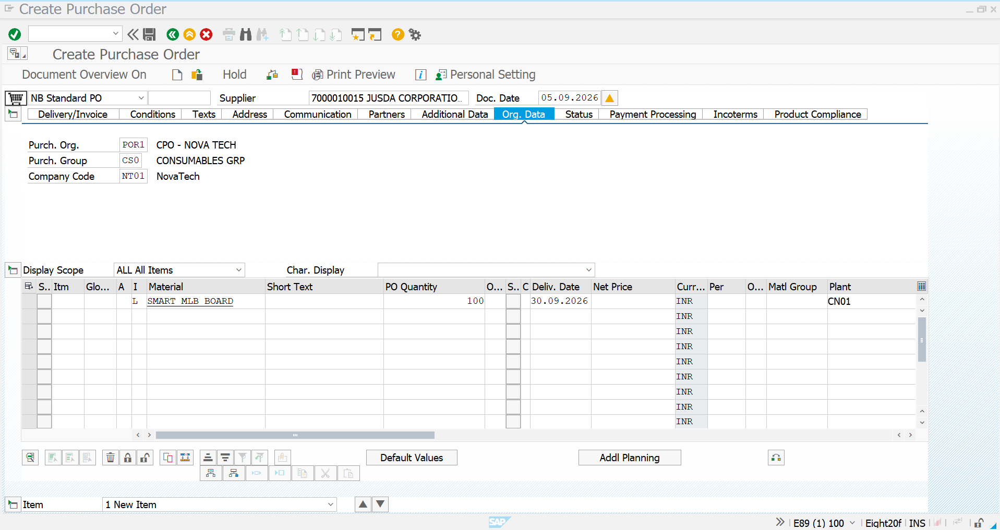
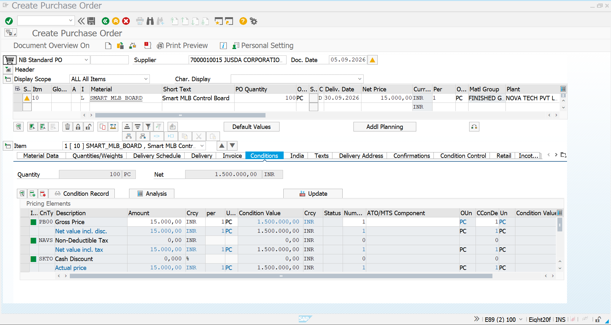
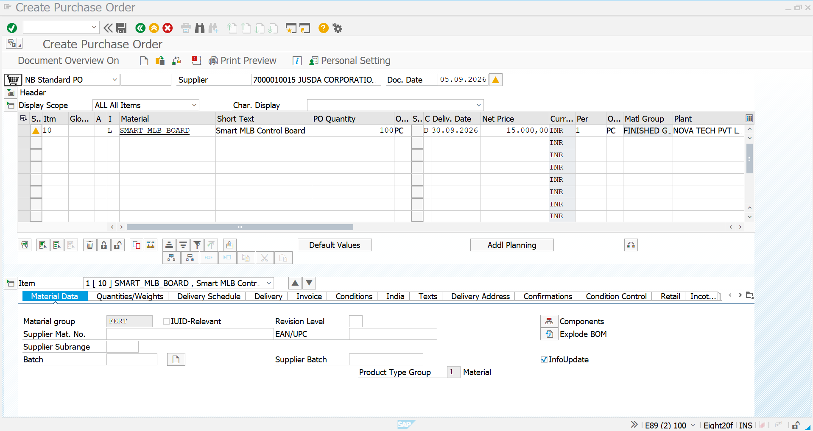
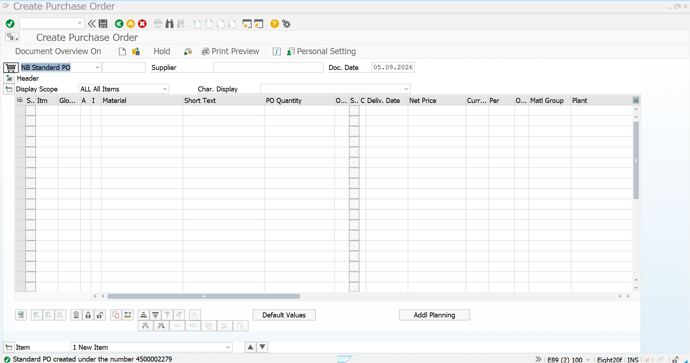

# 05 - Subcontracting Purchase Order

## 1. Process Overview

After completing the Material Master, Initial Stock, Purchase Info Record, BOM and Purchase Requisition, the next step in the Novatech subcontracting process is to create the **Subcontracting Purchase Order (PO)**.

A subcontracting Purchase Order is used when Novatech sends the required components to an external supplier for processing, assembly or other subcontracting activities and receives the completed finished product back from the supplier.

For this project scenario, the subcontracting supplier is **JUSDA CORPORATIONS PVT LTD**.

The Purchase Requisition created in the previous step contains a requirement for **100 PC of SMART_MLB_BOARD**.

The Purchase Info Record contains the subcontracting purchasing relationship and price of **15,000 INR per PC**.

The BOM defines the components required for one `SMART_MLB_BOARD`:

| Component | Quantity per FERT |
|---|---:|
| `PCB_MAIN_BOARD` | 1 PC |
| `IC_CONTROL_UNIT` | 1 PC |
| `CONNECTOR_20PIN` | 2 PC |

Therefore, for the PO quantity of **100 PC**, the corresponding component requirement is:

| Component | Requirement for 100 FERT |
|---|---:|
| `PCB_MAIN_BOARD` | 100 PC |
| `IC_CONTROL_UNIT` | 100 PC |
| `CONNECTOR_20PIN` | 200 PC |

### Purchase Order Information

| Field | Value |
|---|---|
| Transaction | `ME21N` |
| PO Type | `NB – Standard PO` |
| Supplier | `7000010015` |
| Supplier Name | JUSDA CORPORATIONS PVT LTD |
| Material | `SMART_MLB_BOARD` |
| Material Description | Smart MLB Control Board |
| PO Quantity | `100 PC` |
| Plant | `CN01` |
| Purchasing Organization | `POR1` |
| Purchasing Group | `CS0` |
| Company Code | `NT01` |
| Item Category | `L – Subcontracting` |
| Delivery Date | `30.09.2026` |
| Net Price | `15,000 INR / PC` |
| Total PO Value | `1,500,000 INR` |

The Purchase Order was created using transaction **ME21N**.

### Overall Process Flow

```text
Material Creation
        ↓
Initial Component Stock
        ↓
Purchase Info Record
        ↓
BOM – CS01
        ↓
Purchase Requisition
PR 0010001748
        ↓
Subcontracting Purchase Order
ME21N
        ↓
PO 4500002279
        ↓
Provide Components to Vendor
        ↓
Vendor Performs Subcontracting Activity
        ↓
Receive SMART_MLB_BOARD
        ↓
Invoice Verification – MIRO
```

---

## 2. ME21N - Create Purchase Order

### Transaction Code

`ME21N`

The Purchase Order was created using transaction `ME21N`.

The supplier selected for the subcontracting activity is:

**Supplier:** `7000010015 – JUSDA CORPORATIONS PVT LTD`

The organizational data maintained in the Purchase Order is:

| Field | Value |
|---|---|
| Purchasing Organization | `POR1` |
| Purchasing Group | `CS0` |
| Company Code | `NT01` |
| Company Code Description | NovaTech |
| Supplier | `7000010015` |
| Supplier Name | JUSDA CORPORATIONS PVT LTD |
| Document Date | `05.09.2026` |

### Screenshot



### Header Organization Data

The **Org. Data** section confirms the purchasing organizational structure used for the Purchase Order.

The screenshot shows:

- Purchasing Organization: `POR1 – CPO - NOVA TECH`
- Purchasing Group: `CS0 – CONSUMABLES GRP`
- Company Code: `NT01 – NovaTech`

These organizational values determine the purchasing responsibility and company-level context of the PO.

The supplier is maintained as:

`7000010015 – JUSDA CORPORATIONS PVT LTD`

---

## 3. Create PO Item and Maintain Material Details

The Purchase Order item was created for the finished material `SMART_MLB_BOARD`.

The following item information is maintained:

| Field | Value |
|---|---|
| Item | `10` |
| Item Category | `L – Subcontracting` |
| Material | `SMART_MLB_BOARD` |
| Short Text | Smart MLB Control Board |
| PO Quantity | `100 PC` |
| Delivery Date | `30.09.2026` |
| Net Price | `15,000 INR / PC` |
| Plant | `CN01` |
| Material Group | `FERT – FINISHED GOODS` |

### Screenshot



### Item Category – L

The PO item shows **Item Category `L`**, which is the subcontracting item category.

This is an important part of the subcontracting scenario because the PO is not simply purchasing a normal finished product from stock.

The subcontracting requirement is represented through the relationship between:

```text
Finished Product
SMART_MLB_BOARD
        ↓
Item Category
L – Subcontracting
        ↓
BOM Components
PCB_MAIN_BOARD
IC_CONTROL_UNIT
CONNECTOR_20PIN
```

The PO quantity is **100 PC**, which matches the Purchase Requisition created in the previous process.

### Material Data

The Material Data section shows:

| Field | Value |
|---|---|
| Material Group | `FERT` |
| Product Type Group | `1` |
| Material | `SMART_MLB_BOARD` |
| Material Description | Smart MLB Control Board |

The screen also provides the **Components** and **Explode BOM** options.

These functions are used to work with the BOM component structure associated with the subcontracting material.

### Screenshot



The screenshot shows the subcontracting-related component functions available for the PO item, including:

- **Components**
- **Explode BOM**

These options connect the subcontracting PO item with the BOM maintained earlier for `SMART_MLB_BOARD`.

---

## 4. Maintain Conditions and Validate PO Value

The Purchase Order pricing was reviewed in the **Conditions** section.

The Purchase Info Record maintained earlier contains the subcontracting price of:

**15,000 INR per PC**

For the Purchase Order quantity of **100 PC**, the total value is:

```text
100 PC × 15,000 INR
=
1,500,000 INR
```

### Pricing Details

| Pricing Element | Value |
|---|---:|
| Gross Price | `15,000 INR / PC` |
| PO Quantity | `100 PC` |
| Net PO Value | `1,500,000 INR` |
| Currency | `INR` |
| Price Unit | `1 PC` |

### Screenshot


### Price Validation

The Purchase Order pricing was validated as:

```text
Quantity       = 100 PC
Price          = 15,000 INR / PC
Total PO Value = 1,500,000 INR
```

The pricing shown in the PO is consistent with the subcontracting price maintained in the Purchase Info Record.

---

## 5. Save Purchase Order and Verify Creation

After reviewing the supplier, organizational data, material, quantity, plant, delivery date, item category and pricing information, the Purchase Order was saved.

SAP displayed the following confirmation:

**Standard PO created under the number `4500002279`**

### Screenshot



### Final Purchase Order Details

| Field | Final Value |
|---|---|
| PO Number | `4500002279` |
| PO Type | `NB – Standard PO` |
| Supplier | `7000010015` |
| Supplier Name | JUSDA CORPORATIONS PVT LTD |
| Material | `SMART_MLB_BOARD` |
| Material Description | Smart MLB Control Board |
| Quantity | `100 PC` |
| Item Category | `L – Subcontracting` |
| Delivery Date | `30.09.2026` |
| Plant | `CN01` |
| Material Group | `FERT – FINISHED GOODS` |
| Purchasing Organization | `POR1` |
| Purchasing Group | `CS0` |
| Company Code | `NT01` |
| Net Price | `15,000 INR / PC` |
| Total PO Value | `1,500,000 INR` |

### PO and BOM Relationship

The Purchase Order is created for the finished product `SMART_MLB_BOARD`, while the BOM defines the component structure required for the subcontracting process.

```text
SMART_MLB_BOARD – 100 PC
          ↓
Subcontracting PO
          ↓
BOM Component Requirement
          ↓
PCB_MAIN_BOARD      → 100 PC
IC_CONTROL_UNIT     → 100 PC
CONNECTOR_20PIN     → 200 PC
```

The next stage is to provide these components to the subcontractor before the vendor performs the required subcontracting activity.

---

## 6. Process Completion and Next Step

The **Subcontracting Purchase Order Creation** process is completed successfully.

### Completed Activities

1. Started transaction `ME21N`.
2. Selected supplier `7000010015`.
3. Selected JUSDA CORPORATIONS PVT LTD as the subcontracting supplier.
4. Maintained Purchasing Organization `POR1`.
5. Maintained Purchasing Group `CS0`.
6. Maintained Company Code `NT01`.
7. Created PO item for `SMART_MLB_BOARD`.
8. Maintained quantity of `100 PC`.
9. Maintained plant `CN01`.
10. Maintained delivery date `30.09.2026`.
11. Verified Item Category `L – Subcontracting`.
12. Reviewed the BOM/component functions.
13. Verified the subcontracting price of `15,000 INR / PC`.
14. Validated total PO value of `1,500,000 INR`.
15. Saved the Purchase Order successfully.
16. SAP generated PO number `4500002279`.

### Final Component Requirement

For the PO quantity of **100 SMART_MLB_BOARD**, the BOM requires:

| Component | Quantity per FERT | Total Requirement |
|---|---:|---:|
| `PCB_MAIN_BOARD` | 1 PC | 100 PC |
| `IC_CONTROL_UNIT` | 1 PC | 100 PC |
| `CONNECTOR_20PIN` | 2 PC | 200 PC |

### Overall Subcontracting Process Flow

```text
Material Master
        ↓
Initial Stock
100 PCB
100 IC
200 Connectors
        ↓
Purchase Info Record
5800000029
        ↓
BOM – CS01
1 PCB + 1 IC + 2 Connectors
        ↓
Purchase Requisition
0010001748
        ↓
Subcontracting Purchase Order
4500002279
        ↓
SMART_MLB_BOARD – 100 PC
        ↓
Provide Components to Vendor
        ↓
PCB_MAIN_BOARD – 100 PC
IC_CONTROL_UNIT – 100 PC
CONNECTOR_20PIN – 200 PC
        ↓
Vendor Performs Assembly / Processing
        ↓
Receive SMART_MLB_BOARD
MIGO
        ↓
Invoice Verification
MIRO
```

### Screenshot Summary

| No. | Screenshot | Purpose |
|---:|---|---|
| 1 | `ME21N-Initial-Screen.png` | Create PO and maintain supplier and organizational data |
| 2 | `ME21N-PO-Item-Overview.png` | PO item showing SMART_MLB_BOARD, quantity, price, plant and item category |
| 3 | `ME21N-Subcontracting-Components.png` | Material Data section showing subcontracting component and BOM functions |
| 4 | `ME21N-PO-Created.png` | Confirmation of successful PO creation |

### Completion Status

| Activity | Status |
|---|---|
| Material Master Creation | Completed |
| Initial Component Stock | Completed |
| Purchase Info Record | Completed |
| BOM Creation – CS01 | Completed |
| Purchase Requisition – ME51N | Completed |
| Supplier Selection | Completed |
| ME21N PO Creation | Completed |
| PO Item – SMART_MLB_BOARD | Completed |
| Item Category `L – Subcontracting` | Completed |
| Quantity – 100 PC | Completed |
| Plant – CN01 | Completed |
| Price – 15,000 INR / PC | Completed |
| Total PO Value – 1,500,000 INR | Completed |
| Purchase Order | `4500002279` |
| PO Creation | Completed |

**Result:** Subcontracting Purchase Order `4500002279` was successfully created for **100 PC of `SMART_MLB_BOARD`** from **JUSDA CORPORATIONS PVT LTD**. The PO uses Item Category `L – Subcontracting`, is assigned to plant `CN01`, and carries a net price of `15,000 INR per PC`, resulting in a total PO value of `1,500,000 INR`. The next step is to **provide the BOM components to the subcontracting vendor**.