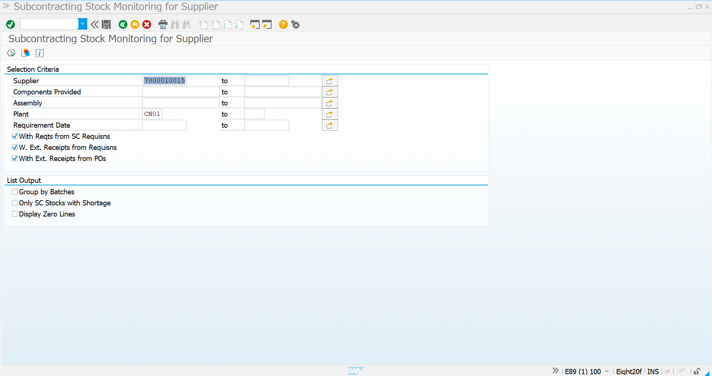
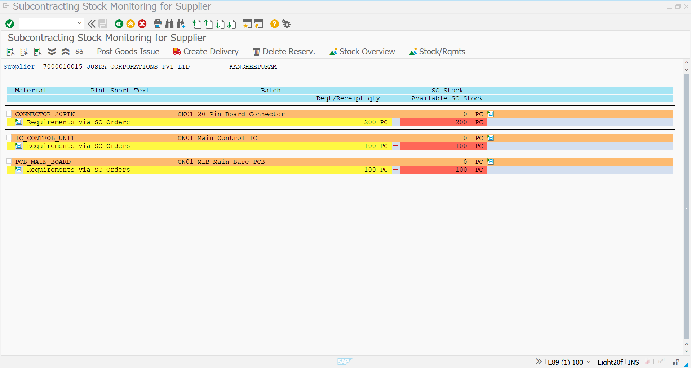
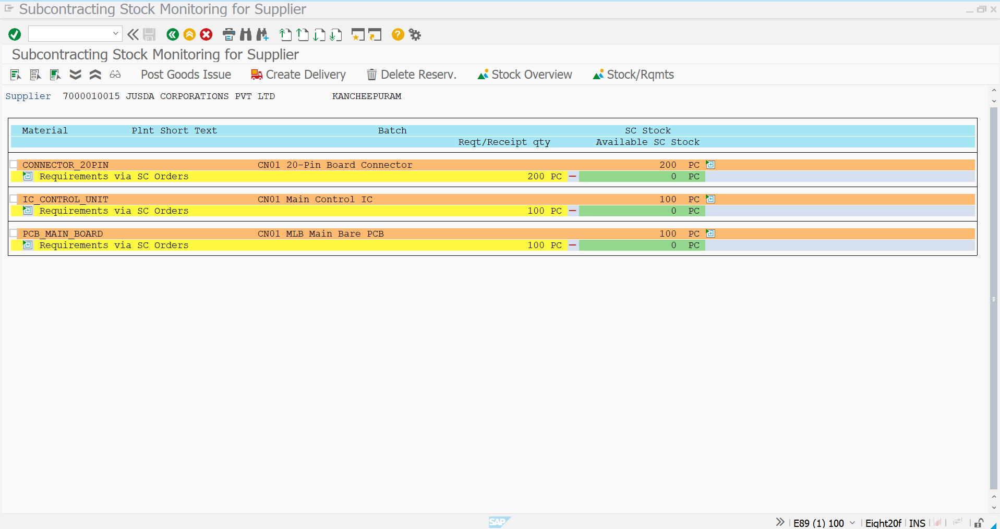
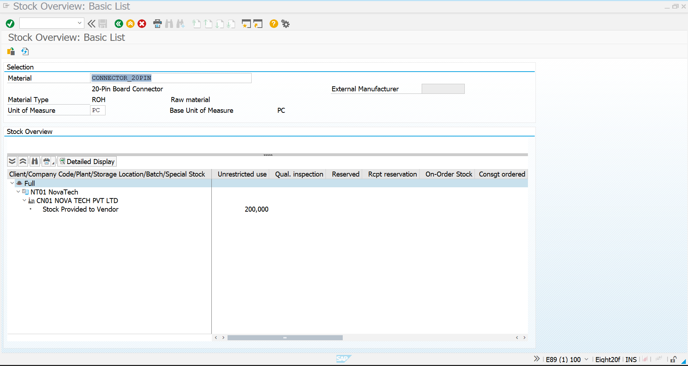
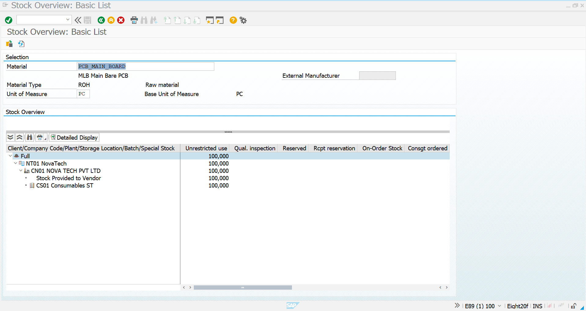
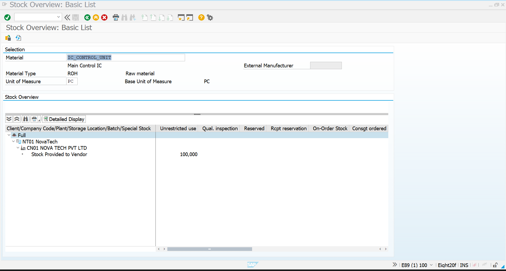

# 06 - Providing Stock to Vendor

## 1. Process Overview

After creating the subcontracting Purchase Order, the next step is to provide the required **ROH components** to the subcontractor.

In the Novatech Electronics subcontracting scenario, **JUSDA CORPORATIONS PVT LTD** performs the external assembly and processing of the `SMART_MLB_BOARD`.

The subcontracting Purchase Order is:

| Field | Value |
|---|---|
| Purchase Order | `4500002279` |
| Supplier | `7000010015` – JUSDA CORPORATIONS PVT LTD |
| Material | `SMART_MLB_BOARD` |
| PO Quantity | 100 PC |
| Plant | `CN01` |
| Storage Location | `CS01` |

Based on the BOM, one `SMART_MLB_BOARD` requires:

| Component | BOM Quantity per FERT | Required for 100 FERT |
|---|---:|---:|
| `PCB_MAIN_BOARD` | 1 PC | 100 PC |
| `IC_CONTROL_UNIT` | 1 PC | 100 PC |
| `CONNECTOR_20PIN` | 2 PC | 200 PC |

Therefore, the complete component quantity required for the subcontracting order is:

**100 PC PCB + 100 PC IC + 200 PC Connectors**

The components are provided to the subcontractor using transaction **`ME2O`**.

---

## 2. ME2O - Subcontracting Stock Monitoring

### Transaction Code

`ME2O`

### Process

Start transaction `ME2O` to monitor and provide components for subcontracting.

In the selection screen, enter the relevant supplier and plant:

- **Supplier:** `7000010015`
- **Plant:** `CN01`
- **With Reqs from SC Requisns:** Selected
- **W. Ext. Receipts from Requisns:** Selected
- **With Ext. Receipts from POs:** Selected

The supplier `7000010015` represents **JUSDA CORPORATIONS PVT LTD**.

Execute the transaction to display the subcontracting stock requirements for the supplier.

### Screenshot



The initial ME2O screen establishes the supplier and plant selection criteria used to identify the subcontracting requirements.

---

## 3. Review Subcontracting Component Requirements

After executing ME2O, SAP displays the components required for the subcontracting order.

For Purchase Order `4500002279`, the system identifies the following component requirements:

| Component | Plant | Required / Receipt Quantity | Available SC Stock Before Provision |
|---|---|---:|---:|
| `CONNECTOR_20PIN` | `CN01` | 200 PC | 0 PC |
| `IC_CONTROL_UNIT` | `CN01` | 100 PC | 0 PC |
| `PCB_MAIN_BOARD` | `CN01` | 100 PC | 0 PC |

The screenshot shows the subcontracting requirements generated from the Purchase Order and BOM.

The red quantity indicates that the required subcontracting stock is currently not available at the vendor.

Therefore, the components need to be provided from Novatech's own stock.

### Screenshot



### Analysis

The system confirms that the subcontractor requires:

```text
PCB_MAIN_BOARD      → 100 PC
IC_CONTROL_UNIT     → 100 PC
CONNECTOR_20PIN     → 200 PC
```

These quantities exactly match the BOM requirement for **100 PC of SMART_MLB_BOARD**.

---

## 4. Provide Components to Vendor

From the ME2O subcontracting stock monitoring screen, the required components are provided to the subcontractor.

The required quantities are:

| Material | Quantity Provided | Purpose |
|---|---:|---|
| `PCB_MAIN_BOARD` | 100 PC | Main PCB for Smart MLB Board |
| `IC_CONTROL_UNIT` | 100 PC | Main Control IC |
| `CONNECTOR_20PIN` | 200 PC | Two connectors per finished board |

After posting the provision, the available subcontracting stock changes from zero to the required quantities.

The process can be represented as:

```text
Novatech Unrestricted Stock
          ↓
       ME2O
          ↓
Provide Components
          ↓
Vendor Special Stock
          ↓
JUSDA CORPORATIONS PVT LTD
          ↓
Components Available for
Subcontracting Processing
```

### Screenshot



### Result

The ME2O screen now shows the provided subcontracting stock:

| Component | Requirement | Available SC Stock |
|---|---:|---:|
| `CONNECTOR_20PIN` | 200 PC | 200 PC |
| `IC_CONTROL_UNIT` | 100 PC | 100 PC |
| `PCB_MAIN_BOARD` | 100 PC | 100 PC |

The available subcontracting stock now covers the complete requirement.

---

## 5. Verify Vendor Special Stock Using MMBE

After providing the components through ME2O, the stock can be verified using **`MMBE` – Stock Overview**.

The stock overview confirms that the components have been moved from Novatech's normal unrestricted stock into **Stock Provided to Vendor**.

### PCB Main Board

For `PCB_MAIN_BOARD`, MMBE shows:

- Material Type: `ROH`
- Plant: `CN01`
- Stock Provided to Vendor: `100 PC`

### Screenshot



---

### IC Control Unit

For `IC_CONTROL_UNIT`, MMBE shows:

- Material Type: `ROH`
- Plant: `CN01`
- Stock Provided to Vendor: `100 PC`

### Screenshot



---

### 20-Pin Board Connector

For `CONNECTOR_20PIN`, MMBE shows:

- Material Type: `ROH`
- Plant: `CN01`
- Stock Provided to Vendor: `200 PC`

### Screenshot



---

## Process Completion

The component provision process is completed successfully.

### Completed Activities

1. Started transaction `ME2O`.
2. Entered supplier `7000010015`.
3. Entered plant `CN01`.
4. Identified the subcontracting requirements from PO `4500002279`.
5. Reviewed the BOM component requirements.
6. Provided `100 PC` of `PCB_MAIN_BOARD`.
7. Provided `100 PC` of `IC_CONTROL_UNIT`.
8. Provided `200 PC` of `CONNECTOR_20PIN`.
9. Verified the vendor special stock using `MMBE`.
10. Confirmed that the complete component requirement is available for the subcontractor.

### Final Stock Provided

| Material | Quantity Provided | Status |
|---|---:|---|
| `PCB_MAIN_BOARD` | 100 PC | Completed |
| `IC_CONTROL_UNIT` | 100 PC | Completed |
| `CONNECTOR_20PIN` | 200 PC | Completed |

### Overall Process Flow

```text
Material & Initial Stock
        ↓
BOM Created
        ↓
Purchase Requisition
        ↓
Subcontracting Purchase Order
4500002279
        ↓
ME2O
        ↓
Review Component Requirements
        ↓
PCB_MAIN_BOARD      → 100 PC
IC_CONTROL_UNIT     → 100 PC
CONNECTOR_20PIN     → 200 PC
        ↓
Provide Components to Vendor
        ↓
Vendor Special Stock
        ↓
MMBE Verification
        ↓
All Components Available
        ↓
JUSDA Performs Subcontracting
        ↓
Next Step:
Receive SMART_MLB_BOARD using MIGO
```

## Screenshot Summary

| No. | Screenshot | Purpose |
|---:|---|---|
| 1 | `ME2O-Initial-Screen.png` | ME2O supplier and plant selection |
| 2 | `ME2O-PO-Components.png` | Displays subcontracting component requirements |
| 3 | `ME2O-Stock-Provided.png` | Confirms components provided to vendor |
| 4 | `MMBE-Vendor-Special-Stock.png` | Verifies PCB stock provided to vendor |
| 5 | `MMBE-Vendor-Special-Stock 2.png` | Verifies IC stock provided to vendor |
| 6 | `MMBE-Vendor-Special-Stock 3.png` | Verifies connector stock provided to vendor |

## Completion Status

| Activity | Status |
|---|---|
| Subcontracting PO | Completed |
| ME2O Supplier Selection | Completed |
| Component Requirement Review | Completed |
| PCB Main Board Provision | 100 PC Completed |
| IC Control Unit Provision | 100 PC Completed |
| 20-Pin Connector Provision | 200 PC Completed |
| Vendor Special Stock Verification | Completed |
| Components Available at Vendor | Completed |
| Ready for Subcontracting Receipt | Completed |