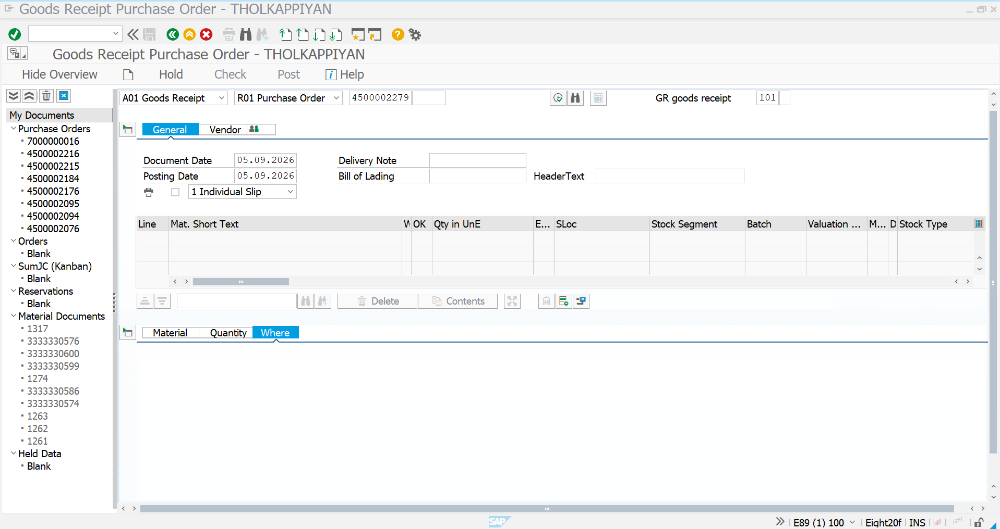
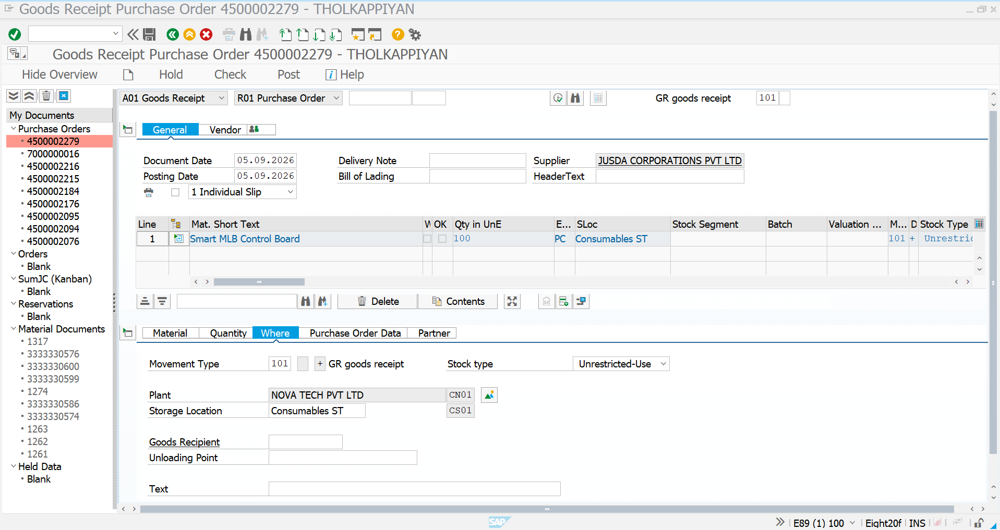
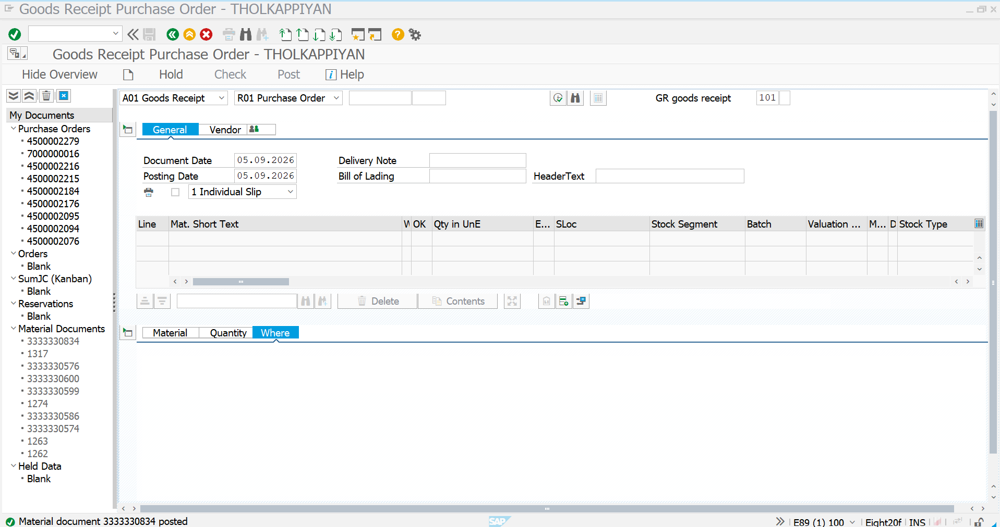
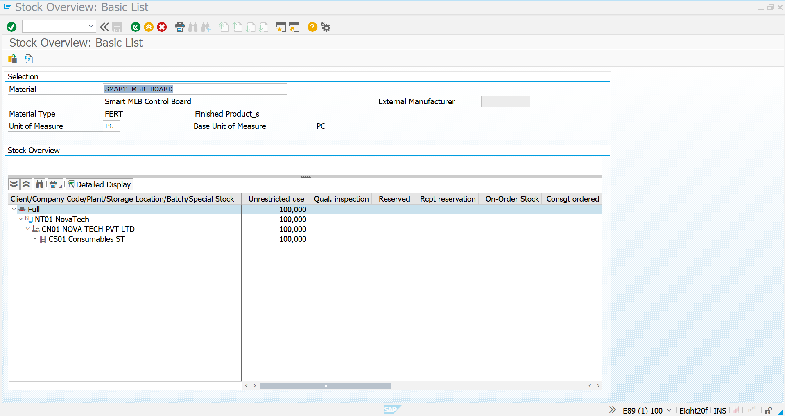

# 07 - Goods Receipt - Subcontracting

## 1. Process Overview

After providing the required ROH components to the subcontractor, the next step in the Novatech subcontracting process is to receive the completed finished product from the subcontractor.

For this scenario, **JUSDA CORPORATIONS PVT LTD** completes the external assembly and processing of the `SMART_MLB_BOARD` and returns the finished product to Novatech.

The Goods Receipt is posted against the subcontracting Purchase Order using transaction **`MIGO`**.

### Subcontracting Details

| Field | Value |
|---|---|
| Purchase Order | `4500002279` |
| Supplier | `7000010015` – JUSDA CORPORATIONS PVT LTD |
| Finished Material | `SMART_MLB_BOARD` |
| Material Description | Smart MLB Control Board |
| Receipt Quantity | 100 PC |
| Plant | `CN01` |
| Storage Location | `CS01` – Consumables ST |
| Movement Type | `101` – Goods Receipt |
| Stock Type | Unrestricted-Use |

The BOM for the finished product contains:

| Component | BOM Quantity | Quantity for 100 FERT |
|---|---:|---:|
| `PCB_MAIN_BOARD` | 1 PC | 100 PC |
| `IC_CONTROL_UNIT` | 1 PC | 100 PC |
| `CONNECTOR_20PIN` | 2 PC | 200 PC |

These components were previously provided to the subcontractor through **ME2O**.

The overall subcontracting process is therefore:

```text
Subcontracting PO
        ↓
Components Provided to Vendor
        ↓
JUSDA Performs Assembly / Processing
        ↓
Finished Product Returned
        ↓
MIGO - Goods Receipt
        ↓
100 PC SMART_MLB_BOARD
        ↓
Component Consumption
        ↓
Finished Product Stock
```

---

## 2. MIGO - Initial Goods Receipt

### Transaction Code

`MIGO`

### Process

Start transaction `MIGO` and select the following options:

- **Transaction:** Goods Receipt
- **Reference:** Purchase Order
- **Movement Type:** `101`

Enter Purchase Order:

`4500002279`

The Purchase Order contains the subcontracting finished product `SMART_MLB_BOARD`.

The Goods Receipt is being created for the finished product received from **JUSDA CORPORATIONS PVT LTD**.

### Screenshot



The initial MIGO screen is used to select the Goods Receipt transaction and the Purchase Order reference.

---

## 3. Enter and Verify Subcontracting Goods Receipt

After entering Purchase Order `4500002279`, SAP retrieves the relevant Purchase Order information.

The Goods Receipt item represents:

| Field | Value |
|---|---|
| Material | `SMART_MLB_BOARD` |
| Description | Smart MLB Control Board |
| Quantity | 100 PC |
| Movement Type | `101` |
| Plant | `CN01` |
| Storage Location | `CS01` |
| Stock Type | Unrestricted-Use |
| Supplier | JUSDA CORPORATIONS PVT LTD |

The screenshot shows the finished product line and the relevant Goods Receipt details.

### Screenshot



### Verification

Before posting the Goods Receipt, verify:

- Correct Purchase Order is selected.
- Correct finished product is selected.
- Quantity is **100 PC**.
- Movement Type is **101**.
- Plant is `CN01`.
- Storage Location is `CS01`.
- Stock Type is **Unrestricted-Use**.

The receipt quantity of **100 PC** corresponds to the subcontracting Purchase Order quantity.

---

## 4. Post Goods Receipt

After verifying the Goods Receipt information, perform the standard MIGO posting process.

The Goods Receipt is posted for:

```text
Purchase Order
4500002279
        ↓
Supplier
7000010015
JUSDA CORPORATIONS PVT LTD
        ↓
Finished Product
SMART_MLB_BOARD
        ↓
Quantity
100 PC
        ↓
Movement Type
101
        ↓
Plant
CN01
        ↓
Storage Location
CS01
        ↓
Goods Receipt Posted
```

SAP successfully posts the Goods Receipt and generates a **Material Document**.

### Material Document

The successful posting message shown in the screenshot confirms:

**Material document `3333330834` posted**

### Screenshot



### Result

The screenshot confirms that the subcontracting Goods Receipt was successfully posted against Purchase Order `4500002279`.

The finished `SMART_MLB_BOARD` has therefore been received into Novatech's inventory.

---

## 5. Verify Finished Product Stock Using MMBE

After posting the Goods Receipt, the finished product stock is verified using transaction **`MMBE` – Stock Overview**.

Enter:

- **Material:** `SMART_MLB_BOARD`

SAP displays the stock position for the finished product.

The screenshot shows:

- Material: `SMART_MLB_BOARD`
- Material Type: `FERT`
- Unit of Measure: `PC`
- Plant: `CN01`
- Storage Location: `CS01`
- Unrestricted-Use stock: 100 PC

### Screenshot



### Analysis

The MMBE verification confirms that the finished `SMART_MLB_BOARD` has been received into the Novatech inventory.

The stock flow is:

```text
JUSDA CORPORATIONS PVT LTD
        ↓
Finished SMART_MLB_BOARD
        ↓
MIGO - Movement Type 101
        ↓
Plant CN01
        ↓
Storage Location CS01
        ↓
Unrestricted-Use Stock
        ↓
100 PC SMART_MLB_BOARD
```

This completes the physical receipt stage of the subcontracting process.

---

## Process Completion

The Goods Receipt process for the subcontracting Purchase Order has been completed successfully.

### Completed Activities

1. Started transaction `MIGO`.
2. Selected **Goods Receipt**.
3. Selected **Purchase Order** as the reference document.
4. Entered Purchase Order `4500002279`.
5. Verified supplier `7000010015 – JUSDA CORPORATIONS PVT LTD`.
6. Verified finished material `SMART_MLB_BOARD`.
7. Entered/verified receipt quantity of `100 PC`.
8. Verified Movement Type `101`.
9. Verified Plant `CN01`.
10. Verified Storage Location `CS01`.
11. Posted the Goods Receipt.
12. SAP generated Material Document `3333330834`.
13. Verified the finished product stock using `MMBE`.
14. Confirmed `100 PC` of `SMART_MLB_BOARD` in inventory.

## Overall Process Flow

```text
Materials Created
        ↓
Initial ROH Stock
100 PCB
100 IC
200 Connectors
        ↓
BOM Created
        ↓
Purchase Requisition
100 SMART_MLB_BOARD
        ↓
Subcontracting Purchase Order
4500002279
        ↓
ME2O
        ↓
ROH Components Provided to Vendor
        ↓
JUSDA Performs Subcontracting
        ↓
Finished Product Returned
        ↓
MIGO
        ↓
Movement Type 101
        ↓
100 PC SMART_MLB_BOARD Received
        ↓
Material Document
3333330834
        ↓
MMBE Verification
        ↓
Finished Product Available in CN01 / CS01
        ↓
Next Step:
MIRO - Invoice Verification
```

## Screenshot Summary

| No. | Screenshot | Purpose |
|---:|---|---|
| 1 | `MIGO-Initial-Screen(2).png` | Initial MIGO Goods Receipt screen |
| 2 | `MIGO-Subcontracting-Components.png` | Verify subcontracting Goods Receipt item and quantity |
| 3 | `MIGO-GR-Posted.png` | Confirm successful Goods Receipt posting and Material Document |
| 4 | `MMBE-Finished-Product-Stock.png` | Verify finished product stock after Goods Receipt |

## Completion Status

| Activity | Status |
|---|---|
| Subcontracting Purchase Order | Completed |
| Components Provided to Vendor | Completed |
| Vendor Processing | Completed |
| MIGO Goods Receipt | Completed |
| Movement Type `101` | Completed |
| Receipt Quantity | `100 PC` |
| Material Document | `3333330834` |
| Finished Product | `SMART_MLB_BOARD` |
| Plant | `CN01` |
| Storage Location | `CS01` |
| Finished Product Stock Verification | Completed |
| Ready for MIRO Invoice Verification | Yes |