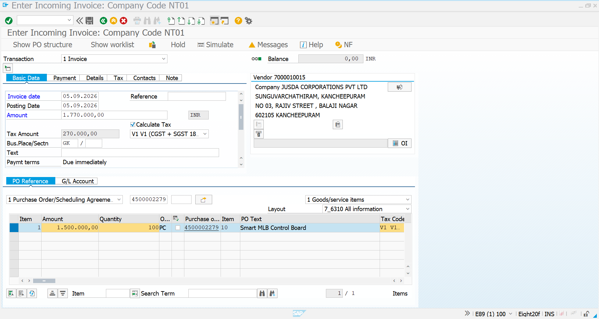
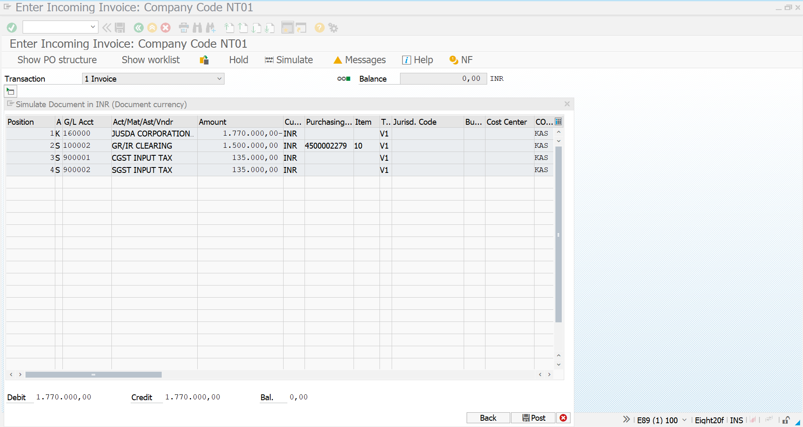
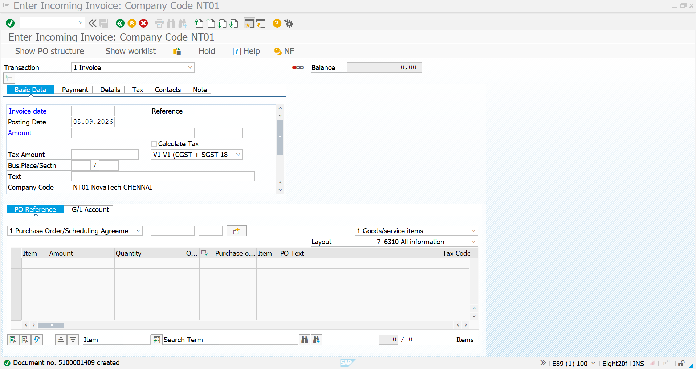
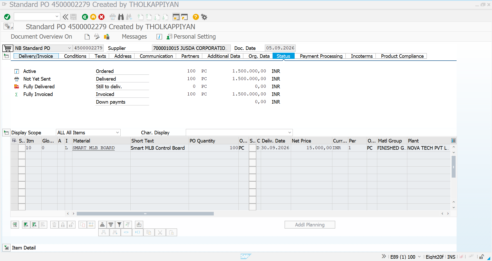
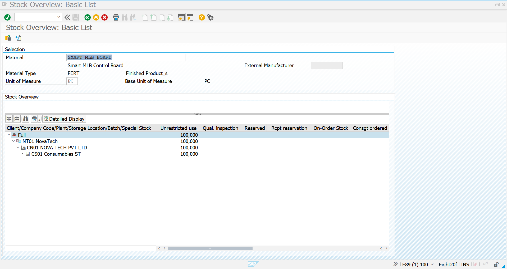

# 08 - Invoice Verification and Testing

## 1. Process Overview

After completing the **Goods Receipt** for the subcontracting Purchase Order, the final procurement activity is **Invoice Verification**.

In this process, Novatech verifies the invoice received from the subcontracting supplier against the Purchase Order and Goods Receipt.

For this project scenario, the subcontracting cycle is completed for **100 PC of SMART_MLB_BOARD**.

| Field | Value |
|---|---|
| Purchase Order | `4500002279` |
| Supplier | `7000010015` – JUSDA CORPORATIONS PVT LTD |
| Material | `SMART_MLB_BOARD` |
| Material Description | Smart MLB Control Board |
| PO Quantity | `100 PC` |
| Goods Receipt Quantity | `100 PC` |
| Net Price | `15,000 INR / PC` |
| PO Net Value | `1,500,000 INR` |
| Tax | `270,000 INR` |
| Invoice Gross Amount | `1,770,000 INR` |
| Plant | `CN01` |
| Storage Location | `CS01` |
| Goods Receipt Material Document | `3333330834` |
| Invoice Verification | `MIRO` |

The invoice is verified using transaction **`MIRO`**.

The complete subcontracting process is therefore:

```text
Material Master
       ↓
BOM
       ↓
Initial ROH Stock
100 PCB + 100 IC + 200 Connectors
       ↓
Purchase Requisition
       ↓
Subcontracting Purchase Order
4500002279
       ↓
Provide Components to Vendor
ME2O
       ↓
Goods Receipt
100 PC SMART_MLB_BOARD
       ↓
Invoice Verification
MIRO
       ↓
PO History Verification
ME23N
       ↓
Subcontracting Process Completed
```

---

## 2. MIRO - Initial Screen

### Transaction Code

`MIRO`

### Process

Start transaction `MIRO` to create an incoming supplier invoice.

The invoice is created with reference to the subcontracting Purchase Order.

Enter the required invoice header information such as:

- **Invoice Date:** `05.09.2026`
- **Posting Date:** `05.09.2026`
- **Company Code:** `NT01`
- **Supplier:** `7000010015`
- **Currency:** `INR`
- **PO Reference:** `4500002279`

The invoice is related to the subcontracting Purchase Order for `SMART_MLB_BOARD`.

### Screenshot



---

## 3. Enter Invoice Header and PO Reference

After entering the invoice header information, the Purchase Order is entered as the reference document.

For this scenario:

| Field | Value |
|---|---|
| Company Code | `NT01` |
| Supplier | `7000010015` |
| Supplier Name | JUSDA CORPORATIONS PVT LTD |
| Invoice Date | `05.09.2026` |
| Posting Date | `05.09.2026` |
| PO Reference | `4500002279` |
| Currency | `INR` |
| Invoice Quantity | `100 PC` |

The Purchase Order reference allows SAP to retrieve the relevant PO item and its purchasing information.

### Screenshot



---

## 4. Verify Invoice Amount and Tax

The invoice amount is verified against the Purchase Order value and applicable tax.

For the Novatech scenario:

| Calculation | Amount |
|---|---:|
| Quantity | `100 PC` |
| Price per PC | `15,000 INR` |
| PO Net Value | `1,500,000 INR` |
| CGST | `135,000 INR` |
| SGST | `135,000 INR` |
| Total Tax | `270,000 INR` |
| Invoice Gross Amount | `1,770,000 INR` |

### Calculation

```text
100 PC × 15,000 INR
        ↓
1,500,000 INR Net Value

CGST = 135,000 INR
SGST = 135,000 INR
        ↓
270,000 INR Total Tax

1,500,000 + 270,000
        ↓
1,770,000 INR Invoice Gross Amount
```

The MIRO screen shows the invoice amount of **1,770,000 INR** including the calculated tax.

The PO item itself has a net value of **1,500,000 INR** for 100 PC.

### Screenshot


---

## 5. Simulate Invoice Accounting Document

Before posting the invoice, the invoice document can be simulated to verify the accounting entries.

The simulation confirms that the debit and credit amounts are balanced.

The screenshot shows:

| Accounting Element | Amount |
|---|---:|
| Vendor / Supplier | `1,770,000 INR` |
| GR/IR Clearing | `1,500,000 INR` |
| CGST Input Tax | `135,000 INR` |
| SGST Input Tax | `135,000 INR` |
| Total Debit | `1,770,000 INR` |
| Total Credit | `1,770,000 INR` |
| Balance | `0.00 INR` |

The zero balance confirms that the simulated accounting document is balanced.

```text
Vendor Liability
1,770,000 INR
       ↓
GR/IR Clearing
1,500,000 INR

CGST Input Tax
135,000 INR

SGST Input Tax
135,000 INR
       ↓
Total
1,770,000 INR

Balance = 0.00 INR
```

This is an important validation before posting the invoice.

---

## 6. Post the Invoice

After verifying the invoice amount, PO reference, quantity, tax and accounting simulation, post the invoice.

SAP successfully creates the invoice document.

The system displays the confirmation:

```text
Document no. 5100001409 created
```

Therefore, the invoice verification process has been successfully completed.

### Screenshot



---

## 7. Verify Final Purchase Order Status

After posting the invoice, the Purchase Order can be reviewed to confirm the final procurement status.

Purchase Order:

`4500002279`

The PO status confirms:

| PO Status | Quantity / Value |
|---|---:|
| Ordered | `100 PC` |
| Delivered | `100 PC` |
| Still to Deliver | `0 PC` |
| Invoiced | `100 PC` |
| PO Net Value | `1,500,000 INR` |
| Invoiced Value | `1,500,000 INR` |

The status indicators show:

- **Active**
- **Not Yet Sent**
- **Fully Delivered**
- **Fully Invoiced**

The PO is therefore fully delivered and fully invoiced.

### Screenshot



---

## 8. Verify Final Finished Product Stock

After the Goods Receipt, the finished product stock is verified using **MMBE**.

Material:

`SMART_MLB_BOARD`

The stock overview confirms:

| Field | Value |
|---|---|
| Material | `SMART_MLB_BOARD` |
| Material Type | `FERT` |
| Plant | `CN01` |
| Storage Location | `CS01` |
| Unrestricted-Use Stock | `100 PC` |

The 100 PC finished product received from the subcontractor is available in unrestricted-use stock.

### Screenshot



---

# Testing

## 9. End-to-End Subcontracting Test

The complete subcontracting process is tested from component availability through invoice verification.

### Test Scenario

```text
ROH Components
       ↓
100 PCB Main Boards
100 Control ICs
200 Connectors
       ↓
BOM
1 PCB + 1 IC + 2 Connectors
       ↓
100 SMART_MLB_BOARD
       ↓
Purchase Requisition
       ↓
Purchase Order
4500002279
       ↓
ME2O
Components Provided to JUSDA
       ↓
MIGO
Goods Receipt
100 PC
       ↓
MIRO
Invoice Verification
       ↓
Invoice Document
5100001409
       ↓
ME23N
Fully Delivered + Fully Invoiced
       ↓
Final Stock
100 PC SMART_MLB_BOARD
```

---

## 10. Test Case Results

| Test Area | Expected Result | Actual Result | Status |
|---|---|---|---|
| Material Master | Required materials available | Materials available | Completed |
| BOM | Correct component quantities maintained | 1 PCB + 1 IC + 2 Connectors | Completed |
| Initial ROH Stock | Components available | 100 + 100 + 200 PC | Completed |
| Purchase Requisition | Requirement created | 100 PC FERT | Completed |
| Purchase Order | Subcontracting PO created | `4500002279` | Completed |
| Supplier | Correct subcontractor assigned | JUSDA CORPORATIONS PVT LTD | Completed |
| Component Provision | Components provided to vendor | Completed through ME2O | Completed |
| Goods Receipt | Finished product received | 100 PC | Completed |
| Material Document | GR document generated | `3333330834` | Completed |
| Invoice Verification | Invoice successfully posted | `5100001409` | Completed |
| Invoice Quantity | Matches received quantity | 100 PC | Completed |
| PO Status | Fully delivered and invoiced | Confirmed | Completed |
| Final Stock | Finished product available | 100 PC | Completed |
| End-to-End Process | Complete subcontracting cycle | Successfully completed | Completed |

---

## 11. Document Flow Verification

The complete document flow for the subcontracting process is:

| Process | Transaction | Document / Reference |
|---|---|---|
| Purchase Requisition | `ME51N` | `0010001748` |
| Purchase Order | `ME21N` | `4500002279` |
| Component Provision | `ME2O` | Stock provided to vendor |
| Goods Receipt | `MIGO` | Material Document `3333330834` |
| Invoice Verification | `MIRO` | Invoice Document `5100001409` |
| PO Verification | `ME23N` | PO `4500002279` |
| Stock Verification | `MMBE` | 100 PC FERT stock |

---

## 12. Final Testing Summary

The Novatech subcontracting scenario has been successfully validated.

### Procurement Validation

- Purchase Requisition created for `100 PC`.
- Purchase Order `4500002279` created for `100 PC`.
- Supplier `7000010015` assigned.
- Subcontracting components provided to the supplier using `ME2O`.

### Inventory Validation

- `100 PC` PCB Main Board available.
- `100 PC` Control IC available.
- `200 PC` Connectors available.
- Components provided to the subcontractor.
- `100 PC` SMART_MLB_BOARD received.
- Final unrestricted stock confirmed as `100 PC`.

### Invoice Validation

- PO net value: `1,500,000 INR`.
- CGST: `135,000 INR`.
- SGST: `135,000 INR`.
- Total invoice amount: `1,770,000 INR`.
- Invoice document: `5100001409`.
- Accounting simulation balance: `0.00 INR`.
- PO status: **Fully Delivered** and **Fully Invoiced**.

---

## 13. Overall Subcontracting Process Completion

```text
                    NOVATECH
                       │
                       ↓
              Raw Material Stock
                       │
        ┌──────────────┼──────────────┐
        ↓              ↓              ↓
     PCB 100         IC 100      Connector 200
        └──────────────┼──────────────┘
                       ↓
                      BOM
                       ↓
             Purchase Requisition
                 100 PC FERT
                       ↓
              Purchase Order
                4500002279
                       ↓
             JUSDA CORPORATIONS
                       ↓
                    ME2O
             Component Provision
                       ↓
                    Vendor
                       ↓
            Subcontracting Work
                       ↓
                    MIGO
             Goods Receipt 101
                       ↓
               100 PC FERT
                       ↓
                    MIRO
             Invoice Verification
                       ↓
              Invoice 5100001409
                       ↓
                   ME23N
             Fully Delivered
             Fully Invoiced
                       ↓
                    MMBE
             100 PC Final Stock
                       ↓
          SUBCONTRACTING COMPLETED
```

---

# Screenshot Summary

| No. | Screenshot | Purpose |
|---:|---|---|
| 1 | `MIRO-Initial-Screen.png` | Initial MIRO invoice verification screen |
| 2 | `MIRO-PO-GR-Verification.png` | PO reference, quantity and invoice verification |
| 3 | `MIRO-Invoice-Posted.png` | Confirmation of successfully posted invoice |
| 4 | `MMBE-Final-Finished-Product-Stock.png` | Final 100 PC finished product stock |
| 5 | `ME23N-PO-History-Final.png` | Final PO status showing fully delivered and fully invoiced |

---

# Completion Status

| Activity | Status |
|---|---|
| Material Master Creation | Completed |
| BOM Creation | Completed |
| Initial ROH Stock | Completed |
| Purchase Requisition | Completed |
| Subcontracting Purchase Order | Completed |
| Component Provision to Vendor | Completed |
| Goods Receipt | Completed |
| Invoice Verification | Completed |
| Invoice Document | `5100001409` |
| Purchase Order | `4500002279` |
| Goods Receipt Material Document | `3333330834` |
| Final Finished Product Stock | `100 PC` |
| PO Delivery Status | Fully Delivered |
| PO Invoice Status | Fully Invoiced |
| End-to-End Subcontracting Testing | Completed |

## Final Result

The complete **SAP S/4HANA MM Subcontracting process** for Novatech Electronics Pvt. Ltd. has been successfully executed and tested.

The process covers the complete **Procure-to-Pay cycle with subcontracting**, including component provision, finished-product receipt, invoice verification and final document/status validation.

**Subcontracting Scenario: COMPLETED**