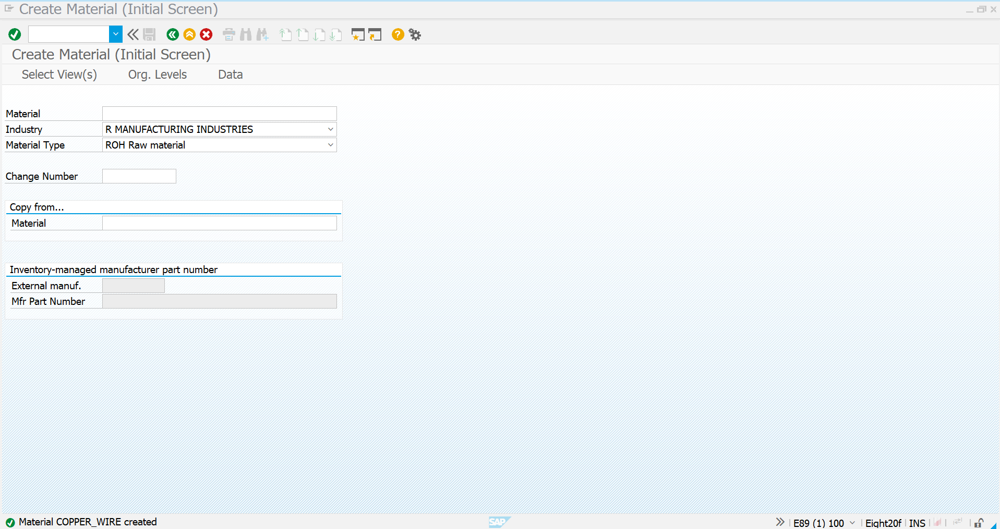
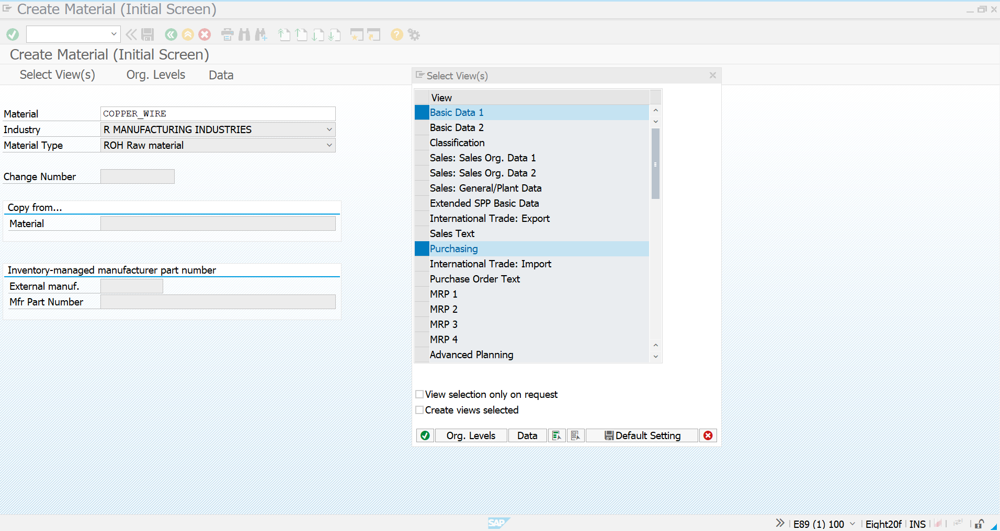
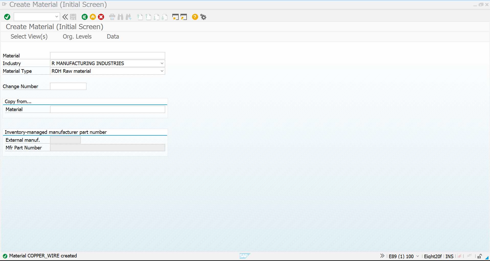
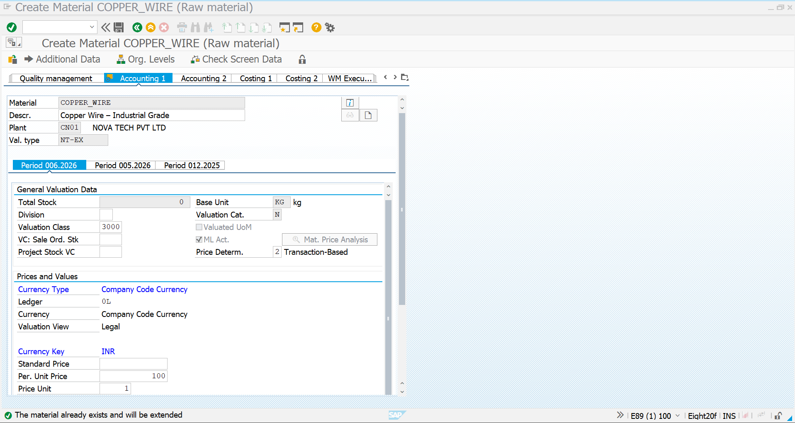
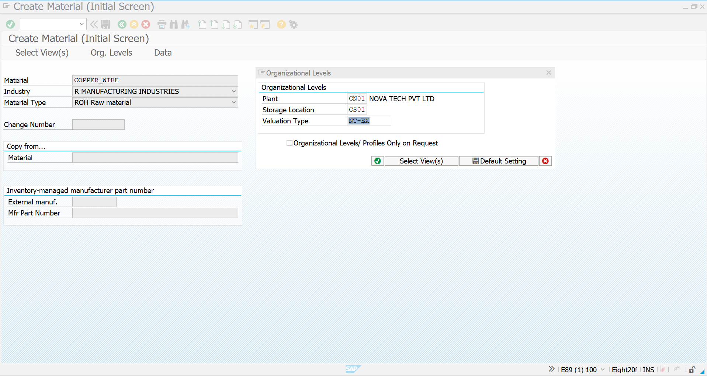
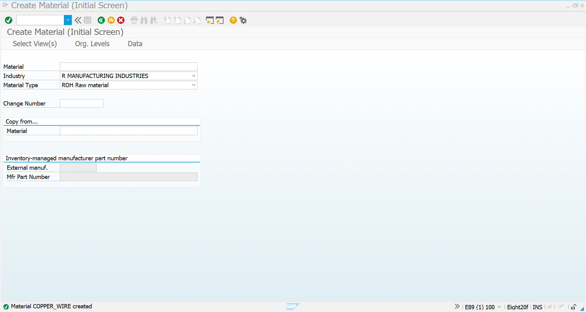
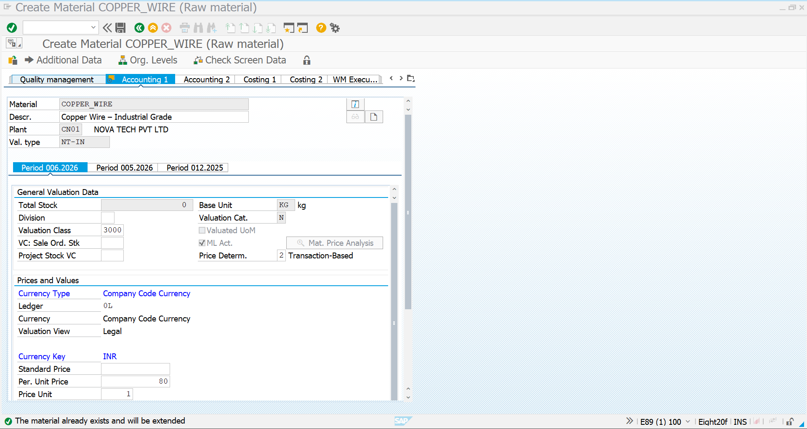
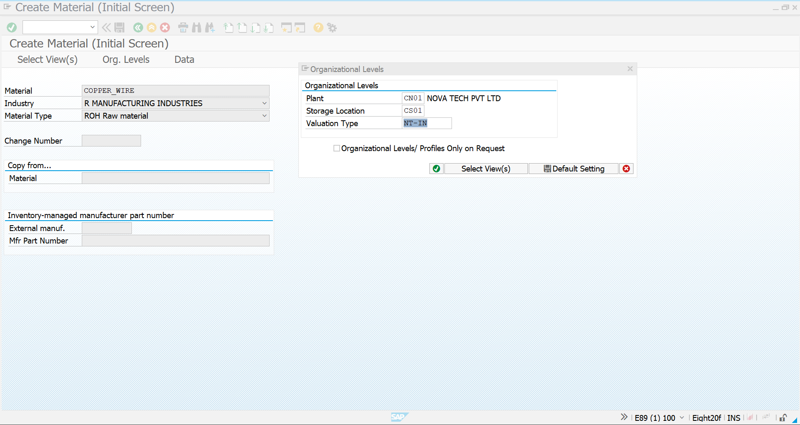
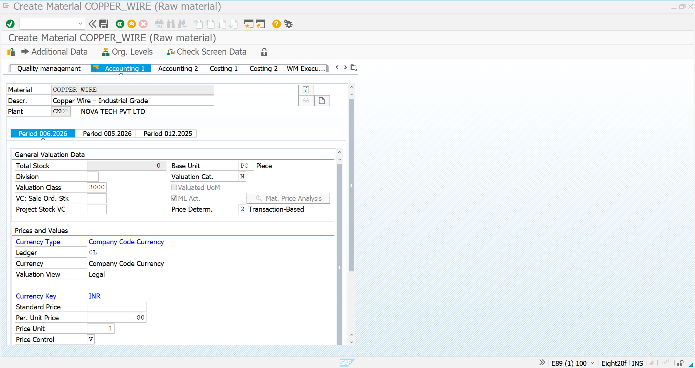
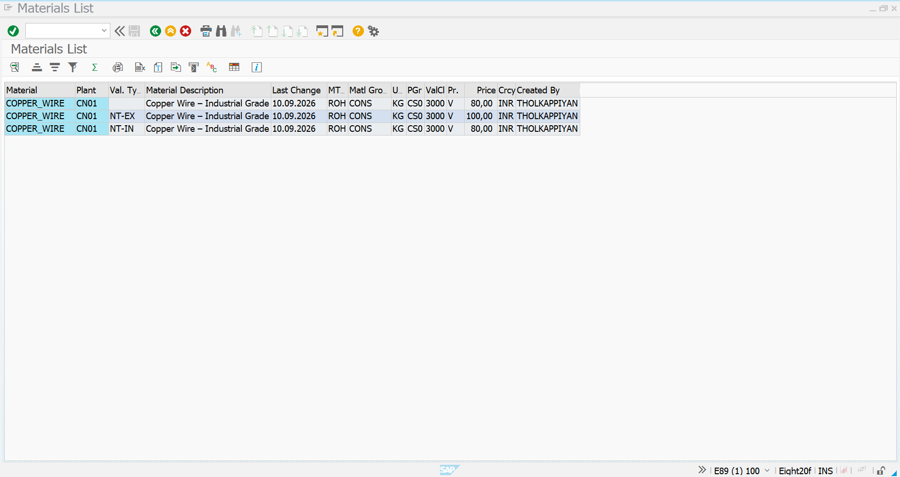

# 02 – Material and Valuation Types

## 1. Overview

This document covers the creation and extension of the material **COPPER_WIRE** for the Split Valuation scenario in SAP S/4HANA MM.

The same material number is maintained with different valuation types so that the stock can be managed and valued separately based on its source.

### Scenario

**Company:** Novatech Electronics Pvt. Ltd.  
**Plant:** CN01 – NOVA TECH PVT LTD  
**Storage Location:** CS01  
**Material:** `COPPER_WIRE`  
**Material Description:** Copper Wire – Industrial Grade  
**Material Type:** ROH – Raw Material  
**Base Unit:** KG  
**Valuation Category:** `N` – NOVA VAL CAT  
**Valuation Types:**

| Valuation Type | Description | Price |
|---|---|---:|
| `NT-IN` | Internal Valuation | ₹80/KG |
| `NT-EX` | External Valuation | ₹100/KG |

The objective is to maintain one material number with two separately valued stocks.

---

## 2. Business Scenario

Novatech uses copper wire as a raw material for electronics manufacturing.

The company obtains the same material from two different sources:

- **NT-IN – Internal:** Copper wire sourced internally.
- **NT-EX – External:** Copper wire procured from an external supplier.

Although both stocks use the same material number `COPPER_WIRE`, SAP maintains separate valuation records for each valuation type.

```text
                         COPPER_WIRE
                              |
                    Valuation Category N
                              |
              +---------------+---------------+
              |                               |
              v                               v
          NT-IN                            NT-EX
        Internal                          External
        ₹80/KG                           ₹100/KG
              |                               |
              v                               v
       Internal Stock                  External Stock
```

---

# 3. Material Creation – Normal Material

The material `COPPER_WIRE` was initially created as a normal raw material using transaction **MM01**.

### Material Master Details

| Field | Value |
|---|---|
| Material Number | `COPPER_WIRE` |
| Material Description | Copper Wire – Industrial Grade |
| Material Type | `ROH – Raw Material` |
| Industry Sector | `R – Manufacturing Industries` |
| Plant | `CN01 – NOVA TECH PVT LTD` |
| Storage Location | `CS01` |
| Base Unit | `KG` |
| Purchasing Group | `CS0` |
| Valuation Class | `3000` |
| Price Control | `V – Moving Average Price` |

### Screenshot – Material Created

The following screenshot confirms that the material `COPPER_WIRE` was successfully created with material type **ROH – Raw Material**.



**What this screenshot demonstrates:**

- Material number is `COPPER_WIRE`.
- Material type is `ROH – Raw Material`.
- Industry sector is Manufacturing Industries.
- SAP confirms the material was successfully created.
- This material becomes the base material for the split valuation scenario.

---

# 4. MM01 – Initial Screen

After creating the basic material, **MM01 – Create Material** is used to extend the material for the required valuation types.

The material number `COPPER_WIRE` is entered and the material type remains **ROH – Raw Material**.



### Screenshot Explanation

This screen represents the starting point for extending the existing material.

The important fields are:

- **Material:** `COPPER_WIRE`
- **Industry:** `R – Manufacturing Industries`
- **Material Type:** `ROH – Raw Material`

The material is then extended with the required organizational levels and valuation type.

---

# 5. Extend Material for External Valuation – NT-EX

The first valuation-specific extension is created for the external valuation type `NT-EX`.

### Organizational Levels

| Field | Value |
|---|---|
| Material | `COPPER_WIRE` |
| Plant | `CN01` |
| Storage Location | `CS01` |
| Valuation Type | `NT-EX` |



### Screenshot Explanation

The screenshot shows the material being extended for valuation type **NT-EX**.

This creates a separate valuation record for externally sourced copper wire.

The material remains the same:

```text
Material = COPPER_WIRE
Valuation Type = NT-EX
Plant = CN01
Storage Location = CS01
```

---

# 6. External Valuation – Accounting View

The Accounting 1 view is maintained for valuation type `NT-EX`.

### Accounting Data

| Field | Value |
|---|---|
| Material | `COPPER_WIRE` |
| Plant | `CN01` |
| Valuation Type | `NT-EX` |
| Valuation Category | `N` |
| Valuation Class | `3000` |
| Currency | INR |
| Price Control | `V` |
| Price | ₹100/KG |
| Price Unit | 1 KG |



### Screenshot Explanation

This screenshot demonstrates the accounting data for the **external valuation type**.

The important point is the valuation type:

**NT-EX**

The price is maintained separately from the internal valuation. This allows externally sourced `COPPER_WIRE` stock to carry its own valuation.

---

# 7. MM01 – External Valuation Type

The material is extended using valuation type `NT-EX`.



### Screenshot Explanation

The screenshot confirms that:

- Material = `COPPER_WIRE`
- Plant = `CN01`
- Storage Location = `CS01`
- Valuation Type = `NT-EX`

This establishes the external valuation-specific material record.

---

# 8. Extend Material for Internal Valuation – NT-IN

The same material number is then extended for the internal valuation type `NT-IN`.

### Organizational Levels

| Field | Value |
|---|---|
| Material | `COPPER_WIRE` |
| Plant | `CN01` |
| Storage Location | `CS01` |
| Valuation Type | `NT-IN` |



### Screenshot Explanation

This screenshot shows the same material being extended for the second valuation type:

**NT-IN – Internal**

The material number does not change.

Only the valuation type changes:

```text
COPPER_WIRE + NT-IN
```

This allows SAP to maintain a separate valuation record for internally sourced copper wire.

---

# 9. Internal Valuation – Accounting View

The Accounting 1 view is maintained for valuation type `NT-IN`.

### Accounting Data

| Field | Value |
|---|---|
| Material | `COPPER_WIRE` |
| Plant | `CN01` |
| Valuation Type | `NT-IN` |
| Valuation Category | `N` |
| Valuation Class | `3000` |
| Currency | INR |
| Price Control | `V` |
| Price | ₹80/KG |
| Price Unit | 1 KG |



### Screenshot Explanation

The screenshot demonstrates the accounting data maintained for **NT-IN – Internal Valuation**.

The key difference from NT-EX is the valuation type and valuation price:

```text
NT-IN → ₹80/KG
NT-EX → ₹100/KG
```

Therefore, the same material can carry different values depending on the valuation type.

---

# 10. MM01 – Internal Valuation Type

The material is extended using valuation type `NT-IN`.



### Screenshot Explanation

The screenshot confirms the organizational level for the internal valuation record:

- Material = `COPPER_WIRE`
- Plant = `CN01`
- Storage Location = `CS01`
- Valuation Type = `NT-IN`

This creates the second valuation-specific record for the same material.

---

# 11. Valuation Category – N

The material uses valuation category:

**`N – NOVA VAL CAT`**



### Screenshot Explanation

The screenshot shows the valuation category assigned to the material:

```text
Valuation Category = N
Description = NOVA VAL CAT
```

The valuation category determines the basis on which the material can be split into separate valuation types.

In this project, category `N` is used to distinguish the internal and external procurement/source valuations.

---

# 12. Material Valuation Structure

The resulting material structure is:

```text
                         COPPER_WIRE
                              |
                    Valuation Category N
                              |
              +---------------+---------------+
              |                               |
              v                               v
           NT-IN                            NT-EX
          Internal                          External
          ₹80/KG                           ₹100/KG
              |                               |
              v                               v
       Separate Valuation              Separate Valuation
             Record                          Record
```

The important concept is that **one material number is used for multiple valuation types**.

---

# 13. Display of All Valuation Types

After the material has been extended, the material list confirms the three records associated with `COPPER_WIRE`.



### Screenshot Explanation

The screenshot shows:

| Material | Plant | Valuation Type | Description | UoM | Price |
|---|---|---|---|---|---:|
| `COPPER_WIRE` | CN01 | Blank/Header | Copper Wire – Industrial Grade | KG | ₹80 |
| `COPPER_WIRE` | CN01 | `NT-EX` | Copper Wire – Industrial Grade | KG | ₹100 |
| `COPPER_WIRE` | CN01 | `NT-IN` | Copper Wire – Industrial Grade | KG | ₹80 |

This confirms that SAP maintains the same material number with different valuation-specific records.

> The header/general material record should not be interpreted as a third business valuation type. The actual split valuation types in this scenario are `NT-IN` and `NT-EX`.

---

# 14. Material Master – Final Configuration

The final configuration of `COPPER_WIRE` is:

| Configuration | Value |
|---|---|
| Material | `COPPER_WIRE` |
| Description | Copper Wire – Industrial Grade |
| Material Type | ROH |
| Plant | CN01 |
| Storage Location | CS01 |
| Base Unit | KG |
| Valuation Category | N – NOVA VAL CAT |
| Valuation Type 1 | NT-IN – Internal |
| Valuation Type 2 | NT-EX – External |
| Valuation Class | 3000 |
| Price Control | V – Moving Average |
| NT-IN Price | ₹80/KG |
| NT-EX Price | ₹100/KG |

---

# 15. Internal vs External Valuation

The main purpose of the configuration is to keep the valuation of the two sources separate.

### Internal Stock

```text
COPPER_WIRE
      |
    NT-IN
      |
Internal Source
      |
₹80/KG
```

### External Stock

```text
COPPER_WIRE
      |
    NT-EX
      |
External Source
      |
₹100/KG
```

Therefore, SAP can track:

- Quantity separately
- Stock value separately
- Valuation price separately
- Material movements separately by valuation type

---

# 16. End-to-End Material Setup Flow

```text
Create COPPER_WIRE
        |
        v
Material Type = ROH
        |
        v
Plant CN01 / Storage CS01
        |
        v
Assign Valuation Category N
        |
        +----------------------+
        |                      |
        v                      v
     NT-IN                  NT-EX
   Internal                External
    ₹80/KG                 ₹100/KG
        |                      |
        +----------+-----------+
                   |
                   v
        Same Material Number
          COPPER_WIRE
                   |
                   v
      Separate Valuation Records
```

---

# 17. Business Result

The material master configuration successfully establishes **split valuation** for `COPPER_WIRE`.

Instead of creating two different material numbers such as:

```text
COPPER_WIRE_INTERNAL
COPPER_WIRE_EXTERNAL
```

SAP uses a single material:

```text
COPPER_WIRE
```

with two valuation types:

```text
COPPER_WIRE / NT-IN → Internal → ₹80/KG
COPPER_WIRE / NT-EX → External → ₹100/KG
```

This provides better material master control while allowing the company to maintain separate stock valuation for different sources.

---

# 18. Transactions Used

| Transaction | Purpose |
|---|---|
| `MM01` | Create / Extend Material |
| `MM03` | Display Material |
| `MMBE` | Stock Overview |
| `OMW0` | Activate Split Material Valuation |
| Configuration | Define Valuation Category and Valuation Types |

---

