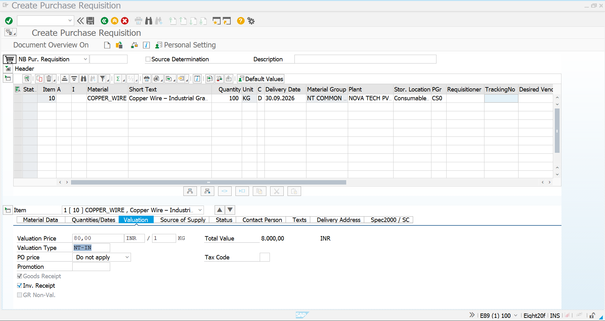
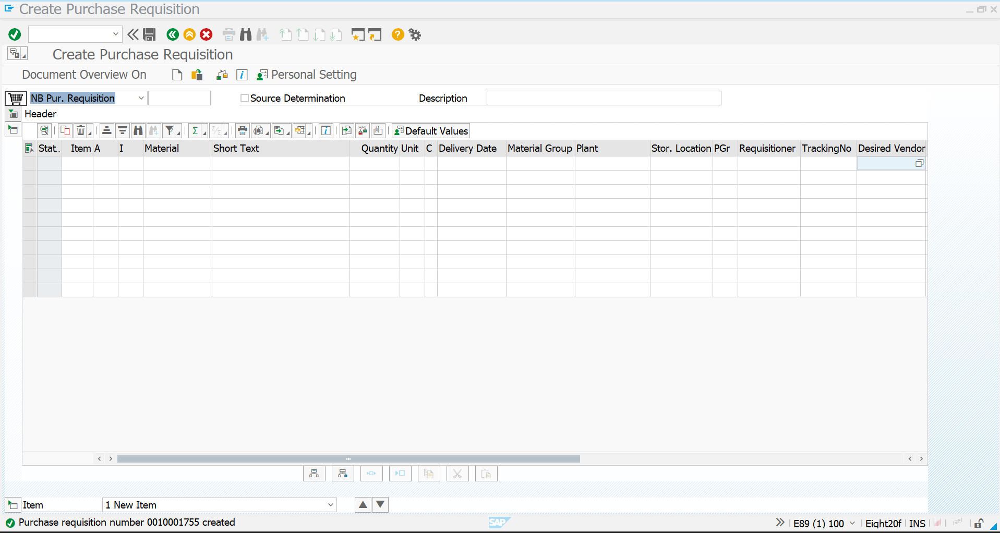
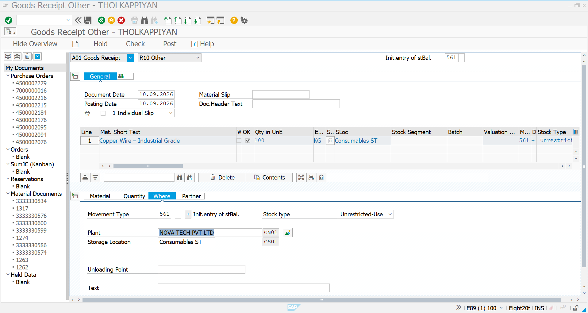
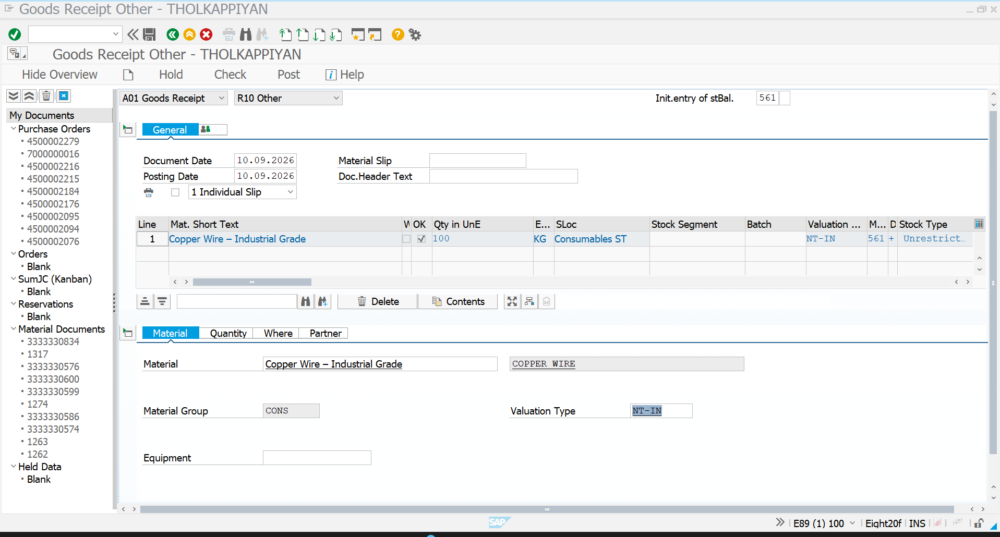
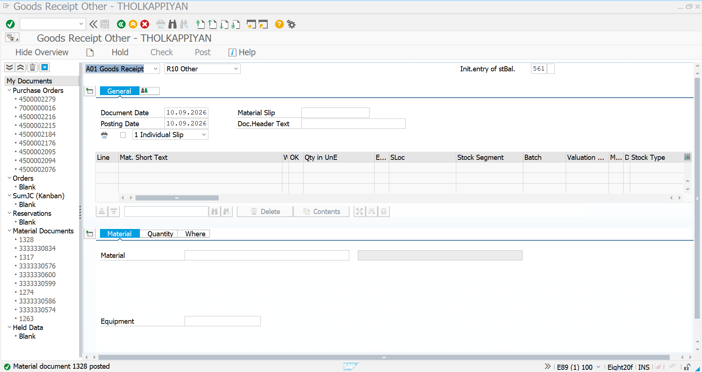
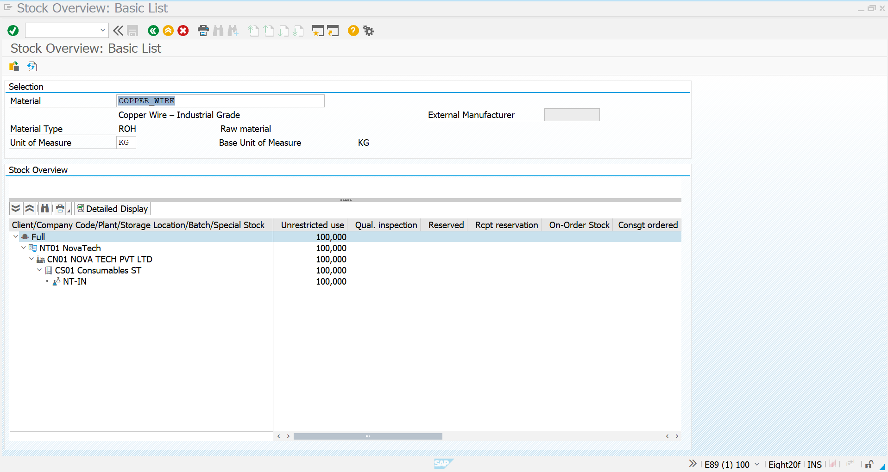

# 03 – Internal Procurement and Stock Transfer

## 1. Objective

This scenario demonstrates internal procurement and stock transfer for the split-valuated material `COPPER_WIRE` using the internal valuation type `NT-IN`.

---

## 2. Business Scenario

Novatech Electronics requires `COPPER_WIRE` for internal manufacturing activities.

The process demonstrates creation of a Purchase Requisition, identification of the internal valuation type, manual initial stock posting using MIGO, and final stock verification using MMBE.

---

## 3. Material and Valuation Details

| Field | Value |
|---|---|
| Material | `COPPER_WIRE` |
| Description | Copper Wire – Industrial Grade |
| Material Type | ROH |
| Quantity | 100 KG |
| Plant | CN01 |
| Storage Location | CS01 |
| Valuation Type | `NT-IN` |
| Valuation Price | INR 80 / KG |
| Total Value | INR 8,000 |

---

## 4. Create Purchase Requisition – ME51N

Transaction `ME51N` is used to create the Purchase Requisition.



---

## 5. Enter COPPER_WIRE Requirement

Enter `COPPER_WIRE` with a requirement quantity of `100 KG`.

The PR is assigned to plant `CN01`, storage location `CS01`, delivery date `30.09.2026`, material group `NT COMMON`, and purchasing group `CS0`.



**Result:** Purchase Requisition `0010001755` was created successfully.

---

## 6. Check Internal Valuation Type

Open the PR item and check the **Valuation** tab.

The PR shows:

- Valuation Price: `INR 80 / KG`
- Total Value: `INR 8,000`
- Valuation Type: `NT-IN`


---

## 7. Create Initial Stock Using MIGO

Transaction `MIGO` is used to enter initial stock for demonstration of the internal valuation process.

Select:

- Goods Receipt
- Reference: `Other`
- Movement Type: `561 – Initial Entry of Stock Balances`



---

## 8. Enter Internal Valuation Type

Enter the material, quantity, plant, storage location, and valuation type.

| Field | Value |
|---|---|
| Material | `COPPER_WIRE` |
| Quantity | 100 KG |
| Plant | CN01 |
| Storage Location | CS01 |
| Movement Type | 561 |
| Stock Type | Unrestricted-Use |
| Valuation Type | `NT-IN` |



The MIGO item displays valuation type `NT-IN`, confirming that the stock is being posted to the internal valuation segment.

---

## 9. Post Internal Stock

Post the MIGO transaction after entering the required stock information.

The system posts `100 KG` of `COPPER_WIRE` under valuation type `NT-IN`.



**Result:** Material document `1328` was posted successfully.

---

## 10. Final Stock Display – MMBE

Transaction `MMBE` is used to verify the final stock position.

The Stock Overview displays the stock hierarchy:

```text
COPPER_WIRE
    ↓
NT01 NovaTech
    ↓
CN01 NOVA TECH PVT LTD
    ↓
CS01 Consumables ST
    ↓
NT-IN
    ↓
100 KG Unrestricted-Use
```



### Final Result

| Material | Valuation Type | Plant | Storage Location | Stock Type | Quantity |
|---|---|---|---|---|---:|
| COPPER_WIRE | NT-IN | CN01 | CS01 | Unrestricted-Use | 100 KG |

The final MMBE display confirms that `100 KG` of `COPPER_WIRE` is available as unrestricted-use stock under valuation type `NT-IN`.

---

## Process Flow

```text
ME51N
Create Purchase Requisition
        ↓
COPPER_WIRE – 100 KG
        ↓
Valuation Type: NT-IN
        ↓
MIGO
Goods Receipt → Other
        ↓
Movement Type: 561
        ↓
Post Initial Stock
        ↓
100 KG NT-IN Internal Stock
        ↓
MMBE
Stock Overview
        ↓
Final Stock Verification
```

## Transactions Used

| Transaction | Purpose |
|---|---|
| ME51N | Create Purchase Requisition |
| MIGO | Post Initial Stock |
| MMBE | Display and verify stock |

## Final Outcome

**Purchase Requisition Created → NT-IN Valuation Identified → Initial Stock Posted → MMBE Verification → 100 KG Internal Stock Confirmed**