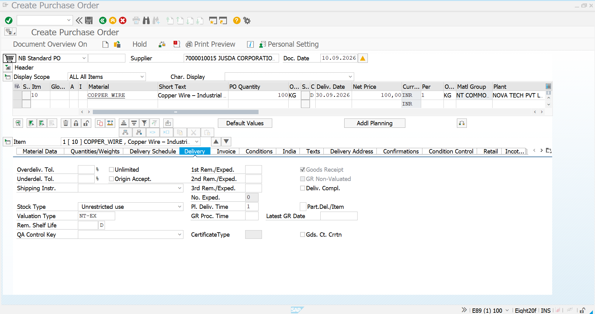
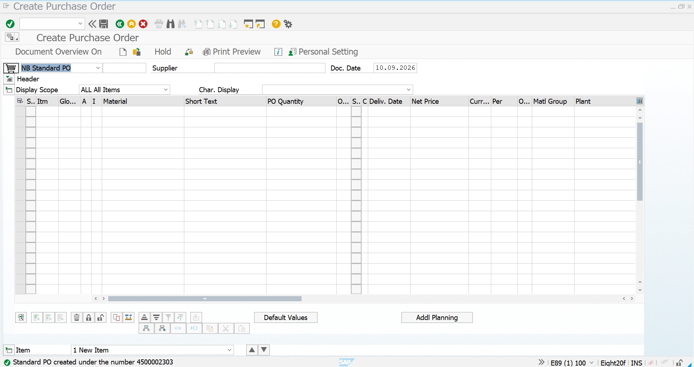
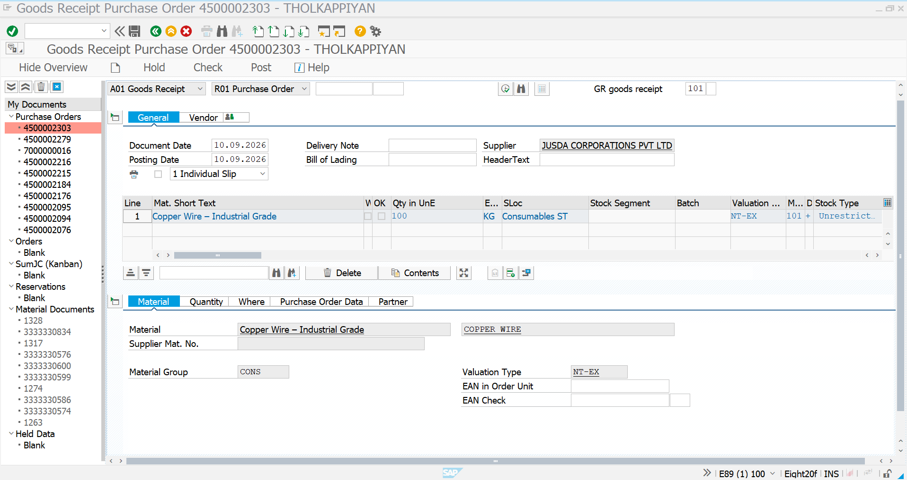
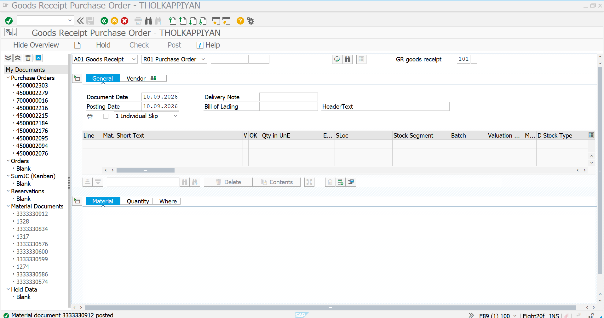
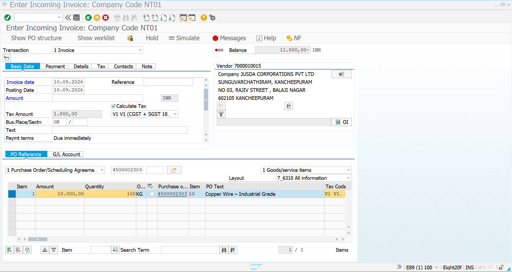
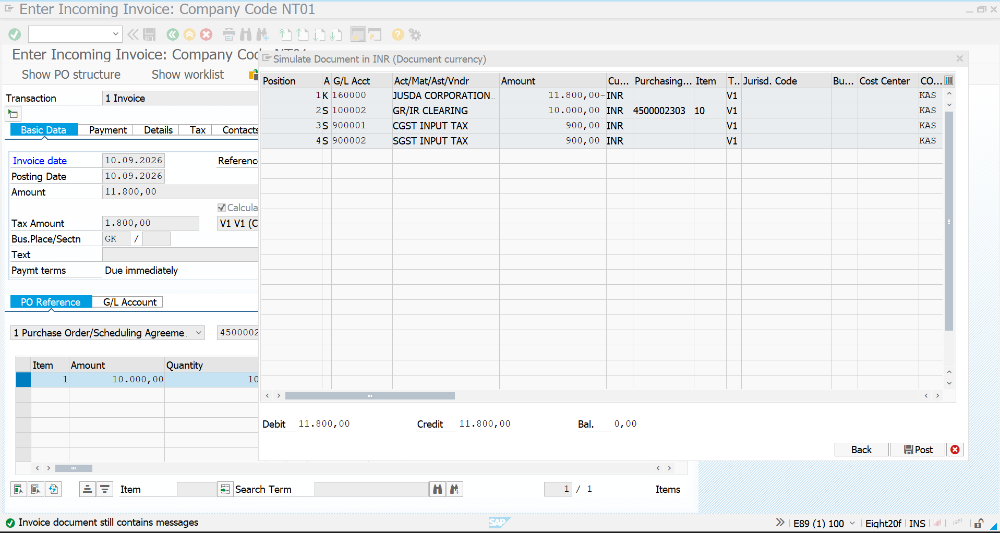
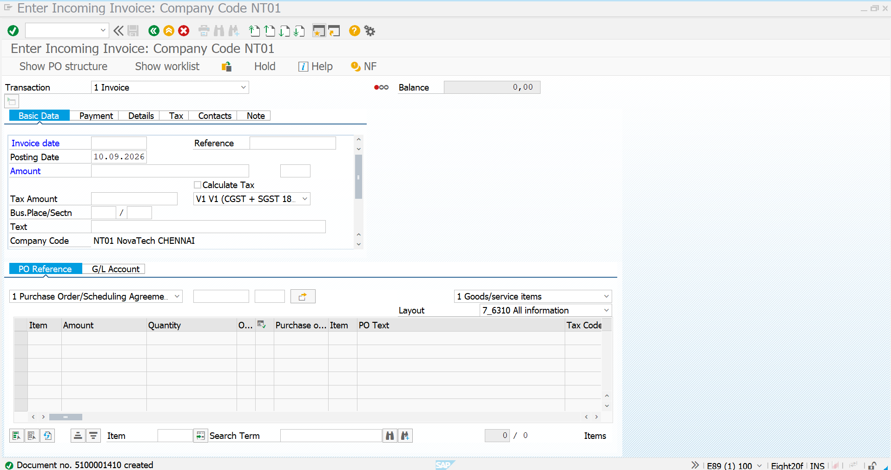
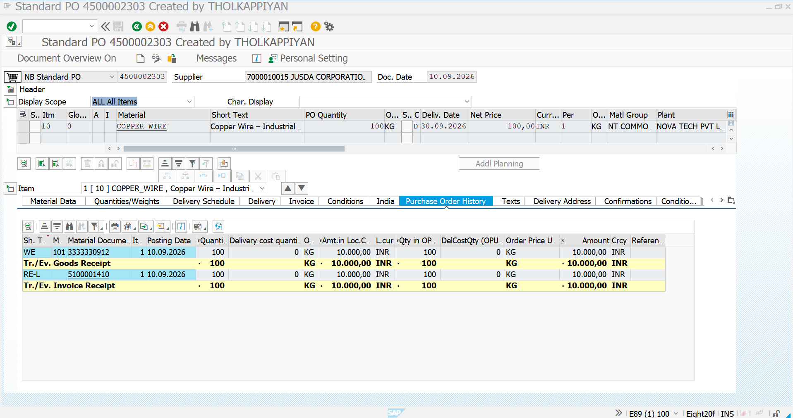

# External Procurement – PO, MIGO and MIRO Process

## 01. Objective

This scenario demonstrates the complete **External Procurement process** for a split-valuated material in SAP S/4HANA MM.

The process covers:

**Purchase Order → Goods Receipt → Invoice Verification → Stock Verification → PO History**

Material used in this scenario:

- Material: `COPPER_WIRE`
- Description: Copper Wire – Industrial Grade
- Material Type: `ROH`
- Unit: `KG`
- Plant: `CN01`
- Storage Location: `CS01 – Consumables ST`
- Valuation Type: `NT-EX`
- Supplier: `7000010015 – JUSDA CORPORATIONS PVT LTD`
- PO Quantity: `100 KG`
- PO Price: `₹100/KG`
- PO Value: `₹10,000`
- Tax: `18%`
- Invoice Total: `₹11,800`

---

## 02. External Procurement Process Flow

The complete process executed in this scenario:

**External Supplier → Purchase Order → Goods Receipt → External Valuation Stock → Invoice Verification → Accounting Document → PO History → Stock Verification**

Main transactions:

| Process | SAP Transaction |
|---|---|
| Create Purchase Order | `ME21N` |
| Display Purchase Order | `ME23N` |
| Goods Receipt | `MIGO` |
| Invoice Verification | `MIRO` |
| Stock Overview | `MMBE` |

---

## 03. External Procurement Business Scenario

Novatech Electronics purchases `COPPER_WIRE` from an external supplier for manufacturing requirements.

Since the material is configured for split valuation, the externally procured stock is maintained under valuation type:

**`NT-EX` – External Procurement**

The external procurement quantity in this scenario is:

**100 KG**

at a purchase price of:

**₹100/KG**

Therefore:

**PO Value = 100 KG × ₹100 = ₹10,000**

---

## 04. Create External Purchase Order – ME21N

Transaction: `ME21N`

Create a new **Standard Purchase Order**.

Enter the supplier and procurement details:

- Document Type: `NB – Standard PO`
- Supplier: `7000010015`
- Material: `COPPER_WIRE`
- Quantity: `100 KG`
- Delivery Date: `30.09.2026`
- Plant: `CN01`
- Net Price: `₹100/KG`

The PO is created for external procurement.

**Result:** The ME21N initial screen is used to create the external procurement purchase order.

---

## 05. Enter External Procurement PO Details

The purchase order contains the supplier, material, quantity, price and plant information.

The created PO number is:

**4500002303**

Key details:

- Supplier: `7000010015 – JUSDA CORPORATIONS PVT LTD`
- Material: `COPPER_WIRE`
- Quantity: `100 KG`
- Price: `₹100/KG`
- Plant: `CN01`
- Delivery Date: `30.09.2026`

**Result:** External Purchase Order `4500002303` was successfully created.

---

## 06. Assign External Valuation Type in Purchase Order

Open the PO item details and navigate to the **Delivery** tab.

The valuation type is maintained as:

**`NT-EX`**

This identifies the stock as belonging to the external procurement valuation category.

**Business significance:** The external procurement quantity is separated from the internally valued stock of the same material.

---

## 07. Review Purchase Order Before Goods Receipt

Before receiving the material, verify:

| Field | Value |
|---|---|
| PO Number | `4500002303` |
| Supplier | `7000010015` |
| Material | `COPPER_WIRE` |
| Quantity | `100 KG` |
| Valuation Type | `NT-EX` |
| Price | `₹100/KG` |
| PO Value | `₹10,000` |
| Plant | `CN01` |

The PO is now ready for goods receipt.

---

## 08. Goods Receipt – MIGO

Transaction: `MIGO`

Use:

- Transaction: `A01 – Goods Receipt`
- Reference: `R01 – Purchase Order`
- PO: `4500002303`
- Movement Type: `101`

The material quantity of **100 KG** is received against the purchase order.

**Result:** MIGO retrieves the purchase order information and prepares the 100 KG external stock receipt.

---

## 09. Verify External Valuation Type During Goods Receipt

During goods receipt, verify that the valuation type is:

**`NT-EX`**

The received material is posted to:

- Plant: `CN01`
- Storage Location: `CS01`
- Stock Type: `Unrestricted Use`
- Valuation Type: `NT-EX`
- Quantity: `100 KG`

**Result:** Goods Receipt is posted with movement type `101` for valuation type `NT-EX`.

---

## 10. Material Document Creation

After posting the MIGO transaction, SAP creates a **Material Document**.

The material document records the physical stock receipt and updates inventory.

The posted receipt increases the external valuation stock by:

**100 KG**

The material document is also reflected in the purchase order history.

---

## 11. Invoice Verification – MIRO

Transaction: `MIRO`

Create the supplier invoice with reference to Purchase Order:

**4500002303**

Invoice details:

- Supplier: `JUSDA CORPORATIONS PVT LTD`
- PO Reference: `4500002303`
- Invoice Base Amount: `₹10,000`
- Tax: `₹1,800`
- Total Invoice Amount: `₹11,800`
- Tax Code: `V1`
- Company Code: `NT01`

**Result:** MIRO retrieves the PO item and allows invoice verification against the procurement transaction.

---

## 12. Verify Invoice Conditions and Tax

The invoice contains:

**Base Value = ₹10,000**

**CGST + SGST = ₹1,800**

**Invoice Total = ₹11,800**

The MIRO simulation shows the accounting impact including:

- Vendor liability
- GR/IR clearing
- CGST input tax
- SGST input tax

**Result:** The invoice accounting is balanced with a debit and credit total of **₹11,800**.

---

## 13. Post Supplier Invoice

After checking the invoice amount, tax and PO reference, post the invoice in MIRO.

SAP creates the invoice document:

**`5100001410`**

The invoice is now recorded against Purchase Order `4500002303`.

**Result:** Supplier invoice was successfully posted with balance `0.00 INR`.

---

## 14. Verify Purchase Order History

Transaction: `ME23N`

Open Purchase Order:

**4500002303**

The PO history confirms:

- Goods Receipt completed
- Quantity received: `100 KG`
- Invoice Receipt completed
- Invoice quantity: `100 KG`
- Invoice amount: `₹10,000`
- Material document generated
- Invoice document generated

**Final PO Status:** The complete procurement cycle from PO to GR and Invoice Receipt is reflected in the PO history.

---

## 15. Final Stock Verification – MMBE

Transaction: `MMBE`

Material:

**`COPPER_WIRE`**

After completing the external procurement process, the stock overview shows:

| Valuation Type | Stock |
|---|---:|
| `NT-EX` | 100 KG |
| `NT-IN` | 100 KG |
| **Total** | **200 KG** |

The external procurement stock is separately displayed under:

**`NT-EX`**

while the existing internal stock remains under:

**`NT-IN`**

**Final Result:** The external procurement successfully added **100 KG** of `COPPER_WIRE` under valuation type `NT-EX`, while the existing `NT-IN` stock remains separately valued.

---

# Final Process Summary

| Step | Transaction | Result |
|---|---|---|
| 1 | `ME21N` | External PO created |
| 2 | `ME21N` | Valuation Type `NT-EX` assigned |
| 3 | `MIGO` | 100 KG received |
| 4 | `MIGO` | Stock posted to `NT-EX` |
| 5 | `MIRO` | Supplier invoice verified |
| 6 | `MIRO` | Invoice `5100001410` posted |
| 7 | `ME23N` | PO history updated |
| 8 | `MMBE` | External stock verified |

## Business Outcome

The complete **External Procurement process for a split-valuated material** was successfully executed:

**External Supplier → PO → GR → NT-EX Stock → MIRO → Invoice → PO History → MMBE**

The scenario demonstrates how SAP S/4HANA MM maintains **separate stock quantities and valuation for internally and externally procured material**.

---

## Key SAP MM Concepts Demonstrated

- External Procurement
- Purchase Order Processing
- Standard PO
- Split Valuation
- Valuation Type
- Goods Receipt
- Movement Type `101`
- Invoice Verification
- GR/IR
- Tax Calculation
- Material Document
- Accounting Document
- Purchase Order History
- Stock Overview
- `ME21N`
- `ME23N`
- `MIGO`
- `MIRO`
- `MMBE`
