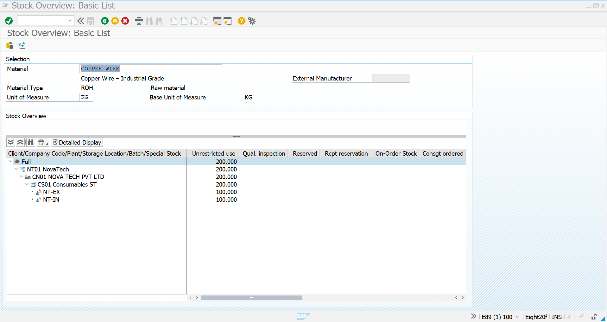

# 05 – Split Stock Analysis and Testing

## 01. Objective

This section validates the complete **Split Valuation process** performed for material `COPPER_WIRE`.

The objective is to confirm that the same material is maintained with separate valuation types for:

- `NT-IN` – Internal Procurement
- `NT-EX` – External Procurement

The testing covers stock quantity, valuation type, storage location, procurement source, and final stock position.

---

## 02. Split Stock Position – Internal vs External

The material `COPPER_WIRE` was configured for split valuation.

The internal procurement scenario created stock under:

**Valuation Type: `NT-IN`**

The external procurement scenario created stock under:

**Valuation Type: `NT-EX`**

Final expected stock:

| Valuation Type | Procurement Source | Quantity |
|---|---|---:|
| `NT-IN` | Internal Procurement | 100 KG |
| `NT-EX` | External Procurement | 100 KG |
| **Total** | **Combined Stock** | **200 KG** |

This confirms that SAP maintains separate stock quantities for different valuation types of the same material.

---

## 03. Internal Stock Analysis – MMBE

Transaction: `MMBE`

Material:

`COPPER_WIRE`

The internal procurement stock is displayed under:

**Plant:** `CN01`  
**Storage Location:** `CS01 – Consumables ST`  
**Valuation Type:** `NT-IN`  
**Unrestricted Stock:** `100 KG`

The MMBE display confirms that the internal stock exists independently under valuation type `NT-IN`.

### Test Result

**PASS**

The system correctly identifies the internally procured stock as:

`COPPER_WIRE → NT-IN → 100 KG`

---

## 04. External Stock Analysis – MMBE

Transaction: `MMBE`

The external procurement process was completed using:

- PO: `4500002303`
- Supplier: `7000010015 – JUSDA CORPORATIONS PVT LTD`
- Quantity: `100 KG`
- Valuation Type: `NT-EX`
- Plant: `CN01`
- Storage Location: `CS01`

After MIGO posting, the external stock is maintained separately under valuation type `NT-EX`.

### Test Result

**PASS**

The system correctly identifies the externally procured stock as:

`COPPER_WIRE → NT-EX → 100 KG`

---

## 05. Final Split-Valuation Testing and Validation

The final test confirms that both valuation types exist simultaneously for the same material.

### Test Case 1 – Material Verification

**Material:** `COPPER_WIRE`

Expected Result:

Material should support multiple valuation types.

**Result: PASS**

---

### Test Case 2 – Internal Stock Verification

Expected:

`NT-IN = 100 KG`

Actual:

`NT-IN = 100 KG`

**Result: PASS**

---

### Test Case 3 – External Stock Verification

Expected:

`NT-EX = 100 KG`

Actual:

`NT-EX = 100 KG`

**Result: PASS**

---

### Test Case 4 – Combined Stock Verification

Expected:

`100 KG + 100 KG = 200 KG`

Actual:

`200 KG`

**Result: PASS**

---

### Test Case 5 – Valuation Separation

Expected:

Internal and external procurement stocks must remain separately identifiable.

Actual:

- `NT-IN` maintained separately
- `NT-EX` maintained separately

**Result: PASS**

---

## Final Testing Summary

| Test | Expected Result | Status |
|---|---|---|
| Material `COPPER_WIRE` exists | Material available | PASS |
| Internal valuation `NT-IN` | 100 KG | PASS |
| External valuation `NT-EX` | 100 KG | PASS |
| Total stock | 200 KG | PASS |
| Internal/external separation | Separate valuation types | PASS |
| Plant | CN01 | PASS |
| Storage Location | CS01 | PASS |
| External PO | 4500002303 | PASS |
| External GR | 100 KG | PASS |
| External Invoice | 5100001410 | PASS |

## Final Result

The **Split Valuation scenario was successfully tested**.

The same material `COPPER_WIRE` is maintained with two separate valuation types:

**`NT-IN = 100 KG`**

**`NT-EX = 100 KG`**

**Total Stock = 200 KG**

This validates the complete split-stock scenario covering **internal procurement, external procurement, valuation-type separation, goods receipt, invoice verification, and final stock analysis**.

### SAP Transactions Used

- `ME51N` – Purchase Requisition
- `ME21N` – Purchase Order
- `MIGO` – Goods Receipt
- `MIRO` – Invoice Verification
- `ME23N` – Purchase Order History
- `MMBE` – Stock Overview

