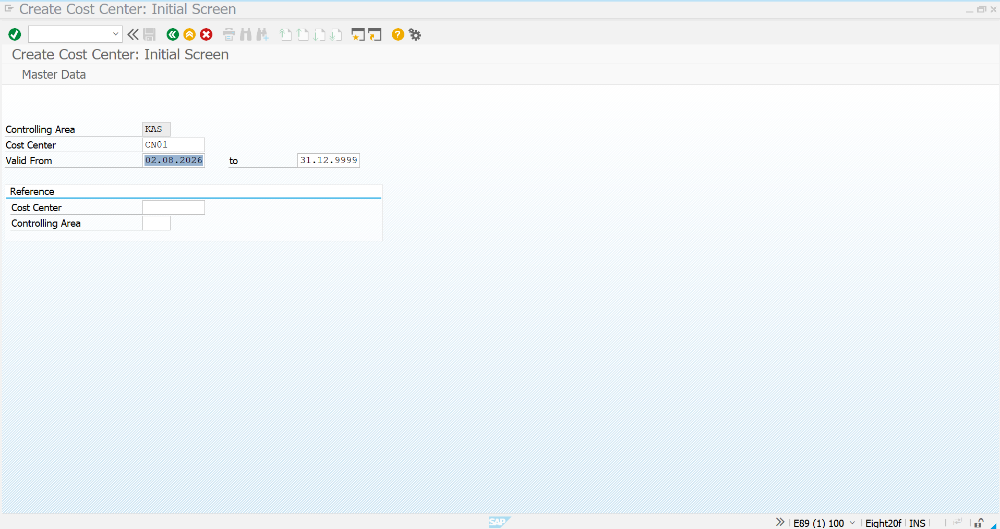
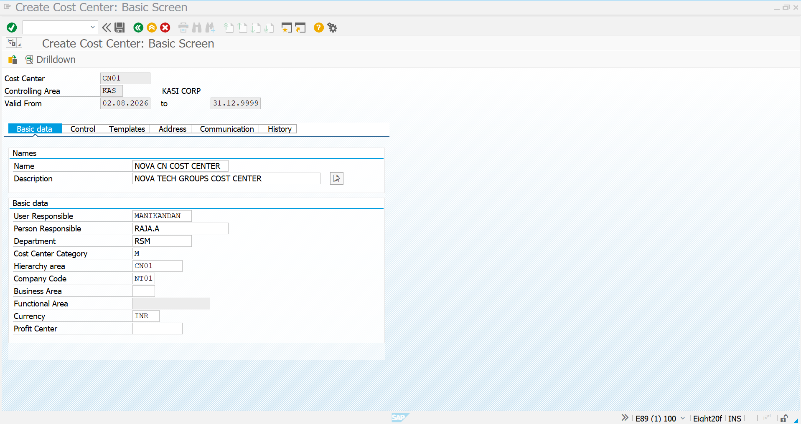
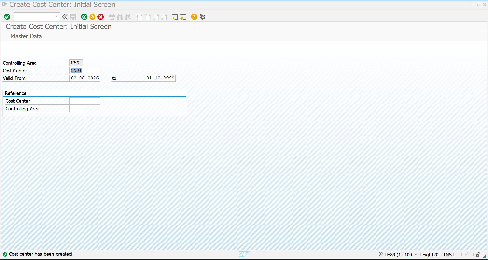

# Cost Center Creation (KS01)

<p align="center">

# 🏢 Cost Center Creation for Pipeline Procurement

**Project:** SAP S/4HANA MM Greenfield Implementation

**Module:** SAP Controlling (CO)

**Transaction Code:** KS01

**Business Scenario:** Pipeline Procurement (Nitrogen Gas)

</p>

---

# 📌 Business Scenario

Nova Tech Pvt Ltd consumes **Nitrogen Gas** continuously in its SMT Production Line.

Unlike normal inventory materials, pipeline materials are directly consumed during production.

When the gas is issued through **MIGO (Movement Type 201P)**, SAP immediately posts the consumption cost to a **Cost Center** instead of increasing inventory.

Therefore, before executing Pipeline Procurement, a valid Cost Center must exist in the Controlling Area.

> **Note**
>
> In this Greenfield Implementation project, the **Controlling Area** and **Cost Elements (Expense G/L Accounts)** were already configured by the **SAP FI/CO Consultant** during the project preparation phase.
>
> The SAP MM Consultant only creates and uses the required Cost Center for business consumption postings.

---

# 📊 Process Flow

```text
SAP FI/CO Team
      │
      ▼
Controlling Area Configured
      │
      ▼
Expense G/L / Cost Element Created
      │
      ▼
SAP MM Consultant
      │
      ▼
Create Cost Center (KS01)
      │
      ▼
Pipeline Goods Issue (201P)
      │
      ▼
Expense Posted to Cost Center
```

---

# 🎯 Objective

Create a Cost Center that will receive all expenses generated during the consumption of Pipeline Materials.

This Cost Center will later be referenced automatically during:

- Goods Issue (MIGO – Movement Type 201P)
- Consumption Accounting
- Vendor Settlement (MRKO)

---

# Transaction Code

```text
KS01
```

---

# Navigation

```text
SAP Easy Access
        │
        ▼
Accounting
        │
        ▼
Controlling
        │
        ▼
Cost Center Accounting
        │
        ▼
Master Data
        │
        ▼
Cost Center
        │
        ▼
Individual Processing
        │
        ▼
Create (KS01)
```

---

# Initial Screen



---

## Enter Basic Information

| Field | Value |
|---------|--------|
| Controlling Area | KAS |
| Cost Center | CN01 |
| Valid From | 02.08.2026 |
| Valid To | 31.12.9999 |

Click **Enter** to continue.

---

# Cost Center Master Data



---

## Maintain Cost Center Details

### Identification

| Field | Value |
|---------|--------|
| Name | NOVA CN COST CENTER |
| Description | NOVA TECH GROUPS COST CENTER |

---

### Responsibility

| Field | Value |
|---------|--------|
| User Responsible | MANIKANDAN |
| Person Responsible | RAJA.A |
| Department | RSM |

---

### Organizational Assignment

| Field | Value |
|---------|--------|
| Cost Center Category | M |
| Hierarchy Area | CN01 |
| Company Code | NT01 |
| Currency | INR |

---

## Business Importance

The Cost Center represents the department responsible for consuming the Pipeline Material.

Whenever Nitrogen Gas is issued to Production, SAP records:

- Which department consumed it
- How much cost was incurred
- Internal cost allocation
- Department-wise expense tracking

This enables accurate management reporting and cost analysis.

---

# Save Cost Center

After maintaining all mandatory fields,

Click

```text
Save
```

SAP creates the Cost Center successfully.

---

# Successful Creation



---

# Business Process Integration

```text
Nitrogen Gas

      │

      ▼

Pipeline Material

      │

      ▼

MIGO (201P)

      │

      ▼

Cost Center CN01

      │

      ▼

Expense G/L

      │

      ▼

Financial Posting

      │

      ▼

MRKO Settlement
```

---

# Role in Pipeline Procurement

The Cost Center acts as the receiver of all consumption costs generated during Pipeline Procurement.

Instead of increasing inventory, SAP directly charges the issued quantity to this Cost Center, ensuring accurate departmental cost tracking and seamless integration between Materials Management (MM) and Controlling (CO).

---

# Key Learning

- Created Cost Center using **KS01**
- Assigned Cost Center to Company Code **NT01**
- Defined departmental ownership and responsibility
- Prepared Cost Object required for Pipeline Procurement
- Enabled cost allocation for **MIGO 201P Goods Issue**
- Established integration between SAP MM and SAP CO

---

# Completion Status

| Activity | Status |
|-----------|--------|
| Controlling Area | Configured by SAP FI/CO Team |
| Cost Element / Expense G/L | Configured by SAP FI/CO Team |
| Cost Center Creation (KS01) | ✅ Completed |
| Ready for Pipeline Goods Issue | ✅ Yes |