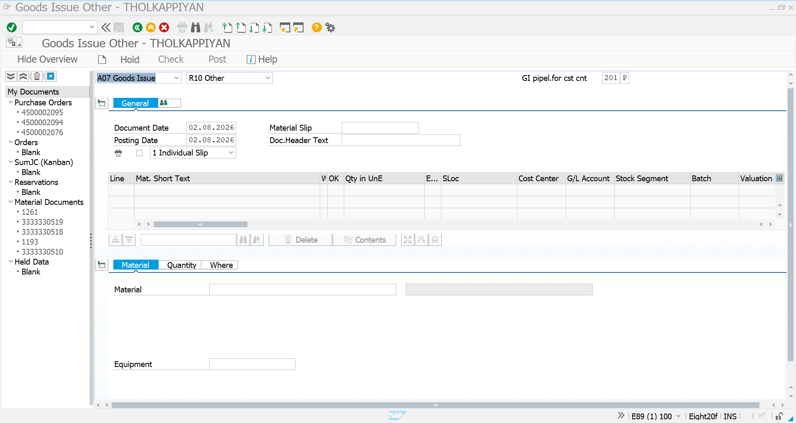
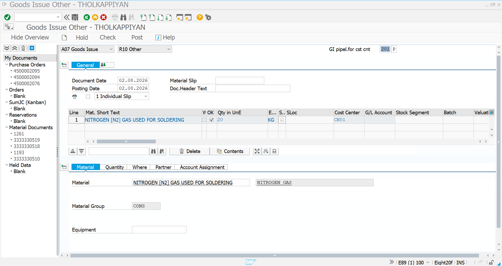
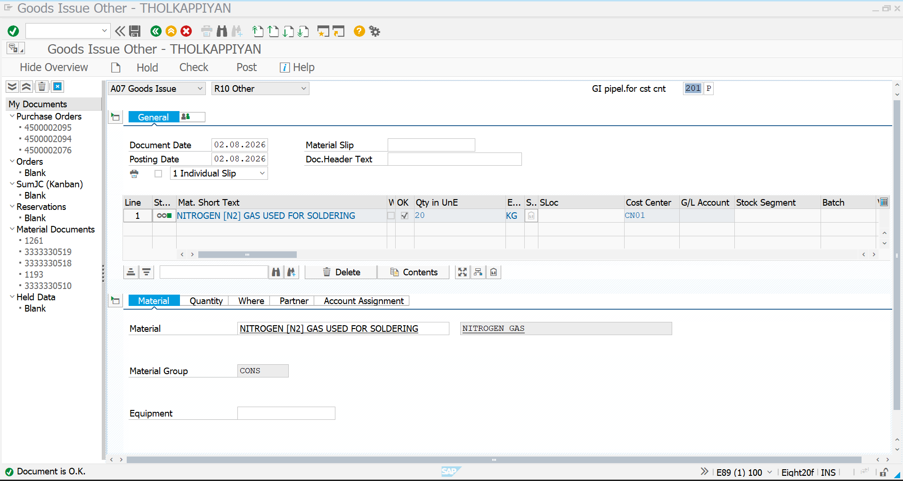
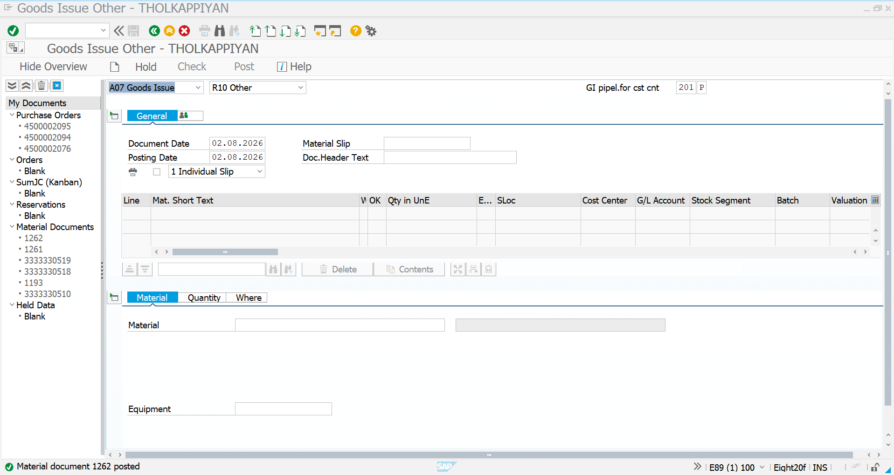

# Pipeline Material Consumption (MIGO)

## Overview

After completing the Pipeline Material, Vendor Master, Pipeline Info Record, and Cost Center setup, the Pipeline Material consumption is recorded using **MIGO**.

Unlike standard procurement, Pipeline Procurement does not create inventory. Instead, the consumed quantity is directly posted against the assigned Cost Center using **Movement Type 201P**. The consumed quantity is then available for Vendor Settlement in **MRKO**.

---

## Transaction Code

```
MIGO
```

---

## Navigation

```
SAP Easy Access

→ Logistics

→ Materials Management

→ Inventory Management

→ Goods Movement

→ MIGO
```

---

# Step 1 – Open MIGO

Open transaction code **MIGO**.

Select the following values:

| Field | Value |
|--------|--------|
| Transaction | A07 – Goods Issue |
| Reference | R10 – Other |
| Movement Type | 201P |

This movement type is specifically used for **Pipeline Material Consumption**.

### Screenshot



---

# Step 2 – Enter Material Details

Enter the Pipeline Material details.

| Field | Value |
|--------|-------|
| Material | NITROGEN GAS |
| Quantity | 20 KG |
| Cost Center | CN01 |
| Movement Type | 201P |

Verify that the required Cost Center is assigned correctly before posting the document.

### Screenshot



---

# Step 3 – Check the Document

Click **Check** to validate the document before posting.

SAP verifies:

- Material
- Quantity
- Cost Center
- Movement Type
- Account Assignment

If all mandatory information is correct, SAP displays the message indicating that the document is valid.

### Screenshot



---

# Step 4 – Post Goods Issue

Click **Post** to complete the Goods Issue.

SAP creates the Material Document and records the Pipeline Material Consumption against the assigned Cost Center.

The consumed quantity is now available for Vendor Settlement using **MRKO**.

### Screenshot



---

# Process Flow

```text
Pipeline Material
        │
        ▼
MIGO
(A07 Goods Issue)
        │
        ▼
Reference
(R10 Other)
        │
        ▼
Movement Type
201P
        │
        ▼
Pipeline Material Consumption
        │
        ▼
Material Document Created
        │
        ▼
Ready for Vendor Settlement (MRKO)
```

---

# Result

| Activity | Status |
|-----------|--------|
| Goods Issue Executed | ✅ |
| Movement Type 201P Posted | ✅ |
| Material Consumption Recorded | ✅ |
| Cost Center Updated | ✅ |
| Material Document Created | ✅ |
| Ready for MRKO Settlement | ✅ |

---

# Key Learning

- Executed Pipeline Material Consumption using **MIGO**
- Used **A07 Goods Issue** with **R10 Other** reference
- Posted consumption using **Movement Type 201P**
- Recorded the consumed quantity against the assigned Cost Center
- Generated the Material Document required for subsequent Vendor Settlement